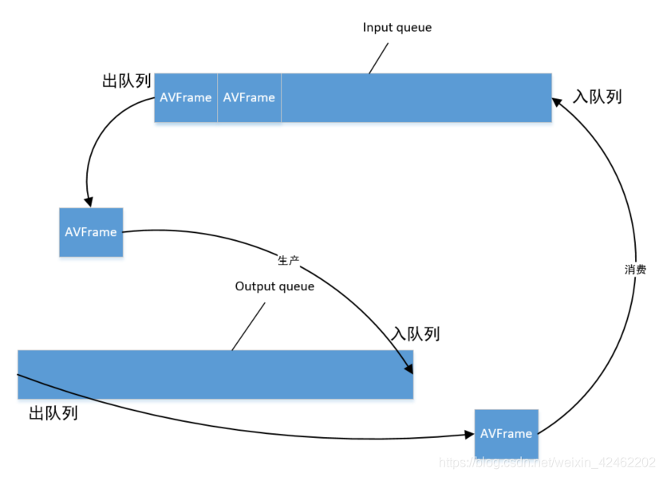
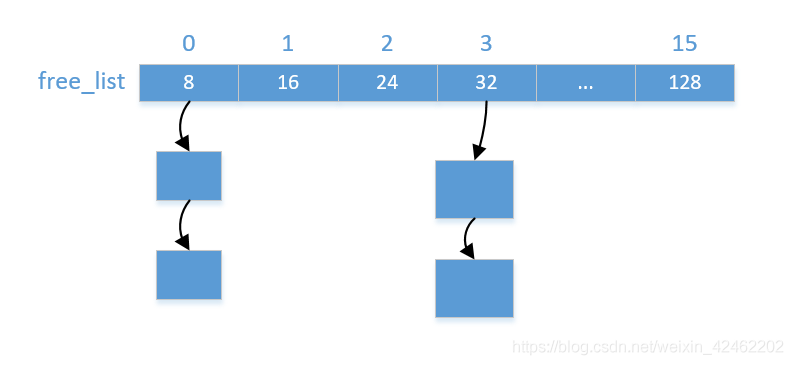
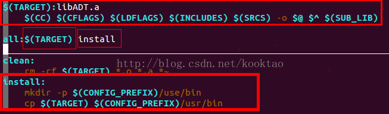
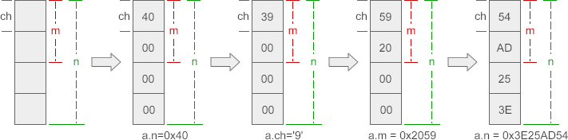

#  RTSP服务器

## 技术点

- **服务器模型**
  非阻塞IO，采用Reactor模型。使用线程池处理计算量较大的任务(音视频文件处理，音视频数据采集与编码)
- **IO多路复用**
 支持select、poll、epoll
- **定时器**
 通过Linux提供的定时器`timerfd_create`,将定时器文件描述符作为一个事件交给Reactor，定时器队列采用`multimap`管理超时时间
- **日志**
 日志实现了前后端分离，前端负责格式化字符串然后发送给后端，后端启动一个线程，服务将数据写入磁盘中，使用了双缓冲技术
- **音视频数据采集与处理**
 音视频的采集与处理使用的生产者与消费者模式，数据采集为生产者，数据处理为消费者。生产者维护着一个循环队列，会往线程池中添加任务填充缓存，消费者有一个定时器，间隔一定时间就会向生产者取数据，并将数据RTP打包再传输




- 内存管理

内存管理分为前后端，前端使用类模板，灵活处理各种类型的对象的分配请求还有释放请求。后端主要是管理内存，提供内存的分配和释放。维护16个自由链表，每个链表维护着相同大小的内存块，分别从8、16、24到128。申请内存的时候，如果小于128字节则从相应的自由链表中获取内存块，如果大于128字节，则直接调用 malloc 进行分配。如果自由链表中没有内存块，那么就从缓冲区中申请一大块内存，然后切分成小块，插入到对应的自由链表中。释放内存的时候，如果小于128字节，那么就插入到对应的自由链表中，如果大于128字节，那么直接调用 free 释放内存


  

## makefile文件分析

### CROSS_COMPILE

即**交叉编译器的前缀**（prefix)，  也就是选择将代码编译成目标cpu的指令的工具。

- 如果所用的交叉工具链的gcc程序名称为arm-linux-gcc，则CROSS_COMPILE=arm-linux-。总之，要省去名称中最后的gcc那3个字母
- 如果不指定CROSS_COMPILE参数，make时将认为prefix为空，即使用gcc来编译

为交叉编译环境编写Makefile时，注意CROSS_COMPILE变量要先export,然后才能在Makefile中使用$(CROSS_COMPILE)gcc

```sh
#buile.sh
# export设置环境变量
# 加上路径
export PATH="$PATH:/Work/QG2101-SDK/prebuilt/gcc/linux-x86/arm/toolchain-sunxi-musl/toolchain/bin"
export CROSS_COMPILE=arm-openwrt-linux-muslgnueabi-
make clean
make
```

### CC与CXX

 这是 C 与 C++ 编译器命令。默认值一般是 “gcc” 与 “g++”

### $(shell pwd)

Makefile里面**获取相对路径**必须在pwd前面加shell，然后把shell pwd当一个变量来引用，书写形式是：$(shell pwd) 


### Makefile中 :=, =, ?=和+=的含义

#### 1. “=”

使用“=”赋值，变量的值是整个makefile中最后被指定的值

```makefile
VIR_A = A
VIR_B = $(VIR_A) B
VIR_A = AA
```

 经过上面的赋值后，最后VIR_B的值是AA B，而不是A B。在make时，会把整个makefile展开，拉通决定变量的值 

#### 2. ":="

 ”:=”就表示直接赋值，赋予当前位置的值。同样举个例子说明 

```makefile
VIR_A := A
VIR_B := $(VIR_A) B
VIR_A := AA
```

#### 3. "?="

 “？=”表示如果该变量没有被赋值，则赋予等号后的值。 

```makefile
VIR ?= new_value
```

 如果VIR在之前没有被赋值，那么VIR的值就为new_value. 

```makefile
VIR := old_value
VIR ?= new_value
```

 这种情况下，VIR的值就是old_value 

#### 4. "+="

 将等号后面的值添加到前面的变量上 

### CFLAGS 与 CXX_FLAGS

CFLAGS表示C编译器的选项，CXXFLAGS表示用于C++编译器的选项。

 “-O” 表示编译优化选项，其后可跟优化等级0\1\2\3，默认是0，不优化 。“-O2” 该优化选项会牺牲部分编译速度，除了执行-O1所执行的所有优化之外，还会采用几乎所有的目标配置支持的优化算法，用以提高目标代码的运行速度。

“-g"  可以用GDB调试

"-I(大写i)"  编译程序按照-I指定的路进去搜索头文件。-I/home/include/表示将-I/home/include/目录作为第一个寻找头文件的目录

### LD_FLAGS 

告诉链接器从哪里寻找库文件 

用法：LDFLAGS=-L/usr/lib -L/path/to/your/lib。每安装一个包都几乎一定的会在安装目录里建立一个lib目录。

### LIBS 
 告诉链接器要链接哪些库文件，如LIBS = -lpthread -liconv 

### ifeq用法

比较$(变量名) 与变量值是否相同

```makefile
ifeq ($（变量名）， 变量值 ) 
........ 
else ifeq ($(..), ..)
.........
else
.........
endif
```

### $(shell find $(SRC_DIR)/base -name *.cpp)

查找相对路径下的base文件夹中的所有.cpp 文件

###  $(wildcard pattern)
参数pattern是一个文件名格式，包含有通配符。函数wildcard的结果是一列和格式匹配且真实存在的文件的名称，文件名之间用一个空格隔开。
比如当前目录下有文件1.c,2.c,1.h,2.h 则
c_src := $(wildcard *.c)
结果为：1.c 2.c 

### notdir

 notdir用于**去掉文件的绝对路径**，只保留文件名
 **$(notdir 文件列表)** 

### patsubst

格式：$(patsubst <pattern>,<replacement>,<text> )  
功能： 查找<text>中的单词（单词以“空格”、“Tab”或“回车”“换行”分隔）是否符合模式<pattern>，如果匹配的话，则以<replacement>替换。 
示例：
$(patsubst %.c,%.o, a.c b.c)
把字串“a.c b.c”符合模式[%.c]的单词替换成[%.o]，返回结果是“a.o b.o”

### all:

在Makefile中使用all:时

 


若直接 make 或 make all 的话，会执行$(TARGET) 和 install 对应的命令

在执行make时，若后面接all下对应的选项，则有：
１、make  $(TARGET)对应值， 则只执行$(TARGET)对应命令
２、make  install，则只执行install对应命令

### @ 

这个符串通常用在“规则”行中，表示不显示命令本身，而只显示它的结果 

```makefile
p = $(shell pwd)
all:
	@echo $p
```

```shell
# 如果不加@，会显示命令和结果
echo /home/wjh/desktop/RtspServer/test
/home/wjh/desktop/RtspServer/test
# 如果加了@, 只显示结果
/home/wjh/desktop/RtspServer/test
```

### $@、$^、$<

$@     --代表目标文件(target)
$^      --代表所有的依赖文件(components)
$<      --代表第一个依赖文件(components中最左边的那个)。
$?      --代表示比目标还要新的依赖文件列表。以空格分隔。
$%      --仅当目标是函数库文件中，表示规则中的目标成员名。例如，如果一个目标是"foo.a(bar.o)"，那么，"$%"就是"bar.o"，"$@"就是"foo.a"。如果目标不是函数库文件（Unix下是[.a]，Windows下是[.lib]），那么，其值为空。

### "-","$","$$"

' - ' 符号的使用
通常删除，创建文件如果碰到文件不存在或者已经创建，那么希望**忽略掉这个错误，继续执行**，就可以在命令前面添加 -，
-rm dir；
-mkdir aaadir；

' $ '符号的使用
美元符号$，主要扩展打开makefile中定义的变量

' $$ '符号的使用
$$ 符号主要扩展打开makefile中定义的shell变量

shell变量的定义和使用（shell变量就是在shell中输入)

```shell
NAME=hello #这里一定不要有空格 hello可以加上""或'' 若定义的值有空格 则要加上"" 或 ''
echo $NAME #这里使用变量时 要加上$  也可以${NAME}  但是不能$()这个表示执行里面的命令
```

## Thread

#### 总结

```cpp
#include<pthread.h>

// 线程的标识符
pthread_t threadId;  
// 创建线程
pthread_create(&threadId, NULL, threadRun, this);
// 让线程分离    ----自动退出，无系统残留资源
pthread_detach(threadId);
// 等待线程执行结束
pthread_join(threadId, NULL);
// 发送信号终止线程执行，命令其他线程停止
pthread_cancel(threadId);
// 线程在执行过程，遇到该函数结束执行
pthread_exit();
```

#### 创建线程

```cpp
int pthread_create(pthread_t *thread,
                   const pthread_attr_t *attr,
                   void *(*start_routine) (void *),
                   void *arg);
/* 参数的含义
1) pthread_t *thread：传递一个 pthread_t 类型的指针变量，也可以直接传递某个 pthread_t 类型变量的地址。pthread_t 是一种用于表示线程的数据类型，每一个 pthread_t 类型的变量都可以表示一个线程。

2) const pthread_attr_t *attr：用于手动设置新建线程的属性，例如线程的调用策略、线程所能使用的栈内存的大小等。大部分场景中，我们都不需要手动修改线程的属性，将 attr 参数赋值为 NULL，pthread_create() 函数会采用系统默认的属性值创建线程。

3) void *(*start_routine) (void *)：以函数指针的方式指明新建线程需要执行的函数，该函数的参数最多有 1 个（可以省略不写），形参和返回值的类型都必须为 void* 类型。void* 类型又称空指针类型，表明指针所指数据的类型是未知的。使用此类型指针时，我们通常需要先对其进行强制类型转换，然后才能正常访问指针指向的数据。

4) void *arg：指定传递给 start_routine 函数的实参，当不需要传递任何数据时，将 arg 赋值为 NULL 即可。*/

如果成功创建线程，pthread_create() 函数返回数字 0，反之返回非零值。各个非零值都对应着不同的宏，指明创建失败的原因，常见的宏有以下几种：
EAGAIN：系统资源不足，无法提供创建线程所需的资源。
EINVAL：传递给 pthread_create() 函数的 attr 参数无效。
EPERM：传递给 pthread_create() 函数的 attr 参数中，某些属性的设置为非法操作，程序没有相关的设置权限。
以上这些宏都声明在 <errno.h> 头文件中，如果程序中想使用这些宏，需提前引入此头文件。
```

#### 分离线程

```cpp
int pthread_detach(pthread_t thread);    成功：0；失败：错误号
/*
作用：从状态上实现线程分离，注意不是指该线程独自占用地址空间。
线程分离状态：指定该状态，线程主动与主控线程断开关系。线程结束后（不会产生僵尸线程），其退出状态不由其他线			 程获取，而直接自己自动释放（自己清理掉PCB的残留资源）。
不会产生僵尸进程。僵尸进程的产生主要是由于进程死后，大部分资源被释放，一点残留资源仍存于系统中，导致内核认为该进程仍存在。
一般情况下，线程终止后，其终止状态一直保留到其它线程调用pthread_join获取它的状态为止（或者进程终止被回收了）。进程如果被置为detach状态，一旦终止就立刻回收它占用的所有资源，而不保留终止状态。*/
注意：不能对一个已经处于detach状态的线程调用pthread_join，这样的调用将返回EINVAL错误（22号错误）。也就是说，如果已经对一个线程调用了pthread_detach就不能再调用pthread_join了。
    
还可以通过修改线程属性的方法来实现线程分离。pthread_create函数的第二个参数
pthread_attr_t attr;            /*通过线程属性来设置游离态（分离态）*/
pthread_attr_init(&attr);
pthread_attr_setdetachstate(&attr, PTHREAD_CREATE_DETACHED);
pthread_create(&tid, &attr, tfn, NULL);
```

##### 什么时候分离线程会产生陷阱？

1. 一个分离线程使用一个共享资源
2. 分离线程的生命周期比所使用的资源的生命周期长

例如：子线程使用一个全局对象(object)，子线程与程序一并退出。

由于程序退出的顺序是：

1. 对象析构
2. 子线程退出
3. 主线程退出

因此，程序退出过程中，全局对象会调用自己的析构函数，此时，对象生命周期结束，对象被销毁。但是，子线程还没马上死亡，子线程仍然有可能继续调用已经析构的对象。期望的结果是安全退出程序，结果却造成了未知的错误。

方法：

1. 不要使用分离线程
2. 分离线程不用使用共享资源
3. 主线程退出前主动销毁子进程
4. 使用条件变量，主线程等待子进程退出

#### 等待线程执行结束

```cpp
int pthread_join(pthread_t thread, void ** retval);
/* 参数的含义：
	thread 参数用于指定接收哪个线程的返回值；retval 参数表示接收到的返回值，如果 thread 线程没有返回值，又或者我们不需要接收 thread 线程的返回值，可以将 retval 参数置为 NULL。*/
	
作用： pthread_join() 函数会一直阻塞调用它的线程，直至目标线程执行结束（接收到目标线程的返回值），阻塞状态才会解除。

如果 pthread_join() 函数成功等到了目标线程执行结束（成功获取到目标线程的返回值），返回值为数字 0；反之如果执行失败，函数会根据失败原因返回相应的非零值，每个非零值都对应着不同的宏，例如：
EDEADLK：检测到线程发生了死锁。
EINVAL：分为两种情况，要么目标线程本身不允许其它线程获取它的返回值，要么事先就已经有线程调用 pthread_join() 函数获取到了目标线程的返回值。
ESRCH：找不到指定的 thread 线程。
以上这些宏都声明在 <errno.h> 头文件中，如果程序中想使用这些宏，需提前引入此头文件。
    
注意：一个线程执行结束的返回值只能由一个 pthread_join()函数获取,当有多个线程调用 pthread_join() 函数获取同一个线程的执行结果时，哪个线程最先执行 pthread_join() 函数，执行结果就由那个线程获得，其它线程的 pthread_join() 函数都将执行失败
对于一个默认属性的线程 A 来说，线程占用的资源并不会因为执行结束而得到释放。而通过在其它线程中执行 pthread_join(A,NULL);语句，可以轻松实现“及时释放线程 A 所占资源”的目的。    
```

#### 发送信号终止线程执行

```cpp
int pthread_cancel(pthread_t thread);
参数 thread 用于指定发送 Cancel 信号的目标线程；

多线程程序中，一个线程可以借助 pthread_cancel() 函数向另一个线程发送“终止执行”的信号（后续称“Cancel”信号），从而令目标线程结束执行。
    
如果 pthread_cancel() 函数成功地发送了 Cancel 信号，返回数字 0；反之如果发送失败，函数返回值为非零数。对于因“未找到目标线程”导致的信号发送失败，函数返回 ESRCH 宏（定义在<errno.h>头文件中，该宏的值为整数 3）
```

#### 终止线程

多线程编程中，线程结束执行的方式有 3 种，分别是：

1. 线程将指定函数体中的代码执行完后自行结束；
2. 线程执行过程中，被同一进程中的其它线程（包括主线程）强制终止；
3. 线程执行过程中，遇到 pthread_exit() 函数结束执行。

```cpp
void pthread_exit(void *retval);
retval 是 void* 类型的指针，可以指向任何类型的数据，它指向的数据将作为线程退出时的返回值。如果线程不需要返回任何数据，将 retval 参数置为 NULL 即可。
    
注意，retval 指针不能指向函数内部的局部数据（比如局部变量）。换句话说，pthread_exit() 函数不能返回一个指向局部数据的指针，否则很可能使程序运行结果出错甚至崩溃
    
pthread_exit() 函数只会终止当前线程，不会影响进程中其它线程的执行。
```

##### return和pthread_exit()的区别

 在主线程（main() 函数）中，return 和 pthread_exit() 函数的区别最明显。举个例子： 

```cpp
#include <stdio.h>
#include <pthread.h>

void *ThreadFun(void *arg)
{
    sleep(5);//等待一段时间
    printf("http://c.biancheng.net\n");
}

int main()
{
    int res;
    pthread_t myThread;
     
    res = pthread_create(&myThread, NULL, ThreadFun, NULL);
    if (res != 0) {
        printf("线程创建失败");
        return 0;
    }
    printf("C语言中文网\n");
    return 0;
}
```

编译、执行此程序，输出结果为：

```
C语言中文网
```

通过执行结果可以看到，主线程正常执行结束，myThread 线程并没有输出指定的数据。原因很简单，主线程执行速度很快，主线程最后执行的 return 语句不仅会终止主线程执行，还会终止其它子线程执行。也就是说，myThread 线程还没有执行输出语句就被终止了。

将上面程序中，main() 函数中的 return 0 用如下语句替换：

```
pthread_exit(NULL);
```

重新编译、执行程序，运行结果为：

```
C语言中文网
http://c.biancheng.net
```

对比上面两个执行结果，我们可以得出的结论是：pthread_exit() 函数只会终止当前线程，不会影响进程中其它线程的执行。

 终止主线程时，return 和 pthread_exit() 函数发挥的功能不同，可以根据需要自行选择。 

## base文件夹

### #include<stdint.h>

 <stdint.h> 定义了 int16_t 、 uint32_t 、 int64_t 等整型

### union共用体

```
union 共用体名{
    成员列表
};

union data{
    int n;
    char ch;
    double f;
} a, b, c;
```

**结构体和共用体的区别在于**：

- 结构体的各个成员会占用不同的内存，互相之间没有影响；
- 而共用体的所有成员占用同一段内存，修改一个成员会影响其余所有成员。 

结构体占用的内存大于等于所有成员占用的内存的总和（成员之间可能会存在缝隙），共用体占用的内存等于最长的成员占用的内存。共用体使用了**内存覆盖技术**，**同一时刻只能保存一个成员的值，如果对新的成员赋值，就会把原来成员的值覆盖掉**。 

举例：

```c
#include <stdio.h>

union data{
    int n;
    char ch;
    short m;
};

int main(){
    union data a;
    printf("%d, %d\n", sizeof(a), sizeof(union data) );
    a.n = 0x40;
    printf("%X, %c, %hX\n", a.n, a.ch, a.m);
    a.ch = '9';
    printf("%X, %c, %hX\n", a.n, a.ch, a.m);
    a.m = 0x2059;
    printf("%X, %c, %hX\n", a.n, a.ch, a.m);
    a.n = 0x3E25AD54;
    printf("%X, %c, %hX\n", a.n, a.ch, a.m);
   
    return 0;
}
```

运行结果：

```
4, 4
40, @, 40
39, 9, 39
2059, Y, 2059
3E25AD54, T, AD54
```

 这段代码不但验证了共用体的长度，还说明共用体成员之间会相互影响，修改一个成员的值会影响其他成员。 

 要想理解上面的输出结果，弄清成员之间究竟是如何相互影响的，就得了解各个成员在内存中的分布。以上面的 data 为例，各个成员在内存中的分布如下： 

  

 成员 n、ch、m 在内存中“对齐”到一头，对 ch 赋值修改的是前一个字节，对 m 赋值修改的是前两个字节，对 n 赋值修改的是全部字节。也就是说，ch、m 会影响到 n 的一部分数据，而 n 会影响到 ch、m 的全部数据。

### 类中静态成员和非静态成员

类的静态成员(变量和方法)属于类本身，**在类加载的时候就会分配内存**，可以通过类名直接去访问；

非静态成员（变量和方法）属于类的对象，所以**只有在类的对象产生（创建类的实例）时才会分配内存**，然后通过类的对象（实例）去访问。

在一个类的静态成员中去访问其非静态成员之所以会出错是因为在类的非静态成员不存在的时候类的静态成员就已经存在了，访问一个内存中不存在的东西当然会出错；