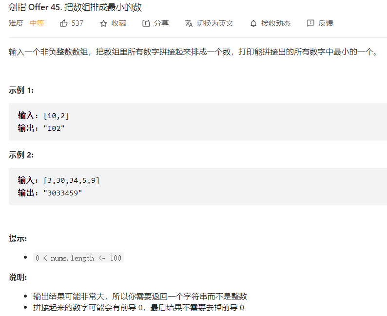

# 1. 约瑟夫问题

已知人数N， 和编号M，  返回剩下最后一人的编号

```cpp
int func(int N, int M)
{
    int nums[N];
    for(int i = 0; i < N; i++)
        nums[i] = i+1;          // 从1开始编号
    int k = N;    // 标记剩下的人
    int j = 0;    // 标记表数
    while( k > 1)
    {
        for(int i = 0; i < N; i++)
        {
            if(nums[i] == 0)
                continue;
            else 
                j++;
            if(j == M)
            {
                nums[i] = 0;
                j = 0;
                k--;
            }
        }
    }
    for(int i = 0; i < N; i++)
    {
        if(nums[i] != 0)
            return nums[i];
    }
    return 0;
}
```

# 2. 将数组排成最小的数



```cpp
class Solution {
public:
    string minNumber(vector<int>& nums) {
        vector<string> str;
        // 将整数转为字符串 插入数组中
        for(int i = 0; i < nums.size(); i++)
        {
            str.push_back(to_string(nums[i]));
        }
        // 自定义排序
        sort(str.begin(), str.end(), [](string& x, string& y){ return x+y < y+x;});
        // 拼接
        string res;
        for(auto&& ch: str)
            res += ch;
        return res;
    }
};
```

# 链表的局部反转

反转从位置 m 到 n 的[链表](https://so.csdn.net/so/search?q=链表&spm=1001.2101.3001.7020)。请使用一趟扫描完成反转。

**说明：**

- 1 ≤ m ≤ n ≤ 链表长度。

**示例：**

```
输入: 1->2->3->4->5->NULL, m = 2, n = 4
输出: 1->4->3->2->5->NULL
```


```cpp

ListNode* function(ListNode* head, int left, int  right) {
    //定义pre,cur,用lefthead来承接整个区间的前驱结点
    ListNode* pre, cur, lefthead;
    // 哨兵节点
    const dummy = new ListNode();
    // 后继指向头节点
    dummy->next = ListNode;
    // p是游标,用于遍历
    ListNode* p = dummy;
    // 走到整个区间的前驱结点处
    for(int i = 0; i < left-1; i++)
    {
        p = p->next;
    }
    // 缓存这个节点到Lefthead中
    lefthead = p;
    // start是反转区间的第一个节点
    ListNode* start = lefthead->next;
    pre = start;
    cur = pre->next;

    // 对区间中的链表进行反转
    for(int i = left; i < right; i++)
    {
        ListNode* next = cur->next;
        cur->next = pre;
        pre = cur;
        cur = next;
    }
    // leftHead的后继节点此时为反转后的区间的第一个节点
    lefthead->next = pre;
    // 将区间内反转后的最后一个节点指向cur
    start->next = cur;

    return dummy->next;
};
```

笔试题：

```cpp
#include <iostream>
#include <vector>
#include <numeric>
#include <limits>

using namespace std;

template <class Type> class ListNode {
public:
    Type data;
    ListNode<Type> *next;
    // bool operator==(ListNode<Type>* p)
    // {
    //     return (this->data = p->data) && (this->next = p->next);
    // }
};

class Solution {
public:
    
    /* Write Code Here */
    ListNode < int > *reverseBetween(ListNode<int> *head, int left, int right) {
    
        // 创建哨兵节点
        ListNode<int>* dummy = new ListNode<int>();
        dummy->next = head;
        // 游标
        ListNode<int>* p = dummy;
        for(int i = 0; i < left-1; i++)
        {
            p = p->next;
        }
        // 记录这个节点
        ListNode<int>* lefthead = p;
        ListNode<int>* start = lefthead->next;
        ListNode<int>* pre = start;
        ListNode<int>* cur = pre->next;
        for(int i = left; i < right; i++)
        {
            ListNode<int>* next = cur->next;
            cur->next = pre;
            pre = cur;
            cur = next;
        }
        lefthead->next = pre;
        start->next = cur;

        return dummy->next;
    }
  
};
int main() {
    ListNode < int > *res = NULL;

    int head_size = 0;
    cin >> head_size;

    ListNode<int> *head = NULL, *head_curr = NULL;
    int head_item;
    for(int head_i=0; head_i<head_size; head_i++) {
        cin >> head_item;

        ListNode<int> *head_temp = new ListNode<int>();
        head_temp->data = head_item;
        head_temp->next = NULL;
        if (head == NULL) {
            head = head_curr = head_temp;
        } else {
            head_curr->next = head_temp;
            head_curr = head_temp;
        }
    }

    int left;
    cin >> left;


    int right;
    cin >> right;


    Solution *s = new Solution();
    res = s->reverseBetween(head, left, right);
    
    while (res != NULL) {
    	cout << res->data << " ";
    	res = res->next;
    }
    cout << endl;

    return 0;

}
```

# String类

```cpp
// c_str()将string转化为char*

class String
{
public:
    String(const char* str = NULL) // 通用构造函数
    {
        if(!str)
        {
            length = 0;
            data = new char[1]; // 1是因为包含'/0'
            *data = '/0';
        }
        else
        {
            length = strlen(str);  // 对空指针调用strlen会引发内存错误
            data = new char[length+1];
            strcpy(data, str);
        }
    }

    String(const String &str)       // 拷贝构造函数
    {
        length = str.size();
        data = new char[length+1];
        strcpy(data, str.c_str());
    }

    ~String()                  // 析构函数
    {
        delete[] data;
        legth = 0;
    }

    String& operator=(const String &str)		//重载=
    {
        if(this == &str) return *this;

        delete[] data;  // 为了避免内存泄露，这里释放了原先申请的内存
        length = str.length;
        data = new char[length+1];
        strcpy(data, str.c_str());
        return *this;
    }

private:
    char* data;    // 字符串
    size_t length;  // 长度
};
```

