# 一、C++初识
## 1.编写hello world
一个函数的定义包括四个部分：返回类型、函数名、形参列表、函数体
```cpp
#include<iostream>
using namespace std;

int main()
{
	cout << "hello world\n"; 		 		// 换行
    cout << "hello world" << endl;           //endl 被称为操作符，效果是换行，清空缓冲区并将其实际写入设备
	
	system("pause");						//暂停黑窗口，输入任意键后继续
	
	return 0;
}
```
## 2.测试system("pause");暂停窗口的代码

```cpp
#include<iostream>
#include <cstdio>
using namespace std;

int main()
{

cout << "本进程执行过程中的第一处暂停位置!" << endl; 

system("pause");


cout << "本进程执行过程中的第二处暂停位置!" << endl; 

system("pause");
return 0;
}
```
运行结果图片： 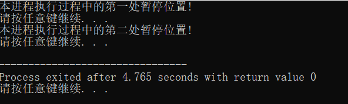 
## 3.C++定义常量
(1) #define 宏常量 `#define 常量名 常量值`
(2)  const 修饰的变量 `const 数据类型 常量名 = 常量值`

区别：
- #define是定义**宏变量**，是在编译之前，由预处理指令把代码里面的宏变量用指定的字符串替换，**它不做语法处理**，而const是定义**含有变量类型的常量**

- 一般来说推荐使用const定义常量，它在编译时会做语法处理。 Effective c++ 的条款1中：“尽量用编译器而不用预处理”，因为#define经常被认为好象不是语言本身的一部分。而且有时候用宏，会出现意想不到的输出结果。 

两者比较：

- const常量有数据类型，而宏变量没有数据类型。编译器可以对前者进行类型安全检查。而对后者只进行字符替换，并且在字符替换可能会产生意料不到的输出结果。
- 有些集成化的调试工具可以对const常量进行调试，但是不能对宏常量进行调试
## 4.C++关键字
这些关键字不能作为常量名、变量名或其他标识符名称
 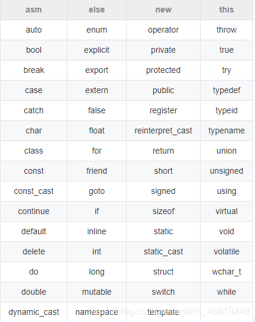 

## 5.C++标识符
C++规定给标识符（变量、常量）命名时，有一套规则
(1)标识符不能是关键字
(2)标识符只能由字母、数字、下划线组成
(3)第一个字符必须为字母或下划线
(4)标识符中字母区分大小写

<font color=#999AAA >示例：
mohd  _temp j a23b9 rVtdh
## 6.转义字符
作用：用于表示一些不能显示出来的ASCII字符
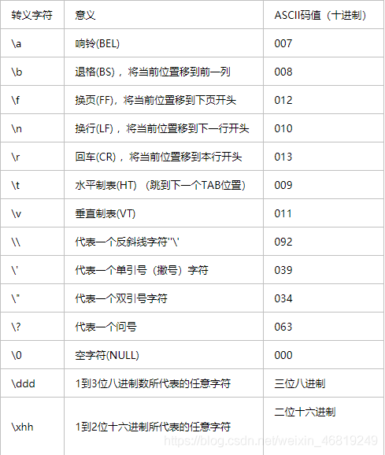
<font color=#999AAA > 示例：水平制表符\t 
`cout <<"aaa\tbbb" <<endl;` 显示的结果是aaa     bbb;(在aaa后面会有5个空格）
`cout <<"aaaa\tbbb" <<endl;` 显示的结果是aaaa    bbb;(在aaaa后面会有4个空格）
## 7. 编译、运行程序

> $ g++ ./test.cpp -o test
>
> $ ./test.out

使用参数`-std=c++11`来开启C++ 11标准支持

> $ g++ -std=c++11 test_c11.cpp
# 二、数据类型
## 1.整型
作用：整型变量表示的是整数类型的数据
C++中能够表示整型的类型有以下几种方式, **区别在于所占内存空间的不同**
| 数据类型               | 占用空间                                        | 取值范围                  |
| :--------------------- | :---------------------------------------------- | ------------------------- |
| short（短整型）        | 2字节                                           | -32768到 32767            |
| int （整型）           | 4字节                                           | -2147483648 到 2147483647 |
| long （长整型）        | Windows为 4字节，Linux为4字节(32位),8字节(64位) | -2^31  ~ 2 ^31-1          |
| long long （长长整型） | 8字节                                           | -2^63  ~ 2 ^63-1          |

## 2.sizeof关键字
作用：利用sizeof关键字可以统计数据类型所占内存大小(字节）
语法：`sizeof(数据类型/变量)`

```cpp
	cout << "short 类型所占内存空间为：" << sizeof(short) << endl; 
	cout << "int 类型所占内存空间为：" << sizeof(int ) << endl; 
	cout << "long int 类型所占内存空间为：" << sizeof(long int) << endl; 
	cout << "long long 类型所占内存空间为：" << sizeof(long long ) << endl; 
```

## 3.实型（浮点型）
作用：用于表示小数
如下图，两者的区别在于**表示的有效数字范围不同**
| 数据类型     | 占用空间 | 有效数字范围    |
| ------------ | -------- | --------------- |
| 单精度float  | 4字节    | 7位有效数字     |
| 双精度double | 8字节    | 15~16位有效数字 |
示例：
```cpp
// 浮点常数通常以 double 类型存储在内存中。如果需要强制将这类常数存储为 float 类型，则可以将 F 或 f 字母附加到其末尾。	
	float f1 = 3.14f;		//后面加个f
	double f2 = 3.14;		
	
//默认情况下，输出一个小数，会显示出6位有效数字
	float f1 = 3.14156897f;
	cout << f1 << endl;
	double f2 = 3.14156897;
	cout << f2 << endl;	
/*输出的是3.14157
		 3.14157   */
//科学计数法
	float d1 = 3e2; //3 * 10^2;
	float d2 = 3e-2; //3 * 0.1^2;
```
### 输出时要小数点后保留几位小数的问题
1.两种简单地使用方式 其实就是一种

第一种：cout<<setiosflags(ios::fixed)<<setprecision( n)<<num;这里的n就是要保留几位小数

第二种：cout<<fixed<<setprecision(n)<<num;其实就是第一种的简写
```cpp
//控制输出时要小数点后保留几位小数,会四舍五入  	必要头文件#include<iomanip>
	cout << setiosflags(ios::fixed) << setprecision(6) << f3 << endl;//3.141569		
	cout << fixed << setprecision(7) << f4 << endl;                  //3.1415690	
```
### 输出时保留几位有效数字的问题

```cpp
#include<iomanip>	//必要头文件
#include<iostream> 
using namespace std;
int main()
{
	double num = 3.14159; 										
	cout << "原数：" << num << endl;								//3.14159

	cout << "保留两位有效数字：" << endl;
	//{
	     cout <<setprecision(2) << num << endl;                       //3.1
    //}

	cout << "保留三位有效数字：" << endl;
	 //{
		 cout << setprecision(3) << num << endl;                      //3.14
	 //}

	cout << "保留四位有效数字：" << endl;
	 //{
		 cout << setprecision(4) << num << endl;                     //3.142
	 //}

	cout << "保留五位有效数字：" << endl;
     //{
		 cout << setprecision(10) << num << endl;                  //3.14159  注意这里并不会补零
     //}
	system("pause");
	return 0;
}
```

## 4.字符型
作用：字符型变量用于显示单个字符
语法：char ch = 'a' ;

注意：(1)创建字符型变量时，要用单引号
		   (2)单引号内只能有一个字符，不可以是字符串

●C和C++中字符型变量只占用1个字节。
●字符型变量并不是把字符本身放到内存中存储，而是将对应的ASCII编码放入到存储单元

```cpp
	char ch = 'a';
	cout << sizeof(char) << endl;	//查看内存大小
	cout << (int )ch << endl;	//查看字符a对应的ASCII编码 

	char ch1 = 97;		//可以直接用ASCII给字符型变量赋值 
	cout << ch1 << endl; 
```


## 5.字符串型
**作用**：用于表示一串字符
**两种风格**
1.C风格字符串：`char 变量名[] = "字符串值"`
注意：C风格的字符串要用双引号括起来

```cpp
	char str1[] = "helloworld";
	cout << str1 << endl;
```
2.C++风格字符串：`string 变量名 = "字符串值"`
注意：C++风格字符串，需要加入头文件`#include<string>`

```cpp
	string str1 = "helloworld";
	cout << str1 << endl;
```
## 6.bool类型
作用：布尔数据类型代表真或假的值
bool类型只有两个值：
●true-----真（本质是1）
●false----假（本质是0）
bool类型只占==一个字节==

```cpp
	bool flag = true;
	cout << flag << endl; //1
	bool flag1 = false;
	cout << flag1 << endl;
```

## 7.数据的输入
作用：用于从键盘上获取数据
关键字：cin
语法：`cin >> 变量`

```cpp
	int a;
	cin >> a ;
	cout << a << endl;
```

# 三、运算符
## 1.算术运算符
假设变量 A 的值为 10，变量 B 的值为 20，则：
| 运算符 | 描述                             | 实例             |
| :----- | :------------------------------- | :--------------- |
| +      | 把两个操作数相加                 | A + B 将得到 30  |
| -      | 从第一个操作数中减去第二个操作数 | A - B 将得到 -10 |
| *      | 把两个操作数相乘                 | A * B 将得到 200 |
| /      | 分子除以分母                     | B / A 将得到 2   |
| %      | 取模运算符，整除后的余数         | B % A 将得到 0   |
| ++     | 自增运算符，整数值增加 1         | A++ 将得到 11    |
| --     | 自减运算符，整数值减少 1         | A-- 将得到 9     |
## 2.关系运算符
假设变量 A 的值为 10，变量 B 的值为 20，则：

| 运算符 | 描述                                                         | 实例              |
| :----- | :----------------------------------------------------------- | :---------------- |
| ==     | 检查两个操作数的值是否相等，如果相等则条件为真。             | (A == B) 不为真。 |
| !=     | 检查两个操作数的值是否相等，如果不相等则条件为真。           | (A != B) 为真。   |
| >      | 检查左操作数的值是否大于右操作数的值，如果是则条件为真。     | (A > B) 不为真。  |
| <      | 检查左操作数的值是否小于右操作数的值，如果是则条件为真。     | (A < B) 为真。    |
| >=     | 检查左操作数的值是否大于或等于右操作数的值，如果是则条件为真。 | (A >= B) 不为真。 |
| <=     | 检查左操作数的值是否小于或等于右操作数的值，如果是则条件为真。 | (A <= B) 为真。   |
## 3.逻辑运算符
**作用**：用于根据表达式的值返回真值或假值
假设变量 A 的值为 1，变量 B 的值为 0，则：
| 运算符 | 描述                                                         | 实例             |
| :----- | :----------------------------------------------------------- | :--------------- |
| &&     | 称为逻辑与运算符。如果两个操作数都非零，则条件为真。         | (A && B) 为假。  |
| `||`   | 称为逻辑或运算符。如果两个操作数中有任意一个非零，则条件为真。 | (A               |
| !      | 称为逻辑非运算符。用来逆转操作数的逻辑状态。如果条件为真则逻辑非运算符将使其为假。 | !(A && B) 为真。 |
## 4.位运算符
位运算符作用于位，并逐位执行操作。&、 | 和 ^ 的真值表如下所示：
&：按位与  ------上下乘
 | ：按位或--------1+0=1  1+1 =1
 ^ : 按位异或------不同为真，相同为假
 ~ ：按位求反------完全相反
 << ：二进制左移运算符
`>>`:：二进制右移运算符
（空出来的位置会用0补充）
| p    | q    | p & q | `p|q` | p ^ q |
| :--- | :--- | :---- | :---- | :---- |
| 0    | 0    | 0     | 0     | 0     |
| 0    | 1    | 0     | 1     | 1     |
| 1    | 1    | 1     | 1     | 0     |
| 1    | 0    | 0     | 1     | 1     |
假设如果 A = 60，且 B = 13，现在以二进制格式表示，它们如下所示：

A = 0011 1100

B = 0000 1101

-----------------

A&B = 0000 1100

A|B = 0011 1101

A^B = 0011 0001

~A = 1100 0011

A << 2 = 1111 0000
A >>2 = 0000 1111
## 5.赋值运算符

| 运算符 | 实例                            |
| :----- | :------------------------------ |
| =      | C = A + B 将把 A + B 的值赋给 C |
| +=     | C += A 相当于 C = C + A         |
| -=     | C -= A 相当于 C = C - A         |
| *=     | C *= A 相当于 C = C * A         |
| /=     | C /= A 相当于 C = C / A         |
| %=     | C %= A 相当于 C = C % A         |
| <<=    | C <<= 2 等同于 C = C << 2       |
| `>>=`  | C >>= 2 等同于 C = C >> 2       |
| &=     | C &= 2 等同于 C = C & 2         |
| ^=     | C ^= 2 等同于 C = C ^ 2         |
| `|=`   | C `|=` 2 等同于 C = C `|` 2     |

## 6.C++ 中的运算符优先级
下表将按运算符优先级从高到低列出各个运算符，具有较高优先级的运算符出现在表格的上面，具有较低优先级的运算符出现在表格的下面。在表达式中，较高优先级的运算符会优先被计算。
| 类别       | 运算符                             | 结合性   |
| :--------- | :--------------------------------- | :------- |
| 后缀       | () [] -> . ++ - -                  | 从左到右 |
| 一元       | + - ! ~ ++ - - (type)* & sizeof    | 从右到左 |
| 乘除       | * / %                              | 从左到右 |
| 加减       | + -                                | 从左到右 |
| 移位       | << >>                              | 从左到右 |
| 关系       | < <= > >=                          | 从左到右 |
| 相等       | == !=                              | 从左到右 |
| 位与 AND   | &                                  | 从左到右 |
| 位异或 XOR | ^                                  | 从左到右 |
| 位或 OR    | `|`                                | 从左到右 |
| 逻辑与AND  | &&                                 | 从左到右 |
| 逻辑或 OR  | `||`                               | 从左到右 |
| 条件       | ?:                                 | 从右到左 |
| 赋值       | = += -= *= /= %=>>= <<= &= ^= `|=` | 从右到左 |
| 逗号       | `,`                                | 从左到右 |

# 四、程序流程结构
## 1.选择结构
C++ 编程语言提供了以下类型的判断语句。

| 语句             | 描述                                                         |
| :--------------- | :----------------------------------------------------------- |
| if 语句          | 一个 if 语句 由一个布尔表达式后跟一个或多个语句组成。        |
| if...else 语句   | 一个 if 语句 后可跟一个可选的 else 语句，else 语句在布尔表达式为假时执行。 |
| 嵌套 if 语句     | 您可以在一个 if 或 else if 语句内使用另一个 if 或 else if 语句。 |
| switch 语句      | 一个 switch 语句允许测试一个变量等于多个值时的情况。         |
| 嵌套 switch 语句 | 您可以在一个 switch 语句内使用另一个 switch 语句。           |
### ? : 运算符
可以用来替代 if...else 语句。它的一般形式如下：

```bash
Exp1 ? Exp2 : Exp3;
```
如果 Exp1 为真，则计算 Exp2 的值.
如果 Exp1 为假，则计算 Exp3 的值.
结果即为整个表达式的值。
## 2.循环结构
### 1.循环类型
| 循环类型        | 描述                                                         |
| :-------------- | :----------------------------------------------------------- |
| while 循环      | 当给定条件为真时，重复语句或语句组。它会在执行循环主体之前测试条件。 |
| for 循环        | 多次执行一个语句序列，简化管理循环变量的代码。               |
| do...while 循环 | 除了它是在循环主体结尾测试条件外，其他与 while 语句类似。    |
| 嵌套循环        | 您可以在 while、for 或 do..while 循环内使用一个或多个循环。  |
### 2.跳转语句
#### (1)break 语句
**作用**：用于跳出选择结构或循环结构
**break使用的时机**：
●出现在switch条件语句中，作用是终止case 并跳出switch
●出现在循环语句中，作用是跳出当前的循环语句
●出现在嵌套循环中，跳出最近的内层循环语句
#### (2)continue语句
**作用**：在循环语句中，跳过本次循环中余下尚未执行的语句，继续执行下一次循环

```cpp
	int i;
	//如果是奇数输出，偶数不输出 
	for(i = 0; i< 100; i++)
	{
	if(i % 2 == 0 ){
	continue;  //后面跳过，然后开始下一个循环
		}
	cout << i <<endl ; 
	}
```
#### (3)goto语句
作用：可以无条件跳转语句
语法：`goto标记`
注意：在程序中不建议使用goto语句，以免造成程序流程混乱
```cpp
int main()
{
	cout << "1" << endl;
	goto FLAG;
	cout << "2" << endl;
	cout << "3" << endl;
	cout << "4" << endl;
	
	FLAG:
	cout << "5" << endl;
     /*输出结果为  1
     			  5  */                                     				  
	return 0; 
}
```


### 3.无限循环
如果条件永远不为假，则循环将变成无限循环。for 循环在传统意义上可用于实现无限循环

```cpp
 for( ; ; )
   {
      printf("This loop will run forever.\n");
   }
```

# 五、数组
## 1.概述
所谓数组，就是一个集合，里面存放了相同类型的数据元素

特点1：数组中的==每个数据元素都是相同的数据类型==
特点2：数组是由==连续的内存位置==组成的
## 2.一维数组
### 2.1 一维数组定义的三种方法：
1.`数据类型 数组名 [ 数组长度 ]；`
2.`数据类型 数组名 [ 数组长度] = { 值1，值2，....}；`
3.`数据类型 数组名 [       ] ={ 值1，值2，....}；`
### 2.2 一维数组数组名
**用途**：
1.可以统计整个数组在内存中的长度
2.可以获取数组在内存中的首地址
<font color=#999AAA >代码如下（示例）：

```cpp
	int arr[5] = { 0 ,1 ,2 ,3 ,4 };
	
	cout <<"整个数组占用的内存空间:" << sizeof(arr) <<endl;			//20
	cout <<"每个元素占用的内存空间:" << sizeof(arr[0]) << endl;		//4
	cout << "数组的元素个数：" << sizeof(arr) / sizeof(arr[0]) <<endl;		//5
	
	cout <<"数组首地址为:" << arr <<endl;					//0x70fdf0
	cout << "数组中第一个元素地址为:" << &arr[0] <<endl;	//0x70fdf0
	cout << "数组中第二个元素地址为:" << &arr[1] <<endl;	//0x70fdf4
```
## 3.二维数组
### 3.1二维数组定义方式
有四种方式：

 1.·`数据类型 数组名 [ 行数 ] [ 列数 ]；`
 2. `数据类型 数组名 [ 行数 ] [ 列数 ] = { {数据1，数据2},{ 数据3，数据4}} ;`
 3. `数据类型 数组名 [ 行数 ] [ 列数 ] = {   数据1，数据2, 数据3，数据4    } ;`
 4. `数据类型 数组名 [  ] [ 列数 ] = {   数据1，数据2, 数据3，数据4    } ;` 
 ==第二种更加直观，提高代码可读性；==
### 3.2 二维数组数组名
 - 查看二维数组所占空间
 - 获取二维数组首地址


# 六、函数
## 1.函数定义
函数的定义一般有5个步骤:

 1. 返回值类型
 2. 函数名
 3. 参数列表
 4. 函数体语句
 5. return xx

<font color=#999AAA >代码如下（示例）：

```cpp
返回值类型 函数名（int a, int b）
{
	函数体语句；
	return xx;
}
```
## 2.函数调用
功能：使用定义好的函数
语法：`函数名（参数）`
## 3.常见的样式

 1. 无参无返
 2. 有参无返
 3. 无参有返
 4. 有参有返
## 4.函数的分文件编写
**作用**:让代码结构更加清晰

函数分文件编写一般有4个步骤:
 1.创建后缀名为.h的头文件
 2.创建后缀名为.cpp的源文件
 3.在头文件中写函数的声明
 4.在源文件中写函数的定义


```cpp
//头文件swap.h
#include<iostream>
using namespace std;

//函数声明
void swap (int a,int b); 
```

```cpp
//swap.cpp
#include"swap.h"

//函数的定义 
void swap(int a, int b)
{
	int temp = a;
	a = b;
	b = temp;
	
	cout <<"a=" << a << endl;
	cout <<"b=" << b << endl; 
}
```


```cpp
#include<iostream>
#include "swap.h"
using namespace std;


int main()
{
	 
	int a = 10;
	int b = 20;
	swap( a , b); 
	

	return 0;
 } 
```
## 5. C++类非静态成员函数后加const的作用
非静态成员函数后面加const，表示成员函数隐含传入的this指针为const指针，**在该成员函数中，不能修改所在类中的成员变量**
但可以修改有`mutable`修饰的成员

> 加到`非成员函数或静态成员`后面会产生编译错误

# 七、指针

## 1.指针的定义和使用
指针变量定义语法：`数据类型 * 变量名 ；`

<font color=#999AAA >代码如下（示例）：

```cpp
#include<iostream>
using namespace std;

int main()
{
	int a = 10;
	//定义指针
	int* p;
	//给指针赋值
	p = &a;
	cout << p << endl;	//打印数据a的地址(十六进制）
	cout << *p << endl;	//打印数据a的值
	//可以这样定义
	int *p = &a; //等同于 int *p;      p = &a;

	return 0;
}
```
## 2.指针所占的内存空间
**不管是什么数据类型**
32位操作系统下：占用4个字节空间。
64位操作系统下：占用8个字节空间。

```cpp
	int a = 10;
	//定义指针
	int* p;
	//给指针赋值
	p = &a;
	cout << "sizeof(int *):" << sizeof(p) << endl;  //4
```
## 3.空指针和野指针
**空指针**：指针变量指向内存中编号为0的空间
**用途**：初始化指针变量
**注意**：空指针指向的内存是不可以访问的

```cpp
	//空指针
	int* p = NULL;
	//空指针不能访问，但可以初始化指针变量
	//0~255之间的内存编号是系统占用，因此不可以访问
```
**野指针**：指针变量指向非法的内存空间

```cpp
	//指针变量指向内存地址编号为0x1100的空间
	int* p = (int*)0x1100;
	//访问野指针会报错
	cout << *p << endl;		//: 读取访问权限冲突。
	
```
==总结：空指针和野指针都不是我们申请的空间，因此不能访问。==
## 4.const修饰指针
有三种情况：

 1. const修饰指针 ---常量指针
 2. const修饰常量 ---指针常量
 3. const既修饰指针，又修饰常量


```cpp
	int a = 10;
	int b = 20;
	//1.const修饰指针
	//指针指向的值不可以改，指针的指向可以改 
	const int* p1 = &a;
	//则*p1 = 20；是一个错误

	cout << p1 << endl;	//输出的是地址
	cout << *p1 << endl;	//输出的是10

	//2.const修饰常量
	//指针指向的值可以改，指针的指向不可以改
	int* const p2 = &b;
	*p2 = 100;//正确
	p2 = &a;	//错误

	//3.const既修饰指针又修饰常量
	const int* const p3 = &a;
	//指针的指向和指向值都不可以改
```
## 5.指针和数组
**作用**：利用指针访问数组元素

```cpp
	int arr[] = { 1,2,3,4,5,6,7,8,9,10 };
	cout << "数组的第一个元素：" << arr[0] << endl;

	int* p = arr; //arr就是数组的首地址
	cout << "利用指针访问第一个元素：" << *p << endl;

	cout << "利用指针访问第二个元素：" << *(p + 1) << endl;
```

## 6.指针和函数
**作用**：利用指针做函数参数，可以修改实参的值

```cpp
#include<iostream>
using namespace std;
 
 //值传递
void swap1(int a, int b)
{
	int temp = a;
	a = b;
	b = temp;
}
//地址传递
void swap2(int* p1, int* p2)
{
	int temp = *p1;
	*p1 = *p2;
	*p2 = temp;
}

int main()
{
	int a = 10;
	int b = 20;
	swap1(a, b);	//值传递不会改变实参
	cout << a << endl;	//10
	cout << b << endl;	//20
	swap2(&a, &b);	//地址传递会改变实参
	cout << a << endl;	//20
	cout << b << endl;	//10
	return 0;
}
```
>总结：如果不想改变实参，就用值传递，如果想改变实参，就用地址传递

# 八、结构体
## 1.结构体基本概念
结构体属于用户==自定义的类型==，允许用户存储不同的数据类型
## 2.结构体定义和使用
### 2.1结构体的定义
语法：`struct 结构体名 {结构体成员列表};`
```cpp
struct student
{
	//成员列表
	string name;	//姓名
	int age;		//年龄
	int score;		//分数
};
```
### 2.2通过结构体创建变量
方式有3种：

 1. struct student s1;
 2. struct student s2 ={ .... };
 3. 在定义结构体时顺便创建结构体变量；

<font color=#999AAA >代码如下（示例）：

```c
#include<iostream>
using namespace std;
#include<string>
//1.结构体定义
struct student
{
	//成员列表
	string name;	//姓名
	int age;		//年龄
	int score;		//分数
}s3;		//2.3顺便创建结构体变量
int main()
{
	//2.通过学生类型创建具体学生

	//2.1 
	struct student s1; //创建结构体变量时struct 可以省略
	s1.name = "张三";	//给s1属性赋值，通过.访问结构体变量中的属性
	s1.age = 18;
	s1.score = 100;
	cout << "姓名：" << s1.name << "年龄：" << s1.age << "成绩：" << s1.score << endl;
	//2.2
	struct student s2 ={ "李四",19,80 };
	cout << "姓名：" << s2.name << "年龄：" << s2.age << "成绩：" << s2.score << endl;
	//2.3 在定义结构体时顺便创建结构体变量
	s3.name = "张三";	//给s1属性赋值，通过.访问结构体变量中的属性
	s3.age = 18;
	s3.score = 100;
	cout << "姓名：" << s3.name << "年龄：" << s3.age << "成绩：" << s3.score << endl;
}
```
## 3.结构体数组
**作用**：将自定义的结构体放入到数组中方便维护
**语法**：`struct 结构体名 数组名[ 元素个数 ]  = { {},{},....{} };`
<font color=#999AAA >代码如下（示例）：
```cpp
#include<iostream>
using namespace std;
#include<string>
//1.结构体定义
struct student
{
	//成员列表
	string name;	//姓名
	int age;		//年龄
	int score;		//分数
};		
int main()
{
	//2.创建结构体数组
	struct student stuArray[3] =
	{
		{"张三",18,100},
		{"李四",45,70},
		{"张三",18,100}
	};
	//3.给结构体数组中的元素赋值
	stuArray[2].name = "王五";
	stuArray[2].age = 50;
	stuArray[2].score = 60;
	//4.遍历结构体数组
	for (int i = 0; i < 3; i++)
	{
		cout << "姓名：" << stuArray[i].name
			<< "年龄：" << stuArray[i].age
			<< "分数：" << stuArray[i].score << endl;
	}
	return 0;
}
```


## 4.结构体指针
作用：通过指针访问结构体中的成员

利用操作符 `->`可以通过结构体指针访问结构体属性
<font color=#999AAA >代码如下（示例）：

```cpp
#include<iostream>
using namespace std;
#include<string>
//1.结构体定义
struct student
{
	//成员列表
	string name;	//姓名
	int age;		//年龄
	int score;		//分数
};		
int main()
{
	//2.创建结构体变量
	struct student s = {"张三",18,100};

	//3.通过指针指向结构体变量
	struct student* p = &s;

	//4.通过指针访问结构体变量中的数据
	cout << "姓名为：" << p->name<< endl
		<< "年龄为：" << p->age << endl
		<< "成绩为：" << p->score << endl ;
	
	return 0;
}
```
## 5.结构体嵌套结构体
<font color=#999AAA >代码如下（示例）：
```cpp
#include<iostream>
using namespace std;
#include<string>

//定义学生结构体
struct student
{
	//成员列表
	string name;	//姓名
	int age;		//年龄
	int score;		//分数
};
//定义老师结构体
struct teacher
{
	int id;
	string name;
	int age;
	struct student stu;		//结构体嵌套

};
int main()
{
	teacher t;
	t.id = 12212;
	t.age = 50;
	t.name = "老王";
	t.stu.name = "小王";
	t.stu.age = 15;
	t.stu.score = 60;
	cout << t.name << t.stu.name << endl;
	return 0;
}
```
## 6.结构体做函数参数
作用：将结构体作为参数向函数中传递
传递方式有2种：

 - 值传递
 - 地址传递
 <font color=#999AAA >代码如下（示例）：

```cpp
#include<iostream>
using namespace std;
#include<string>

//定义学生结构体
struct student
{
	//成员列表
	string name;	//姓名
	int age;		//年龄
	int score;		//分数
};
void printfstudent1(struct student stu1)
{
	stu1.age = 30;
	cout << "值传递中 姓名：" << stu1.name << " " << "年龄： " << stu1.age << " " << "成绩：" << stu1.score << endl;
}
void printfstudent2(struct student* p)
{
	p->age = 40;
	cout << "地址传递中 姓名：" << p->name << " " << "年龄： " << p->age << " " << "成绩：" << p->score << endl;
}
int main()
{

	student stu = { "张三" ,18,100 };
	//值传递
	printfstudent1(stu);
	cout << "主函数中 姓名：" << stu.name << " " << "年龄： " << stu.age << " " << "成绩：" << stu.score << endl;
	//地址传递
	printfstudent2(&stu);
	cout << "主函数中 姓名：" << stu.name << " " << "年龄： " << stu.age << " " << "成绩：" << stu.score << endl;
	return 0;
}
```

 >如果不想修改主函数中的数据，用值传递，反之用地址传递；.

 ## 7. 结构体中const使用场景
 **作用**：用const防止误操作

 将函数中形参改为指针，可以减少内存空间，而且不会复制新的副本出来
 用`const struct xxxx *p`;可以防止误操作
在函数中 一旦有修改的操作就会报错
 # 九、内存分区模型
## 1. C++程序在执行时，将内存大方向划分为4个区域：

 - 代码区：存放函数体的二进制代码，由操作系统进行管理的
 - 全局区：存放全局变量、静态变量、常量
 - 栈区：由编译器自动分配释放，存放函数的参数值，局部变量等
 - 堆区：由程序员分配和释放，若程序员不释放，程序结束时由操作系统回收

内存四区的意义：不同区域存放的数据，赋予不同的生命周期，给我们更大的灵活编程
## 2.程序运行前
在程序编码后，生成了exe可执行文件，**未执行该程序前**分为两个区域：
**代码区**：
	存放CPU执行的机器指令
	代码区是**共享**的，共享的目的是对于频繁被执行的程序，只需要在内存中有一份代码即可
	代码区是**只读**的，使其只读的原因是防止程序意外地修改了它的指令
	**全局区**：
	全局变量和静态变量存放在此
	全局区还包括了常量区，字符串常量和其他常量也存放在此
	==该区域的数据在程序结束后由操作系统释放==

## 3.程序运行后
### 栈区
由编译器自动分配释放，存放函数的参数值，局部变量等
注意事项：==不要返回局部变量的地址，栈区开辟的数据由编译器自动释放==

```cpp
int* func() //形参数据也会放在栈区
{
	int a = 10;	//局部变量  存放在栈区，栈区的数据在函数执行完后自动释放
	return &a;		//返回局部变量的地址
}

int main()
{
	
	int* p = func();
	cout << *p << endl;	//10 第一次可以打印正确的数字，是因为编译器做了保留
	cout << *p << endl;	//2077534608(乱码了）	第二次这个数据就不再保留了

	return 0;
}
```
### 堆区
由程序员分配释放，若程序员不释放，程序结束时由操作系统回收,可以控制堆区存放数据的生命周期
在C++中主要==利用new在堆区开辟内存==

```cpp
int* func()
{
	//利用new关键字 可以把数据开辟到堆区
	//指针 本质也是局部变量，放在栈上，指针保存的数据是放在堆区
	int* p = new int(10);	//10是存放的数据
	return p;		
}

int main()
{
	//在堆区开辟数据
	int* p = func();
	cout << *p << endl;		//10
	cout << *p << endl;		//10

	return 0;
}
```
## 4. new运算符
c++中利用==new==操作符在堆区开辟数据
堆区开辟的数据，由程序员手动开辟，手动释放，释放利用操作符==delete==
语法：`new 数据类型`
利用new创建的数据，会返回该数据对应的类型的指针

示例1：基本语法

```cpp
int* func()
{
	//1.利用new关键字 在堆区创建整型数据
	//new 返回的是 该数据类型的指针
	int* p = new int(10);	//10是存放的数据
	return p;		
}
int main()
{
	//在堆区开辟数据
	int* p = func();
	cout << *p << endl;		//10
	cout << *p << endl;		//10
	//堆区的数据 由程序员管理开辟，程序员管理释放
	//如果想释放堆区的数据，利用关键字 delete
	delete	p;
	//cout << *p <<endl; //内存已经被释放，再次访问就是非法操作，会报错

	return 0;
}
```
示例2.开辟数组

```cpp
//2.在堆区利用new开辟数组
void test02()
{	
	//创建10个整型数据的数组，在堆区
	int* arr = new int[10]; //这里的10代表数组有10个元素
	for (int i = 0; i < 10; i++)
	{
		arr[i] = i + 100;//赋值
		
	}
	for (int i = 0; i < 10; i++)
	{
		cout << arr[i] << endl;

	}
	//释放堆区数组
	//释放堆区数组的时候 要加[]才可以
	delete[] arr;
}
int main()
{
	test02();
	return 0;
}
```
> 总结：释放堆区数组的时候，要加 [ ] 才可以；
# 十、c++中的引用
## 1.引用的基本使用
作用：给变量起别名
语法：`数据结构 &别名 = 原名`

<font color=#999AAA >代码如下（示例）：

```c
int main()
{
	int a=10;
	int& b = a;
	cout << a << endl;	//10
	cout << b << endl;	//10
	b = 100;
	cout << a << endl;	//100	
	cout << b << endl;	//100	
	return 0;
}
```
## 2.引用注意事项

 - 引用必须初始化
 - 引用在初始化后，不可改变

<font color=#999AAA >代码如下（示例）：

```c
int main()
{
	int a=10;
	//int &b;错误，引用必须初始化
	int& b = a;//一旦初始化后就不可改变
	cout << a << endl;	//10
	cout << b << endl;	//10
	int c = 20;
	b = c;  //赋值操作，而不是更改引用
	cout << a << endl;	//20
	cout << b << endl;	//20	
	cout << c << endl;	//20
	return 0;
}
```
## 3.引用做函数返回值
作用：引用是可以作为函数的返回值存在的

注意：==不要返回局部变量引用==
用法：函数调用作为左值

<font color=#999AAA >代码如下（示例）：

```cpp
//返回局部变量引用
int& test01()
{
	int a = 10;	//局部变量
	return a;
}
//返回静态变量引用
int& test02()
{
	static int a = 20;	//静态变量，存放在全局区，全局区上的数据在程序结束后系统释放
	return a;
}
int main()
{
	//不能返回局部变量的引用
	int& ref = test01();
	cout << "ref= " << ref << endl;	//10
	cout << "ref= " << ref << endl;	//2048043408（乱码了）

	//如果函数做左值，那么必须返回引用
	int& ref2 = test02();
	cout << "ref2 = " << ref2 << endl;	//20
	cout << "ref2 = " << ref2 << endl;	//20

	test02() = 1000;
	cout << "ref2 = " << ref2 << endl;	//1000
	cout << "ref2 = " << ref2 << endl;	//1000
	return 0;
}
```
## 4.引用的本质
实质：引用的本质在c++内部实现是一个==指针常量==（指向是不可以修改的，指向的值可以修改）

<font color=#999AAA >代码如下（示例）：

```cpp
//发现是引用，转换为 int* const ref = &a;
void func(int& ref)
{
	ref = 100;	//ref是引用，转换为*ref = 100
}
int main()
{
	int a = 10;
	//自动转换为 int* const ref = &a;
	int& ref = a;
	ref = 20;	//内部发现ref是引用，自动帮我们转换为 *ref = 20;
	cout << "a:" << a << endl;	//20
	cout << "ref:" << ref << endl;	//20
	func(a);

	return 0;
}
```
>结论：c++推荐用引用技术，因为语法方便，引用本质是指针常量，但是所有的指针操作编译器都帮我们做了
## 5.常量引用
作用：常量引用主要用来修饰形参，防止误操作

在函数形参表中，可以加==const修饰形参==，防止形参改变实参

<font color=#999AAA >代码如下（示例）：

```cpp
//引用使用的场景，通常用来修饰形参
void showValue(const int &ret)
{
	cout << ret << endl;	//20
}
int main()
{
	//int& ref = 10; 引用本身需要一个合法的内存空间，因此这行错误

	//加入const之后，编译器将代码修改为int temp = 10;const int & ref = temp;
	const int& ref = 10;	
	//ref =20；//加入const之后变为只读，不可以修改

	//函数中利用常量引用防止误操作修改实参
	int a = 20;
	showValue(a);		
	cout << a << endl;	//20
	return 0;

}
```

# 一、函数提高
## 1.1函数默认参数
在C++中，函数的形参列表中的形参可以有默认值
语法：`返回值类型 函数名 （参数 = 	默认值）{}；`
>1.如果某个位置参数有默认值，那么从这个位置往后，从左到右，必须有默认值
>2.如果函数声明有默认值，函数实现的时候就不能有默认参数


<font color=#999AAA >代码如下（示例）：

```cpp
int func(int a, int b = 10, int c = 10)
{
	return a + b + c;
}

int func2(int a = 10, int b = 10);
int func2(int a, int b)
{
	return a + b;
}
int main()
{
	cout << func(20,20) <<endl;
	cout << func(100) <<endl;
	
	system("pause");
	return 0;
}
```
## 1.2函数占位参数
C++中函数的形参列表里可以有占位参数，用来做占位调用函数时必须填补该位置
语法：`返回值类型 函数名 （数据类型）{}`

占位函数就是调用该函数时，需要补上那个位置才行
<font color=#999AAA >代码如下（示例）：

```cpp
//占位参数也可以有默认参数
void func(int a, int){
	cout << "this" <<endl;
}

int main(){
	func(10,10); //占位参数必须填补
	system("pause");
	return 0 ;
}

```
## 1.3函数重载

作用：函数名可以相同，提高复用性

**函数重载满足条件**

 - 同一个作用域下
 - 函数名称相同
 - 函数参数**类型不同** 或者 **个数不同** 或者**顺序不同**

 **注意**：函数的返回值不可以作为函数重载的条件

##  1.4 函数重载注意事项

 - 引用作为重载条件
 - 函数重载碰到函数默认参数

 <font color=#999AAA >代码如下（示例）：


```cpp
//函数重载注意事项
//1.引用作为重载条件

void func(int& a)
{
	cout << "func(int &a)调用" << endl;
}
void func(const int& a)
{
	cout << "func(const int &a)调用" << endl;

}

//2.函数重载碰到函数默认参数
void func2(int a, int b = 10)
{
	cout << "func2(int a,int b = 10)调用" << endl;

}
void func2(int a)
{
	cout << "func2(int a)调用" << endl;
}
int main()
{
	int a = 10;
	func(a);	//调用无const
	func(10);	//调用有const

	//func2(10);  //碰到默认参数产生歧义，需要避免
	system("pause");
	return 0;
}
```


# 二、类和对象
C++面向对象的三大特性：==封装、继承、多态==
C++认为==万事万物皆为对象==，对象上有其属性和行为
例如：
	人可以作为对象，属性有姓名，年龄，身高，体重...，行为有走，跑，吃饭，唱歌等；
	车可以作为对象，属性有轮胎，方向盘，车灯......,行为有载人，放音乐，放空调...
	具有相同性质的==对象==，我们可以抽象称为==类==，人属于人类，车属于车类

## 2.1.1封装

 - 将属性和行为作为一个整体，表现生活中的事物
 - 将属性和行为加以权限控制
**封装的意义一**：
	在设计类的时候，属性和行为写在一起，表现事物
	**语法**：`class 类名{ 访问权限： 属性  / 行为 };`
	<font color=#999AAA >代码如下（示例1）：


```cpp
#include<iostream>
using namespace std;

//圆周率
const double PI = 3.14;

//class代表设计一个类，类后面跟着的就是类名称
class Circle
{
	//访问权限
public:

	//属性
	int m_r;
	//行为（通常用函数来代表）
	//获取圆的周长
	double calculateZC()
	{
		return 2 * PI * m_r;
	}
};
int main() 
{
	//通过圆类 创建具体的圆（）
	Circle C1;
	//给对象的属性进行赋值
	C1.m_r = 10;
	cout << C1.calculateZC() << endl;
	return 0;
}
```
<font color=#999AAA >代码如下（示例2）：.

```cpp
#include<iostream>
using namespace std;
#include<string>

//学生类
class Student {
public:	//控制权限
	//行为
	void setName(string name) {
		n_name = name;
	}
	void setID(int id) {
		m_id = id;
	}

	void showStudent()
	{
		cout << "name: " << n_name << "ID: " << m_id << endl;
	}
public:
	//属性
	string n_name;
	int m_id;

};
int main()
{
	Student s1;
	s1.setName("啊这");
	s1.setID(250);
	s1.showStudent();
	return 0;
}
```

 **封装意义二**：
 类在设计时，可以把属性和行为放在不同的权限下，加以控制
 访问权限有三种：


 1. public 公共权限
 2. protected 保护权限
 3. private 私有权限

```cpp
#include<iostream>
using namespace std;
#include<string>

//三种权限
//公共权限 public    成员 类内可以访问 类外可以访问
//保护权限 protected 成员 类内可以访问 类外不可以访问   儿子可以访问父亲中的保护内容
//私有权限 private   成员 类内可以访问 类外不可以访问	儿子不可以访问父亲的私有内容

class person
{
	//姓名 公共权限
public:
	string m_Name;

	//汽车 保护权限
protected:
	string m_car;

	//银行卡密码 私有权限
private:
	int m_password;

public:
	void func()
	{
		m_Name = "张三";
		m_car = "拖拉机";
		m_password = 132456;
		cout << m_Name << m_car << m_password << endl;
	}
};
int main()
{
	person p1;
	p1.m_Name = "李四";
	//p1.m_car = "AE86"; 不可访问
	//p1.m_password = 154579;	不可访问
	return 0;

}
```
## 2.1.2 struct和class的区别
在c++中struct和class唯一的区别就在于 **默认的访问权限不同**
区别：

 - struct 默认权限是公共
 - class 默认权限是私有

```cpp
#include<iostream>
using namespace std;


class Cdu1
{
	int m_a; //默认是私有权限
};
struct Cdu2
{
	int m_a; //默认是公有权限
};
int main()
{
	Cdu1 C1;
	Cdu2 C2;
	C1.m_a = 10;	//这个报错，不可访问
	C2.m_a = 20;
	return 0;
}
```
## 2.1.3 成员属性私有化
**优点1**：将所有成员属性设置为私有，可以自己控制读写权限
**优点2**：对于写权限，我们可以检测数据的有效性

```cpp
//类中的属性设置为私有，会提供一些public的接口来对属性进行读和写
class person {
public:

	//姓名设置可读可写
	void setname(string name) {
		m_name = name;
	}
	string getname()
	{
		return m_name;
	}
	//年龄设置只读
	int getage()
	{
		m_age = 18; //初始化为18岁
		return m_age;
	}
	//情人 只写
	void setlover(string lover)
	{
		m_lover = lover;
	}
private:
	//姓名	可读可写
	string m_name;
	//年龄 只读
	int m_age;
	//情人 只写
	string m_lover;
};
int main()
{
	person p;
	p.setname("张三");		//写入数据
	cout << "姓名为： " << p.getname() << endl;		//读取数据
	cout << "年龄为： " << p.getage() << endl;		//读取数据
	p.setlover("某人");		//写入数据
	return 0;
}
```
## 2.1.4 封装案例-立方体
设计立方体（Cube）
- 求出立方体的面积和体积
- 分别用全局函数和成员函数判断两个立方体是否相等
```cpp
#include<iostream>
using namespace std;
#include<string>

/*
立方体类设计
1.创建立方体类
2.设计属性
3.设计行为 获取立方体的面积和体积
4.分别利用全局函数和成员函数 判断两个立方体是否相等
*/
class Cube
{
public:
	//设置长
	//获取长
	//设置宽
	//获取宽
	//设置高
	//获取高
	//获取立方体的面积
	//获取立方体的体积
	void setl(int l)
	{
		m_l = l;
	}
	int  getl()
	{
		return m_l;
	}
	void setw(int w)
	{
		m_w = w;
	}
	int  getw()
	{
		return m_w;
	}void seth(int h)
	{
		m_h = h;
	}
	int  geth()
	{
		return m_h;
	}
	int calculateS()
	{
		return 2 * m_l * m_w + 2 * m_w * m_h + 2 * m_h * m_l;
	}
	int calculateV()
	{
		return m_l * m_w * m_h;
	}
	//利用成员函数判断两个立方体是否相等
	bool issamebyclass(Cube& c)
	{
		if (m_l == c.getl() && m_w == c.getw() && m_h == c.geth())
		{
			return ture;
		}
		return false;
	}
private:
	int m_l;//长
	int m_w;//宽
	int m_h;//高
};
//利用全局函数判断 两个立方体是否相等
bool issame(Cube &c1, Cube& c2)	//值传递，引用不会再拷贝一份数据
{
	if (c1.geth() == c2.geth() && c1.getl() == c2.getl() && c1.getw() == c2.getw())
		return true;
	return false;
}
int main()
{
	Cube c1;
	c1.setw(10);
	c1.setl(10);
	c1.seth(10);
	cout << "c1的面积为：" << c1.calculateS() << endl;
	cout << "c1的体积为： " << c1.calculateV() << endl;
	//利用全局函数
	bool ret = issame(c1, c2);

	//利用成员函数
	ret = c1.issamebyclass(c2);
	if (ret)
	{
		cout << "c1和c2是相等的" << endl;
	}
	else {
		cout << "c1和c2是不相等的" << endl;
	}
	
}
```

# 三、对象特性
## 1.对象的初始化和清理

 - 生活中我们买的电子产品都基本会有==出厂设置==，在某一天我们不用时候也会删除一些我们信息数据保证安全
 - C++的面向对象来源于生活，每个对象也都会有初始设置以及    对象销毁前的清理数据的设置


### 1.1 构造函数和析构函数
对象的**初始化**和**清理**也是两个非常重要的安全问题

-   一个对象或者变量没有初始状态，对其使用后果是未知的
- 同样的使用完一个对象或变量，没有及时清理，也会造成一定的安全问题
C++利用**构造函数和析构函数**解决上述问题，这两个函数将会被编译器自动调用，完成对象的初始化和清理工作

对象的初始化和清理工作是编译器强制要我们做的事情，因此如果**我们不提供构造和析构，编译器会提供**

==编译器提供的构造函数和析构函数是空实现。==

 - 构造函数：主要作用在于创建对象时为对象的成员属性赋值，构造函数由编译器自动调用，无须手动调用
 - 析构函数：主要作用在于对象**销毁前**系统自动调用，执行一些清理工作

**构造函数语法**：`类名（）{}`

 1. 构造函数，没有返回值也	不写void
 2. 函数名称与类名相同
 3. 构造函数可以有参数，因此可以发生重载
 4. 程序在调用对象时会自动调用构造，无须手动调用，而且只会调用一次

**析构函数语法**：`~类名（）{}`

 1. 析构函数，没有返回值也不写void
 2. 函数名称与类名相同，在名称前加上符合~
 3. 析构函数	不可以有参数，因此不可以发生重载
 4. 程序在对象销毁前会自动调用析构，无须手动调用，而且只会调用一次
<font color=#999AAA >代码如下（示例）：

```cpp
#include<iostream>
using namespace std;

class person
{
public:
	//1.构造函数
	person()
	{
		cout << "person 构造函数的调用" << endl;
	}
	//2.析构函数 进行清理的操作
	~person()
	{
		cout << "person 析构函数的调用" << endl;
	}


};

//创建一个对象
void test01()
{
	person p;	//在栈上的数据，test01执行完毕后，释放这个对象
}
int main()
{
	test01();
}
```
>构造函数会在调用对象时执行，若不提供该函数，编译器会自动执行，但是执行的是空实现（即函数里没有代码）
>析构函数会在释放对象时执行，若对象在栈区，运行后就会被释放，此时析构函数会执行

### 1.2 构造函数的分类以及调用
两种分类方式：

 - 按参数分为：有参构造和无参构造（默认构造）
 - 按类型分为：普通构造和拷贝构造

三种调用方式：

 - 括号法
 - 显示法
 - 隐式转换法
<font color=#999AAA>代码如下（示例）：

```cpp
class person
{
public:
	//1.构造函数
	person()
	{
		cout << "person 无参构造函数的调用" << endl;
	}
	person(int a)
	{
		cout << "person 有参构造函数的调用" << endl;
	}
	//拷贝构造函数
	person(const person &p)	//要用引用传入，用const防修改
	{
		//将传入的人身上的所有属性，拷贝到我身上
		age = p.age;
		cout << "person 拷贝构造函数的调用" << endl;
	}


	//2.析构函数 进行清理的操作
	~person()
	{
		cout << "person 析构函数的调用" << endl;
	}

	int age;
};

void test01()
{
	//1.括号法
	person p1; //默认构造函数调用
	person p2(10);//有参构造函数
	person p3(p2);//拷贝构造函数
	//2.显示法
	person p1;
	person p2 = person(10);//有参构造
	person p3 = person(p2);//拷贝构造

	person(10); //匿名对象  特点：当前行执行结束后，系统会立即回收掉匿名对象
	//3.隐式转换法
	person p4 = 10;  //相当于写了person p4 = person(10); 有参构造
	person p5 = p4;  //拷贝构造

}
```

 >注意事项：
 >1.调用默认参数时，不要加小括号
 >2.不要用拷贝构造初始化匿名对象   person (p3) == person p3;     编译器会认为是对象的声明

 ### 1.3 拷贝构造函数调用时机
 C++中拷贝构造函数调用时机通常有三种情况


 - 使用一个已经创建完毕的对象来初始化一个新对象
 - 值传递的方式给函数参数传值
 - 以值方式返回局部对象

 <font color=#999AAA>代码如下（示例）：


```cpp
#include<iostream>
using namespace std;


class person {
public:
	person()
	{
		cout << "person默认构造函数调用" << endl;
	}
	person(int age)
	{
		m_age = age;
		cout << "person 有参函数的调用" << endl;
	}
	person(const person& p)
	{
		cout << "person 拷贝构造函数的调用" << endl;
		m_age = p.m_age;
	}
	~person()
	{
		cout << "person 析构函数调用" << endl;
	}
	int m_age;
};

//1.使用一个已经创建完毕的对象来初始化一个新对象
void test01()
{
	person p1(20);
	person p2(p1);
	cout << "p2的年龄：" << p2.m_age << endl;
}
//2.值传递的方式给函数参数传值
void dowork(person p)
{
}
void test02()
{
	person p3;
	dowork(p3);
}
//3.值方式返回局部参数
person dowork1()
{
	person p5;
	return p5;
}
void test03()
{
	person p = dowork1();
}
int main()
{
	test01();
	return 0;
}
```
### 1.4 构造函数调用规则
默认情况下，C++编译器至少给一个类添加3个函数

 - 默认构造函数（无参，函数体为空）
 - 默认析构函数（无参，函数体为空）
 - 默认拷贝构造函数，对属性进行值拷贝

构造函数调用规则：
 - 如果用户定义有参构造函数，C++不再提供默认无参构造，但是会提供默认拷贝构造
 - 如果用户定义拷贝构造函数，C++不会再提供其他构造函数

 ### 1.5 深拷贝和浅拷贝
 深浅拷贝是面试经典问题，也是常见的一个坑

- 浅拷贝：简单的赋值拷贝操作
- 深拷贝：在堆区重新申请空间，进行拷贝操作
>如果利用编译器提供的拷贝构造函数，会做浅拷贝操作
>如果有些属性是放在堆区，浅拷贝带来的问题就是堆区的内存重复释放，浅拷贝的问题 要利用深拷贝来解决

**总结**：如果属性有在堆区开辟的，一定要自己提供拷贝构造函数，防止浅拷贝带来的问题


<font color=#999AAA>代码如下（示例）：

```cpp
#include<iostream>
using namespace std;


class person {
public:
	person() {
		cout << "无参构造函数！" << endl;
	}
	person(int age , int height) {
		m_age = age;
		m_height = new int(height);
		cout << "有参构造函数! " << endl;
	}
	//自己实现拷贝构造函数 解决浅拷贝带来的问题
	person(const person& p)
	{
		cout << "person 拷贝构造函数调用" << endl;
		m_age = p.m_age;
		//m_height = p.m_height;编译器默认实现就是这行代码
		//深拷贝操作
		m_height = new int(*p.m_height);
	}
	~person() {
		//析构代码，将堆区开辟数据做释放操作
		if (m_height != NULL)
		{
			delete m_height;
			m_height = NULL;
		}
		cout << "析构函数！" << endl;
	}
	int m_age;
	int* m_height;
};

void test01()
{
	person p1(18,160);
	cout << "p1的年龄为： " << p1.m_age << "身高为：" << *p1.m_height<< endl;
	person p2(p1);
	cout << "p2的年龄为： " << p2.m_age << "身高为：" << *p2.m_height << endl;
}
int main()
{
	test01();
	return 0;
}
```
### 1.6 初始化列表
除了构造函数，还有另一种方法初始化属性
作用：C++提供了初始化列表语法，用来初始化属性
语法：`构造函数（）：属性1（值1），属性2（值2）...{}`
<font color=#999AAA >代码如下（示例）：

```cpp
#include<iostream>
using namespace std;

class person {
public:
	
	//传统初始化操作
	//person(int a, int b, int c)
	//{
	//	m_a = a;
	//	m_b = b;
	//	m_c = c;
	//}

	//初始化列表初始化属性
	person(int a,int b,int c) :m_a(a), m_b(b), m_c(c) {

	}
	int m_a, m_b, m_c;
};
void test01()
{
	person p(30,20,10);
	cout << "m_a = " << p.m_a << endl;
	cout << "m_b = " << p.m_b << endl;
	cout << "m_c = " << p.m_c << endl;
}
int main()
{
	test01();
	return 0;
}

```
### 1.7 类对象作为类成员，构造和析构顺序
C++类中的成员可以是另一个类的对象，我们称该成员为对象成员

例如：

```cpp
class A{}
class B
{
	A a;
}
```
B类中有对象A作为成员，A作为对象成员

那么当创建B对象时，A与B的构造和析构的顺序是谁先谁后？
构造是A先B后
析构是B先A后

<font color=#999AAA >代码如下（示例）：

```cpp
#include<iostream>
using namespace std;
#include<string>

//手机类
class phone
{
public:
	phone(string pname):m_pname(pname) { }
	string m_pname; //手机的名称

};
//人的类
class person
{
public:
	person(string name, string pname) : m_name(name), m_phone(pname) //相当于phone m_phone = phone(pname);
	{
	}
	//姓名
	string m_name;
	//手机
	phone m_phone;
};
void test01()
{
	person p("张三", "苹果MAX");
	cout << p.m_name << "拿着: " <<  p.m_phone.m_pname << endl;
	//输出p.m_phone.m_pname
}
int main()
{
	test01();
	return 0;
}
```

>当其他类对象作为本类成员，构造时候先构造类对象，再构造自身。
>析构顺序：先析构自身，再析构类成员。
### 1.8 静态成员
静态成员就是在成员变量和成员函数前加上关键字static,称为静态成员
静态成员分为：

1. 静态成员变量

-  所有对象共享同一份数据
 - 在编译阶段分配内存
 - 类内声明，类外初始化
 - 可以通过对象访问，或通过类名访问

2. 静态成员函数

-  所有对象共享同一个函数
-   静态成员函数只能访问静态成员变量.
-  可以通过对象访问，或通过类名访问

 <font color=#999AAA >静态成员变量（示例）：


```cpp
#include<iostream>
using namespace std;

class person
{
public:
	//1.所有对象都共享同一份数据
	//2.编译阶段就分配内存
	//3.类内声明，类外初始化操作
	static int m_a;	//声明

	//静态成员变量也是有访问权限的
private:
	static int m_b;
};
int person::m_a = 100;	// 两冒号是作用域，初始化静态变量
int person::m_b = 200; 

void test01()
{
	person p;
	cout << p.m_a << endl;
	person p2;
	p2.m_a = 200;	//静态变量是共享的，只有一份，修改后就变化了
	cout << p2.m_a << endl;
}
void test02()
{
	//静态成员变量 不属于某个对象上，所有对象都共享同一份数据
	//因此静态成员变量有两种访问方式

	//1.通过对象进行访问
	person p;
	cout << p.m_a << endl;
	//cout << p.m_b << endl;     //p.m_b类外访问不到，私有权限
	//2.通过类名进行访问
	cout << person::m_a << endl;
	
}
int main()
{
	//test01();
	test02();
	return 0;
}
```

 <font color=#999AAA >静态成员函数（示例）：


```cpp
#include<iostream>
using namespace std;

//静态成员函数
//所有对象共享同一个函数
//静态成员函数只能访问静态成员变量
class person
{
public:
	//静态成员函数
	static void func()
	{
		m_a = 100; //静态成员函数 可以访问静态成员变量
		//m_b = 200;	//会报错，静态成员函数 不可以访问 非静态成员变量
					//无法区分到底是哪个对象的m_b;
		cout << "static void func 的调用" << endl;
	}
	static int m_a; //静态成员变量
	int m_b;	//非静态成员变量

	//静态成员函数也是有访问权限的
};

int person::m_a = 0; //静态成员变量初始化
void test01()
{
	//1.通过对象访问
	person p;
	p.func();
	//2.通过类名访问
	person::func();
}

int main()
{
	test01();
	//test02();
	return 0;
}
```
## 2.C++对象模型和this指针

### 2.1 成员变量和成员函数分开存储
在c++中，类内的成员变量和成员函数分开存储

只有非静态成员变量才属于类的对象上

<font color=#999AAA >代码如下（示例）：

```cpp
#include<iostream>
using namespace std;

//成员变量 和 成员函数 分开存储
class person
{
	int m_a; //非静态成员变量， 属于类的对象上
	static int m_b;  //静态成员变量， 不属于类对象上
	void func() { }  //非静态成员函数 ， 不属于类对象上
	static void func2(){ } //静态成员函数 ， 不属于类对象上

};
int person::m_b = 0;

void test01(){
	person p;
	//空对象占用内存空间为1
	//C++编译器会给每个空对象也分配一个字节空间，是为了区分空对象占内存的位置
	//每个空对象也应该有一个独一无二的内存地址
	cout << "size of p = " << sizeof(p) << endl;	
}
int main()
{
	test01();
	return 0;
}
```
### 2.2 this指针
通过上一节我们知道在C++中成员变量和成员函数是分开存储的
每一个非静态成员函数只会诞生一份函数实例，也就是说多个同类型的对象会共用一块代码
那么问题是：这一块代码是如何区分哪个对象调用自己的呢？

C++通过提供特殊的对象指针，this指针，解决上述问题，**this指针指向被调用的成员函数所属的对象**（谁调用，this指针就指向谁）

this指针是隐含每一个非静态成员函数内的一种指针
this指针不需要定义，直接使用即可

this指针的用途：

 - 当形参和成员变量同名时，可用this指针来区分
 - 在类的非静态成员函数中返回对象本身，可使用return *this

<font color=#999AAA >代码如下（示例）：
```cpp
#include<iostream>
using namespace std;

//this指针

//1.解决名称冲突
//2.返回对象本身用 *this

class person
{
public:
	//1.当形参和成员变量同名时，可用this指针来区分
	person(int age)
	{
		//this指针指向 被调用的成员函数 所属的对象
		this->age = age;
	}
	//若是值的方式返回，person personAdd... 就会返回一个创建的新对象
	//但是用引用的方式返回，不会创建新的对象，会一直返回p2
	person& personAddperson(person& p)	//拷贝构造函数，会拷贝出一个新的数
	{
		this->age += p.age;
		//返回对象本身，this指向p2的指针，*this指向这个对象的本体
		return *this;	
	}
	int age;
};
void test01()
{
	person p1 = person(10);
	cout << "p1.age = " << p1.age << endl;

	person p2 = person(10);
	//链式编程思想
	p2.personAddperson(p1).personAddperson(p1).personAddperson(p1).personAddperson(p1).personAddperson(p1);
		cout << "p2.age = " << p2.age << endl;
}
int main()
{
	test01();
	return 0;
}
```
### 2.3 空指针访问成员函数
C++中空指针也是可以调用成员函数的，但是要注意有没有用到this指针

如果用到this指针，需要加以判断保证代码的健壮性
<font color=#999AAA >代码如下（示例）：

```cpp
#include<iostream>
using namespace std;

class person
{
public:
	void showclassname()
	{
		cout << "this is person class" << endl;
	}
	void showpersonage()
	{
		if (this == NULL)	//提高代码的健壮性
		{
			return;	
		}
		//报错原因是因为传入的指针为NULL
		cout << "age = " << this->m_age << endl;
	}
	int m_age;
};
void test01()
{
	person* p = NULL;
	p->showclassname();
	//p->showpersonage();
}
int main()
{
	test01();
	return 0;
}
```
### 2.4 const 修饰成员函数
**常函数**:

 - 成员函数后加const后我们称为这个函数为常函数
 - 常函数内不可以修改成员属性
 - 成员属性声明时加关键字`mutable`后，在常函数中依然可以修改

**常对象**：

 - 声明对象前加const称该对象为常对象
 - 常对象只能调用常函数

<font color=#999AAA >代码如下（示例）：

```cpp
//常函数
class person
{
public:
	//this指针的本质 是指针常量 指针的指向是不可以修改的
	//const person* const this;	
	//在成员函数后面加const,修饰的是this指针，让指针指向的值也不可以修改
	void showperson()	const
	{
		//this->m_a = 10;
		//this = NULL; //this指针不可以修改指针的指向
		this->m_b = 10;
	}
	void func()
	{
		m_a = 200;
	}
	int m_a;
	mutable int m_b; //特殊变量,即使在常函数中，也可以修改这个值
};
void test01()
{
	person p;
	p.showperson();
}
//常对象

void test02()
{
	const person p1;
	//p1.m_a = 10;	//报错
	p1.m_b = 10;	//m_b是特殊值，在常对象下也可以修改
	p1.showperson();
	//p1.func();	//常对象 不可以调用普通成员函数，因为普通成员函数可以修改属性

}
```

# 四、友元
友元的目的就是让一个函数或者类 访问另一个类中私有成员

友元的关键字：==friend==

友元的三种实现

 - 全局函数做友元
 - 类做友元
 - 成员函数做友元


## 1.全局函数做友元 
>friend 全局函数

<font color=#999AAA >代码如下（示例）：

```cpp
class build
{
	//告诉编译器 goodgay是全局函数 是 build类的好朋友，可以访问类中的私有内容
	friend void goodgay(build* building);
public:
	build()	//初始化
	{
		this->m_redroom = "卧室";
		this->m_sittingroom = "客厅";
	}
public:
	string m_sittingroom; //客厅
private:
	string m_redroom;	//卧室
};

void goodgay(build* building)
{
	cout << "好基友正在访问:" << building->m_sittingroom << endl;
	cout << "好基友正在访问:" << building->m_redroom << endl;
}
void test01()
{
	build b;
	goodgay(&b);
}
```
## 2. 类做友元

>friend 类

<font color=#999AAA >代码如下（示例）：

```cpp
#include<iostream>
using namespace std;

class build;
class goodgay
{
public:
	goodgay();	//构造函数
	void visit();

private:
	build* building;	//创建指针
};

class build
{
	//告诉编译器 goodgay 是 build类的好朋友，可以访问类中的私有内容
	friend class goodgay;
public:
	build();	//可以在类内声明，在类外定义函数
	
public:
	string m_sittingroom; //客厅
private:
	string m_redroom;	//卧室
};

build::build()	
{
	this->m_redroom = "卧室";
	this->m_sittingroom = "客厅";
}
goodgay::goodgay()
{
	building = new build;	//在堆区创建一个类，并用指针指向它
}
void goodgay::visit()	//用goodgay类中的指针访问build类中的私有成员
{
	cout << "好基友正在访问:" << building->m_sittingroom << endl;
	cout << "好基友正在访问:" << building->m_redroom << endl;
}

void test01()
{
	goodgay b;
	b.visit();
}
int main()
{
	test01();
	return 0;
}
```
## 3. 成员函数做友元
>friend void goodgay::visit();

<font color=#999AAA >代码如下（示例）：

```cpp
#include<iostream>
using namespace std;

class build;
class goodgay
{
public:
	goodgay();
	
	void visit();	//让visit函数可以访问build中私有成员 
	void visit2();	//让visit2函数不可以访问build中私有成员

	build* building;	//创建指向build类的指针
};
class build
{
	//告诉编译器 goodgay类下的visit函数作为本类的好朋友，可以访问私有成员
	friend void goodgay::visit();
public:
	build();	//可以在类内声明，在类外定义函数

public:
	string m_sittingroom; //客厅
private:
	string m_redroom;	//卧室

};
//类外实现成员函数
build::build()
{
	this->m_redroom = "卧室";
	this->m_sittingroom = "客厅";
}
goodgay::goodgay()
{
	building = new build;
}
void goodgay::visit()
{
	cout << "visit函数正在访问：" << building->m_sittingroom << endl;
	cout << "visit函数正在访问：" << building->m_redroom << endl;
}
void goodgay::visit2()
{
	cout << "visit2函数正在访问：" << building->m_sittingroom << endl;
	//cout << "visit函数正在访问：" << building->m_redroom << endl;这个会报错，因为不是build类的好朋友
}
void test01()
{
	goodgay gg;
	gg.visit();
}
int main()
{
	test01();
	return 0;
}
```


# 五、C++运算符重载
运算符重载概念：对已有的运算符重新进行定义，赋予其另一种功能，以适应不同的数据类型

## 1. 加号运算符重载
**作用**：实现两个自定义数据类型相加的运算

 1. 成员函数重载+号
`person operator+ (形参)`
 2. 全局函数重载+号
`person operator+(形参1, 形参2);`

<font color=#999AAA >代码如下（示例）：

```cpp
#include<iostream>
using namespace std;

class person
{
public:
	//1.成员函数重载+号
	/*person operator+ (person& p)
	{
		person temp;
		temp.m_a = this->m_a + p.m_a;
		temp.m_b = this->m_b + p.m_b;
		return temp;
	}*/
	int m_a;
	int m_b;
};
//2.全局函数重载+号
person operator+ (person& p1, person& p2)
{
	person temp;
	temp.m_a = p1.m_a + p2.m_a;
	temp.m_b = p1.m_b + p2.m_b;
	return temp;
}
//函数重载的版本
person operator+ (person& p1, int num)
{
	person temp;
	temp.m_a = p1.m_a + num;
	temp.m_b = p1.m_b + num;
	return temp;
}
void test01()
{
	person p1;
	p1.m_a = 10;
	p1.m_b = 10;
	person p2;
	p2.m_a = 10;
	p2.m_b = 10;
	//1.成员函数重载本质调用
	//person p3 = p1.operator+(p2);
	//2.全局函数重载本质调用
	//person p3 = operator(p1,p2);
	person p3 = p1 + p2;
	cout << p3.m_a << endl;
	cout << p3.m_b << endl;

	//运算符重载 也可以发生函数重载
	person p4 = p1 + 100; // person + int
	cout << p4.m_a << endl;
	cout << p4.m_b << endl;
}

int main()
{
	test01();
	return 0;
}
```
>总结1：对于内置的数据类型的表达式的运算符是不可能改变的
>总结2：不要滥用运算符重载
## 2.左移运算符重载
**作用**：可以输出自定义数据类型
全局函数 `ostream& operator<<(ostream& out, person& p)`
>cout<<p1;
>我们可以定义输出

<font color=#999AAA >代码如下（示例）：

```cpp
#include<iostream>
using namespace std;

class person
{
	friend ostream& operator<<(ostream& out, person& p);
public:

	person(int a, int b)
	{
		this->m_a = a;
		this->m_b = b;	
	}
	//成员函数 实现不了 p<<cout 不是我们想要的效果
	//void operator<<(person &p){}

private:
	int m_a;
	int m_b;
};
//全局函数实现左移重载
//ostream对象只能有一个
ostream& operator<<(ostream& out, person& p)	//out是别名 ostream:输出流，是一个类型
{
	out << "a:" << p.m_a << "b:" << p.m_b;
	return out;
}

void test()
{
	person p1(10, 20);
	cout << p1 << "hello world" << endl; //链式编程
}
int main()
{
	test();
	return 0;
}
```
## 3. 递增运算符重载
**作用**：通过重载递增运算符，实现自己的整型数据

<font color=#999AAA >代码如下（示例）：

```cpp
#include<iostream>
using namespace std;

class myinteger {
	friend ostream& operator<<(ostream& out, myinteger myint);
public:
	myinteger()
	{
		m_num = 0;
	}
	//前置++
	myinteger& operator++()
	{
		//先++
		m_num++;
		//再返回
		return *this;
	}
	//后置++
	myinteger operator++ (int)	//占位函数
	{
		//先返回
		myinteger temp = *this; //记录当前本身的值，然后让本身的值加1，但是返回的是以前的值，达到先返回后++
		m_num++;
		return temp;
	}
private:
	int m_num;
};

//前置++ 先++，后返回
void test01()
{
	myinteger myint;
	cout << ++myint << endl;
	cout << myint << endl;
}
//后置++ 先返回 再++
void test02()
{
	myinteger myint;
	cout << myint++ << endl;
	cout << myint << endl;
}
ostream& operator<<(ostream& out, myinteger myint)
{
	out << myint.m_num;
	return out;
}
int main()
{
	test01();
	//test02();
	system("pause");
	return 0;
}
```
## 4. 赋值运算符重载
C++编译器至少给一个类添加4个函数

 1. 默认构造函数（无参，函数体为空）
 2. 默认析构函数（无参，函数体为空）
 3. 默认拷贝构造函数，对属性进行值拷贝
 4. 赋值运算符 operator= , 对属性进行值拷贝

如果类中有属性指向堆区，做赋值操作时也会出现深浅拷贝问题

<font color=#999AAA >代码如下（示例）：

```cpp
#include<iostream>
using namespace std;

class person
{
public:

	person(int age)
	{
		//将年龄数据开辟到堆区
		m_age = new int(age);
	}

	//重载赋值运算符
	person& operator=(person& p)
	{
		//判断对象属性是否为空
		if (m_age != NULL)
		{
			delete m_age;
			m_age = NULL;
		}
		//编译器提供的代码是浅拷贝
		//m_age = p.m_age

		//提供深拷贝，解决浅拷贝的问题
		m_age = new int(*p.m_age);
		//返回自身
		return *this;
	}
	~person()
	{
		if (m_age != NULL)
		{
			delete m_age;
			m_age = NULL;
		}
	}
	int* m_age;
};

void test01()
{
	person p1(18);
	person p2(20);
	person p3(30);
	p3 = p2 = p1; //赋值操作
	cout << *p2.m_age << endl;
	cout << *p3.m_age << endl;
}
//浅拷贝会报错，因为重复释放同一块内存
int main()
{
	test01();
	//test02();
	system("pause");
	return 0;
}
```
>总结：要将对象1的值赋值给对象2，若对象1中的值创建在堆区，需要进行赋值运算符重载，
>先判断对象2的属性是否为空，清理后，再深拷贝
## 5.关系运算符重载
**作用**：重载关系运算符，可以让两个自定义类型对象进行对比操作
`bool operator==(引用形参)`
`bool operator!=(引用形参）`
<font color=#999AAA >代码如下（示例）：

```cpp
#include<iostream>
using namespace std;

class person
{
public:
	person(string name, int age)
	{
		this->m_age = age;
		this->m_name = name;
	};
	bool operator==(person& p)
	{
		if (this->m_age == p.m_age && this->m_name == p.m_name)
		{
			return true;
		}
		else {
			return false;
		}
	}
	bool operator !=(person& p)
	{
		if (this->m_age == p.m_age && this->m_name == p.m_name)
		{
			return false;
		}
		else {
			return true;
		}
	}
	string m_name;
	int m_age;
};
void test01()
{
	//int a = 0;
	//int b = 0;

	person a("哈哈", 18);
	person b("呵呵", 18);
	if (a == b)
	{
		cout << "a和b相等" << endl;
	}
	else {
		cout << "a和b不相等" << endl;
	}
	if (a != b)
	{
		cout << "a和b不相等" << endl;
	}
	else {
		cout << "a和b相等" << endl;
	}
}
int main()
{
	test01();
	//test02();
	system("pause");
	return 0;
}
```
## 6.函数调用运算符重载

 - 函数调用运算符（）也可以重载
 - 由于重载后使用的方式非常像函数的调用，因此称为仿函数
 - 仿函数没有固定写法，非常灵活
`void operator()(形参)`

<font color=#999AAA >代码如下（示例）：

```cpp
#include<iostream>
using namespace std;
#include<string>

class myprint
{
public:
	void operator()(string text)
	{
		cout << text << endl;
	}
};
void test01()
{
	//重载的()操作符 也称为仿函数
	myprint myfunc;
	myfunc("hello world");
}
class myadd
{
public:
	int operator()(int v1, int v2)
	{
		return v1 + v2;
	}
};
void test02()
{
	myadd add;
	int ret = add(10, 10);
	cout << "ret = " << ret << endl;

	//匿名对象调用
	cout << "myadd()(100,100) = " << myadd()(100, 100) << endl;	//使用完后就释放了
}
int main()
{
	test01();
	test02();
	system("pause");
	return 0;
}
```

# 六、C++文件操作
程序运行时产生的数据都属于临时数据，程序一旦运行结束都会被释放
而通过**文件**可以将数据持久化
C++中对文件操作需要包含头文件==fstream==

文件类型分为两种：

1.  **文本文件**     -文件以==文本的ASCII码==形式存储在计算机中
2. **二进制文件**  -文件以文本的==二进制==形式存储在计算机中，用户一般不能直接读懂它们

操作文件的三大类：

 1. ofstream:写操作   【output】
 2. ifstream :读操作	  【input】
 3. fstream :读写操作

## 1. 文本文件
### 1.1 写文件
步骤如下：

 1. 包含头文件
	#include< fstream>
 2. 创建流对象
	ofstream	ofs;
 3. 打开文件
	ofs.open("文件路径",打开方式);
 4. 写数据
	ofs<<"写入的数据";
 5. 关闭文件
	ofs.close();


文件打开方式：
| 打开方式    | 解释                          |
| ----------- | ----------------------------- |
| ios::in     | 为读文件而打开文件            |
| ios::out    | 为写文件而打开文件            |
| ios::ate    | 初始位置：文件尾              |
| ios::app    | 追加方式写文件                |
| ios::trunc  | 如果文件存在  就先删除,再创建 |
| ios::binary | 二进制方式                    |

**注意**：文件打开方式可以配合使用，利用|操作符
**例如**：用二进制方式写文件`ios::binary |  ios::out`


<font color=#999AAA >代码如下（示例）：

```cpp
#include<iostream>
using namespace std;
#include<fstream>

//文本文件  写文件
void test01()
{
	ofstream ofs;
	ofs.open("test.txt", ios::out);
	ofs << "姓名：张三" << endl;
	ofs << "性别：男" << endl;
	ofs.close();
}
int main()
{
	test01();
	return 0;
}
```
**总结**：
- 文件操作必须包含头文件fstream
- 写文件可以利用ofstream,或fstream类
- 打开文件时候需要指定操作文件的路径，以及打开方式
- 利用<<可以向文件中写数据
- 操作完毕，要关闭文件

### 1.2 读文件
读文件与写文件步骤相似，但是读取方式相对比较多

读文件步骤如下：
1.包含头文件
` #include<fstream>`
 2.创建流对象
` ifstream ifs`;
 3.打开文件并判断文件是否打开成功
 `ifs.open("文件路径",打开方式)`;
 4.读数据
 	四种方式读取
 5.关闭文件
 `ifs.close()`;
<font color=#999AAA >代码如下（示例）:

```cpp
#include<iostream>
using namespace std;
#include<fstream>
#include<string>

//文本文件  读文件
void test01()
{
	ifstream ifs;
	ifs.open("test.txt", ios::in);

	//判断是否打开成功
	if (!ifs.is_open())
	{
		cout << "文件打开失败" << endl;
		return;
	}

	//读数据

	//第一种
	//char buf[1024] = { 0 }; //初始化一个字符数组，要将文件放在这个字符数组中
	//while (ifs >> buf)
	//{
	//	cout << buf << endl;
	//}

	//第二种
	//char buf[1024] = { 0 };
	//while (ifs.getline(buf, sizeof(buf)))		//getline就是获取一行
	//{
	//	cout << buf << endl;
	//}

	//第三种
	string buf;
	while (getline(ifs, buf))
	{
		cout << buf << endl;
	}

	//第四种
	//char c;
	//while ((c = ifs.get()) != EOF)  //EOF   end of file
	//{
	//	cout << c;
	//}


	ifs.close();
}
int main()
{
	test01();
	return 0;
}
```
总结：
- 读文件可以利用ifstream,或者fstream类
- 利用is_open函数可以判断文件是否打开成功
- close 关闭文件


## 2. 二进制文件
以二进制的方式对文件进行读写操作
打开方式要指定为==ios::binary==

### 2.1写文件
二进制方式写文件**主要利用流对象调用成员函数write**
函数原型：`ostream& write(const char *buffer, int len);`
参数解释：字符指针buffer指向内存中一段存储空间，len是读写的字节数

<font color=#999AAA >代码如下（示例）：

```cpp
//二进制文件   写文件
class person
{
public:
	char m_name[64];
	int m_age;
};


void test01()
{
	ofstream ofs;

	ofs.open("person.txt", ios::out | ios::binary);
	//写文件
	person p = { "张三",18 };
	ofs.write((const char*)&p, sizeof(person));
	ofs.close();
}

```
总结：文件输出流对象 可以通过write函数，以二进制方式写数据

### 2.2 读文件

二进制方式读文件**主要利用流对象调用成员函数read**
函数原型：`istream & read (char *buffer, int len )`
参数解释：字符指针buffer指向内存中一段存储空间，len是读写的字节数

<font color=#999AAA >代码如下（示例）：

```cpp
#include<iostream>
using namespace std;
#include<fstream>
#include<string>

//二进制文件   读文件
class person
{
public:
	char m_name[64];
	int m_age;
};


void test01()
{
	ifstream ifs;

	ifs.open("person.txt", ios::in | ios::binary);
	//读文件
	person p;
	if (!ifs.is_open())
	{
		cout << "打开文件失败" << endl;
	}
	ifs.read((char*)&p, sizeof(person));
	
	cout << "姓名为： " << p.m_name << "年龄为：" << p.m_age << endl;
	ifs.close();
}

int main()
{
	test01();
	return 0;
}
```
## 3. 文件重定向
### 3.1 定义
当测试程序时，如果有许多数据，反复从键盘敲入输入是非常麻烦的。
大多数操作系统支持**文件重定向**，这种机制允许我们将标准输入和标准输出与命名文件关联起来
`$ addItems <infile> outfile `
假定$是操作系统提示符，我们的加法程序已经编译为名为addItems.exe的可执行文件(在UNIX中是addItems),则上述命令会从一个名为infile的文件读取数据，并将输出结果写入到一个名为outfile的文件中。
### 3.2 用freopen()函数实现重定向

```cpp
#include<iostream>
#include<string>
#include<stdio.h>
using namespace std;

int main()
{
	string name,url;
	freopen("in.txt", "r" , stdin);
	cin >> name >> url;
	freopen("out.txt", "w", stdout);
	cout << name << "\n" << url;
	return 0;
}
```
> 先在当前目录下创建一个名为in.txt的文件，其包含的内容如下：
> C++
> www.baidu.com
>
>
> 然后执行此程序，在命令行界面不需要手动输入，也没有任何输出。
> 会自动生成一个名为out.txt的文件

**总结：通过2次调用freopen()函数，分别对输入流和输出流重定向，
使得cin不再接收由键盘输入的数据，而是直接从in.txt文件中获得，
cout也不再将数据输出到屏幕上，而是写入到out.txt文件。**

# 七、继承
## 1. 基本语法
继承的好处：==可以减少重复的代码==
`class 子类 : 继承方式 父类`
A类称为子类 或 派生类
B类称为父类 或 基类

**派生类中的成员，包含两大部分**：
一类是从基类继承过来的，一类是自己增加的成员
从基类继承过来的表现其共性，而新增的成员体现其个性
<font color=#999AAA >代码如下（示例）：

```cpp
#include<iostream>
using namespace std;

//公共页面类
class common
{
public:
	void header()
	{
		cout << "hello world" << endl;
	}
	void ender()
	{
		cout << "goodbye" << endl;
	}
};
//java页面
class java : public common
{
public:
	void contnent()
	{
		cout << "java学科视频" << endl;
	}
};
//c++页面
class cpp : public common
{
public:
	void contnent()
	{
		cout << "C++学科视频" << endl;
	}
};
void test01()
{
	java jp;
	jp.header();
	jp.contnent();
	jp.ender();
	cpp c;
	c.header();
	c.contnent();
	c.ender();

}
int main()
{
	test01();
	return 0;
}
```
## 2. 继承方式
继承的语法：`class 子类 : 继承方式 父类`

**继承方式一共有三种**:
 - 公共继承
 - 保护继承
 - 私有继承

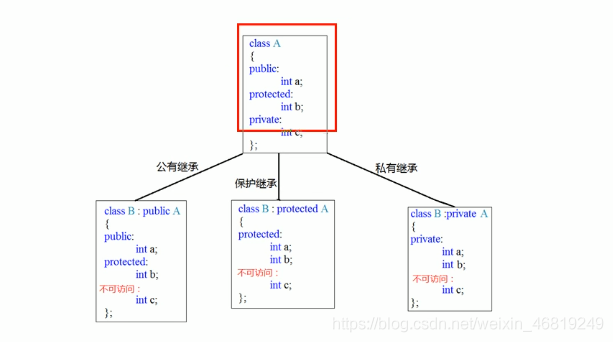
>总结：父类的私有权限内容继承不到。
>保护继承：将父类中的公共权限变为了保护权限
>私有继承：将父类中的公共权限和保护权限内容变为了私有权限


## 3. 继承中的对象模型
**问题**：从父类继承过来的成员，哪些属于子类对象中

<font color=#999AAA >代码如下（示例）：

```cpp
#include<iostream>
using namespace std;

class base
{
public:
	int m_a;
protected:
	int m_b;
private:
	int m_c;  //私有成员只是被隐藏了，但是还是会继承下去
};

//公共继承
class son :public base
{
public:
	int m_d;
};

void test01()
{
	cout << "sizeof son :" << sizeof(son) << endl;	//16
}
//利用开发人员命令提示工具查看对象模型
//跳转盘符	
//跳转文件路径 cd 具体路径下
//cl /d1 reportSingleClassLayout类名 文件名
int main()
{
	test01();
	return 0;
}
```
>结论：父类中的私有成员也是被子类继承下去了，只是被编译器给隐藏后访问不到

## 4. 继承中构造和析构顺序
子类继承父类后，当创建子类对象，也会调用父类的构造函数

问题：父类和子类的构造和析构顺序是谁先谁后？
父类构造函数先调用，
子类析构函数先调用

<font color=#999AAA >代码如下（示例）：

```cpp
class base
{
public:
	base()
	{
		cout << "base的构造函数调用" << endl;
	}
	~base()
	{
		cout << "base的析构函数调用" << endl;
	}
};

//公共继承
class son :public base
{
public:
	son()
	{
		cout << "son的构造函数调用" << endl;
	}
	~son()
	{
		cout << "son的析构函数调用" << endl;
	}
};

void test01()
{
	son p1;
}
```
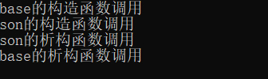
## 5. 继承同名成员处理方式
问题：当子类与父类出现同名的成员，如何通过子类对象，访问到子类或父类中同名的数据呢？
- 访问子类同名成员    直接访问即可
- 访问父类同名成员    需要加作用域

<font color=#999AAA >代码如下（示例）：

```cpp
#include<iostream>
using namespace std;

//继承中同名成员处理
class base
{
public:
	base()
	{
		m_a = 100;
	}
	void func()
	{
		cout << "base-func的调用" << endl;
	}
	void func(int a)
	{
		cout << "base1-func的调用" << endl;
	}
	int m_a;
};
class son : public base
{
public:
	son()
	{
		m_a = 200;
	}
	void func()
	{
		cout << "son-func的调用" << endl;
	}
	
	int m_a;
};

//同名成员属性处理
void test01()
{
	son s;
	cout << "子类的m_a = " << s.m_a << endl;
	//如果通过子类对象，访问到父类中同名成员，需要加作用域
	cout << "父类的m_a = " << s.base::m_a << endl;	
}
//同名成员函数处理
void test02()
{
	son s1;
	s1.func();
	s1.base::func();
	//如果子类中出现和父类同名的成员函数，子类的同名成员会隐藏掉父类中所有同名成员函数
	//如果想访问到父类中被隐藏的同名成员函数，需要加作用域
	s1.base::func(10);
	
}
int main()
{
	//test01();
	test02();
	return 0;
}
```
>总结：
>1.子类对象可以直接访问到子类中同名成员
>2.子类对象加作用域可以访问到父类同名成员
>3.当子类与父类拥有同名的成员函数，子类会隐藏父类中同名成员函数，加作用域可以访问到父类中同名函数

## 6. 继承同名静态成员处理方法
问题：继承中同名的静态成员在子类对象上如何进行访问？

静态成员和非静态成员出现同名，处理方式一致
- 访问子类同名成员 直接访问即可
- 访问父类同名成员 需要加作用域

<font color=#999AAA >代码如下（示例）：

```cpp
#include<iostream>
using namespace std;

//继承中同名成员处理
class base
{
public:
	
	static int m_a;
	static void func()
	{
		cout << "base-static void func()" << endl;
	}
};
int base::m_a = 100;
class son : public base
{
public:
	static void func()
	{
		cout << "son-static void func()" << endl;
	}
	static int m_a;
};
int son::m_a = 200;

//静态同名成员属性处理
void test01()
{
	//1.通过对象访问
	cout << "通过对象访问" << endl;
	son s;
	cout << "son下 m_a = " << s.m_a << endl;
	cout << "base下 m_a = " << s.base::m_a << endl;
	//2.通过类名访问
	cout << "通过类名访问" << endl;
	cout << "son下 m_a = " << son::m_a << endl;
	//第一个::代表通过类名方式访问 第二个::代表访问父类作用域下
	cout << "base下 m_a = " << son::base::m_a << endl;
}
//静态同名成员函数处理
void test02()
{
	//1.通过对象访问
	son s;
	s.func();
	s.base::func();

	//2.通过类名访问
	son::func();
	son::base::func();
}
int main()
{
	test01();
	test02();
	return 0;
}
```
>总结：同名静态成员处理方式和非静态处理方式一样，只不过静态成员有两种访问的方式（通过对象 和 通过类名）

## 7. 多继承语法
C++允许**一个类继承多个类**

语法：`class 子类 :继承方式 父类1 , 继承方式 父类2...`

多继承可能会引发父类中有同名成员出现，需要加作用域区分

## 8. 菱形继承
**菱形继承概念**：
两个派生类继承同一个基类
又有某个类同时继承这两个派生类
这种继承被称为菱形继承，或者钻石继承

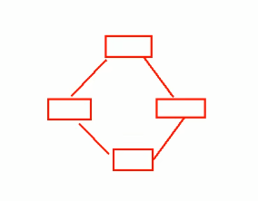


<font color=#999AAA >代码如下（示例）：

```cpp
#include<iostream>
using namespace std;

class animal
{
public:
	int m_age;
};

//继承前加virtual关键字后，变为虚继承
//此时公共的父类animal称为虚基类
class sheep : virtual public animal {};
class tuo : virtual public animal {};

class sheeptuo :public sheep, public tuo{};//继承两个类
//继承的是指向一个值的指针

void test01()
{
	sheeptuo st;
	st.sheep::m_age = 200;
	st.tuo::m_age = 100;
	//保留的数据是最后那个
	cout << "st.sheep::m_age = " << st.sheep::m_age << endl;	//100
	cout << "st.tuo::m_age = " << st.tuo::m_age << endl;		//100
	cout << "st.m_age = " << st.m_age << endl;					//100
}
int main()
{
	test01();
	return 0;
}
```

**总结**：
- 菱形继承带来的主要问题是子类继承两份相同的数据，产生二义性，导致资源浪费以及毫无意义
- 利用虚继承可以解决菱形继承问题

# 八、多态
## 1.	多态的基本语法
多态分为两类
- 静态多态：函数重载 和 运算符重载属于静态多态 ，复用函数名
- 动态多态：派生类和虚函数实现运行时多态

静态多态和动态多态区别：

- 静态多态的函数地址早绑定 - 编译阶段确定函数地址
- 动态多态的函数地址晚绑定 - 运行阶段确定函数地址


<font color=#999AAA >代码如下（示例）：

```cpp
#include<iostream>
using namespace std;

class animal
{
public:
	//speak函数就是虚函数
	//函数前面加上virtual关键字，变成虚函数，那么编译器在编译的时候就不能确定函数调用了
	virtual void speak()
	{
		cout << "动物在说话" << endl;
	}
};
class cat :public animal
{
public:
	void speak()
	{
		cout << "小猫在说话" << endl;
	}
};
class dog :public animal
{
public:
	void speak()
	{
		cout << "小狗在说话" << endl;
	}
};
//我们希望传入什么对象，那么就调用什么对象的函数
//如果函数地址在编译阶段就能确定，那么静态联编
//如果函数地址在运行阶段才能确定，那么动态联编

void dospeak(animal& animal)
{
	animal.speak();
}
//多态满足条件：
//1.有继承关系
//2.子类重写父类中的虚函数
//多态使用：
//父类指针或引用指向子类对象

void test01()
{
	cat cat;
	dospeak(cat);

	dog dog;
	dospeak(dog);
}

int main()
{
	test01();
	return 0;
}
```
**总结**：
> 多态满足条件
> - 有继承关系
> - 子类重写父类中的虚函数

>多态使用条件
>- 父类指针或引用指向子类对象
>**重写**：函数返回值类型   函数名     参数列表    完全一致称为重写
## 2. 多态案例一 计算器类
案例描述：

分别利用普通写法和多态技术，设计实现两个操作数进行运算的计算器

多态的优点：
- 代码组织结构清晰
- 可读性强
- 利于前期和后期的扩展以及维护


<font color=#999AAA >代码如下（示例）：

```cpp
#include<iostream>
using namespace std;

//实现计算器抽象类
class abstractcaculator
{
public:

	virtual int getresult()
	{
		return 0;
	}
	int m_num1;
	int m_num2;
};

//加法计算器
class addcaculator :public abstractcaculator
{
public:
	int getresult()
	{
		return m_num1 + m_num2;
	}
};
//减法计算器
class subcaculator :public abstractcaculator
{
public:
	int getresult()
	{
		return m_num1 - m_num2;
	}
};

//乘法计算器
class mulcaculator :public abstractcaculator
{
public:
	int getresult()
	{
		return m_num1 * m_num2;
	}
};
void test01()
{
	//创建加法计算器
	abstractcaculator* abc = new addcaculator;	//用父类指针或引用  指向子类
	abc->m_num1 = 10;
	abc->m_num2 = 20;
	cout << abc->getresult() << endl;
	delete abc;	//用完了记得销毁

	//创建减法计算器
	abc = new subcaculator;
	abc->m_num1 = 10;
	abc->m_num2 = 10;
	cout << abc->getresult() << endl;
	delete abc;

	//创建乘法计算器
	abc = new mulcaculator;
	abc->m_num1 = 10;
	abc->m_num2 = 10;
	cout << abc->getresult() << endl;
	delete abc;

}
int main()
{
	test01();
	return 0;
}
```
## 3. 纯虚函数和抽象类
在多态中，通常父类中虚函数的实现是毫无意义的，主要都是调用子类重写的内容

因此可以将虚函数改为**纯虚函数**

纯虚函数语法：`virtual 返回值类型 函数名 （参数列表）= 0`

当类中有了纯虚函数，这个类也称为==抽象类==

**抽象类特点**：

 - 无法实例化对象
 - 子类必须重写抽象类中的纯虚函数，否则也属于抽象类

<font color=#999AAA >代码如下（示例）：

```cpp
class base
{
public:
	//纯虚函数
	//只要有一个纯虚函数，这个类称为抽象类
	//抽象类特点：
	//1.无法实例化对象
	//2.抽象类的子类，必须要重写父类中的纯虚函数，否则也属于抽象类
	virtual void func() = 0;
};
class son : public base
{
public:
	virtual void func()
	{
		cout << "func调用" << endl;
	}
};

void test01()
{
	
	base* base = NULL;
	//base = new base; 错误，抽象类无法实例化对象
	base = new son;
	base->func();
	delete base; //记得销毁
}
```
## 4. 多态案例二—制作饮品
利用多态技术实现本案例，提供抽象制作饮品类，提供子类制作咖啡和茶叶

<font color=#999AAA >代码如下（示例）：

```cpp
//制作饮品
class abstractdrinking
{
public:
	//煮水
	virtual void boil() = 0;
	//冲泡
	virtual void brew() = 0;
	//倒入杯中
	virtual void pourincup() = 0;
	//加入辅料
	virtual void putsomething() = 0;
	//制作饮品
	void makedrink()
	{
		boil();
		brew();
		pourincup();
		putsomething();
	}
};
//制作咖啡
class coffee :public abstractdrinking
{
public:
	//煮水
	virtual void boil()
	{
		cout << "煮农夫山泉" << endl;
	};
	//冲泡
	virtual void brew()
	{
		cout << "冲泡咖啡" << endl;
	};
	//倒入杯中
	virtual void pourincup()
	{
		cout << "倒入杯中" << endl;
	};
	//加入辅料
	virtual void putsomething()
	{
		cout << "加入糖和牛奶" << endl;
	};
};
//制作茶叶
class tea :public abstractdrinking
{
public:
	//煮水
	virtual void boil()
	{
		cout << "煮开水" << endl;
	};
	//冲泡
	virtual void brew()
	{
		cout << "冲泡茶叶" << endl;
	};
	//倒入杯中
	virtual void pourincup()
	{
		cout << "倒入杯中" << endl;
	};
	//加入辅料
	virtual void putsomething()
	{
		cout << "加入柠檬" << endl;
	};
};

//制作的函数
void dowork(abstractdrinking *abs) //用父类的指针或引用指向子类的对象
{
	abs->makedrink();
	delete abs;	//释放
}
void test01()
{
	//制作咖啡
	dowork(new coffee);
	cout << "-------------" << endl;
	//制作茶叶
	dowork(new tea);
}
```
## 5. 虚析构和纯虚析构
多态使用时，如果子类中有属性开辟到堆区，那么父类指针在释放时无法调用到子类的析构代码

==解决方式==：将父类中的析构函数改为**虚析构**或**纯虚析构**

虚析构和纯虚析构共性：
- 	可以解决父类指针释放子类对象
-   都需要有具体的函数实现

虚析构和纯虚析构的区别：
- 如果是纯虚析构，该类属于抽象类，无法实例化对象

虚析构语法：`virtual ~类名(){}`
纯虚析构语法：
`virtual ~类名() = 0`
`类名：：~类名(){} `
<font color=#999AAA >代码如下（示例）：

```cpp
class animal
{
public:
	animal()
	{
		cout << "animal的构造函数调用" << endl;
	}
	//利用虚析构可以解决 父类指针释放子类对象时不干净的问题
	/*virtual ~animal()
	{
		cout << "animal的析构函数调用" << endl;
	}*/
	//纯虚析构   有了纯虚析构之后，这个类也属于抽象类，无法实例化对象
	virtual ~animal() = 0;

	//纯虚函数
	virtual void speak() = 0;
};

animal::~animal()
{
	cout << "animal的析构函数调用" << endl;
}
class cat :public animal
{
public:
	cat(string name)
	{
		cout << "cat的构造函数" << endl;
		m_name = new string(name);
	}
	virtual void speak()
	{
		cout << *m_name<<"小猫在说话" << endl;
	}
	~cat()
	{
		if (m_name !=  NULL)
		{
			cout << "调用cat的析构函数" << endl;
			delete m_name;
			m_name = NULL;
		}
	}
	string *m_name;
};
void test01()
{
	animal* animal = new cat("tom");
	animal->speak();
	//父类指针在析构时候 不会调用子类中析构函数，导致子类如果有堆区属性，会出现内存泄漏
	delete animal;
}
```
总结：
	1. 虚析构或纯虚析构就是用来解决通过父类指针释放子类对象
	2. 如果子类中没有堆区数据，可以不写虚析构或纯虚析构
	3. 拥有纯虚析构函数的类也属于抽象类

## 6. 多态案例三--电脑组装
**案例描述**：
	电脑主要组成部件为：CPU（用于计算），显卡（用于显示），内存条（用于存储）
	将每个零件封装出抽象基类，并且提供不同的厂商生产不同的零件，例如intel厂商和lenovo厂商
	创建电脑类提供让电脑工作的函数，并且调用每个零件工作的接口
	测试时组装三台不同的电脑进行工作


<font color=#999AAA >代码如下（示例）：

```cpp
#include<iostream>
using namespace std;
#include<string>

//抽象不同零件类
//抽象CPU类
class cpu
{
public:
	//抽象的计算函数
	virtual void calculate() = 0;
};
//抽象显卡类
class videocard
{
public:
	//抽象的显示函数
	virtual void display() = 0;
};
//抽象内存条类
class memory
{
public:
	//抽象的存储函数
	virtual void storage() = 0;
};


//电脑类
class computer
{
public:
	computer(cpu* cpu, videocard* vc, memory* mem)
	{
		m_cpu = cpu;
		m_vc = vc;
		m_mem = mem;
	}
	//提供工作函数
	void work()
	{
		m_cpu->calculate();
		m_mem->storage();
		m_vc->display();
	}
	virtual ~computer()
	{
		//释放cpu零件
		if (m_cpu != NULL)
		{
			delete m_cpu;
			m_cpu = NULL;
		}
		//释放显卡零件
		if (m_vc != NULL)
		{
			delete m_vc;
			m_vc = NULL;
		}
		//释放内存条零件
		if (m_mem != NULL)
		{
			delete m_mem;
			m_mem= NULL;
		}
	}
private:
	cpu* m_cpu; //cpu的零件指针
	videocard* m_vc; //显卡的零件指针
	memory* m_mem;	//内存条的零件指针
};


//具体厂商
//intel厂商
class intelcpu :public cpu
{
public:
	virtual void calculate()
	{
		cout << "intel的cpu开始计算" << endl;
	}
};
class intelvideocard :public videocard
{
public:
	virtual void display()
	{
		cout << "intel的显卡开始显示" << endl;
	}
};
class intelmemory :public memory
{
public:
	virtual void storage()
	{
		cout << "intel的内存条开始存储" << endl;
	}
};
//lenovo厂商
class lenovocpu :public cpu
{
public:
	virtual void calculate()
	{
		cout << "lenovo的cpu开始计算" << endl;
	}
};
class lenovovideocard :public videocard
{
public:
	virtual void display()
	{
		cout << "lenovo的显卡开始显示" << endl;
	}
};
class lenovomemory :public memory
{
public:
	virtual void storage()
	{
		cout << "lenovo的内存条开始存储" << endl;
	}
};
void test01()
{
	//第一台电脑的零件
	cpu* n_intelcpu = new intelcpu;
	videocard* n_intelvideocard = new intelvideocard;
	memory* n_intelmemory = new intelmemory;
	//创建第一台电脑
	computer* n_computer = new computer(n_intelcpu, n_intelvideocard, n_intelmemory);
	n_computer->work();
	delete n_computer; 


	cout << "第二台电脑开始工作" << endl;
	//第二台电脑组装
	cpu* n_lenovocpu = new lenovocpu;
	videocard* n_lenovovideocard = new lenovovideocard;
	memory* n_lenovomemory = new lenovomemory;
	//创建第二台电脑
	computer* n_computer1 = new computer(n_lenovocpu, n_lenovovideocard, n_lenovomemory);
	n_computer1->work();
	delete n_computer1;


}
int main()
{
	test01();
	return 0;
}
```


## 7. 父类要析构子类的对象要用虚析构
- 构造时，==先构造父类，再构造子类部分==，因此父类和子类的构造函数都会被调用；
- 析构时，要分情况

（1）（**父类析构函数不是虚函数**）使用父类指针指向子类对象，析构该子类对象时，**只会调用父类析构函数**，因为不具多态性；代码理解

```cpp
class child:public parent{};
parent *p = new child();
delete p;   //调用父类析构函数，子类析构函数不会被调用
```
（2） 如果子类对象存在资源在堆区，子类的析构函数没被调用，资源就释放不掉。可以使用虚函数。然后会==先调用子类析构函数，然后再调用父类析构函数==

```cpp
class parent{
	virtual	~parent();
};
class child:public parent
{
	~child();
};
parent *p = new child();
delete p;   //先调用子类的析构函数，再调用父类的析构函数
```
（3）对于第一种非虚函数的情况，如果是用==子类指针指向子类对象==，那么会先调用子类析构函数，再调用父类析构函数，子类释放子类中分配的，父类分配父类中分配的。

```cpp
class child:public parent{};
child*p = new child();
delete p;   //先调用子类的析构函数，再调用父类的析构函数
```
既然第三种方法也能够让父类和子类的资源都释放掉，为什么还需要使用virtual呢？这是为了让面向对象具有多态性，更简单的理解是方便编程，使用父类指针具有==通用性==，特别是大型系统开发中。

# 九、模板
## 1. 模板的概念
模板是泛型编程的基础，泛型编程即以一种独立于任何特定类型的方式编写代码。

模板是创建泛型类或函数的蓝图或公式。库容器，比如迭代器和算法，都是泛型编程的例子，它们都使用了模板的概念。

## 2. 函数模板

 - C++另一种编程思想称为==泛型编程==，主要利用的技术就是模板
 - C++提供两种模板机制：==函数模板==和==类模板==

### 2.1 函数模板语法
函数模板作用：
建立一个通用函数，其函数==返回值类型==和==形参类型==可以不具体制定，用一个**虚拟的类型**来代表

**语法**：`template <typename T>	`		函数声明或定义
**解释**：
template(模板） --- 声明创建模板
typename --- 表明其后面的符合是一种数据类型，可以用class代替
T --- 通用的数据类型，名称可以代替，通常为大写字母

<font color=#999AAA >代码如下（示例）：

```cpp
//交换两个整型函数
void swapInt(int& a, int& b)//用引用交换的是本体，相当于地址传递
{
	int temp = a;
	a = b;
	b = temp;
}
//交换两个浮点型函数
void swapDouble(double& a, double& b)
{
	double temp = a;
	a = b;
	b = temp;
}

//函数模板
template<typename T>	//声明一个模板，告诉编译器后面代码中紧跟着的T不要报错，T是一个通用数据类型
void myswap(T& a, T& b)
{
	T temp = a;
	a = b;
	b = temp;
}

void test01()
{
	int a = 10;
	int b = 20;
	swapInt(a,b);
	cout<<"a="<<a<<endl;//20
	cout<<"b="<<b<<endl;//10
	//利用函数模板交换
	//两种方式使用函数模板
	//1.自动类型推导
	//myswap(a, b);	//因为a是int型，b也是int型。使用编译器推导出T是int型
	//2.显示指定类型
	myswap<int>(a, b);
	cout << "a= " << a << endl;
	cout << "b= " << b << endl;
}
```
总结：

 - 函数模板利用关键字template
 - 使用函数模板有两种方式：自动类型推导、显示指定类型
 - 模板的目的是为了提高复用性，`将类型参数化`

### 2.2 函数模板注意事项
注意事项：

 - 自动类型推导，必须推导出一致的数据类型T 才可以使用
 - 模板必须要确定出T的数据类型，才可以使用

<font color=#999AAA >代码如下（示例）：

```cpp
//利用模板提供通用的交换函数
template<class T>	//typename 可以替换成class
void myswap(T& a, T& b)
{
	T temp = a;
	a = b;
	b = temp;
}
//1.自动类型推导，必须推导出一致的数据类型T才可以使用
void test01()
{
	int a = 10;
	int b = 20;
	char c = 'c';

	//myswap(a, b);	//正确！
	//myswap(a, c);	//错误！推导不出一致的T类型

	cout << "a= " << a << endl;
	cout << "b= " << b << endl;
}

//2.模板必须要确定出T的数据类型，才可以使用
template<class T>
void func()
{
	cout << "func函数的调用" << endl;
}

void test02()
{
	//func();	报错，因为这个是模板函数，必须确定T的数据类型
	func<int>();
}
```
### 2.3 函数模板案例
案例概述：

 - 利用函数模板封装一个排序的函数，可以对**不同数据类型数组**进行排序
 - 排序规则由大到小，排序算法为选择排序
 - 分别利用**char数组**和**int数组**进行测试

<font color=#999AAA >代码如下（示例）：

```cpp
template<typename T>
void mysort(T arr[], int len)	//选择排序
{
	for (int i = 0; i < len; i++)
	{
		int min = i;
		for (int j = i + 1; j < len; j++)
		{
			if (arr[j] < arr[min]) {
				min = j;
			}
		}
		if (min != i)
		{
			T temp = arr[i];
			arr[i] = arr[min];
			arr[min] = temp;
		}
	}
}

template<class T>
void myprintf(T arr[], int len)
{
	for (int i = 0; i < len; i++)
	{
		cout << arr[i] << " " ;
	}
}
void test01()
{
	//测试char数组
	char arr[] = "baderc";
	int len = strlen(arr);	//用sizeof()会把字符数组中的'/0'符合读取进去
	mysort<char>(arr, len);
	myprintf<char>(arr ,len);
	//测试int整型数组
	int arr1[] = { 5,8,6,9,1,2 };
	int len1 = sizeof(arr1) / sizeof(arr1[0]);
	mysort<int>(arr1, len1);
	myprintf<int>(arr1, len1);
}
```
### 2.4 普通函数与函数模板的区别


 - 普通函数调用时可以发生自动类型转换（隐式类型转换）
 - 函数模板调用时，如果利用自动类型推导，不会发生隐式类型转换
 - 如果利用显示指定类型的方式，可以发生隐式类型转换

<font color=#999AAA >代码如下（示例）：

```cpp
//普通函数
int myadd01(int a, int b)
{
	return a + b;
}

//函数模板
template<typename T>
T myadd02(T a, T b)
{
	return a + b;
}

void test01()
{
	int a = 10;
	int b = 20;
	char c = 'a'; // a --- 97
	cout << myadd01(a, b) << endl;		//30
	cout << myadd01(a, c) << endl;		//107 编译器将char型数据转换为int型
	//cout << myadd02(a, c) << endl;		//报错，自动类型推导不会发生隐式类型转换，不会把char型转换为int型
	cout << myadd02<char>(a, c) << endl;	// k
	cout << myadd02<int>(a, c) << endl;		//107
}	
```
### 2.5 普通函数与函数模板的调用规则
调用规则如下：

 1. 如果函数模板和普通函数都可以实现，优先调用普通函数
 2. 可以通过空模板参数列表来强制调用函数模板
 3. 函数模板也可以发生重载
 4. 如果函数模板可以产生更好的匹配，优先调用函数模板


<font color=#999AAA >代码如下（示例）：

```cpp
//普通函数
void myprintf(int a, int b)
{
	cout << "调用的普通函数" << endl;
}

//函数模板
template<typename T>
void myprintf(T a, T b)
{
	cout << "调用的模板" << endl;
}
//函数模板可以重载
template<typename T>
void myprintf(T a, T b, T c)
{
	cout << "调用重载的模板" << endl;
}

void test01()
{
	int a = 10;
	int b = 20;
	myprintf(a, b);//允许普通函数和函数模板同时存在，但优先调用普通函数
	//通过空模板参数列表，强制调用函数模板
	myprintf<>(a, b);
	//myprintf(a,b,100);
	//4.如果函数模板可以产生更好的匹配，优先调用函数模板
	char c1 = 'a';
	char c2 = 'b';
	myprintf(c1, c2);	//调用的模板，因为如果调用函数，还需要隐式类型转换
}	
```
>总结：既然提供了函数模板，最好就不要提供普通函数，否则容易出现二义性

### 2.6 模板的局限性
局限性：

 - 模板的通用性并不是万能的
<font color=#999AAA >例如：

```cpp
template<class T>
void function(T a,T b)
{
	a = b;
}
```
在上述代码中提供的赋值操作，如果传入的a和b是一个数组，就无法实现
<font color=#999AAA >再例如：

```cpp
template<class T>
void f(T a, T b)
{
	if(a > b){...}
}
```

如果T的数据类型传入的是像==Person这样的自定义数据类型==，也无法正常运行

可以进行运算符重载，另一种方法是提供具体化的模板

C++为了解决这种问题，提供模板的重载，可以为这些**特定的类型**提供**具体化的模板**
<font color=#999AAA >代码如下（示例）：

```cpp
//创建一个person类
class person
{
public:
	person(string name, int age)
	{
		this->m_age = age;
		this->m_name = name;
	}
	string m_name;	//姓名
	int m_age;		//年龄
};

//对比两个数据是否相等函数
template<class T>
bool mycompare(T &a, T &b)
{
	return a == b;
}
//模板重载，具体化
//这样就能对比自定义类型的数据了
template<> bool mycompare(person& p1, person& p2)
{
	return p1.m_name == p2.m_name && p1.m_age == p2.m_age;
}
void test01()
{
	int a = 10;
	int b = 20;
	bool ret = mycompare(a, b);
	if (ret)
		cout << "a == b " << endl;
	else
		cout << " a != b" << endl;
}
void test02()
{
	person p1("张三", 10);
	person p2("李四", 20);
	bool ret = mycompare(p1, p2);
	if (ret)		cout << "p1 == p2" << endl;
	else			cout << "p1 != p2" << endl;
}
```
>利用具体化的模板，可以解决自定义类型的通用化
>学习模板不是为了写模板，而是在STL能够运用系统提供的模板
## 3. 类模板
### 3.1 类模板语法
类模板作用：建立一个通用类，类中的成员 数据类型可以不具体制定，用一个**虚拟的类型**来代表
语法：

```cpp
template<typename T> 
类
```
<font color=#999AAA >代码如下（示例）：

```cpp
template<typename nametype,typename agetype>
class person
{
public:
	person(nametype name, agetype age)
	{
		this->m_age = age;
		this->m_name = name;
	}
	nametype m_name;
	agetype m_age;
};
void test01()
{
	person<string, int> p1("张三",10);
	cout << "name = " << p1.m_name << " " << "age = " << p1.m_age << endl;
}
```
>类模板和函数模板语法相似，在声明模板template后面加类，此类称为类模板
### 3.2 类模板与函数模板的区别
区别有两点：

 1. 类模板没有自动类型推导的使用方式
 2. 类模板在模板参数列表中可以有默认参数

<font color=#999AAA >代码如下（示例）：

```cpp
#include<iostream>
using namespace std;
#include<string>

//类模板与函数模板的区别
template<class  nametype, class agetype = int>    //模板中typename可以替换为class
class person
{
    public:
        person(nametype name, agetype age)
            {
                this->m_age = age;
                this->m_name = name;
            }
            void showPerson()
            {
                cout << "name:" << this->m_name << endl
                     << "age:" << this->m_age << endl;
            }
  
            nametype m_name;
            agetype m_age;
};

//1.类模板没有自动类型推导使用方式
void test01()
    {
        //person p1("张三", 100);     //会报错，无法使用自动类型推导
        person<string, int> p1("张三", 100);     //正确，只能用显示指定类型
        p1.showPerson();
    }
    //2.类模板在模板参数列表中可以有默认参数

void test02()
{
    person<string>p2("猪八戒", 999);
    p2.showPerson();
}
int main()
{
    test01();
    test02();
    return 0;
}
```
**总结：**

 - 类模板使用只能用显示指定类型方式
 - 类模板中的模板参数列表可以有默认参数

### 3.3 类模板中成员函数创建时机
类模板中成员函数和普通类中成员函数创建时机是有区别的：
- 普通类中的成员函数一开始就可以创建
- 类模板中的成员函数在调用时才创建

<font color=#999AAA >代码如下（示例）：

```cpp
#include<iostream>
using namespace std;

//类模板中成员函数在调用时才创建

class person1
{
    public:
        void showperson1()
        {
            cout << "person1" << endl;
        }
};

class person2
{
    public:
        void showperson2()
        {
            cout << "person2" << endl;
        }
};

template<class T>
class Myclass
{
    public:
        T obj;

        //类模板中的成员函数
        void func1()
        {
            obj.showperson1();
        }
         void func2()
        {
            obj.showperson2();
        }
};

void test01()
{
    Myclass<person1> m;
    m.func1();
    //m.func2(); //编译会出错，说明 函数调用才会去创建成员函数
}
int main()
{
    test01();
    return 0;
}
```

**总结**
- 类模板中的成员函数不是一开始就创建的，只是在调用时才去创建
### 3.4 类模板对象做函数参数
学习目标：类模板实例化出的对象，向函数传参的方式

有三种传入方式：
1.指定传入类型 			--- 直接显示对象的数据类型
2. 参数模板化				--- 将对象中的参数变为模板进行传递
3. 整个类模板化			--- 将这个对象类型 模板化进行传递

<font color=#999AAA >代码如下（示例）：

```cpp
#include<iostream>
using namespace std;
#include<string>

//类模板对象做函数参数

//写个类模板
template<class T1, class T2>
class person
{
    public:
        person(T1 name, T2 age)
        {
            this->m_age = age;
            this->m_name = name;
        }

        void showperson()
        {
            cout << "姓名：" << this->m_name << endl
                 << "年龄：" << this->m_age << endl;
        }
        T1 m_name;
        T2 m_age;
};
//1.指定传入类型
void printfperson1(person<string,int> &p)   //直接指定
{
    p.showperson();
}
void test01()
{
    person<string, int> p1("孙悟空", 100);
    printfperson1(p1);
}
//2.参数模板化
template<class T1, class T2>
void printfperson2(person<T1,T2> &p)
{
    p.showperson();
    cout << " T1的类型为：" << typeid(T1).name() << endl;
    cout << "T2的类型为：" <<  typeid(T2).name() << endl;
}
void test02()
{
     person<string, int> p2("猪八戒", 90);
    printfperson2(p2);
}

//3.整个类模板化
template<class T3>
void printperson3(T3 &p)
{
    p.showperson();
}
void test03()
{
    person<string, int> p3("唐僧", 80);
    printperson3(p3);
}
int main()
{
    test01();
    test02();
    test03();
    return 0;
}
```
**总结：**
- 通过类模板创建的对象，可以有三种方式向函数中进行传参
- 使用广泛是第一种：指定传入的类型
### 3.5 类模板与继承
当类模板碰到继承时，需要注意以下几点：
- 当子类继承的父类是一个类模板时，子类在声明的时候，要指定出父类中T的类型
- 如果不指定，编译器无法给子类分配内存
- 如果想灵活指定出父类中T的类型，子类也需变为类模板

```cpp
#include<iostream>
using namespace std;

//类模板与继承
//基类
template<class T>
class base
{
    T m;
};

//class son : public base     //错误，必须要知道父类中的T类型，才能继承给子类
//c++  编译需要给子类分配内存，必须知道父类中T的类型才可以向下继承
class son : public base<int>
{
    
};
void test01()
{
    son s1;
}

//如果想灵活指定父类中T类型，子类也需要变为类模板
template<class T1, class T2>
class son1 :public base<T2>
{
    public:
    T1 obj;
};
void test02()
{
    son1<int, char> S2;
}

int main()
{
    test01();
    test02();
    return 0;
}
```
**总结：** 如果父类是类模板，子类需要指定出父类中T的数据类型
### 3.6 类模板成员函数类外实现
<font color=#999AAA >代码如下（示例）：

```cpp
#include<iostream>
using namespace std;

// 类模板成员函数类外实现
template<class T1, class T2>
class Person
{
public:
	Person(T1 name, T2 age);
	void showPerson();
	
	T1 m_Name;
	T2 m_Age;
};

// 构造函数类外实现
template<class T1, class T2>
Person<T1, T2>::Person(T1 name, T2 age)
{
	this->m_Age = age;
	this->m_Name = name;
	
}
// 成员函数类外实现
template<class T1, class T2>
void Person<T1, T2>::showPerson()
{
	cout<<"姓名： "<< this->m_Name <<" " << "年龄： " << this->m_Age << endl;
}

void test01()
{
	Person<string, int> p1("张三", 100);
	p1.showPerson();
}
int main()
{
	test01();
}
```

 ### 3.7 类模板分文件编写
 问题：
 - 类模板中成员函数创建时机是在调用阶段，导致分文件编写时链接不到

解决：
- 解决方式1：直接包含.cpp源文件
- 解决方式2：将声明和实现写到同一个文件中，并更改后缀名为.hpp，.hpp是约定的名称，并不是强制

 <font color=#999AAA >代码如下（示例）：


```cpp
// 方式1
// person.h文件
#pragma once
#include<iostream>
using namespace std;

template<class T1, class T2>
class Person
{
public:
	Person(T1 name, T2 age);
	void showPerson();
	
	T1 m_Name;
	T2 m_Age;
};
```

```cpp
// person.cpp 文件
#include "person.h"

// 构造函数类外实现
template<class T1, class T2>
Person<T1, T2>::Person(T1 name, T2 age)
{
	this->m_Age = age;
	this->m_Name = name;
	
}
// 成员函数类外实现
template<class T1, class T2>
void Person<T1, T2>::showPerson()
{
	cout<<"姓名： "<< this->m_Name <<" " << "年龄： " << this->m_Age << endl;
}
```

```cpp
// 运用方式1，主函数文件要包含.cpp源文件
// 如果用方式2，将声明和实现同一个文件中，并改后缀名为.hpp，然后主函数文件引入
#include<iostream>
#include<string>
using namespace std;
#include "person.cpp"

void test01()
{
	Person<string, int> p1("张三", 100);
	p1.showPerson();
}
int main()
{
	test01();
}
```
### 3.8 类模板与友元
实现：类模板配合友元函数的类内和类外实现

全局函数类内实现 - 直接在类内声明友元即可
全局函数类外实现 - 需要提前让编译器知道全局函数的存在

> 总结：用类内实现就好，用法简单

```cpp
//类内实现
#include<iostream>
#include<string> 
using namespace std;

// 类模板成员函数类外实现
template<class T1, class T2>
class Person
{
    //全局函数 类内实现
    friend void printPerson(Person<T1, T2> p)
    {
        cout << "姓名：" << p.m_Name << "年龄： "<<  p.m_Age << endl;
    }

public:
	Person(T1 name, T2 age)
    {
        this->m_Age = age;
        this->m_Name = name;
    }

private:

	T1 m_Name;
	T2 m_Age;
};

void test01()
{
	Person<string, int> p1("张三", 100);
	printPerson(p1);
}
int main()
{
	test01();
}
```

```cpp
#include<iostream>
#include<string> 
using namespace std;

// 提前让编译器知道person类
template<class T1,class T2>
class Person;

// 要让编译器知道有这个全局函数
template<class T1,class T2>
void printPerson(Person<T1, T2> p)
{
    cout << "姓名：" << p.m_Name << "年龄： "<<  p.m_Age << endl;
}

// 类模板成员函数类外实现
template<class T1, class T2>
class Person
{
    //全局函数 类外实现
    // 加空模板参数列表
    friend void printPerson<>(Person<T1, T2> p);
public:
	Person(T1 name, T2 age)
    {
        this->m_Age = age;
        this->m_Name = name;
    }

private:

	T1 m_Name;
	T2 m_Age;
};


void test01()
{
	Person<string, int> p1("张三", 100);
	printPerson(p1);
}
int main()
{
	test01();
}
```
### 3.9 类模板案例
**案例描述：实现一个通用的数组类，要求如下：**
- 可以对内置数据类型以及自定义数据类型的数据进行存储
- 将数组中的数据存储到堆区
- 构造函数中可以传入数组的容量
- 提供对应的拷贝函数以及operator=防止浅拷贝问题
- 提供尾插法和尾删法对数组中的数据进行增加和删除
- 可以通过下标的方式访问数组中的元素
- 可以获取数组中当前元素个数和数组的容量

```cpp
#include<iostream>
using namespace std;

template<class T>
class MyArray
{
public:
    // 构造函数 传入容量参数
    MyArray(int capacity)
    {
        cout << "有参构造函数调用" << endl;
        this->m_capacity = capacity;
        this->m_size = 0;
        this->pAddress = new T[this->m_capacity];
    }
    // 拷贝构造函数 
    MyArray(const MyArray& arr)
    {
        cout << "拷贝构造函数调用" << endl;
        this->m_capacity = arr.m_capacity;
        this->m_size = arr.m_size;

        //深拷贝
        this->pAddress = new T[arr.m_capacity];
        // 将arr中的数据都拷贝过来
        for(int i=0; i< arr.m_capacity; i++)
        {
            this->pAddress[i] = arr.pAddress[i];
        }
    }

    // operator= 防止浅拷贝问题
    MyArray& operator=(const MyArray& arr)
    {
        cout << "运算符=重载函数调用" << endl;
        //先判断原来堆区是否有数据，如果有释放
        if(this->pAddress != NULL)
        {
            delete[] this->pAddress;
            this->pAddress = NULL;
            this->m_capacity = 0;
            this->m_size = 0;
        }
        // 深拷贝
        this->m_capacity = arr.m_capacity;
        this->m_size = arr.m_size;
        
        this->pAddress = new T[arr.m_capacity];
        // 将arr中的数据都拷贝过来
        for(int i=0; i< arr.m_capacity; i++)
        {
            this->pAddress[i] = arr.pAddress[i];
        }
        return *this;
    }

    // 尾插法
    void Push_Back(const T& val)
    {
        // 判断容量是否等于大小
        if(this->m_capacity == this->m_size)
        {
            return;
        }
        this->pAddress[this->m_size] = val; //在数组末尾插入数据
        this->m_size++;
    }

    // 尾删法
    void Pop_Back()
    {
        if(this->m_size == 0)
        {
            return;
        }
        // 让用户访问不到最后一个元素，即为尾删，逻辑删除
        this->m_size--;
    }
    // 通过下标访问数据
    T operator[] (int index)
    {
        return this->pAddress[index];
    }

    // 返回数据容量
    int getCapacity()
    {
        return this->m_capacity;
    }
    // 返回数组大小
    int getSize()
    {
        return this->m_size;
    }
    // 析构函数
    ~MyArray()
    {
        cout << "析构函数调用" << endl;
        if(this->pAddress != NULL)
        {
            delete[] this->pAddress;
            this->pAddress = NULL;
        }
    }


private:
    T * pAddress;  // 指针指向堆区开辟的真实数组
    int m_capacity;  // 数组容量
    int m_size;     // 数组大小
};

void test01()
{
    MyArray <int> arr1(5);      // 有参构造函数调用
    //arr1[0];          // 访问不到，需要重载
    MyArray<int> arr2(arr1);    //  拷贝构造函数调用
    MyArray<int> arr3(100);     //  有参构造函数调用
    arr3 = arr1;                //  运算符=重载函数调用

    
}
int main()
{
    test01();
    return 0;
}
```

### 3.10 自定义类型是类模板的参数，构造函数哪个先

```cpp
#include<iostream>
using namespace std;

class base
{
public:
    base()
    {
        cout << "自定义类型构造函数" << endl;
    }
    ~base()
    {
        cout << "自定义类型析构函数" << endl;
    }
};

template<class T>
class person1
{
public:
    person1()
    {
        cout << "模板类构造函数" << endl;
    }
    ~person1()
    {
        cout << "模板类析构函数" << endl;
    }
private:
    T a;
};

int main()
{
    person1<base> p1;
    return 0;
}
```

# 一、STL初识
## 1. STL概念
- C++的面向对象和泛型编程思想，目的就是**复用性的提升**
- STL（standard template library)，**标准模板库**
- STL从广义上分为：**容器**（container）**算法**（algorithm）**迭代器**（iterator）
- **容器**和**算法**之间通过**迭代器**进行无缝连接
- STL 几乎所有的代码都采用了**模板类和模板函数**

## 2. STL六大组件
STL大体分为六大组件，分别是：**容器、算法、迭代器、仿函数、适配器(配接器)、空间配置器**

1. 容器：各种数据结构，如vector、list、deque、set、map等，用来存放数据
2. 算法：各种常用的算法，如sort、find、copy、for_each等
3. 迭代器：扮演了容器与算法之间的胶合剂
4. 仿函数：行为类似函数，可作为算法的某种策略
5. 适配器：一种用来修饰容器或者仿函数或迭代器**接口**的东西
6. 空间配置器：负责空间的配置与管理
## 3. STL中容器、算法、迭代器
### 容器：存储数据的数据结构
STL**容器**就是将应用**最广泛的一些数据结构**实现出来
常用的数据结构：数组，链表，树，栈，队列，集合，映射表 等
这些容器分为**序列式容器**和**关联式容器**两种：
- 序列式容器：强调值的排序，序列式容器中的每个元素均有**固定**的位置
- 关联式容器：二叉树结构，各元素之间没有严格的物理上的顺序关系

### 算法：Algorithms
算法分为：**质变算法**和**非质变算法**
- 质变算法：是指运算过程中**会更改区间中的元素的内容**，例如拷贝，替换，删除等等
- 非质变算法：是指运算过程中**不会更改区间中的元素内容**，例如查找、计数、遍历、寻找极值等等

### 迭代器：容器和算法之间粘合剂
提供一种方法，使之能够依序寻访某个容器所含的各个元素，而又无需暴露该容器的内部表示方式。
某个容器都有自己专属的迭代器
迭代器使用非常类似于指针

迭代器种类：
| 种类           | 功能                                                     | 支持运算                                  |
| :------------- | :------------------------------------------------------- | :---------------------------------------- |
| 输入迭代器     | 对数据的只读访问                                         | 只读，支持++、==、!=                      |
| 输出迭代器     | 对数据的只写访问                                         | 只写，支持++                              |
| 前向迭代器     | 读写操作，并能向前推进迭代器                             | 读写，支持++、==、!=                      |
| 双向迭代器     | 读写操作，并能向前和向后操作                             | 读写，支持++、--                          |
| 随机访问迭代器 | 读写操作，可以以跳跃的方式访问任意数据，功能最强的迭代器 | 读写，支持++、--、【n】、-n、<、<=、>、>= |

常用的容器中迭代器种类为双向迭代器，和随机访问迭代器

## 4. 容器算法迭代器初识
STL中最常用的容器为Vector，可以理解为数组，下面将学习如何向这个容器中插入数据、并遍历这个容器

### 4.1 Vector存放内置数据类型
容器：`vector`
算法：`for_each`
迭代器：`vector<int>::iterator`

```cpp
#include <iostream>
#include <vector>
#include <algorithm>
using namespace std;

void MyPrint( int val)
{
    cout << val << endl;
}

void test01()
{
    // 创建vector容器对象，并且通过模板参数指定容器中存放的数据的类型
    vector<int> v;
    // 向容器中放数据
    v.push_back(10);
    v.push_back(20);
    v.push_back(30);
    v.push_back(40);

    // 每个容器都有自己的迭代器，迭代器是用来遍历容器中的元素
    // v.begin() 返回迭代器，这个迭代器指向容器中第一个数据
    // v.end() 返回迭代器， 这个迭代器指向容器元素的最后一个元素的下一个位置
    // vector<int>::iterator 拿到vector<int>这种容器的迭代器类型

    vector<int>::iterator pBegin = v.begin();  // 指向第一个数据
    vector<int>::iterator pEnd = v.end();   // 指向最后一个数据的下一个位置

    // 第一种遍历方式
    while(pBegin != pEnd)
    {
        cout<< *pBegin << endl;
        pBegin++;
    }

    // 第二种遍历方式
    for(vector<int>::iterator it = v.begin(); it != v.end(); it++)
    {
        cout << *it << endl;
    }

    // 第三种遍历方式
    // 使用STL提供标准遍历算法 需要头文件 algorithm
    for_each(v.begin(), v.end(), MyPrint);

}
int main()
{
    test01();
    return 0;
}

```
###  4.2 Vector存放自定义数据类型
学习目标：vector中存放自定义数据类型，并打印输出

```cpp
#include<iostream>
#include<string>
#include<vector>
using namespace std;

// 自定义数据类型
class Person
{
public:
    Person(string name, int age)
    {
        this->mAge = age;
        this->mName = name;
    }

public:
    string mName;
    int mAge;
};

// 存放对象
void test01()
{
    // 创建存放person类型的数据容器
    vector<Person> v;

    // 创建数据
    Person p1("aaa", 111);
    Person p2("bbb", 222);
    Person p3("ccc", 333);
    Person p4("ddd", 444);
    
    v.push_back(p1);
    v.push_back(p2);
    v.push_back(p3);
    v.push_back(p4);

    for(vector<Person>::iterator it = v.begin(); it != v.end(); it++)
    {
        cout<<"Name: " << (*it).mName << " Age: " << (*it).mAge << endl;
    }
}
// 存放对象指针
void test02()
{
    vector<Person*> v1;
    // 创建数据
    Person p1("aaa", 111);
    Person p2("bbb", 222);
    Person p3("ccc", 333);
    Person p4("ddd", 444);
    
    v1.push_back(&p1);
    v1.push_back(&p2);
    v1.push_back(&p3);
    v1.push_back(&p4);
    
    for(vector<Person*>::iterator it = v1.begin(); it != v1.end(); it++)
    {
        cout<<"Name: " << (*it)->mName << " Age: " << (*it)->mAge << endl;
    }
}
int main()
{
    test01();
    test02();
    return 0;
}
```
### 4.3 Vector容器嵌套容器
学习目标：容器中嵌套容器，我们将所以数据进行遍历输出

```cpp
#include<iostream>
#include<string>
#include<vector>
using namespace std;


// 容器嵌套容器
void test01()
{
    
    vector< vector<int> > v;

    vector<int> v1;
    vector<int> v2;
    vector<int> v3;
    vector<int> v4;

    for(int i=0; i<4; i++)
    {
        v1.push_back(i+1);
        v2.push_back(i+2);
        v3.push_back(i+3);
        v4.push_back(i+4);
    }

    // 将容器元素插入到vector v 中
    v.push_back(v1);
    v.push_back(v2);
    v.push_back(v3);
    v.push_back(v4);

    for(vector< vector<int> >::iterator it = v.begin(); it != v.end(); it++)
    {
        // 此时(*it) --------容器vector<int>
        for(vector<int>::iterator it1 = (*it).begin(); it1 != (*it).end(); it1++)
        {
            cout<< *it1 <<" ";
        }
    }
}

int main()
{
    test01();

    return 0;
}
```

# STL-常用容器
## string容器
### 1. string基本概念
**本质**：string是C++风格的字符串，而string本质上是一个类

**string和char*区别：**
- char*是一个指针
- string是一个类，类内部封装了char*,管理这个字符串,是一个**char*型的容器**

**特点：** string类内部封装了很多成员方法
例如：查找find，拷贝copy，删除delete，替换replace，插入insert
string管理char*所分配的内存，不用担心复制越界和取值越界等，由类内部进行负责
### 2. string构造函数
构造函数原型
- `string();`				// 创建一个空的字符串 例如string str;
- `string(const char* s);`   // 使用字符串s初始化
- `string（const string& str);`   // 使用一个string对象初始化另一个string对象
- `string(int n, char c); `   // 使用n个字符c初始化

```cpp
#include<iostream>
using namespace std;
#include<string>

// string的构造函数
/*
 * string();                    // 创建一个空的字符串
 * string(const char* s);       // 使用字符串s初始化
 * string(const string& str);   // 使用一个string对象初始化另一个string对象
 * string(int n, char c);       // 使用n个字符c初始化
 */

void test01()
{
    string s1;  // 默认构造， 相当于创建了一个string对象，会调用构造函数
    
    const char* str = "hello world";
    string s2(str);
    cout << "s2 = " << s2 << endl;

    string s3(s2);
    cout << "s3 = " << s3 << endl;

    string s4(5,'s');
    cout << "s4 = " << s4 << endl;
}
int main()
{
    test01();
    return 0;
}
```
### 3. string赋值操作
功能描述： 给string字符串进行赋值
赋值的函数原型：
- `string& operator=(const char* s); `       // char*类型字符串 赋值给当前的字符串
- `string& operator=(const string& s); `     // 把字符串s 赋值给当前的字符串
- `string& operator=(char c); ` 		 // 字符赋值给当前的字符串

- `string& assign(const char* s);`   			 //把字符串s赋值给当前的字符串
- **`string& assign(const char* s, int n);`	  // 把字符串s的前n个字符赋给当前的字符串**
- `string& assign(const string& s);`  // 把字符串s赋给当前字符串
- `string& assign(int n, char c); `  // 把n个字符c赋给当前字符串
```cpp
#include<iostream>
using namespace std;
#include<string>

// 赋值
void test01()
{
    string str1;

    // 赋值char*类型字符串
    str1 = "hello world";
    cout<< "str1 = " << str1 << endl;      // str1 = hello world

    string str2;
    // 赋值字符串str1
    str2 = str1;
    cout << "str2 = " << str2 << endl;      // str2 = hello world

    string str3;
    // 赋值char字符
    str3 = 'a';
    cout << "str3 = " << str3 << endl;      // str3 = a

    string str4;
    // 把字符串s的前n个字符赋给当前的字符串   
    str4 = str4.assign("hello world", 5);
    cout << "str4 = " << str4 << endl;      // str4 = hello

    string str5;
    // 赋值n个字符
    str5 = str5.assign(5,'a');
    cout << "str5 = " << str5 << endl;         // str5 = aaaaa
}
int main()
{
    test01();
    return 0;
}
```
### 4. 字符串拼接
功能描述： 实现在字符串末尾拼接字符串

函数原型：
- `string& operator+=(const char* str);  `   // 重载+=操作符
- `string& operator+=(const string& str);`  // 重载+=操作符
- `string& operator+=(const char c); `  // 重载+=操作符
- `string& append(const char* s);`    //  同operator+=(const char* s);
- `string& append(const string& s);`   // 同operator+=(const string& str)
- `string& append(const char* s, int n);`  // **把字符串s的前n个字符连接到当前字符串结尾**
- `string& append(const string& s, int pos, int n);`  // **字符串s中从pos开始的n个字符连接到字符串结尾**

```cpp
#include<iostream>
using namespace std;
#include<string>

void test01()
{
    string str1 = "我";

    // 追加char*字符串
    str1 += "爱玩游戏";
    cout << str1 << endl;           // 我爱玩游戏

    // 追加字符
    str1 += '1';
    cout << str1 << endl;            // 我爱玩游戏1

    // 追加string类型数据
    string str2 = "LOL";
    str1 += str2;
    cout << str1 << endl;           // 我爱玩游戏1LOL

    // 追加字符串s的前n个字符
    str1.append("hello world", 5);
    cout << str1 << endl;              // 我爱玩游戏1LOLhello

    // 追加字符串s从pos开始的n个字符， pos从0开始
    string str3 = "want to play";
    string str4 = "I ";
    str4.append(str3,5, 5);
    cout << str4 << endl;               // I to pl
}
int main()
{
    test01();
    return 0;
}
```

### 5. 字符串查找和替换
功能描述：
- 查找：查找指定字符串是否存在
- 替换：在指定的位置替换字符串

后面加 const表示函数不可以修改class的成员

**函数原型：**
- `int find(const string& str, int pos = 0) const;`    //查找str第一次出现位置，从pos开始查找
- `int find(const char* s, int pos = 0) const;`     // 查找s第一次出现位置，从pos开始查找
- `int find(const char* s, int pos, int n) const; `     // 从pos位置查找s的前n个字符第一次位置
- `int find(const char c, int pos = 0) const;`         // 查找字符串c第一次出现位置
--------------------------------------------------------------------------------------
- `int rfind(const string& str, int pos = npos) const;`     // 查找str最后一次位置，从pos开始查找
- `int rfind(const char* s, int pos = npos) const;`      // 查找s最后一次出现位置，从pos开始查找
- `int rfind(const char* s, int pos, int n) const;`           // 从pos查找s的前n个字符最后一次位置
- `int rfind(const char c, int pos = 0) const;`             // 查找字符c最后一次出现位置
-------------------------------------------------
- `string& replace(int pos, int n, const string& str);`      //从pos开始起n个字符替换为字符串str
- `string& replace(int pos, int n, const char* s);`            // 从pos开始的n个字符替换为字符串s

```cpp
#include<iostream>
using namespace std;
#include<string>

// 字符串查找
void test01()
{
    string str1 = "abfcdefcg";

    int pos = str1.find("fc");
    (pos == -1)? (cout << "未找到字符串" << endl):(cout << "找到字符串，pos = " << pos << endl);
    // 找到字符串，pos = 2 找到“fc”在字符串str1中的第一次出现位置

    // rfind 和 find 区别
    // rfind从右往左查找  find从左往右找
    pos = str1.rfind("fc");
    (pos == -1)? (cout << "未找到字符串" << endl):(cout << "找到字符串，pos = " << pos << endl);
     // 找到字符串，pos = 6  找到“fc”在字符串str1中的最后一次出现位置
}
// 字符串替换
void test02()
{
    string st1 = "abcdefg";

    st1.replace(1,3,"1111");    // 将pos=1开始起3个字符替换为后面的字符串
    cout<<"st1 = " << st1 << endl;  // st1 = a1111efg
}

int main()
{
    test01();
    test02();
    return 0;
}
```
> **总结**
> - find查找字符串第一次出现位置，rfind查找字符串最后一次出现位置
> - find找到字符串后返回查找的第一个字符位置，找不到返回-1
> - replace在替换时，要指定从哪个位置起，多少字符，替换成什么样的字符串。如上例，“1111”可以替换进3个字符中

### 6. string字符串比较
功能描述: 字符串之间的比较
比较方式： 字符串比较是按字符的ASCII码进行对比
= 返回 0
**>** 返回  1
< 返回 -1

函数原型：
- `int compare(const string& s) const;`  // 与字符串s比较
- `int compare(const char* s) const; `   // 与字符串s比较

```cpp
#include<iostream>
using namespace std;
#include<string>

// 字符串查找
// 主要是用于比较两个字符串是否相等，相等返回0
void test01()
{
  string str1 = "hello";
  string str2 = "aello";
  string str3 = str1;
  
  cout << str1.compare(str2) << endl;  // 1   str1>str2 所以返回1
  cout << str1.compare(str3) << endl;  // 0
}

int main()
{
    test01();
    return 0;
}
```
### 7. string字符存取
string中单个字符存取方式有两种
- `char& operator[] (int n); `       // 通过【】方式取字符
- `char& at(int n); `                     // 通过at方法获取字符

```cpp
#include<iostream>
using namespace std;
#include<string>

void test01()
{
    string str = "hello";

    cout << str[0] << endl;           // h
    cout << str.at(0) << endl;       // h
    for(int i=0; i< str.size(); i++)
    {
         cout << str[i] << endl;   
    }
}

int main()
{
    test01();
    return 0;
}
```
### 8. string插入和删除
功能描述：
- 对string字符串进行插入和删除字符操作

函数原型：
- `string& insert(int pos, const char* s); `        // 插入字符串
- `string& insert(int pos, const string& str);`    // 插入字符串
- `string& insert(int pos, int n, char c);`        // 在指定位置插入n个字符c
- `string& erase(int pos, int n = npos); `         // 删除从pos开始的n个字符

```cpp
#include<iostream>
using namespace std;
#include<string>

// 字符串插入和删除
void test01()
{
    string str = "hello";
    str.insert(3,"11");
    cout << str << endl;    // hel11lo

    str.erase(1, 4);        // 从1号位置起开始4个字符
    cout << str << endl;    // hlo
}

int main()
{
    test01();
    return 0;
}
```
### 9. string子串
功能描述： 从字符串中获取想要的子串

函数原型：
- `string substr(int pos = 0; int n = npos) const;`    // 返回由pos开始的n个字符组成的字符串

```cpp
#include<iostream>
using namespace std;
#include<string>

// 字符串插入和删除
void test01()
{
    string str = "hello@qq.com";
    string str1 = str.substr(0,str.find('@'));  
    // str.find('@')是5，获取从0开始的5个字符组成的字符串
    cout << str1 << endl;       // hello
}

int main()
{
    test01();
    return 0;
}
```
## vector容器
### 1. 基本概念
vector称为**单端数组**
**vector与普通数组区别**：
- 不同之处在于数组是**静态空间**，而vector可以**动态扩展**

**动态扩展**：
- **并不是在原空间之后续接新空间**，而是找更大的内存空间，然后将原数据拷贝新空间，释放原空间（因为不能确定原空间之后的空间是否被占用了，所以不能直接续接）
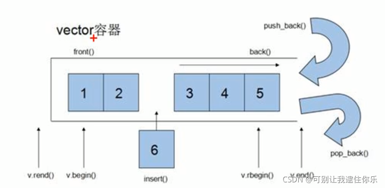
- vector容器的迭代器是支持随机访问的迭代器
-  push_back() 在尾部插入数据  pop_back() 在尾部删除数据
- vector<T>::iterator v 是vector容器的迭代器，v.begin()指向第一个数据，v.end() 指向最后一个数据的下一个位置

### 2. 构造函数
**功能描述**：
- 创建vector容器

**函数原型**:
- `vector<T> v;`							// 采用模板实现类实现，默认构造函数
- `vector(v.begin(), v.end() );`			// 将v[begin(), end())区间中的元素拷贝给本身
- `vector(n, elem);`						// 构造函数将n个elem拷贝给本身
- `vector(const vector& vec);`		// 拷贝构造函数

**示例**:

```cpp
#include<iostream>
using namespace std;
#include<vector>

// 打印数据
void printfvector(vector<int>& c)
{
    for(vector<int>::iterator it = c.begin(); it != c.end(); it++)
    {
        cout << *it << " ";
    }
    cout << endl;
}

// vector容器构造
void test01()
{
    vector<int> v;      // 默认构造 无参构造
    // 输入数据
    for(int i=0; i<10; i++)
    {
        v.push_back(i);
    }
    printfvector(v);

    // 将v[begin(), end())区间中的元素拷贝给本身
    vector<int> v1(v.begin(), v.end());
    printfvector(v1);

    // 构造函数将n个elem拷贝给本身
    vector<int> v2(10, 100);
    printfvector(v2);

    // 拷贝构造函数
    vector<int> v3(v);
    printfvector(v3);
}

int main()
{
    test01();
    return 0;
}
```
### 3. 赋值操作
**功能描述：** 给vector容器进行赋值
**函数原型：**
- `vector& operator=(const vector& vec);`        // 重载等号操作符
- `assign(beg, end);`      								// 将[beg, end)区间中的数据拷贝赋值给本身
- `assign(n, elem);`  // 将n个elem拷贝赋值给本身

**示例：**

```cpp
#include<iostream>
using namespace std;
#include<vector>

// 打印数据
void printfvector(vector<int>& c)
{
    for(vector<int>::iterator it = c.begin(); it != c.end(); it++)
    {
        cout << *it << " ";
    }
    cout << endl;
}

// vector容器构造
void test01()
{
    vector<int> v1;      // 默认构造 无参构造
    
    for(int i=0; i<10; i++)
    {
        v1.push_back(i);
    }
    printfvector(v1);

    // 等号赋值
    vector<int> v2 = v1;
    printfvector(v2);
    
    //assign
    vector<int> v3;
    v3.assign(v1.begin(), v1.end());
    printfvector(v3);

    // n个elem
    vector<int> v4;
    v4.assign(10, 100);
    printfvector(v4);
}

int main()
{
    test01();
    return 0;
}
```
总结：vector赋值方式比较简单，使用operator=, 或者assign都可以

### 4. 容量和大小
函数原型：
- `empty();`					// 判断容器是否为空
- `capacity();`				// 容器的容量
- `size();`					// 返回容器中元素的个数
- `resize(int num);`  		//重新指定容器的长度为num, 若容器变长，则以默认值0填充新位置。如果容器变短，则末尾超出容器长度的元素被删除
- `resize(int num, elem);`  // 重新指定容器的长度为num， 若容器变长，则以elem值填充新位置，若容器变短，则末尾超出容器长度的元素被删除

**示例:**

```cpp
    vector<int> v1;      // 默认构造 无参构造
    
    cout << v1.empty() << endl;  // 是空，为1
    // 插入数据
    for(int i=0; i<10; i++)
    {
        v1.push_back(i);
    }

    cout << v1.empty() << endl; // 非空, 为0
    cout << "v1的容量为：" << v1.capacity() << endl;       // 16
    cout << "v1容器中的元素个数：" << v1.size() << endl;    // 10

    // 重新指定元素个数
    v1.resize(15, 100);    // 指定容器中的个数为15，如果变长，用值100填充
    cout << "v1的容量为：" << v1.capacity() << endl;       // 16
    cout << "v1容器中的元素个数：" << v1.size() << endl;    // 15
    printfvector(v1);

    v1.resize(5);
    printfvector(v1);    // 短了，会删除多余的元素
```

总结：
- 判断是否为空  -- empty
- 返回元素个数   -- size
- 返回容器容量   -- capacity
- 重新指定大小    -- resize

### 5. 插入和删除
函数原型：
- `push_back(ele);`			// 尾部插入元素ele
- `pop_back();`				// 删除最后一个元素
- `insert(const_iterator pos, ele);`   // 迭代器指向位置pos插入元素ele
- `insert(const_iterator pos, int count, ele);` // 迭代器指向位置pos插入count个元素ele
- `erase(const_iterator pos);`    // 删除迭代器指向的元素
- `erase(const_iterator start, const_iterator end);`   // 删除迭代器从strat到end之间的元素
- `clear();`			// 删除容器中所有元素

示例：

```cpp
 	vector<int> v1;      // 默认构造 无参构造
    // 尾插
    v1.push_back(10); 
    v1.push_back(20); 
    v1.push_back(30); 
    v1.push_back(40); 
    // 尾删
    v1.pop_back();   // 删去40
    // 插入
    v1.insert(v1.begin(), 100); // 迭代器指向位置pos插入元素100
    // 删除
    v1.erase(v1.begin());   // 删除迭代器指向的元素

    // 插入count个数据
    v1.insert(v1.begin(), 10, 100);  // 迭代器指向位置pos插入10个100
    // 删除从strat到end之间的元素
    v1.erase(v1.begin(), v1.begin()+10);

    v1.clear();  // 全清
```
### 6. vector数据存取
函数原型：
- `operator[idx];`	 // 返回索引idx所指的数据 
- `at(int idx);` 		// 同上
- `front();`			// 返回容器中第一个数据元素
- `back();`			// 返回容器中最后一个数据元素

示例：

```cpp
    vector<int> v1;      // 默认构造 无参构造
    // 尾插
    v1.push_back(10); 
    v1.push_back(20); 
    v1.push_back(30); 
    v1.push_back(40); 
    
    cout << v1[0] << endl;               // 10
    cout << v1.at(0) << endl;            // 10
    cout << v1.front() << endl;          // 10   
    cout << v1.back() << endl;           // 40
```
### 7. vector互换容器
功能描述：实现两个容器内元素进行互换
函数原型：
- `swap(vec);`    // 将vec与本身的元素互换

示例：

```cpp
    vector<int> v1;
    for(int i=0; i<10; i++)
    {
        v1.push_back(i);
    }
    printfvector(v1); // 0 1 2 3 4 5 6 7 8 9 

    vector<int> v2;
    for(int i=10; i>0; i--)
    {
        v2.push_back(i);
    }
    printfvector(v2); // 10 9 8 7 6 5 4 3 2 1

    v2.swap(v1);
    printfvector(v1);   // 10 9 8 7 6 5 4 3 2 1
    printfvector(v2);   // 0 1 2 3 4 5 6 7 8 9 
```
**实际用途：** 巧用swap可以收缩内存空间

```cpp
 	vector<int> v;
    for(int i=0; i<100000; i++)
    {
        v.push_back(i);
    }
    cout << "v的容量为：" << v.capacity() << endl;   // 131072
    cout << "v中元素个数为：" << v.size() << endl;   // 100000

    v.resize(3); // 重新设定元素个数
    cout << "v的容量为：" << v.capacity() << endl;  // 131072
    cout << "v中元素个数为：" << v.size() << endl;  // 3
    // 这样容器的容量太大，个数确很少，造成了浪费

    // 巧用swap收缩内存
    // 匿名对象，vector<int> (v)拷贝构造v
    // 匿名对象只存在于该行代码，离开这行代码后立即调用析构函数
    vector<int> (v).swap(v); 
    cout << "v的容量为：" << v.capacity() << endl;  // 3
    cout << "v中元素个数为：" << v.size() << endl;  // 3
```
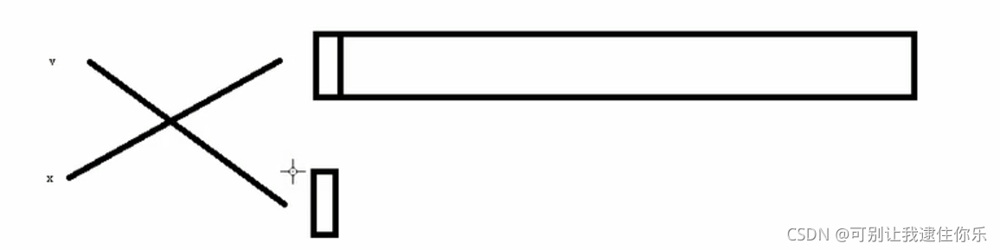
### 8. vector预留空间
功能描述： **减少vector在动态扩展容量时的扩展次数**
函数原型：
- `reserve(int len);`   		// 容器预留len个元素长度，预留位置不初始化，元素不可访问

示例：

```cpp
    vector<int> v;
    int num = 0;  // 记录开辟的次数
    int* p = NULL;
    for(int i=0; i<100000; i++)
    {
        v.push_back(i);
        if(p != &v[0])
        {
            p = &v[0];
            num++;
        }  
    }
    cout << num << endl;    // 18

    // 预留空间
    vector<int> v1;
    num = 0;
    v1.reserve(100000);  
    for(int i=0; i<100000; i++)
    {
         v1.push_back(i);
        if(p != &v1[0])
        {
            p = &v1[0];
            num++;
        }  
    }
    cout << num << endl;  // 1
```
总结：如果数据量较大，可以一开始利用reserve预留空间

## deque容器
### 1. deque基本概念
功能：
- **双端数组**，可以对头端进行插入删除操作

**duque与vector区别**：
- vector对于头部的插入删除效率低，数据量越大，效率越低.(在头部插入一个数，vector后面的数要移动)
- **deque相对而言，对头部的插入删除速度会比vector快**
- **vector访问元素时的速度会比deque快**，这和两者内部实现有关


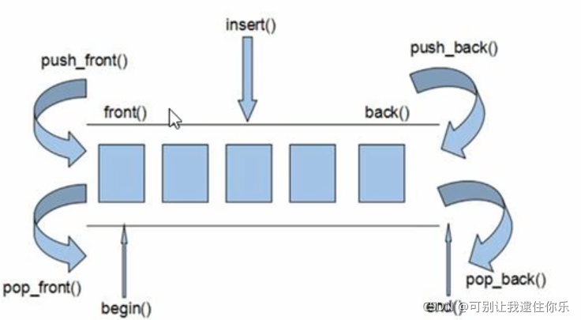
**deque内部工作原理：**
deque内部有个**中控器**， 就是一段连续的内存空间存放一大堆指针，每个指针都指向一段定量连续空间，也叫作缓冲区，缓冲区才是 deque 的主体。
中控器维护的是每个缓存区的地址，使得使用deque时像一片连续的内存空间
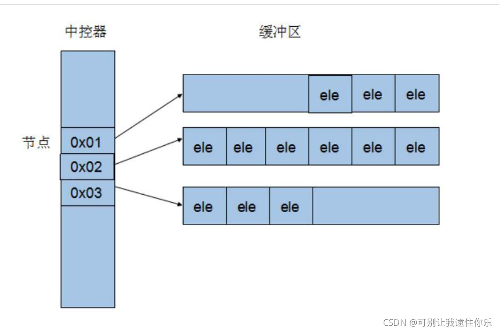
- deque容器的迭代器也是支持随机访问的
### 2. deque构造函数
函数原型：
- `deque<T> x;`          // 默认构造形式
- `deque(beg, end);`	// 构造函数将【beg，end）区间中的元素拷贝给自身
- `deque(n, elem);`		// 构造函数将n个elem拷贝给本身
- `deque(const deque& deq);`		// 拷贝构造函数

示例：

```cpp
#include<iostream>
using namespace std;
#include<deque>

void printfDeque(const deque<int>& q)
{
    for(deque<int>::const_iterator it = q.begin(); it != q.end(); it++)
    {
        // *it = 100;       容器中的数据不可以修改了
        cout << *it << " "; 
    }
    cout << endl;
}

void test01()
{
    deque<int> d1;
    for(int i=0; i<10; i++)
    {
        d1.push_back(i);
    }
    printfDeque(d1);

    deque<int> d2(d1.begin(), d1.end());
    deque<int> d3(10, 100);
    deque<int> d4(d1);
}
```
### 3. deque赋值操作
函数原型：
- `deque& operator=(const deque &deq);`  //重载等号操作符
- `assign(beg, end);`	// 将【beg，end）区间中的数据拷贝赋值给本身
- `assign(n, elem);`		// 将n个elem拷贝赋值给本身

```cpp
	deque<int> d1;
    for(int i=0; i<10; i++)
    {
        d1.push_back(i);
    }
    
    deque<int> d2 = d1;
    deque<int> d3;
    d3.assign(d1.begin(), d1.end());
    d3.assign(10, 100);
```
### 4. deque大小操作
函数原型：
- `deque.empty();`		// 判断容器是否为空
- `deque.size();`			// 返回容器中元素的个数
- `deque.resize(num);`	// 重新指定容器的长度为num，若容器变长，则以默认值填充新位置，如果容器变短，则末尾超出容器长度的元素被删除
- `deque.resize(num, elem);` // 同上，不过用elem值填充新位置
- deque没有容量的概念

**示例**：

```cpp
 	deque<int> d1;
    cout << d1.empty() << endl;  // 1
    for(int i=0; i<10; i++)
    {
        d1.push_back(i);
    }
    cout << d1.empty() << endl;   // 0
    cout << "deque的大小为：" << d1.size() << endl;  // 10
    d1.resize(5); // 重新指定大小为5
```
### 5. deque插入和删除
函数原型：
两端插入操作：
- `push_back(elem);`      // 在容器尾部添加一个数据
- `push_front(elem);`      // 在容器头部插入一个数据
- `pop_back();`				 // 删除容器最后一个数据
- `pop_front();`				// 删除容器第一个数据

指定位置操作（使用迭代器）：
- `insert(pos, elem);`    // 在pos位置插入一个elem元素的拷贝，返回新数据的位置
- `insert(pos, n, elem);`		// 在pos位置插入n个elem数据，无返回值
- `insert(pos, beg, end);`	// 在pos位置插入【beg，end）区间的数据，无返回值
- `clear();`					// 清空容器的所有数据
- `erase(beg, end);`		// 删除【beg，end）区间的数据，返回下一个数据的位置
- `erase(pos);`        // 删除pos位置的数据，返回下一个数据的位置

### 6. deque数据存取
函数原型：
- `operator[idx];`            // 返回索引idx所指的数据
- `at(int idx);`				 //  返回索引idx所指的数据
- `front();`					// 返回容器中第一个数据元素
- `back();`					// 返回容器中最后一个数据元素

### 7. deque排序
功能描述：利用算法实现对deque容器进行排序
算法：
- `sort(iterator beg, iterator end);`			// 对beg和end区间内元素进行排序

**示例：**

```cpp
#include<iostream>
#include<algorithm>
using namespace std;
#include<deque>

void printfDeque(const deque<int>& q)
{
    for(deque<int>::const_iterator it = q.begin(); it != q.end(); it++)
    {
        // *it = 100;       容器中的数据不可以修改了
        cout << *it << " "; 
    }
    cout << endl;
}

void test01()
{
   deque<int> d1;
   d1.push_back(10);
   d1.push_back(20);
   d1.push_back(15);
   d1.push_front(1);
   d1.push_front(2);

   sort(d1.begin(), d1.end()); // 从小到大
   printfDeque(d1);  // 1 2 10 15 20 
}   

int main()
{
    test01();
    return 0;
}
```
## 案例-评委打分
### 1. 案例描述
有5名选手：选手ABCDE，10个评委分别对每一名选手打分，去除最高分，去除评委中最低分，取平均分
### 2. 实现步骤
1. 创建五名选手，放到vector中
2. 遍历vector容器，取出来每一名选手，执行for循环，可以把10个评分打分存到deque容器中
3. sort算法对deque容器中分数排序，去除最高分和最低分
4. deque容器遍历一遍，累加总分
5. 获取平均分

**示例：**

```cpp
#include<iostream>
#include<vector>
#include<deque>
#include<string>
#include<algorithm>
#include<time.h>
using namespace std;

// 选手类
class Person
{
public:

    Person(string name, int score)
    {
        this->m_name = name;
        this->m_score = score;
    }
    string m_name;  // 姓名
    int m_score;    // 平均分
};

// 创建person对象，并放到vector容器中
void createPerson(vector<Person>& v1)
{
    string nameSeed = "ABCDE";
    for(int i=0; i<5; i++)
    {
        string name = "选手";
        name += nameSeed[i];

        int score = 0;
        Person p(name, score);
        v1.push_back(p);
    }
}

//  打分
void setScore(vector<Person>& v)
{
    for(vector<Person>::iterator it = v.begin(); it!= v.end(); it++)
    {
        cout <<  (*it).m_name << " 打分： " << endl; 
        // 将评委的分数，放入到deque容器中
        deque<int> d;
        for(int i=0; i<10; i++)
        {
            int score = rand()%41 + 60;   // 60~100
            d.push_back(score); 
            cout << score << " ";
        }
        cout << endl;
        
        // 排序
        sort(d.begin(), d.end());
        d.pop_front();
        d.pop_back();

        // 取平均分
        int sum = 0;
        for(deque<int>::iterator dit = d.begin(); dit != d.end(); dit++)
        {
            sum += *dit;
        }
        int avg = sum / d.size();
        //将平均分 赋值给选手身上
        it->m_score = avg;
    }
}

// 展示
void showScore(vector<Person>& p)
{
    for(vector<Person>::iterator it = p.begin(); it != p.end(); it++)
    {
        cout << "姓名： " << it->m_name << " 平均分： " << it->m_score << endl;
    }
}
int main()
{
    // 随机数种子 让每次的数不同
    // 用系统时间算随机数
    srand((unsigned int)time(NULL));
    vector<Person> v;   // 存放选手的容器
    createPerson(v);    // 存放
    // 测试
    for(vector<Person>::iterator it = v.begin(); it != v.end(); it++)
    {
        cout << "姓名: " << (*it).m_name << " 分数：" << (*it).m_score << endl;
    }

    // 打分
    setScore(v);
    // 展示
    showScore(v);
    return 0;
}
```


## list容器
### 1. 基本概念
**功能**：将数据进行链式存储
**链表**（list）是一种物理存储单元上**非连续**的存储结构，数据元素的逻辑顺序是通过链表中的指针链接实现的

链表的组成：链表由一系列**结点**组成
结点的组成：
- 存储数据元素的**数据域**
- 存储下一个结点地址的**指针域**

STL中的链表是一个双向循环链表
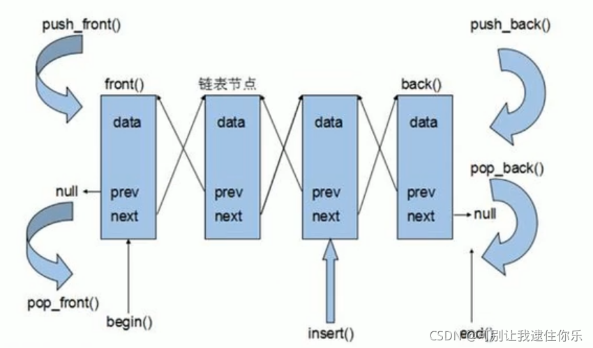
由于链表的存储方式并不是连续的内存空间，因此链表list中的迭代器只支持前移和后移，属于**双向迭代器**

list的优点：
- 采用**动态存储分配**，不会造成内存浪费和溢出
- **链表执行插入和删除操作十分方便**，修改指针即可，不需要移动大量元素

list的缺点：
- 链表灵活，但是空间(指针域）和时间（遍历）额外耗费较大，不方便查找

List有一个重要的性质，插入操作和删除操作都不会造成原有list迭代器的失效，这在vector是不成立的（因为如果vector容器插入的数超过，会重新找一个更大的空间，将原来的数拷贝过去，这样原来迭代器的指向就失效了）

总结：STL中**list和vector是两个最常被使用的容器**，各有优缺点
### 2. list构造函数
函数原型：
- `list<T> lst;`  // 默认构造
- `list(beg, end);`// 将【beg，end）区间中的元素拷贝给本身
- `list(n, elem);`	// 将n个elem拷贝给本身
- `list(const list& lst);` 	// 拷贝构造函数

```cpp
#include<iostream>
#include<list>
using namespace std;
void printlist(const list<int>& L)
{
    for(list<int>::const_iterator it = L.begin(); it != L.end(); it++)
    {
        cout << *it << " ";
    }
    cout << endl;
}
void test()
{
    list<int> lst;

    lst.push_back(10);
    lst.push_back(20);
    lst.push_back(30);
    lst.push_back(40);
    
    printlist(lst);

    list<int> L2(lst.begin(), lst.end());

    list<int> L3(lst);

    list<int> L4(10, 100);
   
}
int main()
{
    test();
    return 0;
}
```
### 3. list赋值和交换
函数原型：
- `list& operator=(const list& lst);`  /// 重载等号运算符
- `assign(beg, end);`	// 将【beg，end）区间中的数据拷贝赋值给本身
- `assign(n, elem);`  // 将n个elem拷贝赋值给本身
- `swap(lst);`	// 将list与本身的元素互换
### 4. list大小操作
函数原型：
- `size();`		// 返回容器中元素的个数
- `empty();`		// 判断容器是否为空
- `resize(num);`	// 重新指定容器的长度为num
- `resize(num, elem);` // 若容器变长，则以elem值填充新位置
### 5. list插入和删除
函数原型：
- `push_back(elem); `			// 在容器尾部加入一个数据
- `push_front(elem);`			// 在容器开头插入一个数据
- `pop_back();`			// 删除容器中最后一个数据
- `pop_front();`			// 删除容器开头第一个数据
- pos要
- `insert(pos, elem);`		// 在pos位置插入elem数据的拷贝，返回新数据的位置
- `insert(pos, n, elem);`		// 在pos位置插入n个elem数据，无返回值
- `insert(pos, beg, end);`	// 在pos位置插入【beg， end）区间的数据，无返回值
- `erase(pos);`	// 删除pos位置的数据，返回下一个数据的位置
- `erase(beg, end);`  // 删除【beg， end）区间的数据，返回下一个数据的位置
- `clear();` 		// 移除容器的所有数据
- `remove(elem);`	// 删除容器中所有与elem值相同的元素

insert和erase中的pos要用迭代器

```cpp
    list<int> lst;

    lst.push_back(10);
    lst.push_back(20);
    lst.push_back(30);
    lst.push_back(40);
    
    // 插入
    list<int>::iterator it = lst.begin();
    lst.insert(it, 100); // 在开头插入100

    // 删除
    lst.erase(it); // 删除it指向的数据
    lst.remove(10); // 删除所有与10相同的数据
```
### 6. list数据存取
函数原型：
- 不可以用【】访问list容器中的元素，迭代器不支持随机访问
- `front();`			// 返回第一个元素
- `back();`			// 返回最后一个元素

```cpp
	list<int> L1;
	//迭代器不支持随机访问
	list<int>::iterator it = L1.begin();
	it = it +4; // 报错，不支持随机访问
	it++;	// 支持双向
	it--;
```
### 7. list反转和排序
函数原型：
- `reverse();`			//	反转链表
- `sort();`				// 链表排序

```cpp
#include<iostream>
#include<list>
using namespace std;
void printlist(const list<int>& L)
{
    for(list<int>::const_iterator it = L.begin(); it != L.end(); it++)
    {
        cout << *it << " ";
    }
    cout << endl;
}
bool mycompare(int a, int b)
{
    return a>b;
}
void test()
{
    list<int> lst;

    lst.push_back(30);
    lst.push_back(20);
    lst.push_back(10);
    lst.push_back(40);
    printlist(lst);

    // 反转容器的元素
    lst.reverse();
    printlist(lst);

    // 排序
    // 所有不支持随机访问迭代器的容器，不可以用标准算法
    // sort(lst.begin(), lst.end());  报错
    // 不支持随机访问迭代器的容器，内部会提供对应一些算法
    lst.sort(); // 默认的排序规则，从小到大
    printlist(lst);

    lst.sort(mycompare);  // 指定规则，从大到小
    printlist(lst);
}
int main()
{
    test();
    return 0;
}
```
### 8. 排序案例
案例描述：将Person自定义数据类型进行排序，Person中属性有姓名、年龄、身高
排序规则：按照年龄进行升序，如果年龄相同按照身高进行降序

**示例：**

```cpp
#include<iostream>
#include<list>
#include<string>
using namespace std;

class Person
{
public:
    Person(string name, int age, int height)
    {
        this->m_name = name;
        this->m_height = height;
        this->m_age = age;
    }

    string m_name; // 姓名
    int m_age;     // 年龄
    int m_height;  // 身高
};

// 打印
void print(list<Person>& L)
{
    for(list<Person>::iterator it = L.begin(); it != L.end(); it++)
    {
        cout << "姓名： " << it->m_name 
            << " 年龄： "<< it->m_age 
            << " 身高： " << it->m_height
            << endl;
    }
}

// 制定排序规则
bool comparePerson(Person& p1, Person& p2)
{
    if(p1.m_age == p2.m_age)
    {
        return p1.m_height > p2.m_height;
    }
    // 按照年龄排序, 降序
    return p1.m_age < p2.m_age;
}

int main()
{
    // 创建容器
    list<Person> L;
    // 准备数据
    Person p1("w", 35, 134);
    Person p2("e", 44, 234);
    Person p3("r", 22, 876);
    Person p4("t", 44, 126);
    // 插入数据
    L.push_back(p1);
    L.push_back(p2);
    L.push_back(p3);
    L.push_back(p4);
    // 打印
    print(L);
    
    //排序
    L.sort(comparePerson);
    // 打印
    print(L);
    return 0;
}
```
## vector、list、deque三者的比较
下图描述了vector 、list 、deque 在内存结构上的特点：

vector 是一段连续的内存块，而deque 是多个连续的内存块， list 是所有数据元素分开保存，可以是任何两个元素没有连续。
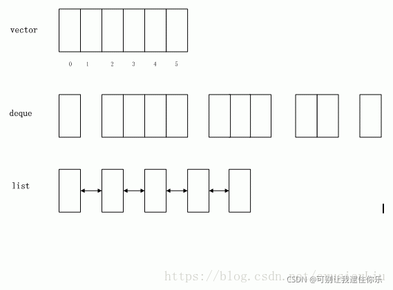
vector 的查询性能最好，并且在末端增加数据也很好，除非它重新申请内存段；适合高效地随机存储。

list 是一个链表，任何一个元素都可以是不连续的，但它都有两个指向上一元素和下一元素的指针。所以它对插入、删除元素性能是最好的，而查询性能非常差；适合 大量地插入和删除操作而不关心随机存取的需求。

deque 是介于两者之间，它兼顾了数组和链表的优点，它是分块的链表和多个数组的联合。所以它有被list 好的查询性能，有被vector 好的插入、删除性能。 如果你需要随即存取又关心两端数据的插入和删除，那么deque 是最佳之选。

# 一、关联式容器
## 1. 定义
set, multiset, map, multimap 是一种**非线性的树结构**，具体的说采用的是一种比较高效的特殊的平衡检索二叉树—— 红黑树结构。

- set ，又称集合，实际上就是一组元素的集合，但其中所包含的元素的值是**唯一**的，且是按一定顺序排列的，集合中的每个元素被称作集合中的实例。因为其内部是通过链表的方式来组织，**所以在插入的时候比vector 快，但在查找和末尾添加上被vector 慢**
- multiset ，是多重集合，其实现方式和set 是相似的，只是它不要求集合中的元素是唯一的，也就是说集合中的同一个元素**可以出现多次**。
- map ，提供一种“键- 值”关系的一对一的数据存储能力。其“键”在容器中不可重复，且按一定顺序排列（其实我们可以将set 也看成是一种键- 值关系的存储，只是它只有键没有值。它是map 的一种特殊形式）。由于其是按链表的方式存储，它也继承了链表的优缺点。
- multimap ， 和map 的原理基本相似，它允许“键”在容器中可以不唯一。

## 2. 特点
-  其内部实现是采用**非线性的二叉树结构**，具体的说是红黑树的结构原理实现的

- set 和map 保证了元素的唯一性，mulset 和mulmap 扩展了这一属性，可以允许元素不唯一

-  元素是有序的集合，默认在插入的时候**按升序排列**

## 3. 对比顺序性容器
-  **关联容器对元素的插入和删除操作比vector 要快**，因为vector 是顺序存储，而关联容器是链式存储；**比list  要慢**，是因为即使它们同是链式结构，但list 是线性的，而关联容器是二叉树结构，其改变一个元素涉及到其它元素的变动比list  要多，并且它是排序的，每次插入和删除都需要对元素重新排序；

-  **关联容器对元素的检索操作比vector 慢，但是比list 要快很多**。vector  是顺序的连续存储，当然是比不上的，但相对链式的list 要快很多是因为list  是逐个搜索，它搜索的时间是跟容器的大小成正比，而关联容器 查找的复杂度基本是Log(N) ，比如如果有1000 个记录，最多查找10  次，1,000,000 个记录，最多查找20 次。容器越大，关联容器相对list 的优越性就越能体现；

-  在使用上set 区别于vector,deque,list 的最大特点就是**set 是内部排序的**，这在查询上虽然逊色于vector ，但是却大大的强于list 。

-  在使用上map 的功能是不可取代的，它保存了“键-  值”关系的数据，而这种键值关系采用了类数组的方式。数组是用数字类型的下标来索引元素的位置，而map  是用字符型关键字来索引元素的位置。在使用上map  也提供了一种类数组操作的方式，即它可以通过下标来检索数据，这是其他容器做不到的，当然也包括set 。（STL 中只有vector 和map  可以通过类数组的方式操作元素，即如同ele[1] 方式）
# 二、set和multiset容器
## 1. 基本概念
简介：
- 所有元素都会在插入时自动被排序

本质：
- set/multiset属于**关联式容器**， 底层结构是用**二叉树**实现

**set和multiset区别**：
- set不允许容器中有重复的元素
- multiset允许容器中有重复的元素
## 2. set构造和赋值
构造：
- `set<T> st;`  // 默认构造
- `set(const set& st);`  // 拷贝构造

赋值：
- `set& operator=(const set& st);` 

```cpp
#include<iostream>
#include<set>
using namespace std;

void printset(set<int>& s)
{
    for(set<int>::iterator it = s.begin(); it != s.end(); it++)
    {
        cout << *it << " ";
    }
    cout << endl;
}

void test()
{
    set<int> s;

    // 插入数据 只有insert方式
    s.insert(10);
    s.insert(30);
    s.insert(20);
    s.insert(50);
    s.insert(10);

    // 遍历容器
    // set容器特点：所有元素插入时自动被排序
    // set容器不允许插入重复值,如果有重复的数，会被忽略
    printset(s);  // 10 20 30 50 
}
```

## 3. set大小和交换
函数原型；
- `size();`   // 返回容器中元素的数目
- `empty();`	 	// 判断容器是否为空
- `swap(st);`	// 交换两个集合容器
## 4. set插入和删除
函数原型：
- `insert(elem);`	// 在容器中插入元素
- `clear();`			// 清除所有元素
- `erase(pos);`	// 删除pos迭代器所指的元素，返回下一个元素的迭代器
- `erase(beg, end);`   // 删除区间【beg, end)的所有元素，返回下一个元素的迭代器
- `erase(elem);`		// 删除容器中值为elem的元素
## 5. set查找和统计
函数原型：
- `find(key);` // 查找key是否存在，若存在，返回该键的元素的迭代器；若不存在，返回set.end();
- `count(key);` // 统计key的元素个数

```cpp
    set<int> s;

    // 插入数据 只有insert方式
    s.insert(10);
    s.insert(30);
    s.insert(20);
    s.insert(50);
    s.insert(10);

    set<int>::iterator pos = s.find(30);
    if(pos != s.end())
    {
        cout<< "找到元素: " << *pos << endl;
    }
    else{
        cout << "没找到" << endl;
    }
    int num = s.count(10);
    // 对于set而已，统计结果要么是0，要么是1，因为没有重复的数
    cout << " num = " << num << endl;
```
## 6. set和multiset区别
**区别：**
- set不可以插入重复数据，而multiset可以
- set插入数据的同时**会返回插入结果**，表示插入成功
- multiset不会检测数据，因此可以插入重复数据

```cpp
    set<int> s;

    // 接受插入后返回的结果
    pair<set<int>::iterator, bool> ret = s.insert(10);
    if(ret.second) // 表示第二个boll
    {
        cout << "第一次插入成功" << endl;
    }else{
        cout << "第一次插入失败" << endl;
    }

    ret = s.insert(10);
    if(ret.second)
    {
        cout << "第二次插入成功" << endl;
    }else{
        cout << "第二次插入失败" << endl;
    }

    // multiset
    multiset<int> ms;
    ms.insert(10);
    ms.insert(10);
```
总结：
- 如果不允许插入重复数据可以利用set
- 如果需要插入重复数据利用multiset
## 7. pair对组创建
**功能描述：**
 - 成对出现的数据，利用对组可以返回两个数据

 **两种创建方式：**
 - `pair<type, type> p (value1, value2);`
 - `pair<type, type> p = make_pair(value1, value2);`
- 用`p.first`和`p.second`访问


```cpp
   // 创建对组
    pair<string, int> p("tom", 20);

    cout << "姓名： " << p.first
         << " 年龄： " << p.second
         << endl;

    // 另一种方式
    pair<string, int> p2 = make_pair("jery", 30);
     cout << "姓名： " << p2.first
          << " 年龄： " << p2.second
          << endl;
```
## 8. set容器排序
学习目标：
- set容器默认排序规则为从小到大，掌握如何改变排序规则

主要技术点：
- 利用**仿函数**，可以改变排序规则
- 仿函数：在一个类中重载（）

**示例一**：set存放内置数据结构

```cpp
// 仿函数
class MyCompare
{
public:
    bool operator()(int v1, int v2)
    {
        return v1>v2;
    }
};
void test()
{
    set<int> s1;
    s1.insert(10);
    s1.insert(40);
    s1.insert(30);
    s1.insert(15);

    for(set<int>::iterator it = s1.begin(); it != s1.end(); it++)
    {
        cout << *it << " ";
    }
    cout << endl;		// 10 15 30 40

    // 指定排序规则为从大到小, 利用仿函数
    set<int, MyCompare> s2;
    s2.insert(10);
    s2.insert(40);
    s2.insert(30);
    s2.insert(15);

    for(set<int, MyCompare>::iterator it1 = s2.begin(); it1 != s2.end(); it1++)
    {
        cout << *it1 << " ";
    }
    cout << endl;   //40 30 15 10
}
```
**示例二：** set存放自定义数据类型
对于自定义数据类型，**set必须指定排序规则**才可以插入数据

```cpp
class Person
{
public:
    Person(string name, int age)
    {
        this->m_age = age;
        this->m_name = name;
    }
    string m_name;
    int m_age;
};

// 仿函数
class MyCompare
{
public:
    bool operator()(const Person& p1, const Person& p2)
    {
        // 按照年龄来排序
        return p1.m_age > p2.m_age;
    }
};
void test()
{
    // 创建对象
    Person p1("刘备", 27);
    Person p2("张飞", 22);
    Person p3("关羽", 25);
    Person p4("赵云", 23);

    // 创建容器
    set<Person, MyCompare> s;
    
    s.insert(p1);
    s.insert(p2);
    s.insert(p3);
    s.insert(p4);

    for(set<Person, MyCompare>::iterator it = s.begin(); it != s.end(); it++)
    {
        cout << "姓名： " << it->m_name 
            << " 年龄： " << it->m_age
            << endl;
    }
}
```
# 三、map/multimap容器
## 1. map基本概念
**简介：**
- map中所有元素都是pair
- pair中第一个元素为key（键值），起到索引作用，第二个元素为value（实值）
- 所有元素都会根据元素的key（键值）自动排序

**本质：**
- map/multimap属于**关联式容器**，底层结构是用二叉树实现

**优点：**
- 可以根据key值快速找到value值

map和multimap**区别**：
- map不允许容器中有重复key值元素
- multimap允许容器中有重复key值元素

## 2. map构造和赋值
**构造：**
- `map<T1, T2> mp;`			// 默认构造函数
- `map(const map& mp);`		// 拷贝构造函数

**赋值：**
- `map& operator=(const map& mp);`

```cpp
void PrintMap(map<int,int>& m)
{
    for(map<int,int>::iterator it = m.begin(); it != m.end(); it++)
    {
        cout << "key: " << it->first << " value: " << it->second << endl;
    }
}
void test()
{
    map<int, int> m;   // 默认构造

    m.insert(pair<int,int>(1,10));
    m.insert(pair<int,int>(3,20));
    m.insert(pair<int,int>(2,40));
    m.insert(pair<int,int>(4,50));
    // m.insert(make_pair(5,40));

    PrintMap(m);

    map<int,int> m2(m);   // 拷贝构造
    PrintMap(m2);

    map<int,int> m3;
    m3 = m2;  // 赋值
    PrintMap(m3);
}
```
## 3. map大小和交换
函数原型：
- `size();`		// 返回容器中元素的数目
- `empty();`		// 判断容器是否为空
- `swap(st);`	// 交换两个集合容器

## 4. map插入和删除
函数原型：
- `insert(elem);`	// 插入元素
- `clear();`	// 清除所有元素
- `erase(pos);`	// 删除pos迭代器所指的元素，返回下一个元素的迭代器
- `erase(beg, end);`	// 删除区间【beg， end）的所有元素，返回下一个元素的迭代器
- `erase(key);` 	// 删除容器中值为key的元素
- 可以通过【key】访问value

## 5. map查找和统计
函数原型：
- `find(key);` // 查找key是否存在，若存在，返回该键的元素的迭代器；若不存在，返回map.end();
- `count(key);`  // 统计key的元素个数

```cpp
    map<int, int> m;   // 默认构造

    m.insert(pair<int,int>(1,10));
    m.insert(pair<int,int>(3,20));
    m.insert(pair<int,int>(2,40));
    m.insert(pair<int,int>(4,50));

   map<int, int>::iterator pos = m.find(3);

   if(pos != m.end())
   {
       cout << "查到了元素 key = " << pos->first << " value = " << pos->second << endl;
   }else{
       cout << "没查到" << endl;
   }

    // map不允许插入重复key元素，count统计而言 结果要么是0 要么是1
   int num = m.count(3);
   cout << "num = " << num << endl;
```
## 6. map容器排序
学习目标：
- map容器默认排序规则为 按照key值进行 从小到大排序， 掌握如何改变排序规则

主要技术点：
- 利用仿函数，可以改变排序规则

```cpp
// 仿函数
class MyCompare
{
public:
    bool operator()(int v1, int v2)
    {
        return v1>v2;
    }
};
void PrintMap(map<int,int, MyCompare>& m)
{
    for(map<int,int, MyCompare>::iterator it = m.begin(); it != m.end(); it++)
    {
        cout << "key: " << it->first << " value: " << it->second << endl;
    }
}
void test()
{
    map<int, int, MyCompare> m;   // 默认构造

    m.insert(pair<int,int>(1,10));
    m.insert(pair<int,int>(3,20));
    m.insert(pair<int,int>(2,40));
    m.insert(pair<int,int>(4,50));

   PrintMap(m);
}
```
## 7. 案例-员工分组
## 1. 案例描述
- 公司今天招聘了10个员工（ABCDEFGHIJ)，10名员工进入公司之后，需要指派员工在哪个部门工作
- 员工信息有：姓名  工资组成； 部门分为：策划、美术、研发
- 随机给10个员工分配部门和工资
- 通过multimap进行信息的插入 key（部门编号） value（员工）
- 分部门显示员工信息

## 2. 实现步骤
- 创建10名员工，放到vector中
- 遍历vector容器，取出每个员工，进行随机分组
- 分组后，将员工部门编号作为key，具体员工作为value，放入到multimap容器中
- 分部门显示员工信息

## 3. 案例代码

```cpp
#include<iostream>
#include<vector>
#include<map>
#include<string>
using namespace std;

#define CEHUA 0
#define MEISHU 1
#define YANFA 2

class Worker
{
public:
    string m_name;
    int m_salary;
};

// 创建员工
void createWorker(vector<Worker>& v)
{
    string nameSeed = "ABCDEFGHIJ";
    for(int i=0; i<10; i++)
    {
        Worker worker;
        worker.m_name = "员工";
        worker.m_name += nameSeed[i];
        
        worker.m_salary = rand()%10000 + 10000;  // 10000~19999
        v.push_back(worker);
    }
}

// 员工分组
void setGroup(vector<Worker>& v, multimap<int, Worker>& m)
{
    for(vector<Worker>::iterator it = v.begin(); it != v.end(); it++)
    {
        // 产生随机部门编号
        int deptID = rand() % 3; // 0 1 2

        // 将员工插入到分组中
        // key部门编号，value具体员工
        m.insert(pair<int, Worker>(deptID, *it));
    }
}
void showWorkerByGrourp(multimap<int, Worker>& m)
{
    cout << "策划部门：" << endl;
    multimap<int, Worker>::iterator pos = m.find(CEHUA);
    int count = m.count(CEHUA);
    int index = 0;
    for(; pos != m.end() && index < count; pos++, index++)
    {
        cout << "姓名：" << pos->second.m_name << "工资： " << pos->second.m_salary << endl;
    }
}
int main()
{
    // 1.创建员工
    vector<Worker> vWorker;
    createWorker(vWorker);
    // 测试
    for(vector<Worker>::iterator it = vWorker.begin(); it != vWorker.end(); it++)
    {
        cout << "姓名：" << it->m_name
             << " 工资： " << it->m_salary
             << endl;
    }

    // 2. 员工分组
    multimap<int, Worker> mWorker;
    setGroup(vWorker, mWorker);

    // 3. 分组显示员工
    showWorkerByGrourp(mWorker);
    return 0;
}
```

# 一、容器
## 1. 定义

在数据存储上，有一种对象类型，它可以持有其它对象或指向其它对象的指针，这种对象类型就叫做容器。很简单，容器就是保存其它对象的对象。

## 2. 好处

- “容器类是一种对特定代码重用问题的良好的解决方案”
- 容器可以自行扩展。它不需要你预先告诉它你要存储多少对象，只要你创建一个容器对象，并合理的调用它所提供的方法，所有的处理细节将由容器来自身完成。它可以为你申请内存或释放内存，并且用最优的算法来执行您的命令。

## 3. 通用容器的分类

STL 对定义的通用容器分三类：**顺序性容器**、**关联式容器**和**容器适配器**。

**顺序性容器** ：一种各元素之间有顺序关系的线性表，是一种线性结构的可序群集。

顺序性容器中的每个元素均有固定的位置，除非用删除或插入的操作改变这个位置。这个位置和  元素本身无关，而和操作的时间和地点有关，顺序性容器不会根据元素的特点排序而是直接保存了元素操作时的逻辑顺序。比如我们一次性对一个顺序性容器追加三个元素，这三个元素在容器中的相对位置和追加时的逻辑次序是一致的。

**关联式容器** ：非线性的树结构，更准确的说是二叉树结构。

- 各元素之间没有严格的物理上的顺序关系，也就是说元素在容器中并没有保存元素置入容器时的逻辑顺序。但是关联式容器提供了另一种根据元素特点排序的功能，这样迭代器就能根据元素的特点“顺序地”获取元素。
- 它是以键值的方式来保存数据，就是说它能把关键字和值关联起来保存，而顺序性容器只能保存一种（可以认为它只保存关键字，也可以认为它只保存值）。这在下面具体的容器类中可以说明这一点

**容器适配器** ：是一个比较抽象的概念。

 C++的  解释是：适配器是使一事物的行为类似于另一事物的行为的一种机制。容器适配器是让一种已存在的容器类型采用另一种不同的抽象类型的工作方式来实现的一种机  制。其实仅是发生了接口转换。那么你可以把它理解为容器的容器，它实质还是一个容器，只是他不依赖于具体的标准容器类型，可以理解是容器的模版。或者把它 理解为容器的接口，而适配器具体采用哪种容器类型去实现，在定义适配器的时候可以由你决定。

## 4. 总结图

下表列出STL 定义的三类容器所包含的具体容器类

| 标准容器类     | 特点                                           |
| -------------- | ---------------------------------------------- |
| 顺序性容器     |                                                |
| vector         | 从后面快速的插入与删除，直接访问任何元素       |
| deque          | 从前面或后面快速的插入与删除，直接访问任何元素 |
| list           | 双链表，从任何地方快速插入与删除               |
| 关联容器       |                                                |
| set            | 快速查找，不允许重复值                         |
| multiset       | 快速查找，允许重复值                           |
| map            | 一对多映射，基于关键字快速查找，不允许重复值   |
| multimap       | 一对多映射，基于关键字快速查找，允许重复值     |
| 容器适配器     |                                                |
| stack          | 后进先出                                       |
| queue          | 先进先出                                       |
| priority_queue | 最高优先级元素总是第一个出列                   |

# 二、容器适配器
## 1. 定义
**栈stack、队列queue 和 优先级 priority_queue**

适配器是容器的接口，它本身不能直接保存元素，它保存元素的机制是调用另一种顺序容器去实现，即可以把适配器看作“它保存一个容器，这个容器再保存所有元素”。

STL 中提供的三种适配器可以由某一种顺序容器去实现。默认下stack 和queue 基于deque 容器实现，priority_queue  则基于vector  容器实现。当然在创建一个适配器时也可以指定具体的实现容器，创建适配器时在第二个参数上指定具体的顺序容器可以覆盖适配器的默认实现。

由于适配器的特点，一个适配器不是可以由任一个顺序容器都可以实现的。

## 2. 特点
栈stack 的特点是**后进先出**，所以它关联的基本容器可以是任意一种顺序容器，因为这些容器类型结构都可以提供栈的操作有求，它们都提供了push_back 、pop_back 和back 操作；

队列queue 的特点是**先进先出**，适配器要求其关联的基础容器必须提供pop_front 操作，因此其不能建立在vector 容器上；

优先级队列priority_queue 适配器要求**提供随机访问功能**，因此不能建立在list 容器上。

# 三、stack容器
## 1. stack基本概念
stack是一种**先进后出**的数据结构，它只要一个出口

栈中只有顶端的元素才可以被外界使用，**因此栈不允许有遍历行为**
入栈 -------- push()
出栈 -------- pop()

## 2. stack常用接口
构造函数：
- `stack<T> stk;`   // stack采用模板类实现，stack对象的默认构造
- `stack(const stack& stk);` // 拷贝构造函数

赋值操作：
- `stack& operator=(const stack& stk);` 

数据存取：
- `push(elem);`		// 向栈顶添加元素
- `pop();`				// 从栈顶移除第一个元素
- `top();`					// 返回栈顶元素

大小操作：
- `empty();`		  		// 判断是否为空
- `size();`				// 返回栈的大小

**示例：**

```cpp
#include<iostream>
#include<stack>
using namespace std;

void test()
{
    // 创建栈容器，后进先出
    stack<int> s;

    // 入栈
    s.push(10);
    s.push(20);
    s.push(30);
    s.push(40);

    while(!s.empty())
    {
        // 输出栈顶元素
        cout << "栈顶元素： " << s.top() << endl;
        //  出栈
        s.pop();
    }
    cout << "栈的大小为：" << s.size() << endl;
}
int main()
{
    test();
    return 0;
}

```
# 四、queue容器
## 1. queue基本概念
queue是一种**先进先出**的数据结构，它有两个出口

- 队列容器允许从一端新增元素，从另一端移除元素
- 队列中只有队头和队尾才可以被外界使用，因此队列不允许有遍历行为
- 队列中进数据称为 --- 入队 `push`
- 队列中出数据称为 --- 出队 `pop`

## 2. queue常用接口
构造函数：
- `queue<T> que;`	//queue采用模板类实现，默认构造
- `queue(const queue& que);`	// 拷贝构造函数

赋值操作：
- `queue& operator=(const queue& que);`	

数据存取：
- `push(elem);`	// 往队尾添加元素
- `pop();`	// 从队头移除第一个元素
- `back();`	// 返回最后一个元素
- `front();`	// 返回第一个元素

大小操作：
- `empty();`	// 判断是否为空
- `size();`	// 返回大小

**示例：**

```cpp
	//先进先出
   queue<int> q;
    // 入队，往队尾添加元素
    q.push(10);
    q.push(20);
    q.push(30);
    q.push(40);

    // 出队，队顶删除元素 
    q.pop();    // 删掉了10
    if( !q.empty() )
    {
        cout << q.front() << endl;  // 20
        cout << q.back() << endl; // 40 
        cout << q.size() << endl;  // 3
    }
```

# 一、STL-函数对象
## 1. 函数对象
### 1. 概念
概念：
- 重载**函数调用操作符**的类，其对象常称为**函数对象**
- **函数对象**使用重载（）时，行为类似函数调用，也叫**仿函数**

本质：
函数对象(仿函数）是一个**类**，不是一个函数

### 2. 函数对象使用
特点：
- 函数对象在使用时，可以像普通函数那样调用，可以有参数，可以有返回值
- 函数对象超出普通函数的概念，函数对象可以有自己的状态
- 函数对象可以作为参数传递

```cpp
#include<iostream>
#include<string>
using namespace std;

// 1. 函数对象在使用时，可以像普通函数那样调用，可以有参数，可以有返回值
class MyAdd
{
public:
    int operator()(int v1, int v2)
    {
        return v1+v2;
    }
};

// 2. 函数对象可以有自己的状态
class MyPrint
{
public:
    MyPrint()
    {
        count = 0;
    }
    void operator()(string m)
    {
        cout << m << endl;
        count++;    // 可以记录调用的次数
    }
    int count;

};

// 3. 函数对象可以作为参数传递
void doPrint(MyPrint &mp, string test)
{
    mp(test);
}

void test01()
{
    // 可以有参数
    MyAdd myadd;
    cout << myadd(10, 10) << endl;

    // 可以有自己的状态
    MyPrint myprint;
    myprint("hello world");
    myprint("hello world");
    myprint("hello world");
    cout << myprint.count << endl;

    // 可以作为参数传递
    doPrint(myprint, "aaa");
}
```
总结：仿函数写法非常灵活，可以作为参数进行传递

## 2. 谓词
### 1. 谓词概念
概念：
- 返回bool类型的仿函数称为谓词
- 如果operator()接受一个参数，那么叫做一元谓词
- 如果operator()接受两个参数，那么叫做二元谓词

## 3. 内建函数对象
### 1. 内建函数对象意义
概念：
- STL内建了一些函数对象

分类：
- 算术仿函数
- 关系仿函数
- 逻辑仿函数

用法：
- 这些仿函数所产生的对象，用法和一般函数完全相同
- 使用内建函数对象，需要引入头文件`#include<functional>`

### 2. 算术仿函数
功能描述：
- 实现四则运算
- 其中negate是一元运算，其他都是二元运算

仿函数原型：
 - `plus<T> n( a, b);`		// 加法仿函数
 - `minus<T> n(a, b);`	// 减法仿函数
 - `multiplies<T> n(a, b);`	// 乘法仿函数
 - `divides<T> n(a, b);`	// 除法仿函数
 - `modulus<T> n(a, b);`	// 取模仿函数
 - `negate<T> n(a);`	// 取反仿函数

```cpp
// 内建函数对象 算术仿函数
void test01()
{
    // negate 一元仿函数 取反仿函数
    negate<int> n;  // 先创建对象
    cout << n(50) << endl;      // -50
    
    // plus 二元仿函数  加法
    plus<int> p;
    cout << p(1,2) << endl;
}
```
### 3. 关系仿函数
功能描述：实现关系对比
仿函数原型：
-  `template<class T> bool equal_to<T>;`		// 等于
-  `template<class T>  bool not_equal_to<T>;`	// 不等于
-  `template<class T> bool greater<T>;`			// 大于
-  `template<class T> bool less<T>;`				// 小于
-  `template<class T> bool less_equal<T>;`		// 小于等于

### 4. 逻辑仿函数
函数原型：
- `template<class T> bool logical_and<T>;`		 // 逻辑与
- `template<class T> bool logical_or<T>;`		// 逻辑或
- `template<class T> bool logical_not<T>;`		// 逻辑非

# 二、 STL常用算法
- 算法主要是由头文件`<algorithm> <functional> <numeric> `组成

## 1. 常用遍历算法
- `for_each`		// 遍历容器
- `transform` 		// 搬运容器到另一个容器
- `transform(iterator beg1, iterator end1, iterator beg2, _func);`
	// beg1 源容器开始迭代器
	// end1 源容器结束迭代器
	// beg2 目标容器开始迭代器
	// _func 函数或函数对象
```cpp
// 普通函数
void print01(int val)
{
    cout << val << " ";
}

// 仿函数
class myPrint
{
public:
    void operator()(int val)
    {
        cout << val << " ";
    }
};

void test01()
{
    vector<int> v1;
    for(int i=0; i<10; i++)
    {
        v1.push_back(i);
    }

    for_each(v1.begin(), v1.end(), print01);
    cout << endl;
    for_each(v1.begin(), v1.end(), myPrint());
    cout << endl;
}   
```

```cpp
// 仿函数
class myPrint
{
public:
    void operator()(int val)
    {
        cout << val << " ";
    }
};

class Transform
{
public:
    int operator()(int val)
    {
        return val;
    }
};

void test01()
{
    vector<int> v1;
    for(int i=0; i<10; i++)
    {
        v1.push_back(i);
    }

    vector<int> v2;
    // 目标容器要提前开辟空间
    v2.resize(v1.size()); 

    transform(v1.begin(), v1.end(), v2.begin(), Transform());
    for_each(v2.begin(), v2.end(), myPrint());
    cout << endl;
}   
```
## 2. 常用查找算法
算法简介：
- `find`	// 查找元素
- `find_if`	// 按条件查找元素
- `adjacent_find`	// 查找相邻重复元素
- `binary_search`	// 二分查找法，查找是否存在
- `count`	// 统计元素个数
- `count_if`	// 按条件统计元素个数

### 2.1 find
功能描述：
- 查找指定元素，找到返回指定元素的迭代器，找不到返回结束迭代器end()
- `find(iterator beg, iterator end, value);`
	// value 看插入的数据
	

```cpp
class Person
{
public:
    Person(string name, int age)
    {
        this->m_age = age;
        this->m_name = name;
    }

    bool operator==(const Person& p)
    {
        if(this->m_name == p.m_name && this->m_age == p.m_age)
        {
            return true;
        }
        return false;
    }
    string m_name;
    int m_age;
};
void test01()
{
    vector<Person> v;
    Person p1("aaa", 10);
    Person p2("bbb", 20);
    Person p3("ccc", 30);

    v.push_back(p1);
    v.push_back(p2);
    v.push_back(p3);

    vector<Person>::iterator it = find(v.begin(), v.end(), p2);
    if(it == v.end())
    {
        cout << "没有找到！" << endl;
    }else{
        cout << "找到姓名：" << it->m_name << " 年龄：" << it->m_age << endl;
    }
}
```

### 2.2  find_if
功能描述：
- 按条件查找元素
函数原型：
- `find_if(iterator beg, iterator end, _pred);`
	// _pred 函数或者谓词(返回bool类型的仿函数)

```cpp
class Person
{
public:
    Person(string name, int age)
    {
        this->m_age = age;
        this->m_name = name;
    }
    string m_name;
    int m_age;
};

class greater20
{
public:
    bool operator()(Person& p)
    {
       return p.m_age > 20;
    }
};
void test01()
{
    vector<Person> v;
    Person p1("aaa", 10);
    Person p2("bbb", 20);
    Person p3("ccc", 30);

    v.push_back(p1);
    v.push_back(p2);
    v.push_back(p3);

    vector<Person>::iterator it = find_if(v.begin(), v.end(), greater20());
    if(it == v.end())
    {
        cout << "没有找到！" << endl;
    }else{
        cout << "找到姓名：" << it->m_name << " 年龄：" << it->m_age << endl;
    }
}
```
### 2.3 adjacent_find
功能描述：
- 查找相邻重复元素

函数原型：
- `adjacent_find(iterator beg, iterator end);`	
	// 查找相邻重复元素，返回相邻元素的第一个位置的迭代器
	
### 2.4 binary_search
功能描述：
- 查找指定元素是否存在

函数原型：
- `bool binary_search(iterator beg, iterator end, value);`
	// 查找指定的元素，查到 返回true 否则false
	// 注意：**在无序序列不可用**
### 2.5 count
功能描述：
- 统计元素个数

函数原型：
- count(iterator beg, iterator end, value);
	// 统计元素个数
	
### 2.6 count_if
功能描述：
- 按条件统计元素
- `count_if(iterator beg, iterator end, _Pred);`
	// 按条件统计元素出现次数
	// _Pred 谓词

## 3. 常用排序算法
- `sort`		// 对容器中元素进行排序
- `random_shuffle`	// 洗牌    指定范围内的元素随机调整次序
- `merge` 		// 容器元素合并，并存储到另一容器中
- `reverse`		// 反转指定范围的元素

### 3.1 sort 
函数原型：
- `sort(iterator beg, iterator end, _pred);`
	//  beg  开始迭代器
	//  end  结束迭代器
	// _pred  谓词，若不填，则按默认排序（从小到大）

改变为降序
`sort(iterator beg, iterator end, greater<T>() );`

### 3.2 random_shuffle 洗牌
功能描述：
- 洗牌 指定范围内的元素随机调整次序

函数原型：
- `random_shuffle(iterator beg, iterator end);`
	// 指定范围内的元素随机调整次序

```cpp
#include<iostream>
using namespace std;
#include<algorithm>
#include<ctime>
#include<vector>

class myPrint
{
public:
    void operator()(int val)
    {
        cout << val << " ";
    }
};

void test01()
{
    // 加随机数种子
    srand((unsigned int) time(NULL));

    vector<int> n;
    for(int i=0; i<10; i++)
    {
        n.push_back(i);
    }
    // 洗牌
    random_shuffle(n.begin(), n.end());
    // 遍历
    for_each(n.begin(), n.end(), myPrint());
    cout << endl;
}
```
总结： 使用时要加随机数种子

### 3.3 merge 合并
功能描述：
- 两个容器元素合并，并存储到另一容器中

函数原型：
-` merge(iterator beg1, iterator end1, iterator beg2, iterator end2, iterator dest);`
	// 容器元素合并，并存储到另一容器中
	// 注意： 两个容器必须是有序的
	// dest     目标容器开始迭代器
```cpp
class myPrint
{
public:
    void operator()(int val)
    {
        cout << val << " ";
    }
};

void test01()
{
    vector<int> v1;
    vector<int> v2;

    for(int i=0; i<10; i++)
    {
        v1.push_back(i);
        v2.push_back(i+1);
    }
    // 目标容器
    vector<int> vTarget;

    // 目标容器需要提前分配空间
    vTarget.resize(v1.size() + v2.size());
    // 合并 两个有序序列
    merge(v1.begin(), v1.end(), v2.begin(), v2.end(),vTarget.begin());
    // 遍历
    for_each(vTarget.begin(), vTarget.end(), myPrint());
}   
```
### 3.4 reverse 反转
功能描述：
- 将容器内元素进行反转

函数原型：
-` reverse(iterator beg, iterator end);`

```cpp
class myPrint
{
public:
    void operator()(int val)
    {
        cout << val << " ";
    }
};

void test01()
{
    vector<int> v1;

    for(int i=0; i<10; i++)
    {
        v1.push_back(i);
    }
    // 遍历
    for_each(v1.begin(), v1.end(), myPrint());  // 0 1 2 3 4 5 6 7 8 9
    cout << endl;

    // 反转
    reverse(v1.begin(), v1.end());
    // 遍历
    for_each(v1.begin(), v1.end(), myPrint());  // 9 8 7 6 5 4 3 2 1 0
    cout << endl;
}   
```
## 4. 常用拷贝和替换算法
- `copy`		// 容器内指定范围的元素拷贝到另一容器中
- `replace`		// 将容器内指定范围的旧元素修改为新元素 
- `replace_if`	// 容器内指定范围满足条件的元素替换为新元素
- `swap`			// 互换两个容器的元素

### 4.1 copy
- `copy(iterator beg, iterator end, iterator dest);`
	// // 容器内指定范围的元素拷贝到另一容器中
	// beg 开始迭代器
	// end 结束迭代器
	// dest 目标起始迭代器

### 4.2 replace 
- `replace(iterator beg, iterator end, oldvalue, newvalue);`
	// 将区间内旧元素 替换成 新元素
	// beg 开始迭代器
	// end 结束迭代器
	// oldvalue 旧元素
	// newvalue 新元素

### 4.3 replace_if
- `replace_if(iterator beg, iterator end, _pred, newvalue);`
	// 按条件替换元素，满足条件的替换成指定元素
	// beg 开始迭代器
	// end 结束迭代器
	// _pred 谓词
	// newvalue  替换的新元素

### 4.4 swap
- `swap(container c1, container c2);`
	//  互换两个同种类型容器的元素
	// c1 容器1
	// c2 容器2
	
## 5. 常用算术生成算法
包含头文件：`#include<numeric>`
- `accumulate` 		// 计算容器元素累加总和
- `fill`				// 向容器中添加元素

### 5.1 accumulate
- `accumulate(iterator beg, iterator end, value);`
	// 计算容器元素累计总和
	// value 起始值

### 5.2 fill
- `fill(iterator beg, iterator end, value);`
	// 向指定区间填充元素
	// beg 开始迭代器
	// end 结束迭代器
	// value 填充的值
## 5. 常用的集合算法
- `set_intersection`		// 求两个容器的交集
- `set_union`				// 求两个容器的并集
- `set_difference`			// 求两个容器的差集

### 5.1 set_intersection
- `set_intersection(iterator beg1, iterator end1, iterator beg2, iterator end2, iterator dest);`
	// 求两个集合的交集
	// 注意：两个集合必须是有序序列
	// dest  目标容器开始迭代器

### 5.2 set_union
- `set_union(iterator beg1, iterator end1, iterator beg2, iterator end2, iterator dest);`
	// 求两个集合的并集
	// 注意：两个集合必须是有序序列
	// dest  目标容器开始迭代器

### 5.3 set_difference
- `set_difference(iterator beg1, iterator end1, iterator beg2, iterator end2, iterator dest);`
	// 求两个集合的差集
	// 注意：两个集合必须是有序序列
	// dest  目标容器开始迭代器

V1：0 1 2 3 4 5 6 7 8 9 
V2：5 6 7 8 9 10 11 12 13 14 

V1和V2容器 差集： 0 1 2 3 4
V2和V1容器 差集： 10 11 12 13 14