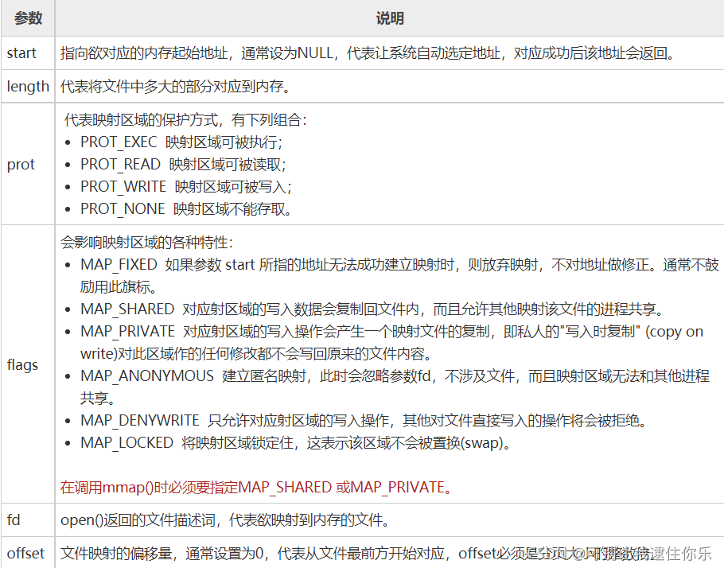

# memcmp函数  比较
**功能**

比较内存区域buf1和buf2的**前count个字节**，区分字母的大小写

`int memcmp(const void *buf1, const void *buf2, unsigned int count);`

**参数**
- buf 1 - 比较串1 
- buf2  - 比较串2 
- count - 比较字节数


**返回值**

当buf1<buf2时，返回值<0 

当buf1=buf2时，返回值=0 

当buf1>buf2时，返回值>0

# memcpy函数  拷贝
c和c++使用的内存拷贝函数，memcpy函数的功能是**从源src所指的内存地址的起始位置**开始拷贝n个字节到**目标dest所指的内存地址的起始位置中**

头文件：`<string.h>`或`<cstring>`
函数原型：

```cpp
memcmp (const void*, const void*, size_t);
第一个参数: 目的地址
第二个参数：源地址
第三个参数：所需要复制的字节数
```
# c_str()函数  转化
c_str()函数**就是把string编成了char*类型**

const char* c_str();

返回一个指向正规C字符串的指针, 内容与本string串相同,这是为了与c语言兼容，在c语言中没有string类型，故必须通过**string类对象的成员函数**c_str() 把string 对象转换成c中的字符串样式。

# usleep()函数  暂停
usleep函数能把线程挂起一段时间， 单位是微秒（千分之一毫秒）。本函数可暂时使程序停止执行。参数 micro_seconds 为要暂停的微秒数(us)。

这个函数不能工作在windows 操作系统中。用在Linux的测试环境下面

# memset() 初始化函数
```cpp
 void* memset(void* s, int ch, size_t n);
```

将s中当前位置后面的n个字节用ch替代并返回s
作用：在一段内存块中填充某个给定的值，它是对较大的结构体或数组清零操作的一种最快方法
 这个函数通常为新申请的内存做初始化工作。
 样例：


```cpp
 memset(&fmt, 0, sizeof(fmt));
```

# mmap()函数：建立内存映射
作用：将一个文件或者其他对象映射进内存，**让用户程序直接访问设备内存**，这种机制，相比较在用户空间和内核空间互相拷贝数据，效率更高。在要求高性能的应用中比较常用。mmap映射内存必须是页面大小的整数倍，面向流的设备不能进行mmap，mmap的实现和硬件有关。
**头文件**

`#include<unistd.h>` 
 `#include<sys/mman.h>`

 **函数定义**

```cpp
void *mmap(void *start, size_t length, int prot, int flags, int fd, off_t offsize);
```
mmap()用来将某个文件内容映射到内存中，对该内存区域的存取即是直接对该文件内容的读写
参数说明：
返回值：若映射成功则返回映射区的内存起始地址，否则返回MAP_FAILED(-1)，错误原因存于errno 中
错误代码：

- EBADF  参数fd 不是有效的文件描述词。
- EACCES  存取权限有误。如果是MAP_PRIVATE 情况下文件必须可读，使用MAP_SHARED 则要有PROT_WRITE 以及该文件要能写入。
- EINVAL  参数start、length 或offset 有一个不合法。
- EAGAIN  文件被锁住，或是有太多内存被锁住。
- ENOMEM  内存不足。


 


# 参考文章
- [C语言mmap()函数：建立内存映射](http://c.biancheng.net/cpp/html/138.html)