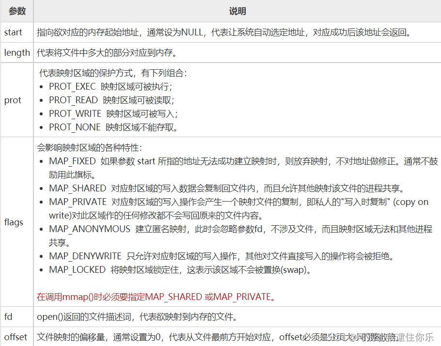

# 头文件

## include<assert.h>

assert.h是c标准库的一个头文件，该头文件的主要目的就是提供一个assert的宏定义。

 assert只是对所给的表达式求值，就像if判断语句中一样，然后如果该值为真则正常运行，否则报错，并调用abort(),产生异常中断，exit出来。适用于软件测试、调试、排错

 该宏可以屏蔽掉，只需在包含assert.h之前＃define NDEBUG，想开再#undef。从这里可以看出预处理带来的方便。

```c
#define NDEBUG//关闭静态断言，必须放在头文件上方
```

**函数名：assert**

功能：测试一个条件并可能使程序终止

用 法: void assert(int test);

malloc分配内存失败，返回NULL，assert可以用于检测指针是否NULL

缺点：频繁的调用会极大的影响程序的性能，增加额外的开销


# memcmp函数  比较

**功能**

比较内存区域buf1和buf2的**前count个字节**，区分字母的大小写

`int memcmp(const void *buf1, const void *buf2, unsigned int count);`

**参数**
- buf 1 - 比较串1 
- buf2  - 比较串2 
- count - 比较字节数


**返回值**

当buf1<buf2时，返回值<0 

当buf1=buf2时，返回值=0 

当buf1>buf2时，返回值>0

# memcpy函数  拷贝
c和c++使用的内存拷贝函数，memcpy函数的功能是**从源src所指的内存地址的起始位置**开始拷贝n个字节到**目标dest所指的内存地址的起始位置中**

头文件：`<string.h>`或`<cstring>`
函数原型：

```cpp
memcmp (const void*, const void*, size_t);
第一个参数: 目的地址
第二个参数：源地址
第三个参数：所需要复制的字节数
```
# c_str()函数  转化
c_str()函数**就是把string编成了char*类型**

const char* c_str();

返回一个指向正规C字符串的指针, 内容与本string串相同,这是为了与c语言兼容，在c语言中没有string类型，故必须通过**string类对象的成员函数**c_str() 把string 对象转换成c中的字符串样式。

# usleep()函数  暂停
usleep函数能把线程挂起一段时间， 单位是微秒（千分之一毫秒）。本函数可暂时使程序停止执行。参数 micro_seconds 为要暂停的微秒数(us)。

这个函数不能工作在windows 操作系统中。用在Linux的测试环境下面

# memset() 初始化函数
```cpp
 void* memset(void* s, int ch, size_t n);
```

将s中当前位置后面的n个字节用ch替代并返回s
作用：在一段内存块中填充某个给定的值，它是对较大的结构体或数组清零操作的一种最快方法
 这个函数通常为新申请的内存做初始化工作。
 样例：


```cpp
 memset(&fmt, 0, sizeof(fmt));
```

# mmap()函数：建立内存映射
作用：将一个文件或者其他对象映射进内存，**让用户程序直接访问设备内存**，这种机制，相比较在用户空间和内核空间互相拷贝数据，效率更高。在要求高性能的应用中比较常用。mmap映射内存必须是页面大小的整数倍，面向流的设备不能进行mmap，mmap的实现和硬件有关。
**头文件**

`#include<unistd.h>` 
 `#include<sys/mman.h>`

 **函数定义**

```cpp
void *mmap(void *start, size_t length, int prot, int flags, int fd, off_t offsize);
```
mmap()用来将某个文件内容映射到内存中，对该内存区域的存取即是直接对该文件内容的读写
参数说明：
返回值：若映射成功则返回映射区的内存起始地址，否则返回MAP_FAILED(-1)，错误原因存于errno 中
错误代码：

- EBADF  参数fd 不是有效的文件描述词。
- EACCES  存取权限有误。如果是MAP_PRIVATE 情况下文件必须可读，使用MAP_SHARED 则要有PROT_WRITE 以及该文件要能写入。
- EINVAL  参数start、length 或offset 有一个不合法。
- EAGAIN  文件被锁住，或是有太多内存被锁住。
- ENOMEM  内存不足。

# C库函数----fread()

## 作用

 从给定流 **stream** 读取数据到 **ptr** 所指向的数组中 

## 声明

> ```c
> size_t fread(void *ptr, size_t size, size_t nmemb, FILE *stream)
> ```

 ## 参数

-  **ptr** -- 这是指向带有**最小尺寸** *size\*nmemb* 字节的内存块的指针 
- **size** -- 这是要读取的每个元素的大小，以字节为单位。
- **nmemb** -- 这是元素的个数，每个元素的大小为 size 字节。
- **stream** -- 这是指向 FILE 对象的指针，该 FILE 对象指定了一个输入流。

## 返回值

 成功读取的元素总数会以 size_t 对象返回，size_t 对象是一个整型数据类型。如果总数与 nmemb 参数不同，则可能发生了一个错误或者到达了文件末尾。 

# C 库函数---fwrite()

## 作用

  把 **ptr** 所指向的数组中的数据写入到给定流 **stream** 中 

## 声明

> ```c
> size_t fwrite(const void *ptr, size_t size, size_t nmemb, FILE *stream)
> ```

## 参数

- **ptr** -- 这是指向要被写入的元素数组的指针。
- **size** -- 这是要被写入的每个元素的大小，以字节为单位。
- **nmemb** -- 这是元素的个数，每个元素的大小为 size 字节。
- **stream** -- 这是指向 FILE 对象的指针，该 FILE 对象指定了一个输出流。

## 返回值

如果成功，该函数返回一个 size_t 对象，表示元素的总数，该对象是一个整型数据类型。如果该数字与 nmemb 参数不同，则会显示一个错误。 

# signal()函数

### 定义

设置一个函数来处理信号，即带有 **sig** 参数的信号处理程序

### 声明

> ```c++
> void (*signal(int sig, void (*func)(int)))(int)
> ```

### 参数

- sig -- 在信号处理程序中作为变量使用的信号码。下面是一些重要的标准信号常量

| 宏      | 信号                                                         |
| ------- | ------------------------------------------------------------ |
| SIGABRT | (Signal Abort) 程序异常终止。                                |
| SIGFPE  | (Signal Floating-Point Exception) 算术运算出错，如除数为 0 或溢出（不一定是浮点运算）。 |
| SIGILL  | (Signal Illegal Instruction) 非法函数映象，如非法指令，通常是由于代码中的某个变体或者尝试执行数据导致的。 |
| SIGINT  | (Signal Interrupt) 中断信号，如 ctrl-C，通常由用户生成。     |
| SIGSEGV | (Signal Segmentation Violation) 非法访问存储器，如访问不存在的内存单元。 |
| SIGTERM | (Signal Terminate) 发送给本程序的终止请求信号。              |

- **func**  -- 一个指向函数的指针。它可以是一个由程序定义的函数，也可以是下面预定义函数之一：

| SIG_DFL | 默认的信号处理程序。 |
| ------- | -------------------- |
| SIG_IGN | 忽视信号。           |

### 返回值

该函数返回信号处理程序之前的值，当发生错误时返回 SIG_ERR。


# 参考文章
- [C语言mmap()函数：建立内存映射](http://c.biancheng.net/cpp/html/138.html)