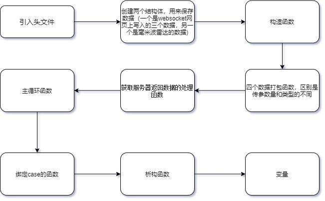

# Lpr_CameraVideo设备的代码介绍

## 1.头文件介绍

### 结构流程图



### 1.引入头文件

```C++
// Lpr_CameraVideo.h
#pragma once            //防止重复引用
#include "Lpr_GlobalConfig.h"
#include "Lpr_Device.h"	
#include "Lpr_WireDetector.h" // 巡线用到的头文件
#include "Lpr_AsyncTcp.h"
```

### 2. 创建两个结构体

```c++
/* 网页上的数据结构 */
typedef struct websocket_data1
{
    int NeighborThresh; //邻间差阈值：线左右两侧灰度差
    double NewTarSim; //上次记录为空时，新纪录的相似度阈值（与标准电线[竖直线]的相似度）
    int BW_DETECT; // 电线类型 0-white 1-black 2-black and white
}websocket_data;

/*毫米波数据 left middle right*/
typedef struct cam_Mmware_data
{
    float left;
    float middle;
    float right;
}cam_Mmware_data;
```

### 3.创建Cam_device类

```c++
class Cam_device
{
public:
    //传入服务器端口和设置设备名字
    Cam_device(int port);
    Cam_device(){}

    // 4个数据打包函数
    // 视觉降落的数据打包
    void CamDevice_land_data_Package(Message *msg, Msg_proto_Devices_type msg_to,  double height,double center_y,double center_x,double angle);
    // 巡线的数据打包
    void CamDevice_line_patrol_Package(Message *msg, Msg_proto_Devices_type msg_to,float x, float angle1);
    // 将数据打包给网页
    void CamDevice_websocket_package(Message *msg, Msg_proto_Devices_type msg_to,int NeighborThresh, double NewTarSim, int BW_DETECT);
    // 打包string类型的数据
    void DevicePackage(Message *msg, Msg_proto_Devices_type msg_to, std::string data);

    
     //读取数据回调函数
    void DeviceReadHandler(void *buff, std::size_t bytes_transferred);
  
    //主循环函数
    void CamDeviceLoop();
    bool run();
    // 绑定case的函数，在项目的主函数中将其与某个case绑定
    string cam_land_msg(string h_data, RequestModule *m_request);           
    string cam_line_patrol_msg(string h_data, RequestModule *m_request);      
    string cam_switch_mode(string h_data, RequestModule *m_request);          
    string pack_websocket_data(string h_data, RequestModule *m_request);      
    string sub_websocket_vision(string h_data,RequestModule *m_request);   
    
    ~Cam_device(){}

   
    Config cam_config; // 因为要对配置文件进行操作，所以创建一个配置文件的对象

private:
    Device m_device;        //设备名字
    std::shared_ptr<AsyncTcpClient> m_tcp_device;
    std::list<Msg_proto> m_plist;   //接受pbuf消息队列
    std::mutex m_mtx;           //消息队列锁
    websocket_data1 websocket_data; // 创建接收websocket数据的对象
    cam_Mmware_data Mmware_data;    // 创建接收毫米波雷达数据的对象
    /*******巡线用到的数据*********/
    WireDetector wd; //电线检测器
    std::mutex fps_mutex; //fps mutex
    std::mutex sleep_mutex; //fps mutex
     std::condition_variable sleep_condition;
    int fps = 0; //帧率 
    int framesNum = 0; //帧计数
     Wire adFactor;//电线参数，发送给无人机的参数(偏移量，角度)->((float):adFactor.x, (float):adFactor.angle)
    /*********保存图像到文件**********/
    char ch[64] = {0};
    char filename[100] = {0};
    /*******************************/
    string mode = "";
    int int_mode = 0; // 0是降落，1是巡线 2默认（其他）
    int radarSectors; // 通过毫米波的三个数据来判断左中右
};
```

## 源文件介绍

### 结构顺序如下：

### 1.视觉降落需要用到的头文件

```c++
#include "Lpr_CameraVideo.h"
#include <opencv2/core/core.hpp>
#include <opencv2/imgproc/imgproc.hpp>
#include <opencv2/highgui/highgui.hpp>

using namespace cv;
using namespace std;
```

### 2.视觉降落算法用到的结构，并创建输入和输出对象

```c++
/* 视觉降落算法用到的结构*/
struct xyza{
    double center_y;
    double center_x;
    double height;
    double angle;
    int sign_stable;
    Mat frame;   //输入图片 
};
struct xyza st_in; //输入结构体
struct xyza st_out; 
```

### 3.缩小图标后的拟合数据( 通过仿真得到的数据 )

```c++
//缩小图标后的拟合数据
static double camera_a = 396;			// 528
static double camera_b = 0.01179;		//0.008841
static double h_s_b = 0.2818;			//0.2113
static double h_s_r = 0.4221;			//0.3166
```

### 4. gstreamer 图传

```c++
/********* gstreamer 图传 ********************/
cv::VideoWriter out;//gstream

//图传分辨率写入配置文件，在构造函数中赋值
std::string gstreamerPORT;   // gstreamer传输的端口
std::string gstreamerIP;   // gstreamer传输的IP
int gwidth,gheight; 
cv::Size resolTran;// = cv::Size(gwidth, gheight);//图传分辨率

//send image to ground station 发送图像给地面站的函数
void uploadStream(cv::Mat &gstreamMat)
{
	cv::Mat tmpMat = gstreamMat.clone();
	if(!tmpMat.data)
	throw std::invalid_argument("empty image for gstreamer");
    
	if(cv::Size(tmpMat.cols, tmpMat.rows) != resolTran)
	cv::resize(tmpMat, tmpMat, resolTran);

	out.write(tmpMat);
	usleep(40*1000);//25fps
	//sleep(1);
}
/*********************************************/
```

### 5. 构造函数

```c++
//传入服务器端口和设置设备名字
Cam_device::Cam_device(int port)
    : m_device("Cam_device", port)
{
    using namespace std::placeholders;
	cam_config.setParameterFile("/home/pi/Lpr_data/Config/cam_config.ini"); // 读取配置文件的位置
     // 将配置文件中的某些数值赋值给下面的变量，这样就能通过配置文件来调整
	gstreamerPORT = cam_config.get<string>("DEV", "gstreamerPORT");
	gstreamerIP = cam_config.get<string>("DEV", "gstreamerIP");
	gwidth = cam_config.get<int>("DEV", "gWIDTH");
	gheight = cam_config.get<int>("DEV", "gHEIGHT");
	resolTran = cv::Size(gwidth, gheight);//图传分辨率
	/* 绑定TCP回调函数 */
    /* 接受摄像头数据并加入到m_tcp_device->rData*/
    auto callback_device = std::bind(&Cam_device::DeviceReadHandler, this, _1, _2);
    m_tcp_device = std::make_shared<AsyncTcpClient>(6666, "127.0.0.1"); 
	 //注册返回数据处理函数
	// 将接收websocket的变量初始化
	this->websocket_data.BW_DETECT = 0;
	this->websocket_data.NeighborThresh = 0;
	this->websocket_data.NewTarSim = 0;
	// 将接收毫米波雷达数据的变量初始化
	this->Mmware_data.left = 0;
	this->Mmware_data.middle = 0;
	this->Mmware_data.right = 0;
}
```

### 6. 数据打包函数

```C++
/* 视觉降落的数据打包 */
void Cam_device::CamDevice_land_data_Package(Message *msg, Msg_proto_Devices_type msg_to,  double height,double center_y,double center_x,double angle)
{
    /* device 数据包创建 */
    Msg_proto *q = msg->GetProto();

    /* 包数据初始化*/
    q->set_msg_from(Msg_proto_Devices_type_Cam_device); //数据来源
    q->set_msg_to(msg_to);                              //数据去处
    /* 增加设备嵌套数据 */
    Cam_device_proto *cam_device_proto = q->add_cam_device_proto();
    // 设置设备名
    cam_device_proto->set_name(this->m_device.GetDeviceName());
    //设置传输数据
    cam_device_proto->set_height(height);
	cam_device_proto->set_center_y(center_y);
	cam_device_proto->set_center_x(center_x);
	cam_device_proto->set_angle(angle);
    
    return;
}

/* 巡线的数据打包 */
void Cam_device::CamDevice_line_patrol_Package(Message *msg, Msg_proto_Devices_type msg_to,float x, float angle1)
{
    /* device 数据包创建 */
    Msg_proto *q = msg->GetProto();

    /* 包数据初始化*/
    q->set_msg_from(Msg_proto_Devices_type_Cam_device); //数据来源
    q->set_msg_to(msg_to);                              //数据去处
    /* 增加设备嵌套数据 */
    Cam_device_proto *cam_device_proto = q->add_cam_device_proto();
    // 设置设备名
    cam_device_proto->set_name(this->m_device.GetDeviceName());
    //设置传输数据
    cam_device_proto->set_x(x);
	cam_device_proto->set_angle1(angle1);

    return;
}

/* 将websocket那几个参数打包 */
void Cam_device::CamDevice_websocket_package(Message *msg, Msg_proto_Devices_type msg_to,int NeighborThresh, double NewTarSim, int BW_DETECT)
{
    /* device 数据包创建 */
    Msg_proto *q = msg->GetProto();

    /* 包数据初始化*/
    q->set_msg_from(Msg_proto_Devices_type_Cam_device); //数据来源
    q->set_msg_to(msg_to);                              //数据去处
    /* 增加设备嵌套数据 */
    Cam_device_proto *cam_device_proto = q->add_cam_device_proto();
    // 设置设备名
    cam_device_proto->set_name(this->m_device.GetDeviceName());
    //设置传输数据
    cam_device_proto->set_neighborthresh(NeighborThresh);
	cam_device_proto->set_newtarsim(NewTarSim);
	cam_device_proto->set_bw_detect(BW_DETECT);

    return;
}

/* string数据打包 */
void Cam_device::DevicePackage(Message *msg, Msg_proto_Devices_type msg_to, std::string data)
{
    /*获取msg protobuf*/
    Msg_proto *q = msg->GetProto();
    /* 设置信息归属 */
    q->set_msg_from(Msg_proto_Devices_type_Cam_device);
    /* 设置信息去向 */
    q->set_msg_to(msg_to);
    /* 增加附属消息 */
  	 Cam_device_proto *cam_device_proto = q->add_cam_device_proto();
   // 设置设备名
    cam_device_proto->set_name(this->m_device.GetDeviceName());
	cam_device_proto->set_data(data);
    return;
}
```

### 7.获取服务器返回数据的处理函数 

```c++
/* 获取服务器返回数据的处理函数 */
void Cam_device::DeviceReadHandler(void *buff, std::size_t bytes_transferred)
{
	//获取消息
    /* 接受包 */
    Message q(std::string((char *)buff, bytes_transferred));
    if(!q.Decode()){
        std::cout <<"q Decode error"<<std::endl;
    }
#if 0
    std::cout << "DeviceReadHandler: " << Result_msg::Result_type_Name(q.Head()->status) << std::endl;
    std::cout << "DeviceReadHandler data size is: " << q.Size() << std::endl;
#endif

    //m_mtx.lock();
    switch (q.Head()->status)
	{
    case Result_msg_Result_type_RESULT_OK:
    {
        break;
    }
    case Result_msg_Result_type_RESULT_ERROR:
    {
        break;
    }
    case Result_msg_Result_type_RESULT_DATA:
    {
		
        std::list<Msg_proto> m_plist; //接受pbuf消息队列   
        //获取中转数据
        q.MsgProtoList(&m_plist, bytes_transferred);    
        std::list<Msg_proto>::iterator p_1;
		for (p_1 = m_plist.begin(); p_1 != m_plist.end(); p_1++)
        { 
			if ((*p_1).remote_control_proto_size() > 0)
        	{
          	  /*判断数据头包的cmd*/
           	 std::string a = string(q.Head()->cmd, strlen(q.Head()->cmd));

           	 	Remote_control_proto::Remote_control_proto_Case_type value;
           		 /*将string 类型的cmd解析到value*/
            	//std::cout<<"data:"<<((Msg_proto)*p_1).flight_control_proto(0).data()<<std::endl;
            	if (Remote_control_proto::Remote_control_proto_Case_type_Parse(a, &value))
            	{
               		 std::cout<<"value: "<<value<<std::endl;
                	//SDK_PRINT(DEBUGLEVEL,"value = %d\n",value);
           		 }
            	else
            	{
               		 std::cout << "cmd value error: " << value << std::endl;
            	}
           		 switch (value)
           	 	{
            		/*gps lock_status*/
            		case Cam_device_proto::SWITCHING_MODE:
            		{
               			mode = ((Msg_proto)*p_1).cam_device_proto(0).mode();
                		std::cout<<"mode: "<< mode <<std::endl;
						this->mode = mode;
            		} break;
            	}
        	}	
			if ((*p_1).mmware_radar_proto_size() > 0)
        	{
            	 /*判断数据头包的cmd*/
            	std::string a = string(q.Head()->cmd, strlen(q.Head()->cmd));

            	Mmware_radar_proto::Mmware_radar_proto_Case_type value;
            	/*将string 类型的cmd解析到value*/
            	//std::cout<<"data:"<<((Msg_proto)*p_1).flight_control_proto(0).data()<<std::endl;
            	if (Mmware_radar_proto::Mmware_radar_proto_Case_type_Parse(a, &value))
            	{
                	//std::cout<<"value: "<<value<<std::endl;
                	//SDK_PRINT(DEBUGLEVEL,"value = %d\n",value);
            	}
            	else
            	{
               		 std::cout << "cmd value error: " << value << std::endl;
            	}
            	switch (value)
            	{
               		 // 毫米波的数据
                 	case Mmware_radar_proto::MMWAVE_RADAR_PROTO_DATA:
                 	{
                    
                   		this->Mmware_data.left = ((Msg_proto)*p_1).mmware_radar_proto(0).left();
                    	this->Mmware_data.middle = ((Msg_proto)*p_1).mmware_radar_proto(0).middle();
                    	this->Mmware_data.right = ((Msg_proto)*p_1).mmware_radar_proto(0).right();
                    	// std::cout<<"left: "<<Mmware_data.left<<" middle:"<<Mmware_data.middle<<" right:"<<Mmware_data.right<<std::endl;
						if(this->Mmware_data.left == 0 && this->Mmware_data.middle == 0 && this->Mmware_data.right == 0 )
							radarSectors = MWRDS_NOTARTGET;
						else if(this->Mmware_data.left >= this->Mmware_data.middle  && this->Mmware_data.middle >= this->Mmware_data.right == 0 )
            				radarSectors = MWRDS_MIDDLE; // 中
						else if(this->Mmware_data.middle >= this->Mmware_data.left  && this->Mmware_data.left >= this->Mmware_data.right == 0)
							radarSectors = MWRDS_LEFT;  //左
						else if(this->Mmware_data.middle >= this->Mmware_data.right  && this->Mmware_data.right >= this->Mmware_data.left == 0)
							radarSectors = MWRDS_RIGHT;
							// cout<<Mmware_data.left <<"   "<<Mmware_data.middle << "  "<< Mmware_data.right<<endl;
                 	} break;
            	}
        	}	
		}
	}	
	}
}
```

### 8.视觉降落算法用到的一些函数

```c++
/***************************视觉降落数据处理用到的函数*****************************************/
/* 视觉输出用到的函数 */
inline double calc_real_length(const double L, const double height)
{
	return L*(height / camera_a + camera_b);
}

inline double calc_pixel_length(const double P, const double height)
{
	return P*(camera_a + camera_b)/height;
}

inline double calc_height_red_signS(const double S)
{
	//double L = 70 / sqrt(S / 0.318367) ;
	double L = 70 / sqrt(S / h_s_r) ;
	return camera_a * (L - camera_b);
}

inline double calc_height_blue_signS(const double S)
{
	//double L = 16 / sqrt(S / 0.316077) ;
	double L = 16 / sqrt(S / h_s_b) ;
	return camera_a * (L - camera_b);
}

static inline double angle(Point pt1, Point pt2, Point pt0)
{
	double dx1 = pt1.x - pt0.x;
	double dy1 = pt1.y - pt0.y;
	double dx2 = pt2.x - pt0.x;
	double dy2 = pt2.y - pt0.y;
	double sin = dx1*dy2 - dy1*dx2;
	if (sin > 0)
		return  acos((dx1*dx2 + dy1*dy2) / sqrt((dx1*dx1 + dy1*dy1)*(dx2*dx2 + dy2*dy2) + 1e-10));
	else
		return  -acos((dx1*dx2 + dy1*dy2) / sqrt((dx1*dx1 + dy1*dy1)*(dx2*dx2 + dy2*dy2) + 1e-10));
}

inline bool chk(Mat& frame, vector<Point>& approx_poly, int* corners)
{
	morphologyEx(frame, frame, MORPH_CLOSE, getStructuringElement(MORPH_ELLIPSE,Size(3,3)), Point(-1, -1), 1, BORDER_REPLICATE);
	vector<vector<Point>> contoursR;
	vector<vector<Point>> contoursR2;
	findContours(frame, contoursR, CV_RETR_EXTERNAL, CV_CHAIN_APPROX_NONE);
	vector<vector<Point>>::iterator contours_it = contoursR.begin();
	while (contours_it != contoursR.end())
	{
		//erase the contour if its too small
		double S = contourArea(*contours_it, false);
		if (S < 200)
		{
			++contours_it;
			continue;
		}

		double L = arcLength(*contours_it, true);
		double e = L*L / 33.323076923 / S;
		if (e<0.5 || e>1.5)
		{
			++contours_it;
			continue;
		}

		// square contours should have 4 vertices after approximation
		vector<Point> approx;
		approxPolyDP(*contours_it, approx, L*0.02, true);
		if (approx.size() < 4 || approx.size()>10)
		{
			++contours_it;
			continue;
		}

		vector<Point> approx2;
		Point last_point;//2d point
		double sum_x = 0, sum_y = 0;
		int n = 0;
		double min_distance = L*0.02;
		min_distance *= min_distance;
		vector<Point>::iterator approx_it = approx.begin();
		double x = (*approx_it).x - approx.back().x;
		double y = (*approx_it).y - approx.back().y;
		if (x*x + y*y > min_distance)
			approx2.push_back(*approx_it);
		else
		{
			last_point = approx.back();
			sum_x += x;
			sum_y += y;
			++n;
		}
		++approx_it;
		while (approx_it != approx.end())
		{
			if (n > 0)
			{
				x = (*approx_it).x - last_point.x;
				y = (*approx_it).y - last_point.y;
			}
			else
			{
				x = (*approx_it).x - (*(approx_it - 1)).x;
				y = (*approx_it).y - (*(approx_it - 1)).y;
			}
			if (x*x + y*y > min_distance)
			{
				if (n > 0)
				{
					approx2.push_back(Point(sum_x / n, sum_y / n));
					sum_x = sum_y = n = 0;
				}
				approx2.push_back(*approx_it);//[note by seanlau] suppose to be involved in else block？
			}
			else
			{
				if (n > 0)
					last_point = *approx_it;
				sum_x += x;
				sum_y += y;
				++n;
			}
			++approx_it;
		}
		if (n > 0)
		{
			approx2.push_back(Point(sum_x / n, sum_y / n));
			sum_x = sum_y = n = 0;
		}

		if (approx2.size() != 4)
		{
			++contours_it;
			continue;
		}

		//double maxCosine = 0;
		vector< int > current_corners;
		current_corners.push_back(0);
		current_corners.push_back(0);
		current_corners.push_back(0);
		current_corners.push_back(0);
		double sq = 0;
		int sign = 0;
		//[note by seanlau] angle0:131.4, angle2:67.6, angle1 angle3:29.1
		//[note by seanlau]corners from approxPolyDP are already in order of clockwise or anticlockwise
		for (int j = 2; j < 6; j++)
		{
			// find the maximum cosine of the angle between joint edges
			int p1 = j;
			if (p1 >= 4)
				p1 -= 4;
			int p2 = j - 1;
			if (p2 >= 4)
				p2 -= 4;

			double current_angle = angle(approx2[p1], approx2[j - 2], approx2[p2]) * 180 / 3.1415926;
			double abs_angle = abs(current_angle);

			if (abs_angle > 100 )
			{
				if (current_corners[0] != 0)
				{
					++contours_it;
					goto continue_chk;
				}
				else
				{
					if (sign == 0)
					{
						if (current_angle > 0)
							sign = 1;
						else
							sign = -1;
					}
					else if (sign * current_angle < 0)
					{
						++contours_it;
						goto continue_chk;
					}
						
					sq += pow(abs_angle - 131.4, 2);
					current_corners[0] = p2 + 1;
				}
			}
			else if (abs_angle > 45)
			{
				if (current_corners[2] != 0)
				{
					++contours_it;
					goto continue_chk;
				}
				else
				{
					if (sign == 0)
					{
						if (current_angle < 0)
							sign = 1;
						else
							sign = -1;
					}
					else if (sign * current_angle > 0)
					{
						++contours_it;
						goto continue_chk;
					}
					sq += pow(abs_angle - 67.6, 2);
					current_corners[2] = p2 + 1;
				}
			}
			else
			{
				if (sign == 0)
				{
					if (current_angle < 0)
						sign = 1;
					else
						sign = -1;
				}
				else if (sign * current_angle > 0)
				{
					++contours_it;
					goto continue_chk;
				}
				sq += pow(abs_angle - 29.1, 2);
				if (current_corners[1] != 0)
				{
					if (current_corners[3] != 0)
					{
						++contours_it;
						goto continue_chk;
					}
					else
					{						
						current_corners[3] = p2 + 1;
					}
				}
				else
				{
					current_corners[1] = p2 + 1;
				}
			}
		}
		sq /= 4;
		for (int j = 1; j < 4; ++j)
		{
			int e = abs(current_corners[j] - current_corners[j - 1]);
			if (e != 1 && e != 3)
			{
				++contours_it;
				goto continue_chk;
			}
		}
		if (sq > 200)
		{
			++contours_it;
			continue;
		}
		corners[0] = current_corners[0];
		corners[1] = current_corners[1];
		corners[2] = current_corners[2];
		corners[3] = current_corners[3];

		contoursR2.push_back(*contours_it);
		approx_poly = approx2;
		return true;

		++contours_it;
	continue_chk:
		continue;
	}
	return false;
}

#define frame_count 4
Mat frames[frame_count];
int frame_index = 0;
VideoCapture* capture;
bool find_result[ frame_count ];
int current_use_frame = 0;
 
void* image_getting_thread(void* arg)
{
	Mat temp_frame;
	while(1)
	{
		temp_frame.release();
		(*capture) >> temp_frame;
		
		int next_frame_index;	
					
		next_frame_index = frame_index + 1;
		re_find_next_frame_index:	
		if( next_frame_index == frame_count	)
			next_frame_index = 0;
		if( next_frame_index == current_use_frame )
		{
			++next_frame_index;
			goto re_find_next_frame_index;
		}
			
		frames[ next_frame_index ].release();
		frames[ next_frame_index ] = temp_frame.clone();
		frame_index = next_frame_index;
	}
}

struct xyza image_processing(struct xyza st)
{
	GaussianBlur(st.frame, st.frame, Size(3, 3), 0);
	Mat frameHsv;
	cvtColor(st.frame, frameHsv, COLOR_BGR2HSV);

	Mat MatB(frameHsv.size(), CV_8UC1);//CV_8U equals to unsinged int(8 bits)
	Mat MatR(frameHsv.size(), CV_8UC1);
	int frame_size = frameHsv.size().width * frameHsv.size().height * 3;
	#pragma omp parallel for
	for (int i = 0; i < frame_size; i += 3)
	{
		unsigned char H = frameHsv.data[i];
		unsigned char S = frameHsv.data[i + 1];
		unsigned char V = frameHsv.data[i + 2];

		bool is_colored = (S > 43) && (S < 255) && (V > 46);
		//bool is_blue = is_colored && H > 110 && H < 125;
		bool is_blue = is_colored && (H>=100 && H<=125);
		bool is_red = is_colored && ((H<10) || (H > 156 && H < 180));

		int result_frame_index = i / 3;

		if (is_blue)	//B
		{
			MatB.data[result_frame_index] = 255;
			MatR.data[result_frame_index] = 0;
		}
		else if (is_red)  //R
		{
			MatB.data[result_frame_index] = 0;
			MatR.data[result_frame_index] = 255;
		}
		else
		{
			MatB.data[result_frame_index] = 0;
			MatR.data[result_frame_index] = 0;
		}
	}
	
	vector<Point> approx_poly;
	int corners[4];
	bool red_sign_found = chk(MatR, approx_poly, corners);
	bool blue_sign_found;
	if (red_sign_found)
	{
		st.height = calc_height_red_signS(contourArea(approx_poly, false));
		st.center_x = calc_real_length(approx_poly[corners[0] - 1].x - st.frame.size().width / 2, st.height);
		st.center_y = calc_real_length(approx_poly[corners[0] - 1].y - st.frame.size().height / 2, st.height);
		Point corner1( calc_real_length(approx_poly[corners[1] - 1].x - st.frame.size().width / 2, st.height) , calc_real_length(approx_poly[corners[1] - 1].y - st.frame.size().height / 2, st.height) );
		Point corner2( calc_real_length(approx_poly[corners[3] - 1].x - st.frame.size().width / 2, st.height) , calc_real_length(approx_poly[corners[3] - 1].y - st.frame.size().height / 2, st.height) );
		Point corner3( calc_real_length(approx_poly[corners[2] - 1].x - st.frame.size().width / 2, st.height) , calc_real_length(approx_poly[corners[2] - 1].y - st.frame.size().height / 2, st.height) );
		Point mid( (corner1.x + corner2.x)*0.5 , (corner1.y + corner2.y)*0.5 );
		
		mid.x = corner3.x - st.center_x;
		mid.y = corner3.y - st.center_y;
		double norm = sqrt( 1.0 / (mid.x*mid.x + mid.y*mid.y) );
		double offset_x = mid.x * norm;//[note by seanlau] similar to cosine
		double offset_y = mid.y * norm;
		st.center_x += 6.5 * offset_x;//[note by seanlau] move point to center
		st.center_y += 6.5 * offset_y;	
		st.angle = atan2( mid.x , mid.y );
		//if(cam_config.get<bool>())
		//cout << "\nred sign found!\n  height = " << height<<"  x = "<<center_x<<"  y = "<<center_y<< "  angle = " <<angle*180/3.1415926<< "\n";
	}
	else
	{
		blue_sign_found = chk(MatB, approx_poly, corners);
		if (blue_sign_found)
		{
			st.height = calc_height_blue_signS(contourArea(approx_poly, false));
			st.center_x = calc_real_length(approx_poly[corners[2] - 1].x - st.frame.size().width / 2, st.height);
			st.center_y = calc_real_length(approx_poly[corners[2] - 1].y - st.frame.size().height / 2, st.height);
			Point corner3( calc_real_length(approx_poly[corners[2] - 1].x - st.frame.size().width / 2, st.height) , calc_real_length(approx_poly[corners[2] - 1].y - st.frame.size().height / 2, st.height) );
			Point mid(0 , 0 );
			mid.x = corner3.x - st.center_x;
			mid.y = corner3.y - st.center_y;
			st.angle = atan2( mid.x , mid.y );
			//cout << "\nblue sign found!\n  height = " << height << "  x = " << center_x << "  y = " << center_y << "  angle = " <<angle*180/3.1415926<< "\n";
		}
	}
	
	//static int st.sign_stable = 0;
	static double last_x=0 ,last_y=0 ,last_z=0;
	if( red_sign_found || blue_sign_found )
	{
		double err_x = st.center_x - last_x;
		double err_y = st.center_y - last_y;
		double err_z = st.height - last_z;
		
		if( abs(err_z) > 20 || ( err_x*err_x + err_y*err_y > 25*25 ) )
			st.sign_stable = 0;
		else if( st.sign_stable < 100 )
			++st.sign_stable;
			
		last_x = st.center_x;
		last_y = st.center_y;
		last_z = st.height;
	}
	else
	{
		st.sign_stable = 0;
		
	}
	
	polylines(st.frame, approx_poly, true, Scalar(255, 255, 0), 2);			
	circle(st.frame, Point( calc_pixel_length( st.center_x , st.height ) + st.frame.size().width / 2 , calc_pixel_length( st.center_y , st.height ) + st.frame.size().height / 2 ) , 4, Scalar(0, 255, 255), 2);
	
	char str[100];
	sprintf( str, "x=%f , y=%f , z=%f", st.center_y, st.center_x, st.height );
	std::string text(str);	
	int font_face = cv::FONT_HERSHEY_COMPLEX; 	
	double font_scale = 0.3;	int thickness = 1;	int baseline;	
	//获取文本框的长宽	
	cv::Size text_size = cv::getTextSize(text, font_face, font_scale, thickness, &baseline); 	
	//将文本框在图片右下角绘制	
	cv::Point origin; 	
	origin.x = st.frame.cols - text_size.width - 10;
	origin.y = st.frame.rows - text_size.height - 10;
	cv::putText(st.frame, text, origin, font_face, font_scale, cv::Scalar(0, 255, 255), thickness, 8, 0);
	
	return st;
}

void get_image1()
{
	usleep(3000000);	//把线程挂起3s，暂时使程序停止执行
	Mat frame = Mat::zeros(480, 640, CV_8UC3);   //输入图片
    
    /*------------------------------------------Camera Setting---------------------------------------*/
	
	capture = new VideoCapture(0); 
	
    if(!capture->isOpened())   //判断相机是否打开
    {
        printf("can not open capture\n");
    }

	/*---------------------------------------Catch Image---------------------------------------------*/	
	(*capture) >> frames[frame_index];
	(*capture) >> frames[frame_index];
	int cap_index = 0;
	

	capture->set( 3 , 640 );//width of the frames in the video stream
	capture->set( 4 , 480 );//Height of the frames in the video stream
	capture->set( 5 , 120 );//frame rate
	
	(*capture) >> frames[frame_index];
	
	pthread_t image_create_thread_pointer;
	pthread_create( &image_create_thread_pointer , NULL , image_getting_thread , NULL );

}
/************************************************************************************************/
```

### 9.将视觉降落识别算法的结果输出

```c++
void visual_land_data_output()
{
	/* 开始输出数据 */
 	current_use_frame = frame_index;       //获取一帧图片
	int current_frame_index = current_use_frame;
	Mat frame =frames[current_frame_index].clone();

    st_in.center_y = 0;
    st_in.center_x = 0;
    st_in.height = 0;
    st_in.angle = 0;
    st_in.sign_stable = 0;
    st_in.frame = frame;  
    st_out = image_processing(st_in);  
    st_out.angle = st_out.angle*180/3.1415926;
#if 0
	if(st_out.sign_stable >= 1)
	{
		//图像处理函数,st_out里面装有xyz坐标,angle角度以及frame存放处理好的图像
        cout <<"\n height = " <<st_out.height<<" x = "<<st_out.center_y<<" y = "<<st_out.center_x<< " angle = " <<st_out.angle<< "\n";
	}
	else
		cout <<"\n height = 0 " <<" x = 0"<<" y = 0"<< " angle = 0"<< "\n";
#endif 
	 if(st_out.sign_stable <1)
	 {
	 	st_out.height = 0;
	 	st_out.center_y = 0;
	 	st_out.center_x = 0;
	 	st_out.angle = 0;
	 }
		uploadStream(frame);
}
```

### 10.主循环

### 主循环的逻辑图


```C++
void Cam_device::CamDeviceLoop()
{
    using namespace std::placeholders;
    /*开启TCP服务 */
    m_device.PoolEnqueue([this](){     //加入线程池
       m_tcp_device->run();
    });

	// 用一个线程来请求数据
	 m_device.PoolEnqueue([this](){     //加入线程池
      while(1)
	  {
		   // 请求毫米波的数据
		   Message Mmware_data_p;
            char get_buff[2041] = {0};
            /* 发送请求 服务器数据 */
            Mmware_data_p.Encode(Mmware_radar_proto::Mmware_radar_proto_Case_type_Name(Mmware_radar_proto::MMWAVE_RADAR_PROTO_DATA),
                    std::bind(&Cam_device::DevicePackage, this, _1,
                            Msg_proto_Devices_type_Mmware_radar,
                            "hb"));
            auto b_func = std::bind(&Cam_device::DeviceReadHandler, this, _1, _2);
            /* 发送到服务器请求 */
            m_device.DeviceSendReq((char *)Mmware_data_p.Data().c_str(), Mmware_data_p.Data().size(), get_buff, b_func);
            m_device.wait(500); 	
	  }
    });

	//fps计数 加入线程池
    m_device.PoolEnqueue([](Cam_device *wdd){
        while(1){
            {
                std::unique_lock<std::mutex> sleep_lock(wdd->sleep_mutex);
                wdd->sleep_condition.wait_for(sleep_lock, std::chrono::milliseconds(1000));
            }
            //区分域，否则存在死锁风险
            {
                std::unique_lock<std::mutex> fps_lock(wdd->fps_mutex);
                wdd->fps = wdd->framesNum;
                wdd->framesNum = 0;
            }
        }
    }, this);
	    
      	Message p;
		get_image1();
		//[1]初始化图传
		std::ostringstream gstrConfig;
		std::string cfCon = "appsrc  ! videoconvert ! omxh264enc noise-reduction=10000 speed-preset=ultrafast tune=zerolatency !  rtph264pay config-interval=1 pt=96 !udpsink host=";
		gstrConfig << cfCon << gstreamerIP << " port=" << gstreamerPORT << " sync=false";
		std::cout<< "gstreamer config: "<< gstrConfig.str() << std::endl;
		std::cout<< "gstreamer size: " << resolTran << std::endl;
		out.open(gstrConfig.str(), 0, (double)20.0, resolTran, true);
	while(1)
	{
		switch(this->int_mode)
		{
			// 执行降落
			case 0:{
				
				while(1)
				{
					//std::cout<<"视觉case0 降落"<<std::endl;
					// 输出视觉降落的数据
					visual_land_data_output();
					//if(Config::get<bool>("SAVE","land_picture"))
					
					if(cam_config.get<bool>("SAVE","land_picture"))
					{
						//以时间保存处理好的图片
       					time_t t = time(NULL);          //获取当前时间
	   					strftime(ch, sizeof(ch) - 1, "%Y_%m_%d_%H_%M_%S", localtime(&t));     //转换格式 年-月-日 时-分-秒
   	    			    sprintf(filename, "/home/pi/autoland_target_detect/video/%s.png", ch);    //连接成字符串
				        cv::imwrite(filename, st_out.frame);
					}
					if(this->int_mode != 0) break;
				}
			}
			break;
			// 执行巡线
			case 1: {

			while(1)
			{	
				/*[1]巡线获取图像*/
				current_use_frame = frame_index;       //获取一帧图片
				int current_frame_index = current_use_frame;
				cv::Mat srcImg =frames[current_frame_index].clone();
				//std::cout<<"111111"<<std::endl;
            	/*[2]获取毫米波雷达数据, 其中雷达扇区数据radarSectors需要实时更新*/
				
            	wd.setParams(ParamFlag::RADAR_SECTORS, radarSectors);//输入雷达数据到电线检测器
				//std::cout<<"222222"<<std::endl;
            	/*[3]检测电线*/
           	 	//Wire adFactor;//电线参数，发送给无人机的参数(偏移量，角度)->((float):adFactor.x, (float):adFactor.angle)
            	Line standardLine = wd.detectElectLine(srcImg, adFactor);
				//std::cout<<"1电线检测："<<adFactor.x <<"    "<<adFactor.angle <<std::endl;
				//std::cout<<"33333333"<<std::endl;
				/*[4]构造检测效果图*/
           		 cv::Mat displayImg= srcImg;
            	wd.displayLine(displayImg, standardLine, adFactor, fps);
				
				//std::cout<<"444444"<<std::endl;

            	/*[5]gstreamer 图传->displayImg*/

            	//cv::Mat imgDisplay = cv::Mat::zeros(480, 640, CV_8UC1);
				//cv::Mat imgDisplay = cv::Mat::zeros(480, 640, CV_8UC3);
				//uploadStream(imgDisplay);
				uploadStream(displayImg);
				//std::cout<<"5555555"<<std::endl;
				
			{
                std::unique_lock<std::mutex> fps_lock(fps_mutex);
                framesNum++;
            }
			if(this->int_mode != 1) break;

			}
			
			//std::cout<<"66666666666"<<std::endl;
	 		//if(this->int_mode != 1) break;
			}
				break;
			// 不执行任何操作
			default:
			{
				/* 开始输出数据 */
 				current_use_frame = frame_index;       //获取一帧图片
				int current_frame_index = current_use_frame;
				Mat frame =frames[current_frame_index].clone();
				uploadStream(frame);
			}
				break;
		}
		}
}	
bool Cam_device::run()
{
    //绑定当前主循环函数
	return m_device.DeviceRun(std::bind(&Cam_device::CamDeviceLoop, this));
}
```

### 11.绑定case的函数

```c++
// 降落
string Cam_device::cam_land_msg(string h_data, RequestModule *m_request)
{

    Message p;
    auto callback = std::bind(&Cam_device::CamDevice_land_data_Package, this, std::placeholders::_1,
                              Msg_proto_Devices_type_Remote_control, st_out.height,st_out.center_y,st_out.center_x,st_out.angle);
    p.Encode(Cam_device_proto::Cam_device_proto_Case_type_Name(Cam_device_proto::LAND_STATUS), callback);
   	//std::cout<<"打包st_out.height :"<<st_out.height << "  " <<"st_out.center_x:"<<st_out.center_x<<" "<<"y:"<<st_out.center_y <<" "<<"angle:"<<st_out.angle <<std::endl;
    p.Head()->status = Result_msg::RESULT_DATA;
	return std::move(p.Data());
}
// 巡线
string Cam_device::cam_line_patrol_msg(string h_data, RequestModule *m_request)
{
	Message p;
	
		
   	auto fun_c = std::bind(&Cam_device::CamDevice_line_patrol_Package, this, std::placeholders::_1,
                              Msg_proto_Devices_type_Remote_control, adFactor.x, adFactor.angle);
   	p.Encode(Cam_device_proto::Cam_device_proto_Case_type_Name(Cam_device_proto::LINE_PATROL_STATUS), fun_c);
   
   	//std::cout<<"2adFactor.x:"<<adFactor.x <<"    "<<"adFactor.angle:"<<adFactor.angle <<std::endl;
   	p.Head()->status = Result_msg::RESULT_DATA;
	return std::move(p.Data());
}
// 发送数据给websocket模块
string Cam_device::pack_websocket_data(string h_data, RequestModule *m_request)
{
	 Message p;
    auto callback = std::bind(&Cam_device::CamDevice_websocket_package, this, std::placeholders::_1,
                              Msg_proto_Devices_type_Websocket, this->websocket_data.NeighborThresh, this->websocket_data.NewTarSim, this->websocket_data.BW_DETECT);
    p.Encode(Cam_device_proto::Cam_device_proto_Case_type_Name(Cam_device_proto::FROM_CAMERA_TO_WEBSOCKET), callback);
    p.Head()->status = Result_msg::RESULT_DATA;
	return std::move(p.Data());
}
// 将websocket模块的数据包分包处理
string Cam_device::sub_websocket_vision(string h_data,RequestModule *m_request)
{
	Message p1(h_data);
	 if(!p1.Decode()){
        std::cout <<"p1 Decode error"<<std::endl;
    }

	Msg_proto *p_1 = p1.GetProto();
	/*判断数据头包的cmd*/
    std::string a = string(p1.Head()->cmd, strlen(p1.Head()->cmd));
    	
    this->websocket_data.NeighborThresh = p_1->cam_device_proto(0).neighborthresh();
	this->websocket_data.NewTarSim = p_1->cam_device_proto(0).newtarsim();
	this->websocket_data.BW_DETECT = p_1->cam_device_proto(0).bw_detect();

	wd.setParams(ParamFlag::PARAM_NEIGHBOR_THRESH, this->websocket_data.NeighborThresh, 
    ParamFlag::PARAM_NEW_TAR_SIM, this->websocket_data.NewTarSim, 
    ParamFlag::PARAM_BW_DETECT,this->websocket_data.BW_DETECT);

	//写入配置文件
	#if 0
	Config::set<int>("MODEL","neighborThresh",this->websocket_data.NeighborThresh);
	Config::set<double>("MODEL","newTarSim",this->websocket_data.NewTarSim);
	Config::set<int>("METHOD","BW_DETECT",this->websocket_data.BW_DETECT);
	#endif
	cam_config.set<int>("MODEL","neighborThresh",this->websocket_data.NeighborThresh);
	cam_config.set<double>("MODEL","newTarSim",this->websocket_data.NewTarSim);
	cam_config.set<int>("METHOD","BW_DETECT",this->websocket_data.BW_DETECT);

    std::cout << "subpackage"<<"  "
			  <<"NeighborThresh:" << this->websocket_data.NeighborThresh <<" "
           	  << "NewTarSim:" << this->websocket_data.NewTarSim <<" "
              << "BW_DETECT:" << this->websocket_data.BW_DETECT << std::endl;   
	
	return "a";

}
 
string Cam_device::cam_switch_mode(string h_data, RequestModule *m_request)
{
	Message p1(h_data);
	 if(!p1.Decode()){
        std::cout <<"p1 Decode error"<<std::endl;
    }
	Msg_proto *p_1 = p1.GetProto();
	/*判断数据头包的cmd*/
    std::string a = string(p1.Head()->cmd, strlen(p1.Head()->cmd));
	this->mode = p_1->cam_device_proto(0).data();
	//将string转为int类型
	this->int_mode = atoi(this->mode.c_str());
	
	std::cout<<"cam_switch_mode : "<<this->mode <<std::endl;
	return "a";
}
```

## 配置文件

```ini
[METHOD]
;稳定判断，帧间目标不能漂移太大
STABLE=true
;自动清除上次记录
AUTO_REFLESH=true
;分割方法 1-直线卷积 2-均值比例 4-分块均值比例(仅白线)
segMethod=1
;电线类型 0-white 1-black 2-black and white
BW_DETECT=0
;多通道图像处理
MULTI_CHANNELS=true
;毫米波雷达协助
RADAR_ASSIST=true
;电线为多线线组
MULTI_WIRES=true

[MODEL]
;上次记录为空时，新纪录的相似度阈值（与标准电线[竖直线]的相似度）
newTarSim=0.75
;电线先验角度
PRIOR_ANGLE=65
;目标分辨率
width=640
height=480
;邻间差阈值：线左右两侧灰度差
neighborThresh=50
;最大连通宽度
maxLength=8
;轮廓最小点数
minPoints=300

;//直线检测参数
;霍夫空间相交曲线的根数(共线点的个数)
linesThresh=50
;最终直线长度(不等于linesThresh，中间可能有gap)
minLineLength=80
;点最大间隔
maxLineGap=20

;//直线筛选阈值
;线长阈值
lenThresh=300
;线间倾角误差范围
agThresh=5
;线间距离阈值(组间)
disThreshCoarse=80
;线间距离阈值(组内二次分组)
disThreshPrecise=18

;//线段稳定及有效判断
;无目标帧数大于该值则清除上次记录的电线
refleshThresh=30
;直线与图像中心水平距离稳定在该值以内
stableThreshX=30
;直线角度变化量在该值以内
stableThreshAngle=3
;直线在边界edgeThresh*imgWidth附近内被清洗
edgeThresh=0.125

[TEXT]
;字体尺寸
textSize=1.0
;字体颜色
textR=0
textG=255
textB=255

[DEFAULT]
DefaultNeighborThresh=50
DefaultNewTarSim=0.75
DefaultBW_DETECT=1

[TEST]
DEBUG=false
;图像保存路径
saveImgPath="/home/pi/vision_line_detector_libpi/img"
;图像保存类型
saveImgType=".png"

[SAVE]
;视觉降落选择是否保存图片
land_picture=true
```

​                                         