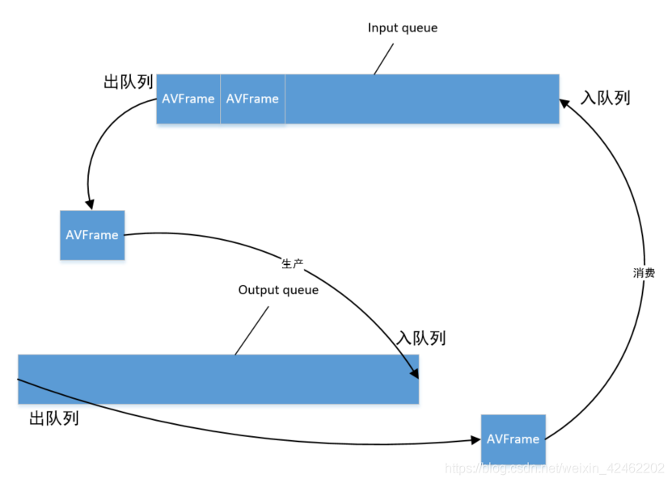
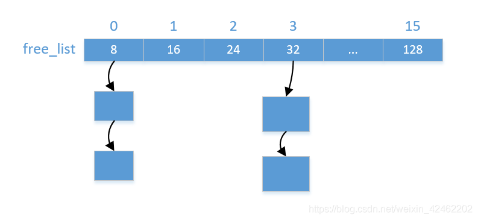
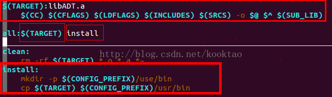

#  RTSP服务器

## 技术点

- **服务器模型**
  非阻塞IO，采用Reactor模型。使用线程池处理计算量较大的任务(音视频文件处理，音视频数据采集与编码)
- **IO多路复用**
 支持select、poll、epoll
- **定时器**
 通过Linux提供的定时器`timerfd_create`,将定时器文件描述符作为一个事件交给Reactor，定时器队列采用`multimap`管理超时时间
- **日志**
 日志实现了前后端分离，前端负责格式化字符串然后发送给后端，后端启动一个线程，服务将数据写入磁盘中，使用了双缓冲技术
- **音视频数据采集与处理**
 音视频的采集与处理使用的生产者与消费者模式，数据采集为生产者，数据处理为消费者。生产者维护着一个循环队列，会往线程池中添加任务填充缓存，消费者有一个定时器，间隔一定时间就会向生产者取数据，并将数据RTP打包再传输




- 内存管理

内存管理分为前后端，前端使用类模板，灵活处理各种类型的对象的分配请求还有释放请求。后端主要是管理内存，提供内存的分配和释放。维护16个自由链表，每个链表维护着相同大小的内存块，分别从8、16、24到128。申请内存的时候，如果小于128字节则从相应的自由链表中获取内存块，如果大于128字节，则直接调用 malloc 进行分配。如果自由链表中没有内存块，那么就从缓冲区中申请一大块内存，然后切分成小块，插入到对应的自由链表中。释放内存的时候，如果小于128字节，那么就插入到对应的自由链表中，如果大于128字节，那么直接调用 free 释放内存


  

## makefile文件分析

### CROSS_COMPILE

即**交叉编译器的前缀**（prefix)，  也就是选择将代码编译成目标cpu的指令的工具。

- 如果所用的交叉工具链的gcc程序名称为arm-linux-gcc，则CROSS_COMPILE=arm-linux-。总之，要省去名称中最后的gcc那3个字母
- 如果不指定CROSS_COMPILE参数，make时将认为prefix为空，即使用gcc来编译

为交叉编译环境编写Makefile时，注意CROSS_COMPILE变量要先export,然后才能在Makefile中使用$(CROSS_COMPILE)gcc

```sh
#buile.sh
# export设置环境变量
# 加上路径
export PATH="$PATH:/Work/QG2101-SDK/prebuilt/gcc/linux-x86/arm/toolchain-sunxi-musl/toolchain/bin"
export CROSS_COMPILE=arm-openwrt-linux-muslgnueabi-
make clean
make
```

### CC与CXX

 这是 C 与 C++ 编译器命令。默认值一般是 “gcc” 与 “g++”

### $(shell pwd)

Makefile里面**获取相对路径**必须在pwd前面加shell，然后把shell pwd当一个变量来引用，书写形式是：$(shell pwd) 


### Makefile中 :=, =, ?=和+=的含义

#### 1. “=”

使用“=”赋值，变量的值是整个makefile中最后被指定的值

```makefile
VIR_A = A
VIR_B = $(VIR_A) B
VIR_A = AA
```

 经过上面的赋值后，最后VIR_B的值是AA B，而不是A B。在make时，会把整个makefile展开，拉通决定变量的值 

#### 2. ":="

 ”:=”就表示直接赋值，赋予当前位置的值。同样举个例子说明 

```makefile
VIR_A := A
VIR_B := $(VIR_A) B
VIR_A := AA
```

#### 3. "?="

 “？=”表示如果该变量没有被赋值，则赋予等号后的值。 

```makefile
VIR ?= new_value
```

 如果VIR在之前没有被赋值，那么VIR的值就为new_value. 

```makefile
VIR := old_value
VIR ?= new_value
```

 这种情况下，VIR的值就是old_value 

#### 4. "+="

 将等号后面的值添加到前面的变量上 

### CFLAGS 与 CXX_FLAGS

CFLAGS表示C编译器的选项，CXXFLAGS表示用于C++编译器的选项。

 “-O” 表示编译优化选项，其后可跟优化等级0\1\2\3，默认是0，不优化 。“-O2” 该优化选项会牺牲部分编译速度，除了执行-O1所执行的所有优化之外，还会采用几乎所有的目标配置支持的优化算法，用以提高目标代码的运行速度。

“-g"  可以用GDB调试

"-I(大写i)"  编译程序按照-I指定的路进去搜索头文件。-I/home/include/表示将-I/home/include/目录作为第一个寻找头文件的目录

### LD_FLAGS 

告诉链接器从哪里寻找库文件 

用法：LDFLAGS=-L/usr/lib -L/path/to/your/lib。每安装一个包都几乎一定的会在安装目录里建立一个lib目录。

### LIBS 
 告诉链接器要链接哪些库文件，如LIBS = -lpthread -liconv 

### ifeq用法

比较$(变量名) 与变量值是否相同

```makefile
ifeq ($（变量名）， 变量值 ) 
........ 
else ifeq ($(..), ..)
.........
else
.........
endif
```

### $(shell find $(SRC_DIR)/base -name *.cpp)

查找相对路径下的base文件夹中的所有.cpp 文件

###  $(wildcard pattern)
参数pattern是一个文件名格式，包含有通配符。函数wildcard的结果是一列和格式匹配且真实存在的文件的名称，文件名之间用一个空格隔开。
比如当前目录下有文件1.c,2.c,1.h,2.h 则
c_src := $(wildcard *.c)
结果为：1.c 2.c 

### notdir

 notdir用于**去掉文件的绝对路径**，只保留文件名
 **$(notdir 文件列表)** 

### patsubst

格式：$(patsubst <pattern>,<replacement>,<text> )  
功能： 查找<text>中的单词（单词以“空格”、“Tab”或“回车”“换行”分隔）是否符合模式<pattern>，如果匹配的话，则以<replacement>替换。 
示例：
$(patsubst %.c,%.o, a.c b.c)
把字串“a.c b.c”符合模式[%.c]的单词替换成[%.o]，返回结果是“a.o b.o”

### all:

在Makefile中使用all:时

 


若直接 make 或 make all 的话，会执行$(TARGET) 和 install 对应的命令

在执行make时，若后面接all下对应的选项，则有：
１、make  $(TARGET)对应值， 则只执行$(TARGET)对应命令
２、make  install，则只执行install对应命令

### @ 

这个符串通常用在“规则”行中，表示不显示命令本身，而只显示它的结果 

```makefile
p = $(shell pwd)
all:
	@echo $p
```

```shell
# 如果不加@，会显示命令和结果
echo /home/wjh/desktop/RtspServer/test
/home/wjh/desktop/RtspServer/test
# 如果加了@, 只显示结果
/home/wjh/desktop/RtspServer/test
```

### $@、$^、$<

$@     --代表目标文件(target)
$^      --代表所有的依赖文件(components)
$<      --代表第一个依赖文件(components中最左边的那个)。
$?      --代表示比目标还要新的依赖文件列表。以空格分隔。
$%      --仅当目标是函数库文件中，表示规则中的目标成员名。例如，如果一个目标是"foo.a(bar.o)"，那么，"$%"就是"bar.o"，"$@"就是"foo.a"。如果目标不是函数库文件（Unix下是[.a]，Windows下是[.lib]），那么，其值为空。

### "-","$","$$"

' - ' 符号的使用
通常删除，创建文件如果碰到文件不存在或者已经创建，那么希望**忽略掉这个错误，继续执行**，就可以在命令前面添加 -，
-rm dir；
-mkdir aaadir；

' $ '符号的使用
美元符号$，主要扩展打开makefile中定义的变量

' $$ '符号的使用
$$ 符号主要扩展打开makefile中定义的shell变量

shell变量的定义和使用（shell变量就是在shell中输入)

```shell
NAME=hello #这里一定不要有空格 hello可以加上""或'' 若定义的值有空格 则要加上"" 或 ''
echo $NAME #这里使用变量时 要加上$  也可以${NAME}  但是不能$()这个表示执行里面的命令
```


## base文件夹

### #include<stdint.h>

 <stdint.h> 定义了 int16_t 、 uint32_t 、 int64_t 等整型

### union共用体

```
union 共用体名{
    成员列表
};

union data{
    int n;
    char ch;
    double f;
} a, b, c;
```

**结构体和共用体的区别在于**：

- 结构体的各个成员会占用不同的内存，互相之间没有影响；
- 而共用体的所有成员占用同一段内存，修改一个成员会影响其余所有成员。 

结构体占用的内存大于等于所有成员占用的内存的总和（成员之间可能会存在缝隙），共用体占用的内存等于最长的成员占用的内存。共用体使用了**内存覆盖技术**，**同一时刻只能保存一个成员的值，如果对新的成员赋值，就会把原来成员的值覆盖掉**。 

举例：

```c
#include <stdio.h>

union data{
    int n;
    char ch;
    short m;
};

int main(){
    union data a;
    printf("%d, %d\n", sizeof(a), sizeof(union data) );
    a.n = 0x40;
    printf("%X, %c, %hX\n", a.n, a.ch, a.m);
    a.ch = '9';
    printf("%X, %c, %hX\n", a.n, a.ch, a.m);
    a.m = 0x2059;
    printf("%X, %c, %hX\n", a.n, a.ch, a.m);
    a.n = 0x3E25AD54;
    printf("%X, %c, %hX\n", a.n, a.ch, a.m);
   
    return 0;
}
```

运行结果：

```
4, 4
40, @, 40
39, 9, 39
2059, Y, 2059
3E25AD54, T, AD54
```

 这段代码不但验证了共用体的长度，还说明共用体成员之间会相互影响，修改一个成员的值会影响其他成员。 

 要想理解上面的输出结果，弄清成员之间究竟是如何相互影响的，就得了解各个成员在内存中的分布。以上面的 data 为例，各个成员在内存中的分布如下： 

  

 成员 n、ch、m 在内存中“对齐”到一头，对 ch 赋值修改的是前一个字节，对 m 赋值修改的是前两个字节，对 n 赋值修改的是全部字节。也就是说，ch、m 会影响到 n 的一部分数据，而 n 会影响到 ch、m 的全部数据。

### 类中静态成员和非静态成员

类的静态成员(变量和方法)属于类本身，**在类加载的时候就会分配内存**，可以通过类名直接去访问；

非静态成员（变量和方法）属于类的对象，所以**只有在类的对象产生（创建类的实例）时才会分配内存**，然后通过类的对象（实例）去访问。

在一个类的静态成员中去访问其非静态成员之所以会出错是因为在类的非静态成员不存在的时候类的静态成员就已经存在了，访问一个内存中不存在的东西当然会出错；