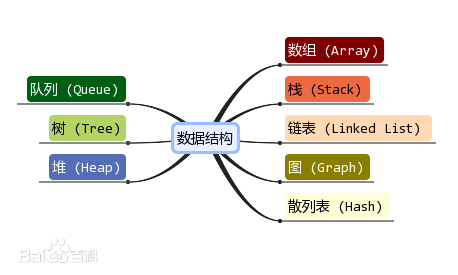

# 算法与数据结构

## 基本概念

### 什么是数据结构？

数据结构是计算机存储、组织数据的方式，数据结构是指相互之间存在一种或多种特定关系的数据元素的集合。

精心限制的数据结构可以带来更高的运行或存储效率



### 复杂度

#### 时间复杂度

常见的时间复杂度所耗费的时间从小到大：

O(1) < O(logn) < O(n) < O(nlogn) < O(n^2) < O(n^3) < O(2^n) < O(n!) < O(n^n) 

#### 空间复杂度

O(1)


## 测试例子

### 例1.写程序实现一个函数PrintN,使得传入一个正整数为N的参数后，能顺序打印从1到N的全部正整数

解：有两种方式，**循环代码量大，但节省空间；递归代码最少，但容易溢出。**

> 每次递归就相当于调用一个函数，函数每次被调用时都会将局部数据（在函数内部定义的变量、参数、数组、对象等）放入栈中。
>
> 递归1000次，就会将1000份这样的数据放入栈中。这些数据占用的内存直到整个递归结束才会被释放，在递归过程中只会累加，不会释放。
>
> 如果递归次数过多，并且局部数据也多，那么会使用大量的栈内存，很容易就导致栈溢出了。

>  栈用来存储程序的局部数据 。 例如在函数内部定义的变量、指针、参数、结构体、数组、对象、引用等，它们都要保存到栈中。 
>
> 栈为什么会溢出？
>
> 对每个程序来说，栈能使用的内存是有限的，一般是 1M~8M，这在编译时就已经决定了，程序运行期间不能再改变。如果程序使用的栈内存超出最大值，就会发生栈溢出（Stack Overflow）错误，程序就崩溃了。

```c++
// 用for循环
void PrintN(int n)
{
    for(int i=1; i<=n; i++)
    {
        cout<<i<<endl;
    }
    return;
}
// 递归调佣
void PrintN1(int N)
{
    if(N)
    {
        PrintN(N-1);
        cout<<N<<endl;
    }
    return;
}
```

### 例2：写程序计算给定多项式在给定点x处的值 

第一种解法：
$$
f(x)=a_0+a_1x+...+a_{n-1}x^{n-1}+a_nx^n
$$

```c++
double f(int n, double a[], double x) // n表示阶数，
{
    int i;
    double p = a[0];
    for(int i=1; i<=n; i++)
    {
        p += (a[i] * pow(x, i));
    }
    return p;
}
```

第二种解法：
$$
f(x) = a_0 +x(a_1 +x(...(a_{n-1}+x(a_n))...))
$$

```c++
double f(int n, double a[], double x)
{
    int i;
    double p = a[n];
    for(int i=n; i>0; i--)
    {
        p = a[i-1]+x*p;
    }
    return p;
}
```

> 第二种解法运行更快，比第一张解法高了一个数量级。
>
> 时间复杂度：(看里面的乘法次数)
>
> 第一种：1+2+3+...+n = ( n^2 + n) / 2
>
> 第二种： n

