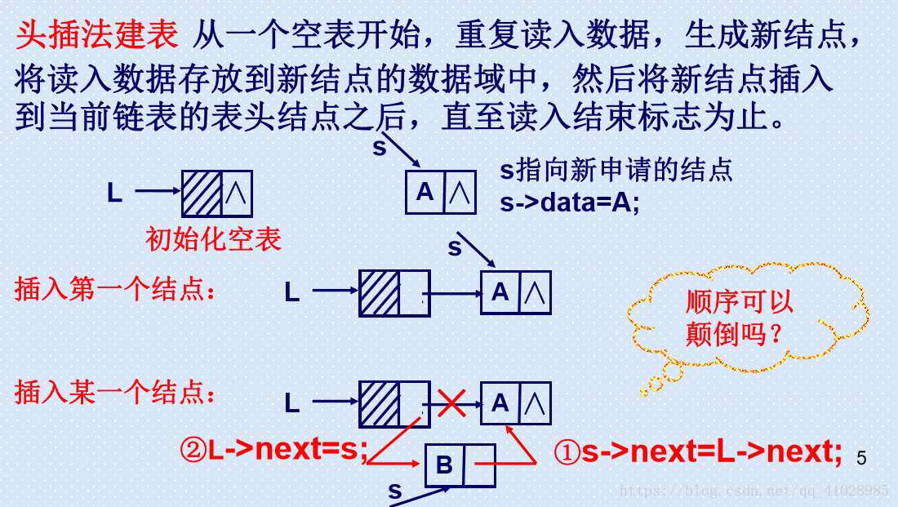
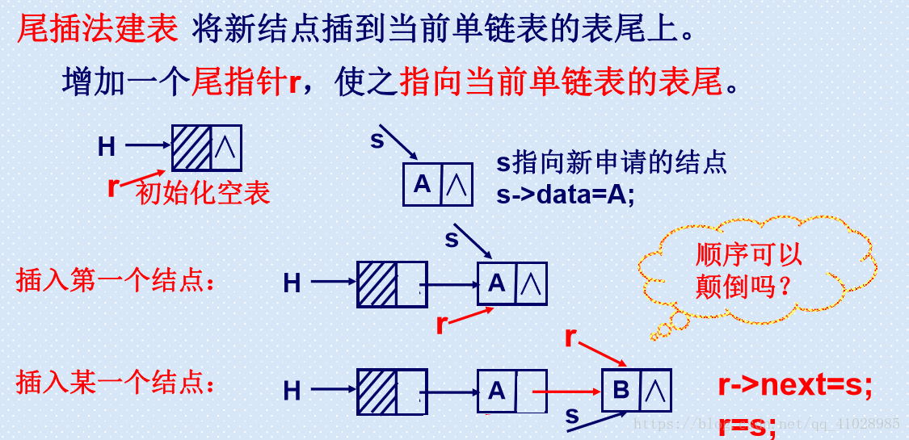

# 链表

## 定义

n个节点离散分配，彼此通过指针相连。

## 专业术语

- 首节点：存放第一个有效数据的节点
- 尾节点：存放最后一个有效数据的节点
- 头结点：位于首节点之前的一个节点，头结点并不存放有效数据，加头结点的目的是为了方便对链表的操作
- 头指针：指向头结点的指针变量
- 尾指针：指向尾节点的指针变量

## 分类

- 单链表：每个节点只有一个指针域
- 双链表：每个节点有两个指针域
- 循环链表：能通过任何一个节点找到其他所有的节点
- 非循环链表：不能通过任何一个节点找到其他所有的节点

> 循环链表是双链表的一个子集

## 优缺点

优点：空间没有限制，插入和删除元素很快

缺点：存取速度很慢

# 代码实现

## 单链表

### 头插法创建

 

### 尾插法创建

 

### 总结

1. 头插法相对简单，但插入的数据与插入的顺序相反;
2. 尾插法相对复杂，但插入的数据与插入的顺序相同；

### 代码

```cpp
#include<iostream>
#include<stdio.h>
#include<stdlib.h>    //提供malloc()和free()
#include<string.h>      //提供strcpy()
using namespace std;

// 创建结构体
typedef struct Node
{
    int data;
    Node* next;
}LNode, *LinkList;

# if 0
// 头插法
LinkList Creat_list(LinkList head)
{
    head = (LinkList)malloc(sizeof(LNode));  //为头指针开辟内存空间
    LinkList node = NULL;    // 定义新节点
    int count = 0;          // 创建节点的个数
    head->next = NULL;
    node = head->next;      //  将最后一个结点的指针域永远保持为NULL
    printf("Input the node number: ");
    scanf("%d",&count);
    for(int i=0; i<count; i++)
    {
        node = (LinkList)malloc(sizeof(LNode));    // 为新节点开辟内存空间
        node->data = i;
        node->next = head->next;    //  将头指针所指向的下一个结点的地址，赋给新创建结点的next
        head->next = node;      //  将新创建的结点的地址赋给头指针的下一个结点
    }
    return head;
}
# endif

// 尾插法
LinkList Creat_list(LinkList head)
{
    head = (LinkList)malloc(sizeof(LNode));
    LinkList node = NULL;	//  定义结点
    LinkList end = NULL;	//  定义尾结点
    head->next = NULL;  //  初始化头结点指向的下一个地址为 NULL
    end = head;			//  未创建其余结点之前，只有一个头结点
    int count = 0;
    printf("Input the node number: ");
    scanf("%d",&count);
    for(int i=0; i<count; i++)
    {
        node = (LinkList)malloc(sizeof(LNode));
        node->data = i;
        end->next = node;
        end = node;
    }
    end->next = NULL;
    return head;
}

void Export(LinkList head)
{
    while(head->next)
    {
       cout<< head->next->data <<endl;
       head = head->next;
    }
    
}

int main()
{
    LinkList head = NULL;  // 链表的头指针
    head = Creat_list(head);   // 创建链表
    Export(head);     // 输出每个节点的数据域

    return 0;
}
```

## 双链表

节点中有两个指针，prior和next，分别指向前驱和后继；

```cpp
typedef struct DLnode{
	ElemType data;
	struct DLnode *prior,*next; 
}DLnode,*DLinkList;
```


