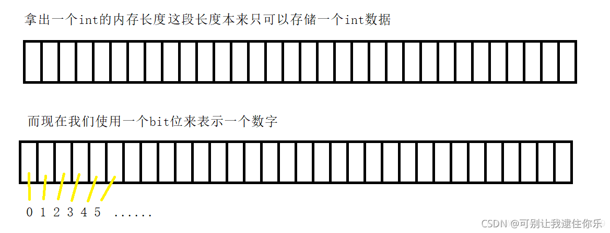
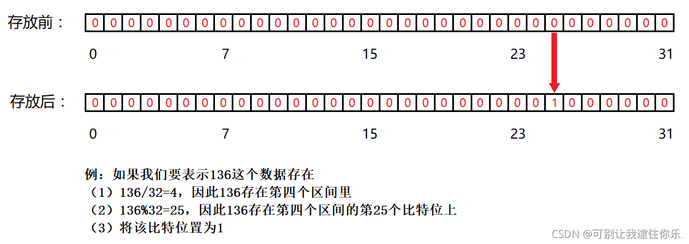
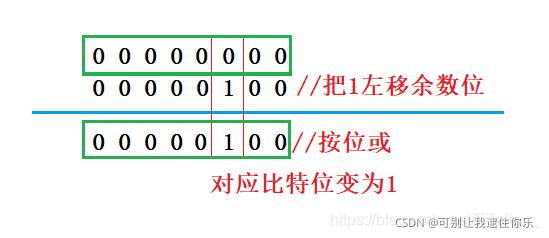
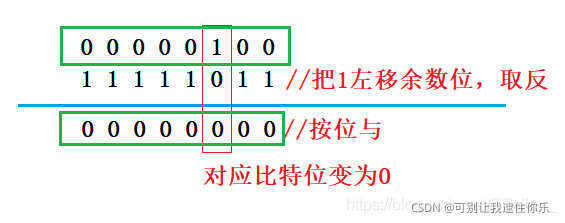
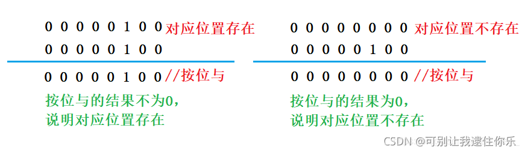
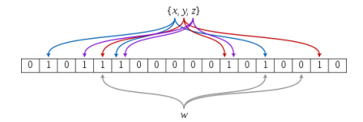
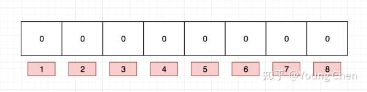
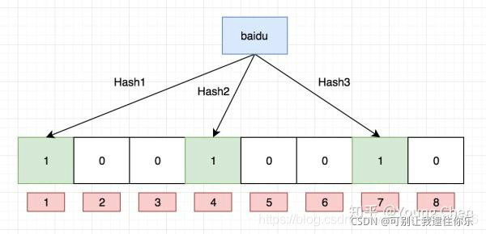
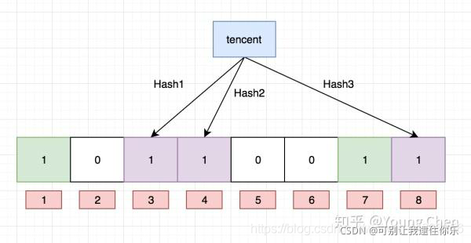

# 一、位图
## 1. 面试题
给40亿个不重复的无符号整数，没排过序，给一个无符号整数，如何快速判断一个数是否在这40亿个数中：
- 遍历，时间复杂度O(N)
- 排序O(NlogN)，利用二分查找: logN
- 位图解决：数据是否在给定的整形数据中，**结果是在或者不在**，刚好是两种状态，那么**可以使用一个二进制比特位来代表数据是否存在的信息，如果二进制比特位为1，代表存在，为0代表不存在**

一个整型int就是4个字节，10亿个int差不多已经需要4G的内存了，40亿个int就是16G。所以这里方法行不通的根本原因实际上是**内存不够**
## 2. 概念
位图，就是**用每一位来存放某种状态**，适用于海量数据，数据无重复的场景，通常是用来判断某个数据存不存在（用0和1表示状态)

用比特位来标记(映射)这些数据，int是4个字节，32位bit

4个字节本来只能存储一个int，而现在使用位图我们就可以存储(映射)32个数字,意味着16G/32 等于500m左右就可以了
## 3. 图形解释
**因为比特位只有两种状态，要不是0，要不就是1。所以位图其实就是一个直接定址法的哈希，只不过位图只能表示这个值在或者不在**，**当我们探测到25比特位的值为1时，我们就可以判断出136这个数据存在**

## 4. 接口实现
### 1. 标识一个数存在，将对应的位置为1


```cpp
 	void SetBit(size_t x)
 	{
        size_t index = x >> 5;  // 计算是数组的第几个段
        size_t num = x % 32;   // 计算是这个段的第几个位     

        // 把对应的比特位 置为1
        _bitTable[index] |= ( 1 << num);  //  将数字1左移余数位
    }
```
### 2. 取消数字在位图当中的标识，将对应bit位置为0


```cpp
    // 取消数字在位图当中的标识，将对应bit位置为0
    void RemoveBit(size_t x)
    {
        size_t index = x >> 5;
        size_t num = x % 32;

        _bitTable[index] &= ~(1<<num);   // 将对应的比特位置为0
    }
```
### 3. 判断对应的比特位是0（不存在) 还是1(存在)


```cpp
    // 判断对应位是0还是1
    bool TestBit(size_t x)
    {
        size_t index = x >> 5;    
        size_t num = x % 32;

        return _bitTable[index]&(1<<num);  // 与完之后的结果如果非0就说明存在，为0就说明不存在
    }
```


## 5. 完整代码

```cpp
#include<iostream>
#include<vector>
using namespace std;

// 0表示不存在，1表示存在
// 0和1  &0后都会变化为0， |1都会变化为1
class BitMap
{
public:
    BitMap(size_t range)
    {
        // 右移5位相当于除以32，加1是因为小于32的数字除以32等于0
        // resize指定大小
        _bitTable.resize((range >> 5) + 1 );
    }

    // 标识一个数字在位图中的位置,将对应bit位置为1
    void SetBit(size_t x)
    {
        size_t index = x >> 5;  // 计算是数组的第几个段
        size_t num = x % 32;   // 计算是这个段的第几个位     

        // 把对应的比特位 置为1
        _bitTable[index] |= ( 1 << num);  //  将数字1左移余数位
    }
    // 取消数字在位图当中的标识，将对应bit位置为0
    void RemoveBit(size_t x)
    {
        size_t index = x >> 5;
        size_t num = x % 32;

        _bitTable[index] &= ~(1<<num);   // 将对应的比特位置为0
    }
    // 判断对应位是0还是1
    bool TestBit(size_t x)
    {
        size_t index = x >> 5;    
        size_t num = x % 32;

        return _bitTable[index]&(1<<num);  // 与完之后的结果如果非0就说明存在，为0就说明不存在
    }

private:
    vector<int> _bitTable;
    size_t _bitnum;
};

int main()
{   
    BitMap bs(1000);
    bs.SetBit(6666);
	bs.SetBit(666);
	bs.SetBit(66);
	bs.SetBit(6);

	cout << bs.TestBit(6) << endl;//存在
	cout << bs.TestBit(66) << endl;//存在
	cout << bs.TestBit(666) << endl;//存在
	cout << bs.TestBit(6666) << endl;//存在
	cout << bs.TestBit(16) << endl;//不存在
    return 0;
}
```
## 6. 拓展
将问题修改为寻找40亿个数据中出现过两次的数据，此时我们就需要使用两位来标记同一个数据

```cpp
// 寻找出现过两次的数据,用两位来标记同一个数据
class BitMap
{
public:
    BitMap(size_t range)
    {
        _bitTable.resize(range >> 4 + 1);   // 16位
    }
    void SetBit(size_t x)
    {
        size_t index = x >> 4;  // 计算是数组的第几个段
        size_t num = x % 16;    // 计算是这个段的第几个位
        num *= 2;   // int型是4个字节，有32位

    // first,second表示第一次和第二次是否存在
        bool first = _bitTable[index] & (1 << num);
        bool second = _bitTable[index] & (1 << (num+1));

       	if (!(first && second)) 
		{ //if current bit is already set 1, set the (num + 1) is 1 
			if (_bitTable[index] >> num) _bitTable[index] |= (1 << (num + 1)); 
			else _bitTable[index] |= (1 << num); 
		}
    }
    void RemoveBit(size_t x)
    {
        size_t index = x >> 4;
        size_t num = x % 16;
        num *= 2;
        _bitTable[index] &= ~(1 << num);
        _bitTable[index] &= ~(1 << (num + 1));
    }
    bool TestBit(size_t x)
    {
        size_t index = x >> 4;
        size_t num = x % 16;
        num *= 2;
        
		// return (_bitTable[index] >> num) & 0x02;  // 0x02 ==  0010
        return (_bitTable[index] & (1 << num)) && (_bitTable[index] & (1 << (num+1)));
    }
private:
    vector<int> _bitTable;
};
```
## 7. 位图的应用
1. 快速查找某个数据是否在一个集合中
2. 排序
3. 求两个集合的交集、并集等
4. 操作系统中磁盘块标记

# 二、布隆过滤器
## 1. 提出
我们在使用新闻客户端看新闻时，它会给我们不停地推荐新的内容，它每次推荐时要去重，去掉那些已经看过的内容。问题来了，新闻客户端推荐系统如何实现推送去重的？ 用服务器记录了用户看过的所有历史记录，当推荐系统推荐新闻时会从每个用户的历史记录里进行筛选，过滤掉那些已经存在的记录。 如何快速查找呢？
1. 用哈希表存储用户记录，缺点：浪费空间
2. 用位图存储用户记录，缺点：不能处理哈希冲突
3. 将哈希与位图结合，即布隆过滤器
## 2. 概念
布隆过滤器是一种紧凑型的、比较巧妙的概率型数据结构，**特点是高效地插入和查询，可以用来告诉你“某样东西一定不存在或者可能存在”**，它是**用多个哈希函数，将一个数据映射到位图结构中，此种结构不仅可以提升查询效率，也可以节省大量的内存空间**

## 3. 插入

 向布隆过滤器中插入：“baidu”
 
 
## 4. 查找
布隆过滤器的思想是**将一个元素用多个哈希函数映射到一个位图中，因此被映射到的位置的比特位一定为1。**
 所以可以按照以下方式进行查找：**分别计算每个哈希值对应的比特位置存储的是否为零，只要有一个为零，代表该元素一定不在哈希表中，否则可能在哈希表中。**
> 布隆过滤器如果说某个元素不存在时，该元素一定不存在。如果该元素存在时，该元素可能存在，因为有些哈希函数存在一定的误判
## 5. 删除
不能直接支持删除工作，因为在删除一个元素时，可能会影响其他元素
支持删除的方法：**将布隆过滤器中的每个比特位扩展成一个小的计数器，插入元素时给k个计数器(k个哈希函数计算出的哈希地址)加一，删除元素时，给k个计数器减一，通过多占用几倍存储空间的代价来增加删除操作**
缺点：
- 无法确认元素是否真正在布隆过滤器中
- 存在计数回绕

## 6. 布隆过滤器优点
1. **时间复杂度低**，增加和查询元素的时间复杂度为O(k), (k为哈希函数的个数，一般比较小),与数据量大小无关
2. 哈希函数相互之间没有关系，**方便硬件并行运算**
3. 布隆过滤器**不需要存储元素本身**，在某些对保密要求比较严格的场合有很大优势
4. 在能够承受一定的误判时，布隆过滤器比其他数据结构**有很大的空间优势**
5. 数据量很大时，**布隆过滤器可以表示全集**，其他数据结构不能
6. 使用同一组散列函数的布隆过滤器**可以进行交、并、差运算**

## 7. 缺点
1. **有误判率**，即不能准确判断元素是否在集合中（补救方法：再建立一个白名单，存储可能会误判的数据)
2. **不能获取元素本身**
3. 一般情况下**不能从布隆过滤器中删除元素**
4. **如果采用计数方式删除，可能会存在计数回绕问题**


 ## 8. 代码实现


```cpp
#include<iostream>
#include<vector>
using namespace std;

//布隆过滤器实现
class BitMap
{
public:
    BitMap(size_t range)
    {
        _bitTable.resize((range >> 5) + 1);
    }

    //标识一个数字在位图中的位置
    void SetBit(size_t x)
    {
        size_t index = x >> 5;
        size_t num = x % 32;

        _bitTable[index] |= (1 << num);
    }

    //取消数字在位图当中的标识.
    void RemoveBit(size_t x)
    {
        size_t index = x >> 5;
        size_t num = x % 32;

        _bitTable[index] &= ~(1 << num);
    }


    bool TestBit(size_t x)
    {
        size_t index = x >> 5;
        size_t num = x % 32;

        return _bitTable[index] & (1 << num);
    }

private:
    vector<int> _bitTable;
};

template<typename T>
struct __HashFunc1
{
    size_t operator()(const T& s)
    {
        size_t hash = 0;
        for (int i = 0; i < s.size(); i++)
        {
            hash = hash * 131 + s[i];
        }
        return hash;
    }
};

template<typename T>
struct __HashFunc2
{
    size_t operator()(const T& s)
    {
        size_t hash = 0;
        for (int i = 0; i < s.size(); i++)
        {
            hash = hash * 65599 + s[i];
        }
        return hash;
    }
};

template<typename T>
struct __HashFunc3
{
    size_t operator()(const T& s)
    {
        size_t hash = 0;
        for (int i = 0; i < s.size(); i++)
        {
            hash = hash * 1313 + s[i];
        }
        return hash;
    }
};

// 布隆过滤器
template<class K = string,
    class HashFunc1 = __HashFunc1<K>,
    class HashFunc2 = __HashFunc2<K>,
    class HashFunc3 = __HashFunc3<K>>
class BloomFilter
{
public:
    BloomFilter(size_t num)
        :_bm(num * 5)
        , _size(num * 5)
    {}

    void Set(const K& key)
    {
        size_t index1 = HashFunc1()(key) % _size;
        _bm.SetBit(index1);
        size_t index2 = HashFunc2()(key) % _size;
        _bm.SetBit(index2);
        size_t index3 = HashFunc3()(key) % _size;
        _bm.SetBit(index3);
    }

    bool Test(const K& key)
    {
        size_t index1 = HashFunc1()(key) % _size;
        if (_bm.TestBit(index1) == false)
        {
            return false;
        }

        size_t index2 = HashFunc2()(key) % _size;
        if (_bm.TestBit(index2) == false)
        {
            return false;
        }

        size_t index3 = HashFunc3()(key) % _size;
        if (_bm.TestBit(index3) == false)
        {
            return false;
        }
        //所有位置都为真. 但是它是不准确的.
        return true;
    }
private:
    BitMap _bm;
    size_t _size;
};
int main()
{

    vector<string> url{ "http://www.csdn.net/",
        "http://www.baidu.com/",
        "http://www.google.com.hk",
        "http://www.cnblogs.com/",
        "http://www.zhihu.com/",
        "https://www.shiyanlou.com/",
        "http://www.google.com.hk",
        "https://www.shiyanlou.com/",
        "http://www.csdn.net/" };
    
    BloomFilter<string> fliter(5);
    
    for (int i = 0; i < url.size(); i++)
    {
        fliter.Set(url[i]);
    }

    bool myurlFlag = fliter.Test("http://www.csdn.net/");
    cout << myurlFlag << endl;
    return 0;
} 
```

# 参考文章
- [unorder(哈希-海量数据处理)](https://cloud.tencent.com/developer/article/1688443)
- [【数据结构】----- 位图原理及实现](https://blog.csdn.net/lucky52529/article/details/90172264)
- [数据结构：位图](https://blog.csdn.net/ETalien_/article/details/90752420)
- [位图和布隆过滤器](https://blog.csdn.net/qq_37469992/article/details/115023400)