# 哈希表(散列表)
## 一、引子
编译处理时，涉及变量及属性(如：变量类型)的管理：
- 插入：新变量定义
- 查找：变量的引用

变量管理时，需要**动态查找**，但是利用查找树(搜索树)进行管理，比起整数的比较，两个变量名(字符串) 比较的效率不高，**如果可以将字符串通过某个函数转化为整数来比较，效率就会提高**

已知的几种查找方法：
| 查找方法           | 时间复杂度                |
| ------------------ | ------------------------- |
| 顺序查找           | O(N）                     |
| 二分查找(静态查找) | O(log2N）                 |
| 二叉搜索树         | O(h)  h为二叉查找树的高度 |
| 平衡二叉树         | O(log2 N)                 |
散列查找的时间复杂度**几乎是常量：O（1）**，即查找时间与问题规模无关
如果没有溢出(冲突)，T(查询) = T(插入) = T(删除) = O(1）

## 二、定义
1. 散列表(Hash table,也叫哈希表)，**是根据 键值（key）来直接进行访问的数据结构。** 
通过把关键码值映射到表中一个位置来访问记录，以加快查找的速度。这个映射函数叫做**散列函数**，存放记录的数组叫做**散列表**

2. **哈希表就是将key值通过一个固定的算法函数(即散列函数)转化为一个整型数字，然后就将该数字对数组长度进行取余，取余结果就当做数组的下标，将value存储在以该数字为下标的数组空间里**
**查找数据时也是利用哈希函数**

3. 散列(Hashing)的基本思想是：
（1）以关键字key为自变量，通过一个确定的函数h（散列函数)，计算出对应的函数值h(key)，作为数据对象的存储地址。
（2）可能不同的关键字会映射到同一个散列地址上，即h(keyi) = h(keyj)(但keyi != keyj )，称为 “冲突” 
4. ==装填因子(Loading Factor)==: 设散列表空间大小为m，填入表中元素个数是n，则称`α = n/m `为散列表的装填因子 

散列查找法的两项基本工作：
- **计算位置：构造散列函数**确定关键词存储位置
- **解决冲突：应用某种策略**解决多个关键词位置相同的问题

## 三、散列函数（哈希函数)  的构造方法
### 考虑因素
一个“好”的散列函数一般应考虑下列两个因素：

1. **计算简单**，以便提高转换速度；

2. 关键词对应的**地址空间要分步均匀**，以尽量减少冲突

### 1. 直接定址法
> 直接确定函数

取关键词的某个线性函数值为散列地址，即
`h(key) = a x key + b`  (a,b 为常数)
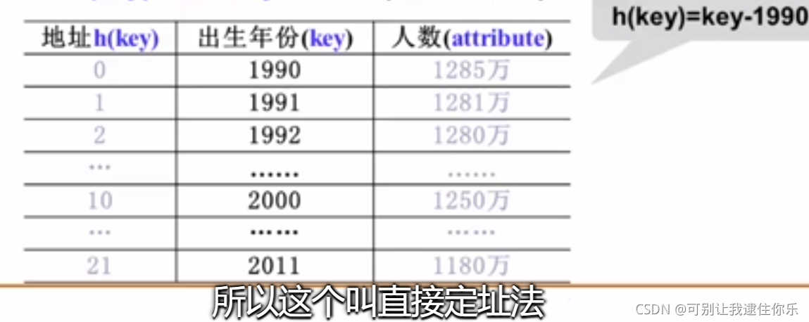
### 2. 除留余数法
散列函数为：`h(key) = key mod p`
例：h(key) = key % 17
素数就是不能被1以上整除的数
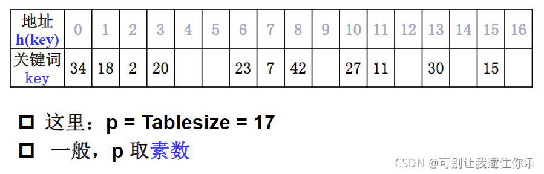
### 3. 数字分析法
分析出对象的关键字在每一位上的表现，我们把那些能够随机变化的这些位取出来，组成我们的地址，达到**映射均匀**的这样一个目的。
例子如下：
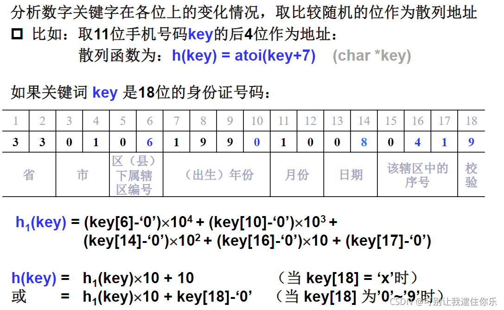
### 4. 折叠法
把关键词分割成位数相同的几个部分，然后叠加
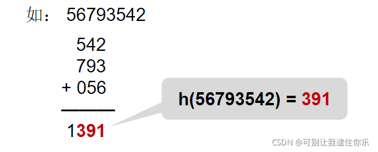
### 5. 平方取中法
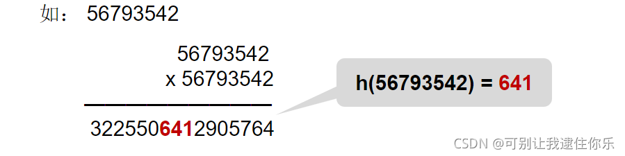
### 6. 字符关键词的散列函数构造
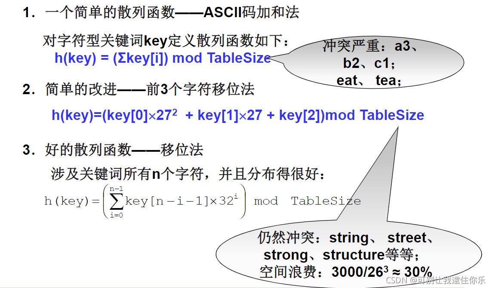
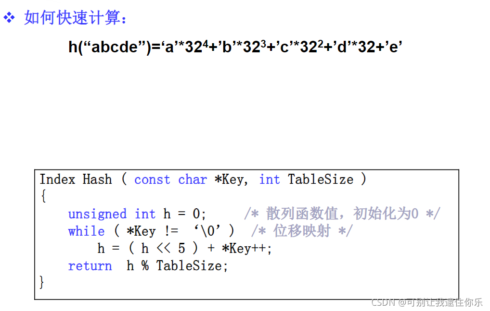
## 四、冲突处理方法
### 思路
冲突就是不同的key通过哈希函数得到了相同的值，但要存储的空间已经被占据了，需要解决这个问题。

常用处理冲突的思路：
- 换个位置：**开放地址法**
- 同一位置的冲突对象组织在一起：**链地址法**
### 开放定址法
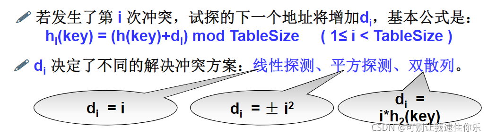
#### 1. 线性探测法
线性探测法：以增量序列1,2，......,（TableSize-1)循环试探下一个存储地址。
#### 2. 平方探测法
平方探测法：以增量序列1^2,  (-1)^2, 2^2, (-2)^2, ........., q^2, (-q)^2 且q<=[TableSize/2] 循环试探下一个存储地址
 > 有定理显示：如果散列表长度TableSize是某个**4k+3**（k是正整数)形式的**素数**时，**平方探测法**就可以**探查到整个散列表空间**

#### 3. 双散列探测法
 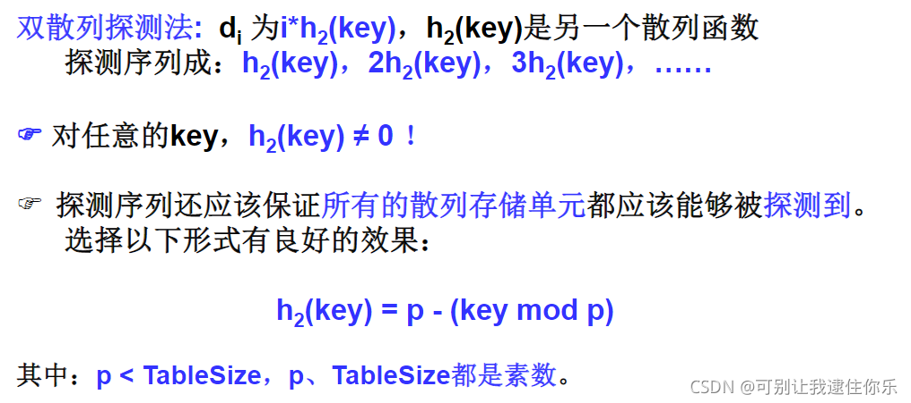
#### 4. 再散列
- 当散列表元素太多(即装填因子α太大)时，查找效率会下降；
》实用最大装填因子一般取0.5 <= α <= 0.85
- 当装填因子过大时，解决的方法是加倍扩大散列表，这个过程叫 “再散列"
#### 5. 删除操作
在开放地址散列表中，==删除操作==要很小心。通常只能"==懒惰删除==",即需要增加一个删除标记(Deleted)，**而不是真正删除它**。**以便查找时不会”断链”**。其空间可以在下次插入时==重用==。
### 分离链接法
分离链接法：将相应位置上冲突的所有关键词存储**在同一个单链表中**

## 五、散列表查找性能分析
### 1. 成功与不成功平均查找长度
- **成功平均查找长度(ASLs)**
- **不成功平均查找长度(ASLu)**

例子如下：
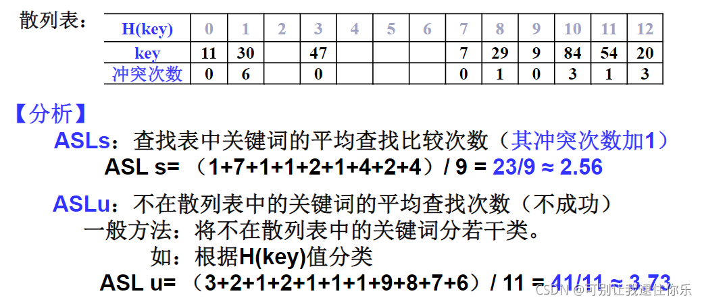
成功平均查找长度就是**每个关键词的冲突次数+1，然后全部相加取平均**。
不成功平均查找长度就是 **从开始位置查找，直到地址是空的位置**，这个过程的查找次数就是不成功查找长度

### 2. 影响因素
影响产生冲突多少有以下三个因素：
（1）散列函数是否均匀
（2） 处理冲突的方法
（3）散列表的装填因子α

### 3. 线性探测法的查找性能
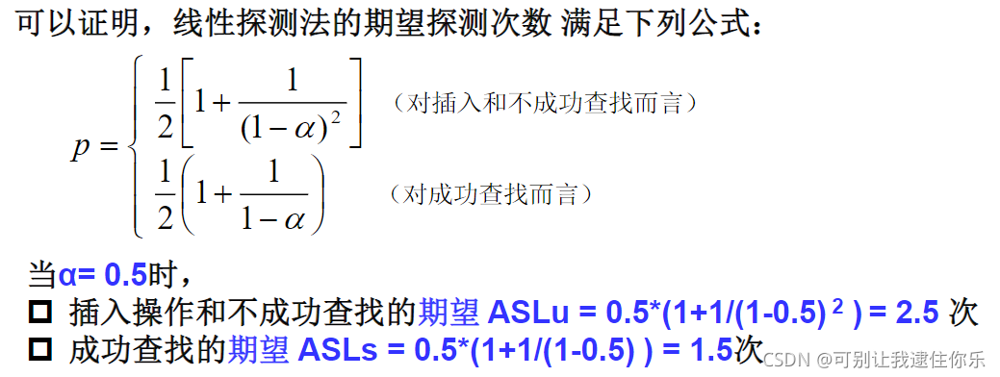
### 4. 平方探测法和双散列探测法的查找性能
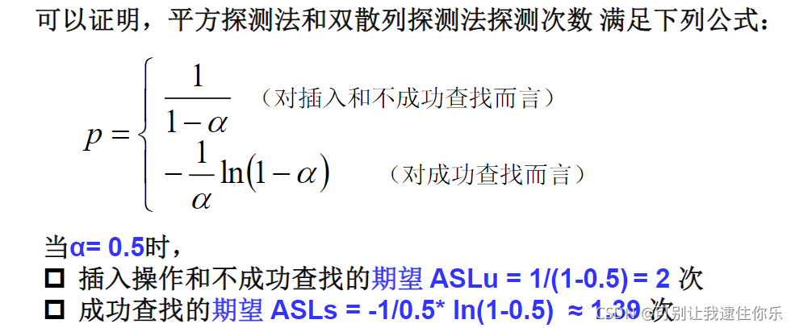
### 5. 期望探测次数与装填因子α的关系
合理的最大装入因子α应该不超过0.85
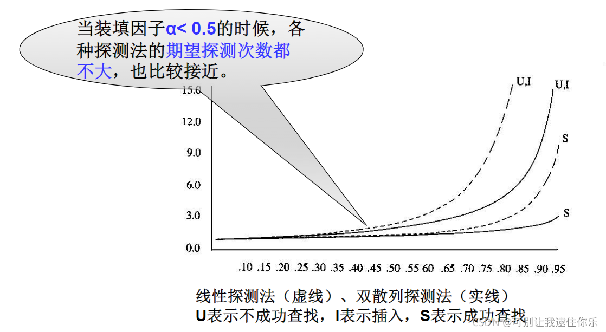
### 6. 分离链接法的查找性能
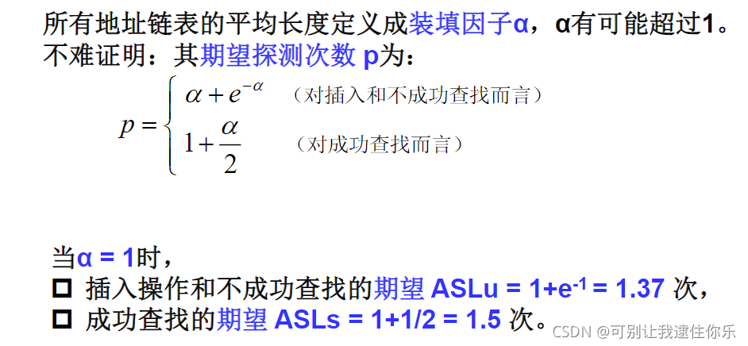
### 7. 分析
1. 开放地址法：
散列表是一个数组，存储效率高，随机查找
散列表有"聚集"现象
2. 分离链接法：
散列表是顺序存储和链式存储的结合，链表部分的存储效率和查找效率都比较低
关键字删除不需要"懒惰删除“法，从而没有存储"垃圾"
太小的α可能导致空间浪费，大的α又将付出更多的时间代价。不均匀的链表长度导致时间效率的严重下降                                                                                                                                                                                                                                                                                                                                                                                                                                                                                                                                                                                                                                                                                                                                                                                                                                                                                                                                                                                                                                                                                                                                                                                                                                                                                                                                                                                                                                                                                                                                                                                                                                                                                                                                                                                                                                                                                                                                                                                                                                                                                                                                                                                                                                                                                                                                                                                                                                                                                                                                                                                                                                                                                                                                                                                                                                                                                                                                                                                                                                                                                                                                                                                                                                                                                                                                                                                                                                                                                                                                                                                                                                                                                                                                                                                                                                                                                                                                                                                                                                                                                                                                                                                                                                                                                                                                                                                                                                                                                                                                                                                                                                                                                                                                                                                                                                                                                                                                                                                                                                                                                                                                                                                                                                                                                                                                                                                                                                                                                                                                                                                                                                                                                                                                                                                                                                                                                                                                                                                                                                                                                                                                                                                                                                                                                                                                                                                                                                                                                                                                                                                                                                                                                                                                                                                                                                                                                                                                                                                                                                                                                                                                                                                                                                                                                                                                                                                                                                                                                                                                                                                                                                                                                                                                                                                                                                                                                                                                                                                                                                                                                                                                                                                                                                                                                                                                                                                                                                                                                                                                                                                                                                                                                                                                                                                                                                                                                                                                                                                                                                                                                                                                                                                                                                                                                                                                                                                                                                                                                                                                                                                                                                                                                                                                                                                                                                                                                                                                                                                                                                                                                                                                                                                                                                                                                                                                                                                                                                                                                                                                                                                                                                                                                                                                                                                                                                                                                                                                                                                                                                                                                                                                                                                                                                                                                                                                                                                                                                                                                                                                                                                                                                                                                                                                                                                                                                                                                                                                                                                                                                                                                                                                                                                                                                                                                                                                                                                                                                                                                                                                                                                                                                                                                                                                                                                                                                                                                                                                                                                                                                                                                                                                                                                                                                                                                                                                                                                                                                                                                                                                                                                                                                                                                                                                                                                                                                                                                                                                                                                                                                                                                                                                                                                                                                                                                                                                                                                                                                                                                                                                                                                                                                                                                                                                                                                                                                                                                                                                                                                                                                                                                                                                                                                                                                                                                                                                                                                                                                                                                                                                                                                                                                                                                                                                                                                                                                                                                                                                                                                                                                                                                                                                                                                                                                                                                                                                                                                                                                                                                                                                                                                                                                                                                                                                                                                                                                                                                                                                                                                                                                                                                                                                                                                                                                                                                                                                                                                                                                                                                                                                                                                                                                                                                                                                                                                                                                                                                                                                                                                                                                                                                                                                                                                                                                                                                                                                                                                                                                                                                                                                                                                                                                                                                                                                                                                                                                                                                                                                                                                                                                                                                                                                                                                                                                                                                                                                

## 参考文章
- [哈希表(散列表)原理详解](https://cloud.tencent.com/developer/article/1432801)
- [数据结构_浙江大学_中国大学MOOC（慕课)](https://www.icourse163.org/learn/ZJU-93001?tid=1464647442#/learn/content?type=detail&id=1243232266&cid=1266529548&replay=true)                                                                                                                                                                                                                                                                                                                                                                                                                                                                                                                                                                                                                                                                                                                                                                                                                                                                                            