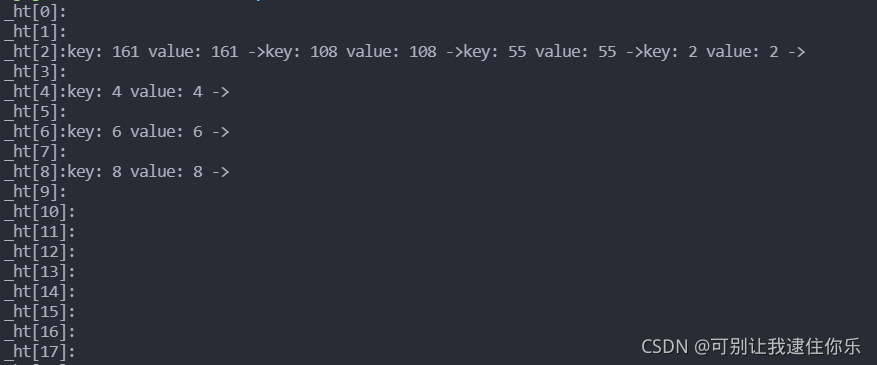

# unordered_map关联式容器
## 1. 文档介绍
- unorder_map是**存储<key, value>键值对的关联式容器**，其允许通过key快速的索引到与其对应的value
- **键和映射值的类型可能不同**，键值通常用于唯一的标识元素，而映射值是一个对象
- **在内部unorder_map没有对<key, value>按照任何特定的顺序排序**,为了在常数范围内找到key所对应的value，unorder_map将相同哈希值的键值对放在相同的桶中
- **unorder_map容器通过key访问单个元素要比map快**，但它通常在遍历元素子集的范围迭代方面效率较低
- **unorder_map实现了直接访问操作符(operator[])，它允许使用key作为参数直接访问value**，map也可以
- 它的迭代器至少是前向迭代器
- hash的性能非常出色:拥有高达O(1)的插入和查找复杂度.这比map(平衡二叉树)的O(logn)要快

## 2. 接口说明
### 2.1 构造

```cpp
#include<unordered_map>
unordered_map<T1, T2> mp;
```
### 2.2 容量
| 函数声明             | 功能介绍                 |
| -------------------- | ------------------------ |
| bool empty() const   | 检测容器是否为空         |
| size_t  size() const | 获取容器中的有效元素个数 |
### 2.3 迭代器
| 函数声明 | 功能介绍                                |
| -------- | --------------------------------------- |
| begin    | 返回第一个元素的迭代器                  |
| end      | 返回最后一个元素下一个位置的迭代器      |
| cbegin   | 返回第一个元素的const迭代器             |
| cend     | 返回最后一个元素下一个位置的const迭代器 |

### 2.4 元素访问
| 函数声明   | 功能介绍                             |
| ---------- | ------------------------------------ |
| operator[] | 返回与key对应的value，没有一个默认值 |

### 2.5 查询
| 函数声明                    | 功能介绍                                            |
| --------------------------- | --------------------------------------------------- |
| iterator find(const K& key) | 返回key在哈希桶中的位置                             |
| size_t count(const K& key)  | 返回哈希桶中关键码为key的键值对的个数，查看是否存在 |
> unordered_map中key是不能重复的，因此count函数的返回值最大为1
### 2.6 修改操作
| 函数声明                | 功能介绍               |
| ----------------------- | ---------------------- |
| insert                  | 向容器中插入键值对     |
| erase                   | 删除容器中的键值对     |
| void clear()            | 清空容器中有效元素个数 |
| void swap(unorder_map&) | 交换两个容器中的元素   |
### 2.7 桶操作
| 函数声明                           | 功能介绍                    |
| ---------------------------------- | --------------------------- |
| size_t bucket_count() const        | 返回哈希桶中桶的总个数      |
| size_t bucket_size(size_t n) const | 返回n号桶中有效元素的总个数 |
| size_t bucket(const K& key)        | 返回元素key所在的桶号       |


## 3. 底层结构
unorder系列的关联式容器之所以效率比较高，是因为其底层使用了**哈希结构**
map/multimap属于关联式容器，底层结构是用二叉树实现
## 4. 哈希表代码实现
### 1. 开放定址法中的删除

```cpp
// 懒惰删除，增加一个删除标记
// 哈希表每个空间给个标记
// EMPTY此位置为空，EXIST此位置已经有元素，DELETE元素已经删除
enum Status{EMPTY, EXIST, DELETE};
```
### 2. 线性探测的实现

```cpp
#include<iostream>
#include<vector>
using namespace std;

// hash设计时要尽可能少冲突，非素数有一对公约数，冲突概率暴涨，因此capacity要是素数(质数)
// 素数列表，num_prime是个数
static const int num_prime = 32;
static const unsigned long prime_list[num_prime] =
{
    3, 7, 13, 19,
  53,         97,           193,         389,       769,
  1543,       3079,         6151,        12289,     24593,
  49157,      98317,        196613,      393241,    786433,
  1572869,    3145739,      6291469,     12582917,  25165843,
  50331653,   100663319,    201326611,   402653189, 805306457,
  1610612741, 3221225473ul, 4294967291ul
};

// 根据输入的数得到比它大的素数
unsigned long GetNextPrime(size_t num)
{
    for(int i=0; i<num_prime; i++)
    {
        if(prime_list[i] > num)
        {
            return prime_list[i];     // 返回第一个比num大的数
        }
    }
    // 如果没有比num大的素数, 返回列表中最后一个数
    return prime_list[num_prime - 1];
};

// 闭散列处理哈希冲突，不能随便物理删除哈希表中已有的元素，若直接删除元素会影响其他元素的搜索
// 所以每个空间要给个标记
enum Status
{
    EMPTY,  // 空
    EXIST,  // 有元素
    DELETE  // 已经删除
};

template<class key, class value>
class HashTable{
    struct Elem
    {
        pair<key, value> _val;         // 键值对
        Status _status;
    };
public:
    // 形参设置默认值，函数调用时，不传递任何实参就使用默认参数，有实参则进行实参传递
    // 初始化列表中，(number)是为容器开辟了number大小的空间
    HashTable(size_t capacity = 3) : _ht(capacity), _size(0)    
    {
        for(size_t i= 0; i<capacity; ++i)
            _ht[i]._status = EMPTY;
    }

public:
// 插入方法
// 闭散列，线性探测法    
    bool Insert(const pair<key, value>& val)
    {
        // 检测哈希表底层空间是否充足
        CheckCapacity();
        size_t hashAddr = HashFunc(val.first);
        // 找到空的位置才可以插入
        while(_ht[hashAddr]._status != EMPTY)   
        {
            // 重复键值的元素是无法插入的
            if(_ht[hashAddr]._status == EXIST && _ht[hashAddr]._val.first == val.first)
                return false;     

            // 删除标记的地方可以重用
            if(_ht[hashAddr]._status == DELETE)
                break;
            hashAddr++;
            if(hashAddr == _ht.capacity())
                hashAddr = 0;
            /* 转一圈也没有找到，注意：动态哈希表，该种情况可以不用考虑，哈希表中元素个数到达
            *一定的数量，哈希冲突概率会增大，需要扩容来降低哈希冲突，因此哈希表中元素是不会存满的
            */
        }
        // 插入元素
        _ht[hashAddr]._status = EXIST;
        _ht[hashAddr]._val = val;
        _size++;
        return true;
    }

// 获取size
    size_t Size() const
    { 
        return _size;
    }
// 判断是否为空
    bool Empty() const
    {
         return _size == 0;
    }
// 查找
    int Find(const key& t)
    {
        size_t hashAddr = HashFunc(t);
        while(_ht[hashAddr]._status != EMPTY)
        {
            if(_ht[hashAddr]._val.first == t && _ht[hashAddr]._val.second != DELETE)
                return hashAddr;
            hashAddr++;
        }
        return -1;
    }
// 删除
    bool Erase(const key& k)
    {
        int index = Find(k);
        if(index == -1)
            return false;
        _ht[index]._status = DELETE;
        _size--;
        return true;
    }
// 交换
    void Swap(HashTable<key, value>& ht)
    {
        swap(_ht, ht._ht);
        swap(_size, ht._size);
    }
private:
// 检查容量，不够就扩容
    void CheckCapacity()
    {
        if(_size * 10 / _ht.capacity()  >= 7)
        {
            HashTable<key, value> newHt(GetNextPrime(_ht.capacity()));
            for(size_t i=0; i<_ht.capacity(); i++)
            {
                if(_ht[i]._status == EXIST)
                    newHt.Insert(_ht[i]._val);
            }
            // 因为CheckCapacity()函数中的newHt对象是局部的，作用域只在这个函数中
            // 局部变量存在栈区，编译器 编译结束后会释放掉
            // 所以要将原来的对象和newHt对象进行交换
            Swap(newHt);
        }
    }
// 哈希函数
    size_t  HashFunc(const key& k)
    {
        return k % _ht.capacity();
    }
private:
    vector<Elem> _ht;
    size_t _size;
};

int main()
{
    cout << "111" << endl;
    HashTable<int, int> ht;
    int ar[] = { 4, 6, 8, 3, 6, 13, 1, 2, 9};
    int n = sizeof(ar) / sizeof(int);
    cout << n << endl;      // 9
    for(int i=0; i<n; i++)
    {
        cout << "222" << endl;
        ht.Insert(pair<int, int>(ar[i], ar[i]));
        cout << "333" << endl;
    }
    // 因为不能有重复的元素,所以下面的结果是 8
    cout << ht.Size() << endl;  //当前元素个数
    ht.Erase(8);
    cout << ht.Size() << endl;  //删除之后元素个数
    
    cout <<"key = 6 : index = "<< ht.Find(6) << endl;
    cout << "key = 8 : index = " << ht.Find(8) << endl;
    cout <<"key = 13 : index = " << ht.Find(13) << endl;

    return 0;
}

/*
unordered系列关联式容器的底层实现是hashtable，
比如在undered_set中value就是key，而在unordered_map中value代表键值对的值
哈希函数使用除留余数法计算存放地址，那么key就必须是整形或者转换为整形才能取模==
*/
```

### 3. 链地址法


```cpp
#include<iostream>
#include<algorithm>
#include<vector>
#include<string>
using namespace std;

// 素数
static const int num_prime = 28;
static const unsigned long prime_list[num_prime] =
{
     53,         97,           193,         389,       769,
    1543,       3079,         6151,        12289,     24593,
    49157,      98317,        196613,      393241,    786433,
    1572869,    3145739,      6291469,     12582917,  25165843,
    50331653,   100663319,    201326611,   402653189, 805306457,
    1610612741, 3221225473ul, 4294967291ul
};

// 扩容的长度
inline unsigned long next_prime(unsigned long n)
{
    const unsigned long* first = prime_list;
    const unsigned long* last = prime_list + num_prime;
    // lower_bound()函数的功能：
    // 在[first, last)区间上返回一个存放不小于n的数的内存地址
    const unsigned long* pos = lower_bound(first, last, n);
    // 没找到返回最大值
    return pos == last ? *(last-1) : *pos;
}

// 节点结构
template<class key_type, class value_type>
struct HashBucketNode
{
    HashBucketNode<key_type, value_type>* _pNext;   // 指向下个节点的指针
    pair<key_type, value_type> _val;        // 键值对
};


template<class key_type, class value_type>
class HashBucket
{
    typedef struct HashBucketNode<key_type, value_type> Node;
public:
// 初始化
    HashBucket(size_t capacity = 3) : _size(0)
    {
      const size_t n_buckets = next_prime(capacity);
      // 预留空间
      _ht.reserve(n_buckets);
      // 插入节点结构的空指针
      // insert(const_iterator pos, int count, ele);  // 迭代器指向位置pos插入count个元素ele
      _ht.insert(_ht.end(), n_buckets, (Node*)0);
    }

// 开辟新节点
    Node* new_node(const pair<key_type, value_type>& val)
    {
        Node* n = (Node*)malloc(sizeof(Node));
        n->_pNext = (Node*)0;
        n->_val = val;
        return n;
    }

// 哈希桶中的元素不能重复
    Node* Insert(const pair<key_type, value_type>& val)
    {
        // 确认是否需要扩容
        CheckCapacity(_size+1);
        // 计算元素所在的桶号
        size_t bucketNow = HashFunc(val.first);

        // 检测该元素是否在桶中
        Node* pCur = _ht[bucketNow];
        while(pCur)
        {
            if(pCur->_val.first == val.first && pCur->_val.second == val.second)
                return pCur;

            pCur = pCur->_pNext;
        }
        // 插入新元素
        pCur = new_node(val);
        pCur->_pNext = _ht[bucketNow];
        _ht[bucketNow] = pCur;
        _size++;
        return pCur;
    }
// 删除
    bool Erase(const key_type& k)
    {
        size_t bucketNow = HashFunc(k);
		Node* pCur = _ht[bucketNow];
		Node* pPrev = nullptr, pRet = nullptr;

		while (pCur)
		{
			if (pCur->_val.first == k)
			{
				if (pCur == _ht[bucketNow])   // 如果当前指针指向的节点是头一个
					_ht[bucketNow] = pCur->_pNext;
				else
					pPrev->_pNext = pCur->_pNext;  // 如果不是，就用一个指针记录其后面的节点


				pRet = pCur->_pNext;
				delete pCur;
				_size--;
				return pRet;
			}
		}

		return nullptr;
    }

    Node* Find(const key_type& data);
// 交换    
    void Swap(HashBucket<key_type, value_type>& ht)
    {
        swap(_ht, ht._ht);
        swap(_size, ht._size);
    }


// 判断是否需要扩容
   void CheckCapacity(size_t num_elements_hint)
   {
       size_t bucketCount =_ht.capacity();
       // 看有没有超过容量
		if (num_elements_hint > bucketCount)
		{
            const size_t n = next_prime(num_elements_hint);
			HashBucket<key_type, value_type> newHt(n);
			for (size_t bucketIdx = 0; bucketIdx < _ht.size(); ++bucketIdx)
			{
				Node* pCur = _ht[bucketIdx];
				while (pCur)
				{
					// 将该节点从原哈希表中拆出来
					_ht[bucketIdx] = pCur->_pNext;

					// 将该节点插入到新哈希表中
					size_t bucketNo = newHt.HashFunc(pCur->_val.first);
                    // 先拼接起来，再移动
					pCur->_pNext = newHt._ht[bucketNo];
					newHt._ht[bucketNo] = pCur;
					pCur = _ht[bucketIdx];
				}
			}

			newHt._size = _size;
			this->Swap(newHt);
   }
   }

// 求size
    size_t Size()   const
    {
        return _size;
    }

// 判空
    bool Empty()    const
    {
        return _size == 0;
    }

// 展示
    void show_hashtable()
    {
        for(size_t i=0; i< _ht.size(); i++)
        {
            Node* p = _ht[i];
            cout << "_ht[" << i << "]:";
            while(p != NULL)
            {
                cout << "key: " << p->_val.first << " value: " << p->_val.second << " ->";
                p = p->_pNext;
            }
            cout << endl;
        }
    }

private:
// 哈希函数
    size_t HashFunc(const key_type& data)
    {
        return data % _ht.capacity();
    }

private:
// 数组存放指向Node的指针
    vector<Node*> _ht;
    size_t _size;  
         
};

int main()
{
    int ar[] = {2, 55, 108, 161, 6, 8, 6, 8, 4};
    int n = sizeof(ar) / sizeof(int);
    HashBucket<int, int> ht(3);
    for (int i = 0; i < n; ++i) {
       
        ht.Insert(pair<int, int>(ar[i], ar[i]));
    }
    ht.show_hashtable();
    return 0;
}
```
运行结果如下：

### 4. 开散列与闭散列的比较
用链地址法处理哈希冲突，需要增加链接的指针，似乎增加了存储开销。事实上：**由于开地址法必须保持大量的空闲空间来确保搜索效率，如二次探查法要求装载因子a<=0.7,而表项所占空间又比指针大的多，所以使用链地址法反而比开地址法节省存储空间**

### 5. 存储其他类型

```cpp
// 哈希函数可以采用处理余数法，key要化为整型才可以处理
// 仿函数
template<class T>
class DefHashF
{
public:
    size_t operator()(const T& val)
    {
        return val;
    }
};

// key为字符串类型，需要将其转化为整型
class Str2Int
{
public:
    size_t operator()(const string& s)
    {
        // 将string类型转化为char*类型
        const char* str = s.c_str();
        unsigned int seed = 131;
        unsigned int hash = 0;
        while(*str)
        {
            hash = hash * seed + (*str++);
        }
        return (hash & 0x7FFFFFFF);
    }
};
// 关键是s.c_str()函数
```

​	


## 参考文章
- [unorder（哈希-海量数据处理)](https://cloud.tencent.com/developer/article/1688443)
- [模拟实现hashtable](https://www.codenong.com/cs105722955/)