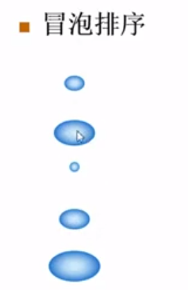
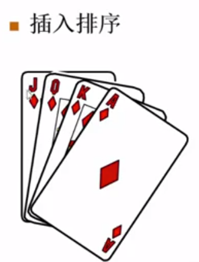

# 前提

排序函数命名规范

> void X_sort( ElementType A[ ], int N)

- N是正整数
- 只讨论基于比较的排序( > = < 有定义)
- 只讨论内部排序
- 稳定性：任意两个相等的数据，排序前后的相对位置不发生改变
- 没有一种排序是任何情况下都表现最好的

# 简单排序(冒泡、插入)

## 冒泡排序



作用：对数组内元素进行排序，每一轮会有一个最大值像气泡一样冒出来
每次从上到下比较相邻的两个泡泡，大的泡泡往下走（交换位置)，这样在最下面的泡泡就是最大的。

1.比较相邻的元素。如果第一个比第二个大，就交换他们两个。
2.对每一对相邻元素做同样的工作，执行完毕后，找到第一个最大值。
3.重复以上的步骤，每次比较-1，直到不需要比较

>元素总轮次 =  元素个数 - 1；
>每轮对比次数 = 元素个数 - 排序轮次 -1；

<font color=#999AAA >代码如下（示例）：

```C++
void bubble_sort( int A[], int N)
{
     for(int i=N-1; i>0; i--) /* 只需要找出N-1个泡泡就行 */
     {
         int flag = 0;
         for(int j=0; j<i; j++) /* 一趟冒泡 */
         {
             if(A[j] > A[j+1])
             {
                 swap(A[j], A[j+1]);
                 flag = 1;
             }
         }
         if(flag == 0) break;  /* 全程无交换 */
     }
}

int main()
{
    int a[] = {1,2,7,3,6,9,7,5,3};
    int length = sizeof(a)/sizeof(a[0]);
    bubble_sort(a, length);
    for(int i=0; i<length; i++)
        cout << a[i] << endl;
    return 0;
}
```

### 时间复杂度

最好情况： 数组本身是顺序的，外层循环遍历一次就完成了      T=O(N)

最坏情况：数组本身是逆序的，内外层遍历                                T=O (N^2)

交换次数最多是：(n-1)!

### 空间复杂度

开辟一个空间交换顺序 O(1)

### 稳定性

稳定

### 测试题

1.对于7个数进行冒泡排序，最坏情况下需要进行的比较次数为（）

正确答案：6! = 1+2+3+4+5+6 = 21;

## 插入排序



插入排序：插入一张牌，后面的牌要往后移一位

```c++
void insert_sort( int A[], int N)
{
    for( int i=1; i<N; i++) /* 不用从0开始，默认手中有一张牌 */
    {
        int Temp = A[i];  /* 摸下一张牌 */
        for( int j=i; j>0 && A[j-1]>Temp; j--)
        {
            A[j] = A[j-1]; /* 移出空位 */
            A[j-1] = Temp;
        }
    }
}
```

### 时间复杂度

最好情况： 顺序 T=O(N)

最坏情况 ：逆序 T=O(N^2) 

### 测试题

 对一组包含10个元素的非递减有序序列，采用插入排序排成非递增序列，其可能的比较次数和移动次数分别是 

A. 45,44                        B.54,63                        C.100,54                        D.100,100

答案是A；

最坏情况下移动次数是 9！=1+2+3+4+5+6+7+8+9 = 45， 因为题目中有可能两字，所以可以有相等的数，故可以选择A
