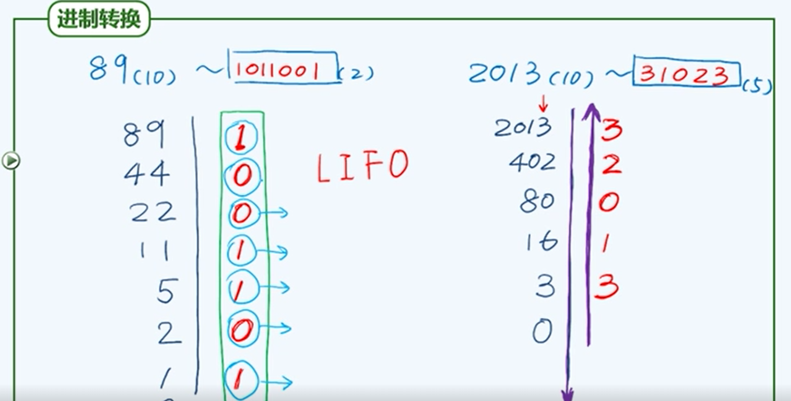
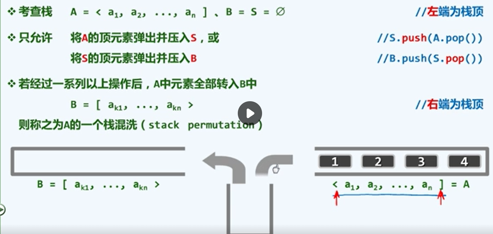
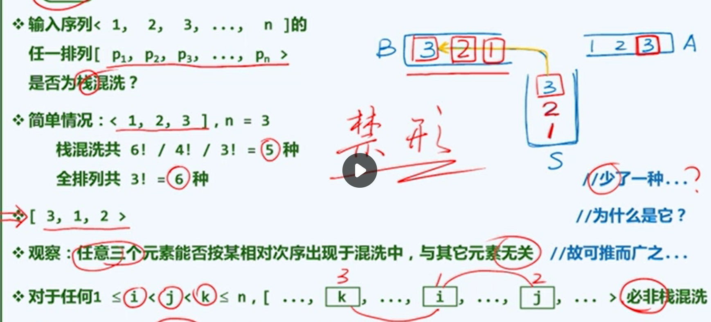
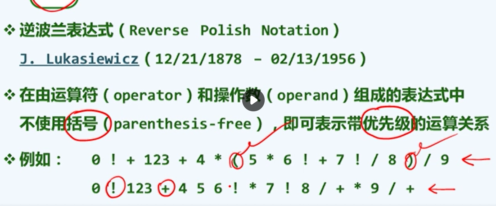

# 栈与队列

## 栈

### 定义

栈(stack)是存放数据对象的一种特殊容器。栈中可操作的一端被称为**栈顶**，无法直接操作的盲端则称作**栈底**

支持**后进先出**，需要头文件：`#include<stack>` 常用的操作接口如下：

| 操作接口                 | 功能                |
| ------------------------ | ------------------- |
| stack<T> xxx;            | 创建一个stack类对象 |
| stack(const stack& stk); | 拷贝构造            |
| size()                   | 报告栈中的数据个数  |
| empty()                  | 判断栈是否为空      |
| push(e)                  | 将e插至栈顶         |
| pop()                    | 删除栈顶对象        |
| top()                    | 返回栈顶元素        |

### 基于向量或列表派生

栈可视作序列的特例，故可以直接基于向量或列表派生

```C++
template<typename  T> // 以向量为基类，派生出栈模板类
class Stack: public Vector<T>   // 将向量的首/末端作为栈底/顶
{
public: // size()、empty()以及其他开放接口，均可直接沿用
    void push(T const& e)
    {
        insert(size(), e);  //入栈：等效于将新元素作为向量的末元素插入
    }

    T pop()
    {
        return remove(size()-1); // 出栈：等效于删除向量的末元素
    }

    T& top()
    {
        return (*this)[size()-1];   // 取顶：直接返回向量的末元素
    }
}
```

用单链表模拟栈

```C++
template<typename  T> 
class Stack
{
private:
    struct Node
    {
        T data;
        Node* next;
    };
    Node* head;  
    Node* end;
    int length;
public: 
    Stack()
    {
        head = NULL;
        end = NULL;
        length = 0;
    }
    void push(T n) // 入栈
    {
        Node* q = new Node;
        q->data = n;
        if(head == NULL)
        {
            q->next = head; // 接在头指针的前面
            head = q;      // 移动头指针和尾指针
            end = q;
        }
        else{
            q->next = end;   // 接在尾指针的前面
            end=q;           // 尾指针移动
        }
        length++;
    }
    T pop() // 出栈并且将出栈的元素返回
    {   
        if(length <= 0)
        {
            abort();  // 异常终止一个进程，返回一个错误代码
        }
        // 新建一个指针指向要删除的节点，并记录节点中的数据
        Node* q;
        int data;
        q = end;
        data = end->data;
        
        end = end->next; // 尾指针移动
        delete(q);
        length--;
        return data;
    }
    int size()
    {
        return length;
    }
    T top()
    {
        return end->data;
    }
    bool isEmpty()
    {
        return (length == 0 ? true : false);
    }
    void clear()
    {
        while(length > 0)
        {
            pop();
        }
    }
};
int main()
{
    Stack<char> s;
    s.push('a');
    s.push('b');
    s.push('c');
    while(!s.isEmpty())
    {
        cout<<s.pop()<<endl;
    }
    return 0;
}
```

## 栈的应用

### A. 进制转换

#### 定义

逆序输出的情况：输出次序与处理过程颠倒，递归深度和输出长度不易预知



得到的数据，输出时要从后往前来排列输出

#### 算法实现

```cpp
void convert(stack<char> & S, int n, int base)
{
    static char digit[] = 
    { '0','1','2','3','4','5','6','7','8','9','A','B','C','D','E','F'};
    while(n > 0)  
    {
        S.push(digit[n % base]);  // 余数入栈
        n /= base;   // n更新为其对base的除商
    }
}
int main()
{
    stack<char> S;
    int n = 89;                 // n表示要计算的数值
    int base = 2;               // base表示要转化的进制
    convert(S, n, base);
    while(!S.empty())
    {   
        cout << S.top() ; // 逆序输出
        S.pop();
    }
    return 0;
}
```

### B. 括号匹配

```cpp
bool paren(const char exp[], int lo, int hi)  //exp[lo, hi)
{
    stack<char> S; //使用栈记录已发现但尚未匹配的左括号
    for(int i = lo; i < hi; i++) // 逐一检查当前字符
    {
        if('(' == exp[i])   S.push(exp[i]);    // 遇到左括号：则进栈
        else if( !S.empty()) S.pop();    // 遇到右括号：若栈非空，则弹出左括号
        else return false;      // 否则（若遇右括号时栈已空), 必不匹配
    return S.empty();  // 最终，栈空当且仅当匹配
    }
}
```

拓展：不可使用计数器，因为有多种括号并存的情况

### C. 栈混洗

#### 定义

按照某种约定规则，对栈中的元素重新排列



栈中的元素弹出后可以压入中转栈S中，或者直接压入栈B中

重新排列次序的可能结果 <= n!



#### 算法实现

```cpp
// 将栈A中的数值弹出， 然后压入中转栈S，或 直接压入栈B中
// 判断栈B中的元素序列是否是一种栈混洗

// 假设栈A中的元素是升序排列，将栈A中的数压入中转栈S，如果S的栈顶数与b[i]相等，再压入B中
bool Stack_mixing(int a, const int* array_b)
{
    stack<int> S;
    for(int i=0; i<5; i++)
    {
        if(S.empty())
        {
            cout << "push " << a << endl;
            S.push(a++);   // 先压入一个数，让S.top()可以判断
        }
            
        while(S.top() < array_b[i])
        {
            cout << "push " << a << endl;
            S.push(a++);
        }
        if(S.top() == array_b[i])
        {
            cout << "pop " << S.top() << endl;
            S.pop();
        }
        else{
            cout << "no!!!\n";
            return false;
        }
    }
}
int main()
{
    int b[] = { 2, 3, 1, 4, 5};
    Stack_mixing(0, b);

    return 0;
}
```

### D.  中缀表达式求值

```cpp

// 中缀表达式求值
float evaluate( char* & RPN)
{
    stack<float> opnd;  // 运算数栈
    stack<char> optr;   // 运算符栈
    optr.push('\0');  // 尾哨兵'\0'也作为头哨兵首先入栈
    char* S; // 单个字符
    while(!optr.empty()) // 非空进入，逐个处理各字符，直至运算符栈空
    {
        if(isdigit(*S)) // 若RPN中的单个字符为操作数,则
        {
            opnd.push(*S);
            readNumber(S, opnd);  // 读取（可能多位的)操作数,若是两位，三位，多位数，就将前面的数弹出，合并字符(因为是单个字符的读取)
        }
        else // 若当前字符为运算符，则视作与栈顶运算符直接优先级的高低
            switch( orderBetween(optr.top(), *S))
            /* 分别处理 */
    }
    return opnd.top();  
}
```

### E. 逆波兰表达式



```cpp
// 求值
rpnEvaluation(expr)
输入： RPN表达式expr
输出: 表达式数值
{
    引入栈S，用以存放操作数；
    while(expr尚未扫描完毕)
    {
        从expr中读入下一元素x；
        if(x是操作数) 将x压入S;
        else{
            从栈S中弹出运算符x所需数目的操作数；
            对弹出的操作数实施x运算，并将运算结果重新压入S；
        }
    }
    返回栈顶;
}
```

## 队列ADT及实现

### 定义

队列（queue）也是受限的序列

- 只能在队尾插入（查询): enqueue() + rear()
- 只能在队头删除（查询): dequeue() + front()

支持**先进先出(FIFO) 后进后出(LILO)**，需要头文件：`#include<queue>` 常用的操作接口如下：

| 操作                     | 功能                  |
| ------------------------ | --------------------- |
| queue<T> xxx;            | 创建一个queue类的对象 |
| queue(const queue& que); | 拷贝构造函数          |
| size()                   | 报告元素总数          |
| empty()                  | 判断队列是否为空      |
| front()                  | 引用队首对象          |
| enqueue(e)               | 将e插入队尾           |
| dequeue()                | 删除队首对象          |

### 基于向量或列表派生

```cpp
template<typename T>
class Queue: public list<T>
{
public:  // size(),empty(),front()直接沿用
    void enqueue(T const& e)
    {
        push_back(e);    // 在链表的队尾插入一个数据
    }
    T dequeue()
    {
        return pop_front();  // 删除队头的第一个元素
    }
}
```

