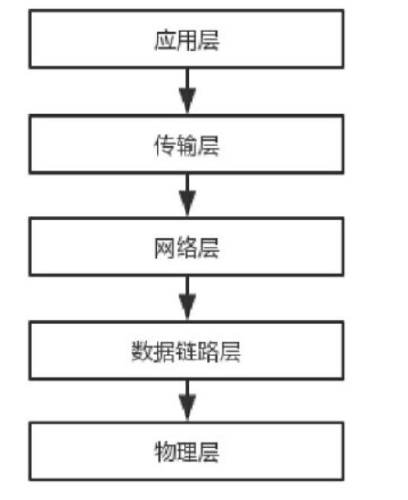
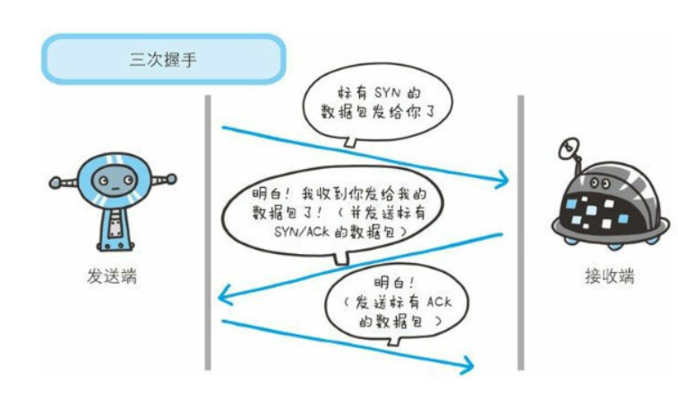

# TCP/IP 的分层管理

TCP/IP协议族按层次分别为 **应用层，传输层，网络层，数据链路层，物理层**

## 物理层

该层负责 **比特流**在**节点**之间的传输，即负责物理传输，这一层的协议既与链路有关，也与传输的介质有关。通俗来说就是把计算机连接起来的物理手段。

## 数据链路层

控制网络层与物理层之间的通信，主要功能是保证物理线路上进行可靠的数据传递。为了保证传输，从网络层接收到的数据被分割成特定的可被物理层传输的**帧**。帧是用来移动数据结构的结构包，他不仅包含原始数据，还包含发送方和接收方的**物理地址**以及纠错和控制信息。而纠错和控制信息则确保帧无差错到达。如果在传达数据时，接收点检测到所传数据中有差错，就要通知发送方重发这一帧。

## 网络层

决定如何将数据从发送方路由到接收方。网络层通过综合考虑发送优先权，网络拥塞程度，服务质量以及可选路由的花费等来决定从网络中的A节点到B节点的最佳途径。即建立主机到主机的通信。

## 传输层

该层为两台主机上的应用程序提供端到端的通信。

传输层有两个传输协议：TCP(传输控制协议)和 UDP(用户数据报协议)。其中，TCP是一个可靠的面向连接的协议，udp是不可靠的或者说无连接的协议

## 应用层

应用程序收到传输层的数据后，接下来就要进行解读。解读必须事先**规定好格式**，而应用层就是规定应用程序的数据格式。

主要的协议有：HTTP.FTP,Telent等。

# TCP与UDP

TCP/UDP 都是传输层协议

## 报文

### 面向字节流

虽然应用程序和TCP的交互是一次一个数据块(大小不等)，但TCP把应用程序看成是一连串的无结构的字节流。**TCP有一个缓冲**，当应用程序传送的数据块太长，TCP就可以把它划分短一些再传送。

可能会发生粘包问题

### 面向报文

面向报文的传输方式是应用层交给UDP多长的报文，UDP发送多长的报文，即一次发送一个报文。因此，应用程序必须选择合适大小的报文。

不会发生粘包问题

## 双工性

- 全双工

是指交换机在发送数据的同时也能够接收数据，两者同步进行。

好处：迟延小，速度快

- 半双工

是指一个时间段内只有一个动作发生

# TCP的三次握手与四次挥手

## 第一次握手

建立连接。客户端**发送连接请求报文段**，并将syn(**标记位**)设置为1，Squence Number(**数据包序号**)(seq)为x,接下来等待服务端确认，客户端进入SYN_SENT状态(**请求连接**)；

## 第二次握手

服务端收到客户端的 SYN 报文段，对 SYN 报文段进行确认，设置 ack(确认号)为 x+1(即seq+1 ; 同时自己还要发送 SYN 请求信息，将 SYN 设置为1, seq为 y。服务端将上述所有信息放到 SYN+ACK 报文段中，一并发送给客户端，此时服务器进入 SYN_RECV状态

## 第三次握手

客户端收到服务端的 SYN+ACK(确认符) 报文段；然后将 ACK 设置为 y+1,向服务端发送**ACK报文段**，这个报文段发送完毕后，客户端和服务端都进入ESTABLISHED(**连接成功**)状态，完成TCP 的三次握手。

**当客户端和服务端通过三次握手建立了 TCP 连接以后,当数据传送完毕,断开连接就需要进行TCP的四次挥手**

## 第一次挥手

客户端设置seq和 ACK ,向服务器发送一个 FIN(终结)报文段。此时，客户端进入 FIN_WAIT_1 状态，表示客户端没有数据要发送给服务端了。

## 第二次挥手

服务端收到了客户端发送的 FIN 报文段，向客户端回了一个 ACK 报文段

## 第三次挥手

服务端向客户端发送FIN 报文段，请求关闭连接，同时服务端进入 LAST_ACK 状态。

## 第四次挥手

客户端收到服务端发送的 FIN 报文段后，向服务端发送 ACK 报文段,然后客户端进入 TIME_WAIT 状态。服务端收到客户端的 ACK 报文段以后，就关闭连接。此时，客户端等待 2MSL（指一个片段在网络中最大的存活时间）后依然没有收到回复，则说明服务端已经正常关闭，这样客户端就可以关闭连接了。
****

## 长连接

如果有大量的连接，每次在连接，关闭都要经历三次握手，四次挥手，这显然会造成性能低下。因此。Http 有一种叫做  **长连接**（keepalive connections）  的机制。它可以在传输数据后仍保持连接，当客户端需要再次获取数据时，直接使用刚刚空闲下来的连接而无需再次握手。

****

# 问题总结

## 1.为什么要三次握手

为了防止**已失效的连接请求报文**突然又传送到了服务端，产生错误。

具体解释： “已失效的连接请求报文段”产生情况：

client 发出的第一个连接请求报文段并没有丢失，而是在某个网络节点长时间滞留，因此导致延误到连接释放以后的某个时间才到达 service。如果没有三次握手，那么此时server收到此失效的连接请求报文段，就误认为是 client再次发出的一个新的连接请求，于是向 client 发出确认报文段，同意建立连接，而此时 client 并没有发出建立连接的情况，因此并不会理会服务端的响应，而service将会一直等待client发送数据，因此就会导致这条连接线路白白浪费。

例子：    

- 第一次握手： A给B打电话说，你可以听到我说话吗？
- 第二次握手： B收到了A的信息，然后对A说： 我可以听得到你说话啊，你能听得到我说话吗？
-  第三次握手： A收到了B的信息，然后说可以的，我要给你发信息啦！

在三次握手之后，A和B都能确定这么一件事： 我说的话，你能听到； 你说的话，我也能听到。 这样，就可以开始正常通信了，如果是两次，那将无法确定。

这样客户端和服务端都知道了能正常通信

## 2.为什么要四次挥手

TCP 协议是一种面向连接，可靠，基于字节流的传输层通信协议。TCP 是全双工模式(同一时刻可以同时发送和接收)，这就意味着，当主机1发出 FIN 报文段时，只是表示主机1已结没有数据要发送了，主机1告诉主机2，它的数据已经全部发送完毕；但是，这个时候主机1还是可以接受来自主机2的数据；当主机2返回 ACK报文段时，这个时候就表示主机2也没有数据要发送了，就会告诉主机1，我也没有数据要发送了，之后彼此就会中断这次TCP连接。

## 3.为什么要等待 2MSL

**MSL**：报文段最大生存时间，它是任何报文段被丢弃前在网络内的最长时间

原因：

- 保证TCP协议的全双工连接能够可靠关闭
- 保证这次连接的重复数据从网络中消失

第一点： 如果主机1直接 关闭，由于IP协议的不可靠性或者其他网络原因，导致主机2没有收到主机1最后回复的 ACK。那么主机2就会在超时之后继续发送 FIN，此时由于主机1已经关闭，就找不到与重发的 FIN 对应的连接。所以，主机1 不能直接进入 关闭，而要是TIME_WAIT 状态。当再次收到 FIN 的时候，能够保证对方收到 ACK ，最后正确关闭连接。

第二点：如果主机1直接 关闭，然后又再向主机 2 发起一个新连接，我们不能保证这个新连接与刚才关闭的连接端口是不同的。也就是说有可能新连接和老连接的端口号是相同的。一般来说不会发生什么问题，但还是有特殊情况出现；假设新连接和已经关闭的老连接端口号是一样的，如果前一次连接的某些数据仍然滞留在网络中( Lost Duplicate )，那些延迟数据在建立新连接之后才到达主机2，由于新连接和老连接的端口号是一样的，TCP 协议就认为哪个延迟的数据时属于新连接的，这样就和真正的新连接的数据包发生混淆了。所以TCP连接要在 TIME_WAIT 状态等待两倍 MSL ，保证本次连接的所有数据都从网络中消失。

## 4.为什么不是三次挥手？

> - 报文段1：主动关闭方client向被动关闭方server发送结束报文段。
> - 报文段2：server发送结束报文段确认，此时client数据已经传输完毕。
> - 报文段3：server数据也发送完毕，发送结束报文段。
> - 报文段4：client对结束报文段进行确认。

如果报文段2和报文段3合并，这样会出现问题。

server发送报文段2只是确认主动关闭方发来的结束报文段，但并不代表自身的数据已经传输完毕，可能会有数据未发送完成，需要继续发送，因此不能将确认消息和请求关闭消息同时发送

当server的数据传输完毕后才会发送报文段3

## 5.什么是TCP粘包？

1.发送端为了将多个发往接收端的包，更有效的发到对方，使用了**优化方法（Nagle算法）**，将多次间隔较小、数据量小的数据包，合并成一个大的数据包发送(把发送端的缓冲区填满一次性发送)。

2.接收端底层会把tcp段整理排序交给缓冲区，这样接收端应用程序从缓冲区取数据就只能得到整体数据而不知道怎么拆分 

这两个原因是**tcp是面向流的协议**

比如发送端发送了一个由2个100字节组成的200字节的数据包到接受端的缓冲区，接受端从缓冲区一次取80字节的数据，那么第一次取的就是一个不完整的数据包，第二次取就会带上第一个数据包的尾部和下一个数据包的头

注：一次取多少数据通过socket.recv(80)定义

## 6.为什么UDP不会粘包？

1.TCP协议是**面向流的协议**，UDP是**面向消息的协议**

UDP段都是一条消息，应用程序必须以消息为单位提取数据，不能一次提取任意字节的数据

2.UDP具有保护消息边界，在每个UDP包中就有了消息头（消息来源地址，端口等信息），这样对于接收端来说就容易进行区分处理了。传输协议把数据当作一条独立的消息在网上传输，接收端只能接收独立的消息。接收端一次只能接收发送端发出的一个数据包,如果一次接受数据的大小小于发送端一次发送的数据大小，就会丢失一部分数据，即使丢失，接受端也不会分两次去接收

## 7. 如何解决粘包问题？

只有TCP有沾包问题，UDP没有沾包问题。

使用udp：（1）dns

（2）webrtc音视频通话 tcp、udp

 		tcp重传机制不可控

（3）游戏