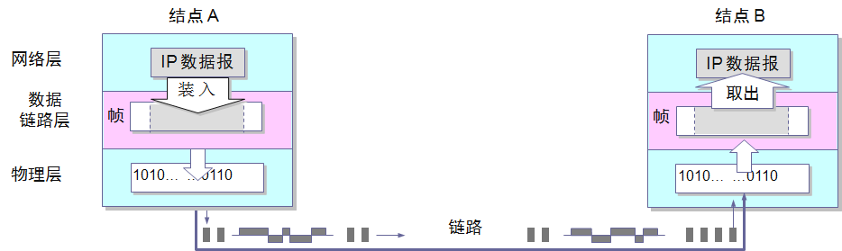
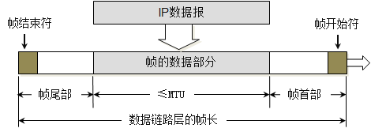
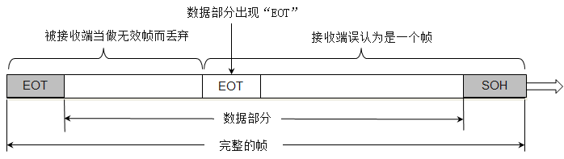

# 数据访问过程

一个数据包需要两个地址：

- ip地址：告诉路由器去往哪里
- 物理地址(mac)：确定的是要去往ip地址，下一跳应该去哪。因此是不断修改
- 数据包：目的ip 源ip + 源端口和目的端口 + 数据
- 数据帧：数据包 + 目标mac和源mac以及差错检验

# 数据链路层

控制网络层与物理层之间的通信，主要功能是保证物理线路上进行可靠的数据传递。为了保证传输，从网络层接收到的数据被分割成特定的可被物理层传输的**帧**。帧是用来移动数据结构的结构包，他不仅包含原始数据，还包含发送方和接收方的**物理地址**以及纠错和控制信息。而纠错和控制信息则确保帧无差错到达。如果在传达数据时，接收点检测到所传数据中有差错，就要通知发送方重发这一帧。

数据帧：数据包 + 目标mac和源mac以及差错检验

## 基本概念

链路：指的是从一个节点到相邻节点的一段**物理线路**,且中间没有任何其他的交换节点

数据链路：传输数据时，除了一条物理线路，还需要一些必要通信协议来控制这些传输

## 数据链路层的三个基本问题：

### 封装成帧

- 基本概念

  数据链路层在接收端，将网络层交下来的数据报封装为数据帧，发送到链路上。在接收端，将接收到的数据帧中的数据报取出并且上交给网络层

  网络层协议数据单元就是 **IP数据报**,数据链路封装成的帧，在物理层变成数字信号在链路上传输。

  

  如上图，不考虑物理层，简单的认为，数据帧通过数据链路通过节点A发送到节点B

  - 封装

  

  - 封装成帧，就是将网络层的IP数据报的前后分别添加**首部**和**尾部**,这样就构成了一个帧
  - 不同的数据链路层协议的帧的首部和尾部包含的信息有明确的规定，帧的首部和尾部有`帧开始符`和`帧结束符`，称为**帧定界符**。接收端收到物理层传过来的数字信号读取到帧开始字符一直到帧结束字符，就认为接收到了一个完整的帧。在数据传输中出现差错时，帧定界符的作用更加明显。
  - MTU：每一种数据链路层协议都规定了所能够传送的帧的数据部分长度的上限--即**最大传输单元MTU**（Maximum Transfer Unit），**以太网的MTU为1500个字节**。

### 透明传输

帧的开始符为`SOH (start of head)`，是`ASCII`字符表中的，对应的16进制是0x01，结束符为`EOT (End of Transmission)`,也是`ASCII`字符表中。当传输二进制数据，很可能在数据部分出现和结束符相同的编码，那么为了避免提前结束，那么就需要用转义字符`ECS`，来告诉接收端的数据链路层，这里不是真正的结束符号。其他需要转义的字符也是也是如此。

### 差错控制

