# 操作系统

## 定义

**操作系统**是指控制和管理整个计算机系统的硬件和软件资源，并合理的组织调度计算机的工作和资源的分配，以提供给用户和其他软件方便的接口和环境，它是计算机系统中最基本的**系统软件**。

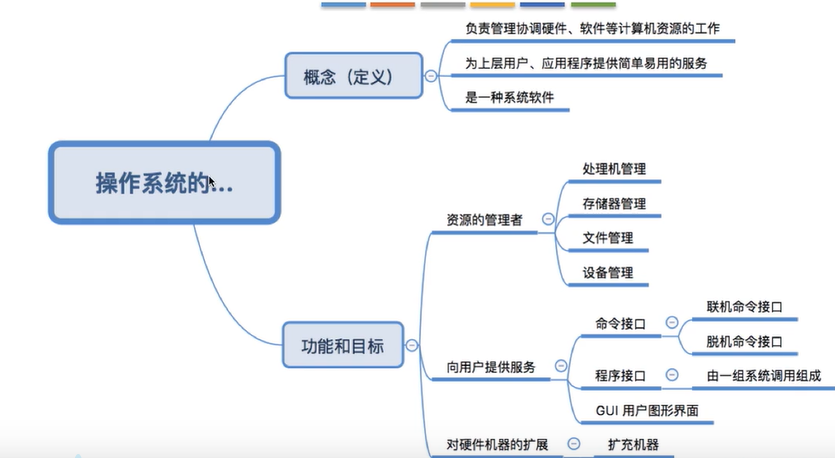

## 特征

- 并发
- 共享
- 虚拟
- 异步

### 1. 并发

并发：指两个或多个事件在同一时间间隔内发生。这些事件**宏观上是同时发生的，但微观上是交替发生的**

并行：指两个或多个事件在同一时刻同时发生

**操作系统的并发性**指计算机系统中同时存在着多个运行着的程序

### 2. 共享

**共享**即资源共享，是指系统中的资源可供内存中多个并发执行的进程共同使用

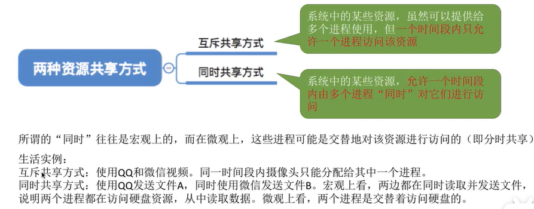

并发和共享互为存在的条件。

没有并发和共享，就谈不上虚拟和异步，因此并发和共享是操作系统的两个最基本的特征

### 3. 虚拟

**虚拟**是指把一个物理上的实体变为若干个逻辑上的对应物。物理实体(前者)是实际存在的，而逻辑对应物(后者)是用户感受到的。

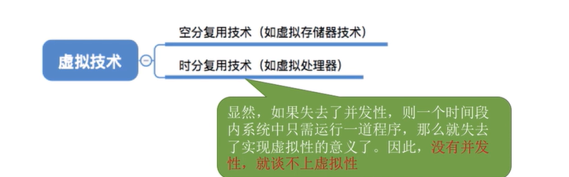

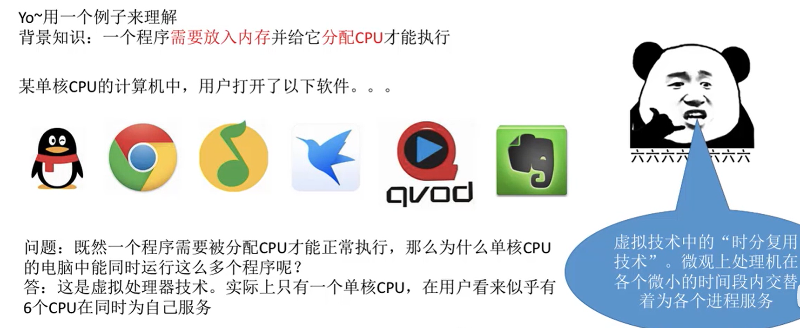

### 4. 异步

异步是指，在多道程序环境下，允许多个程序并发执行，但**资源有限**，进程的执行不是一贯到底，而是走走停停，以不可预知的速度向前推进，这就是进程的异步性。

## OS的发展与分类

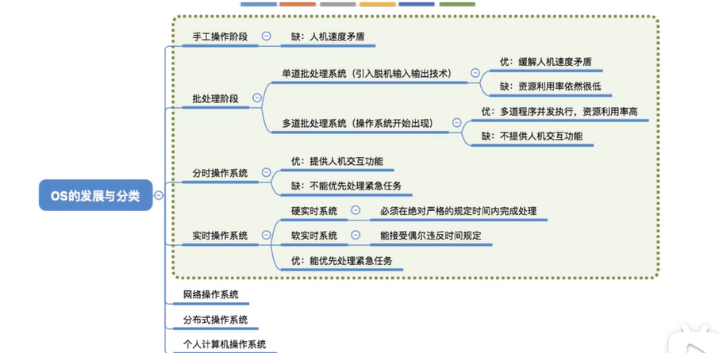

## OS的运行机制和体系结构

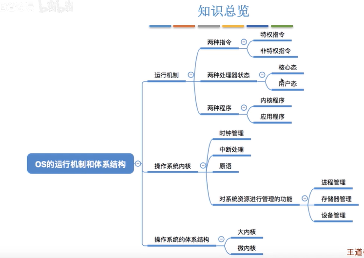

### 运行机制

"指令"：让处理器(CPU)能识别、执行的最基本命令

问题：CPU如何判断当前是否可以执行特权指令？

根据处理器处于什么状态。

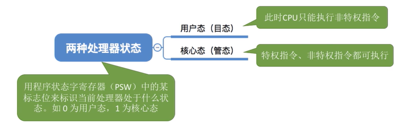

两种程序：

### 操作系统内核

**内核**是计算机配置的底层**软件**，是操作系统最基本、最核心的部分。

实现操作系统内核功能的那些程序就是**内核程序**

### 体系结构

# 中断

## 定义

- **当中断发生时，CPU会立即进入核心态**。实际上，用户态和内核态之间的切换也是依靠中断完成的
- 当中断发生，当前运行的进程会暂停运行，并且交由操作系统内核对中断进行处理
- 对于不同的中断，会进行不同的处理

本质：发生了**中断**，就说明**需要操作系统介入，开展管理工作**。由于操作系统的管理工作(比如进程切换，分配I/O设备等)需要特权指令，因此CPU要从用户态转入核心态。故而，**中断可以使CPU从用户态切换为核心态，使操作系统获得计算机的控制权**，有了中断，才能实现多道程序并发执行。 

用户态与内核态是通过寄存器`psw`来标志的：

- 用户态--> 核心态： 是通过**中断**实现的。并且**中断**是**唯一**途径
- 核心态--> 用户态： 是通过执行**一个特权指令**，将程序状态字(psw)的标志位设置为“用户态”

## 分类

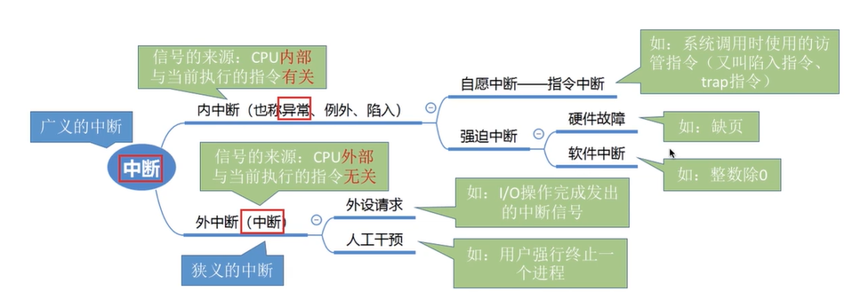

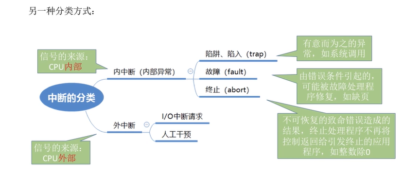

## 外中断的处理过程

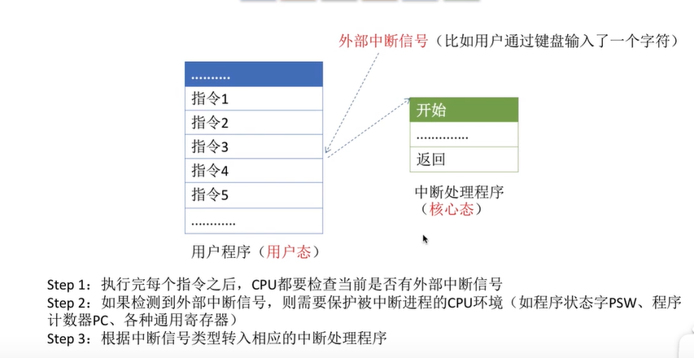

# 系统调用

## 定义

应用程序通过**系统调用**请求操作系统的服务。系统中的各种共享资源都由操作系统统一掌管，因此在用户程序中，凡是与资源有关的操作(如存储分配、I/O操作、文件管理等)，都必须通过系统调用的方式向操作系统提出服务请求，由操作系统代为完成。这样**可以保证系统的稳定性和安全性**，防止用户进行非法操作。

凡是与资源有关的操作、会直接影响到其他进程的操作，一定需要操作系统的介入，即需要通过系统调用来实现

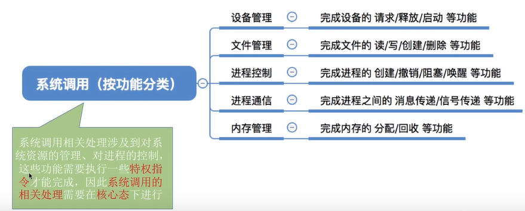

## 系统调用和库函数

- 系统调用是操作系统向上层提供的接口
- 有的库函数是对系统调用的进一步封装

## 系统调用背后的过程

1. 传递系统调用参数，保存到寄存器中
2. 执行陷入指令(中断)，使处理器从用户态进入核心态(系统调用发生在用户态，对系统调用的处理发生在核心态)
3. 执行系统调用相应服务程序
4. 返回用户程序