# 进程

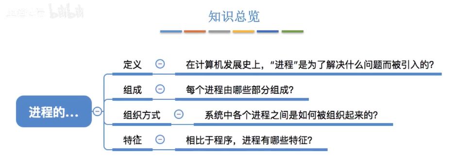

## 定义

程序：就是一个指令序列

- 早期的计算机(只支持**单道**程序)；
- 引入**多道**程序技术后，为了方便操作系统管理，完成各程序并发执行，引入了**进程、进程实体**的概念。系统为每个运行的程序配置一个数据结构，称为**进程控制块(PCB)**，用来描述进程的各种信息(如程序代码存放位置)。 

## 组成

**PCB(进程控制块)、程序段、数据段三部分构成了进程实体(进程映像)。一般情况下，我们把进程实体简称为进程。**

例如：所谓创建进程，实际上是创建进程实体中的PCB，而撤销进程，实际上是撤销进程实体中的PCB。**PCB是进程存在的唯一标志**

**进程是进程实体的运行过程，是系统进行资源分配和调度的一个独立单位**

进程标识符PID：当进程被创建时，操作系统会为该进程分配一个**唯一的、不重复**的ID，**用于区分不同的进程**(类似身份证号)

用户标识符UID：进程所属的用户

各种寄存器值：**当进程切换时需要把进程当前的运行情况记录下来保存在PCB中**，如程序计数器的值表示了当前程序执行到哪一句

## 组织方式

讨论多个进程之间的组织方式问题

### 链接方式

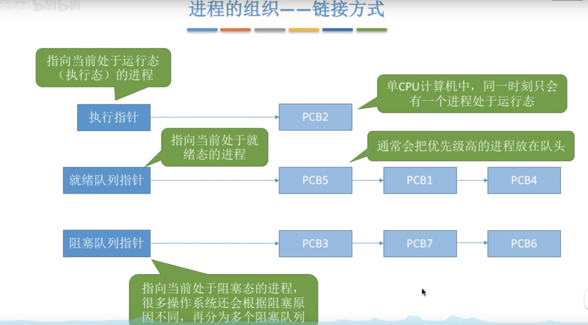

### 索引方式

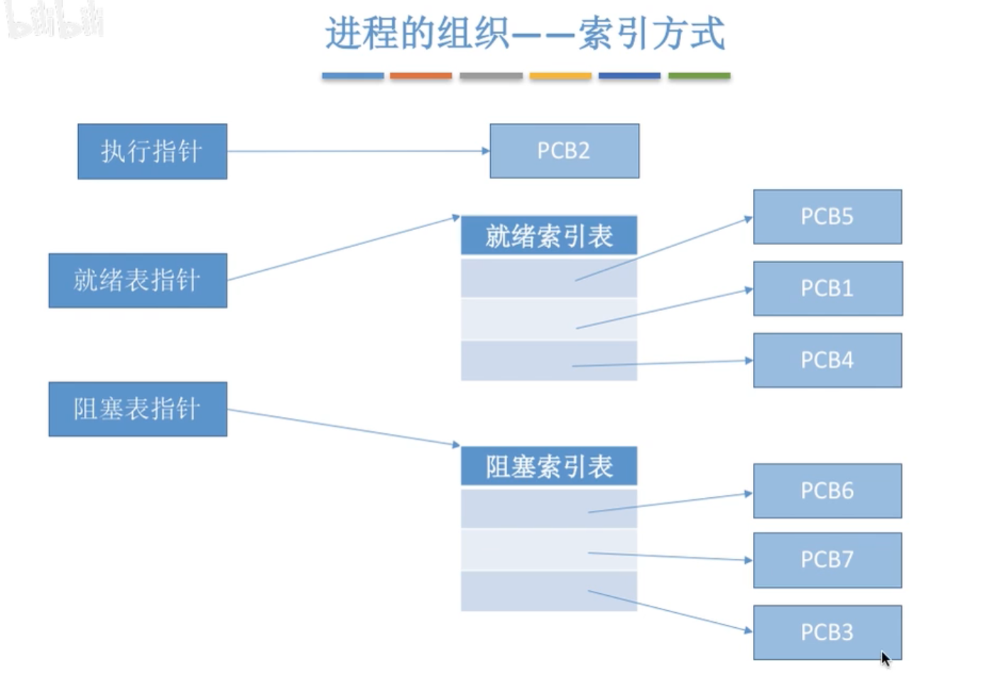

## 特征

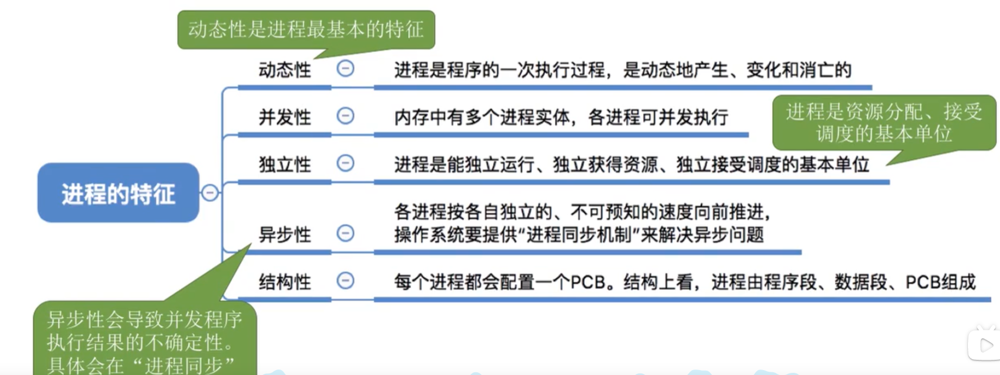

## 进程的状态与切换                                                                                            

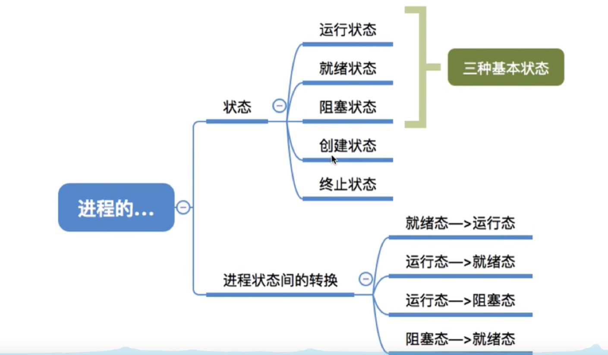

### 进程的状态

- 运行状态：当前占据CPU资源的进程的状态
- 就绪状态：已经具备运行条件，位于进程的就绪队列中，等待进程调度被分配CPU资源
- 阻塞状态：处于运行态的进程因发出某种资源请求，操作系统将其CPU资源剥夺，等待请求的事件满足，再变成就绪态，加入就绪队列
- 创建状态：进程正在被创建，操作系统需要为其分配资源、初始化PCB
- 终止状态：进程正在从系统中撤销，操作系统会回收进程拥有的资源、撤销PCB

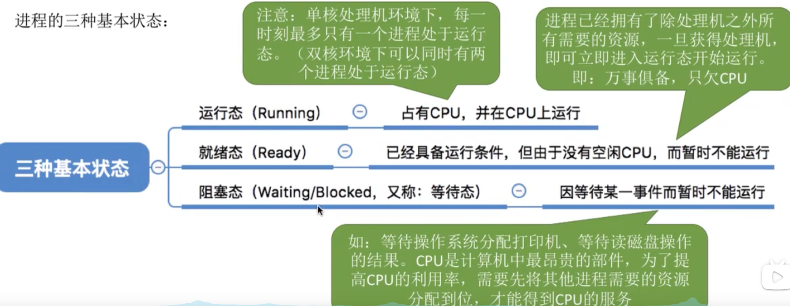

### 进程状态的切换

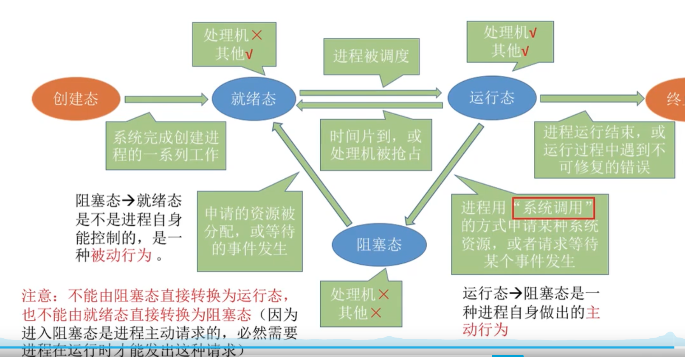

## 进程控制

进程控制的主要功能是对系统中的所有进程实施有效的管理，它具有创建新进程、撤销已有进程、实现进程状态转换等功能。简化理解就是 **实现进程状态的转换**

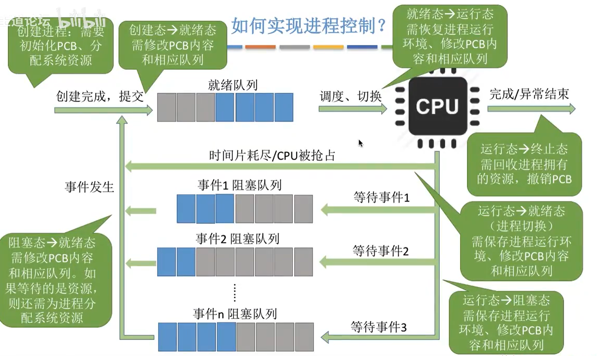

### 如何实现进程控制

用**原语**实现进程控制。原语的特点是执行期间**不允许中断**，只能一气呵成（原语运行在**核心态**）

这种不可被中断的操作即**原子操作。**

**原语采用"关中断指令"和"开中断指令"实现**	

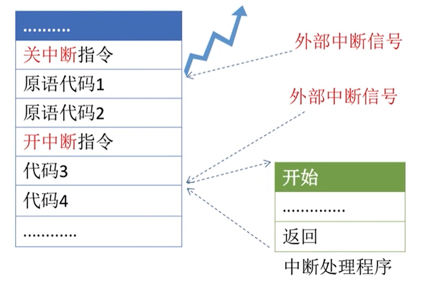

**在关中断指令中，外部中断信号会被忽略掉。**

显然，**关/开中断指令**的权限非常大，必然是只允许在**核心态**下执行的特权指令

#### 为什么使用原语控制

为了防止进程队列中与其进程状态标志不一致。通过原语控制，实现将进程放进某个运行状态的队列时，其对应的PCB数据也会被修改与所在队列保持一致。否则如果被中断，很可能会发生不一致，导致系统崩溃。

### 进程控制相关的原语

进程控制会导致进程状态的转换。无论哪个原语，要做的无非三类事件：

1. **更新PCB中的信息**(如**修改进程状态标志、将运行环境保存到PCB、从PCB恢复运行环境**)

   a. 所有进程控制原语一定都会修改进程状态标志

   b. 剥夺当前运行进程的CPU使用权必然需要保存其运行环境

   c. 某进程开始运行前必然要恢复其运行环境

2. **将PCB插入合适的队列**

3. **分配/回收资源**

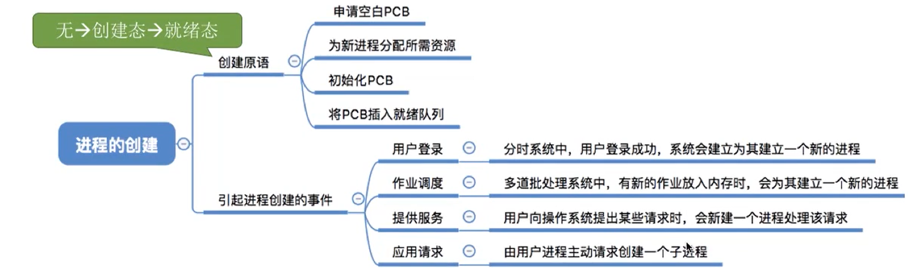

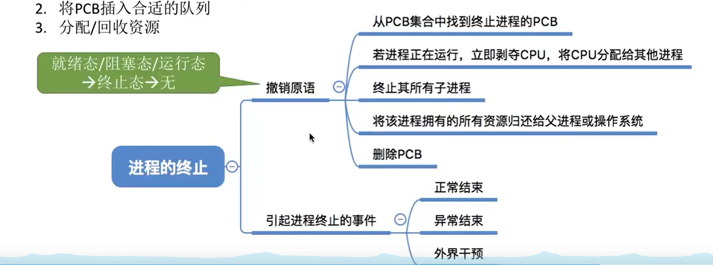

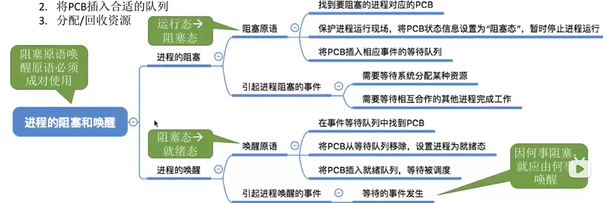

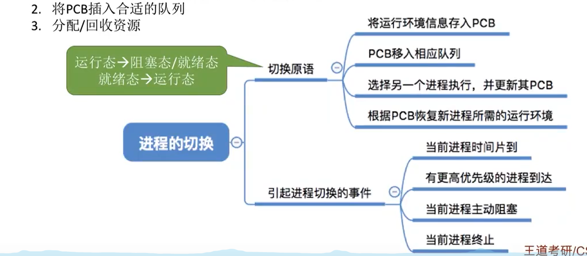

## 进程通信

进程通信就是指**进程之间的信息交换**。

进程是分配系统资源的单位(包括内存地址空间)，因此**各进程**拥有的**内存地址空间相互独立**。

为了保证安全，**一个进程不能直接访问另一个进程的地址空间。**

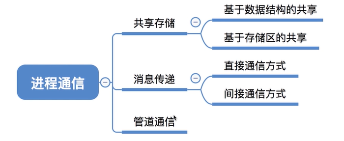

### 共享存储

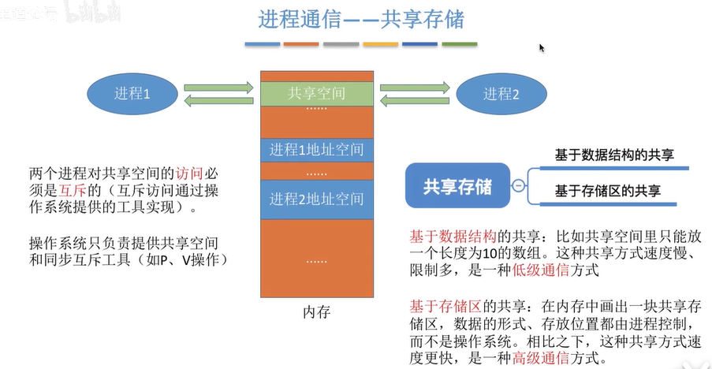

### 管道通信

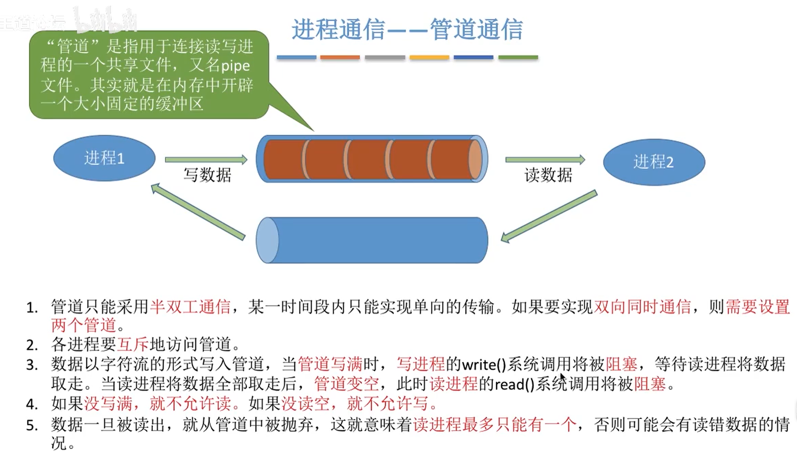

### 消息传递

进程间的数据交换以**格式化的消息**（Message）为单位。进程通过操作系统提供的**“发送消息/接收消息”两个原语** 进行数据交换。

### 直接通信方式

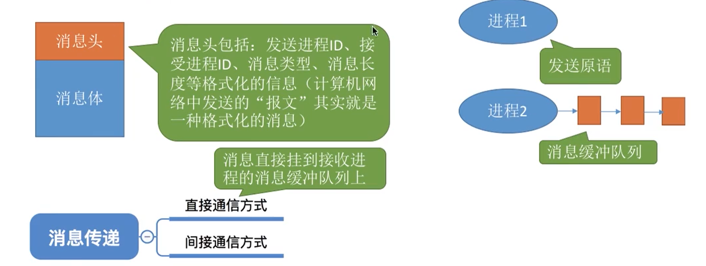

### 间接通信方式

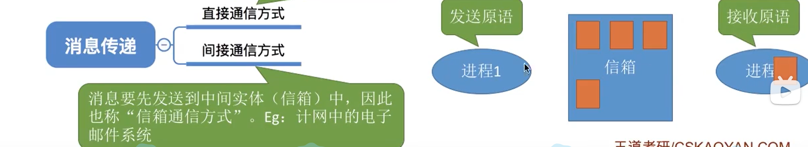

# 线程

**线程**是一个**基本的CPU执行单元**，也是**程序执行流的最小单位**。

引入线程后，**进程**只作为**除CPU之外的系统资源的分配单元**(如打印机、内存地址空间等都是分配给进程的)

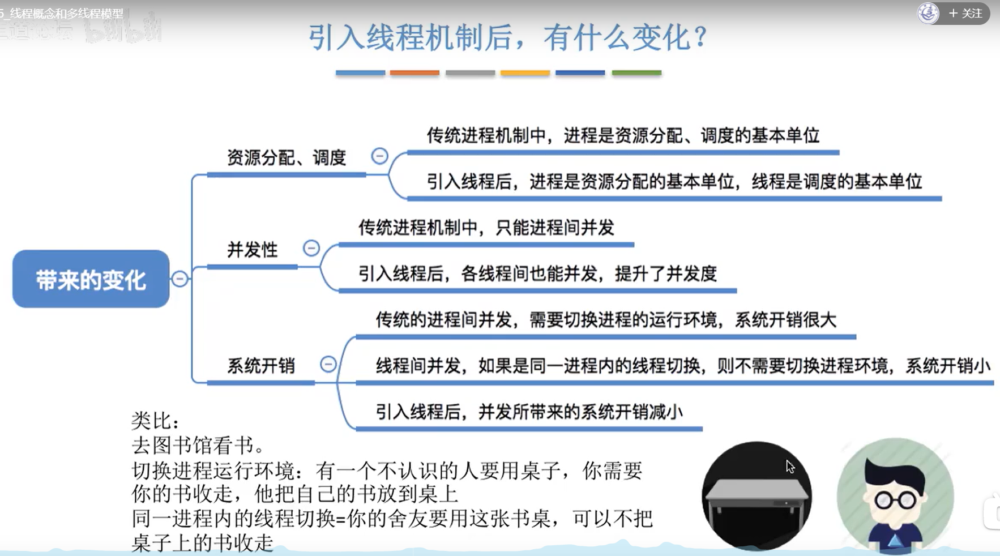

引入线程后：

- **进程是资源分配的基本单位，线程是调度的基本单位**
- 各线程间也能**并发**
- 同一进程内的线程切换，**不需要切换进程环境，系统开销减少**

## 线程的属性

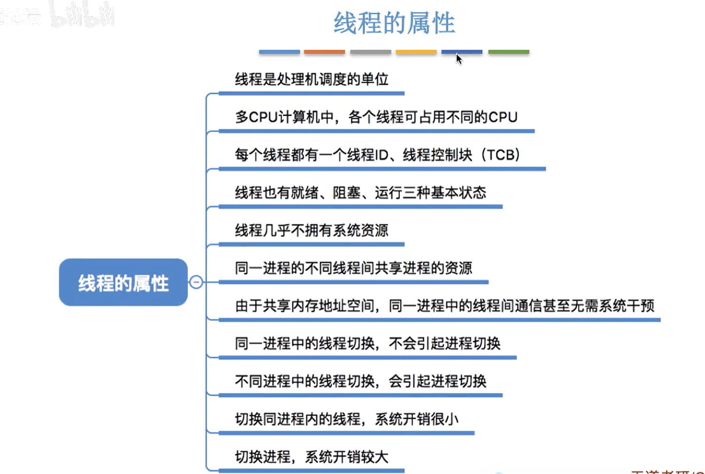

## 线程的实现方式

### 用户级线程

用户级线程由应用程序通过线程库实现。

所有的**线程管理工作**都由**应用程序负责**(包括线程切换)

用户级线程中，**线程切换**可以在**用户态下即可完成**，无需操作系统干预，系统开销小。

在用户看来，是有多个线程。但是在操作系统内核看来，并没意识线程的存在。(用户级线程对用户不透明，对操作系统透明)

**“用户级线程”就是“从用户视角看能看到的线程”**

### 内核级线程

内核级线程(Kernel-Level Thread, KLT, 又称“内核支持的线程”)

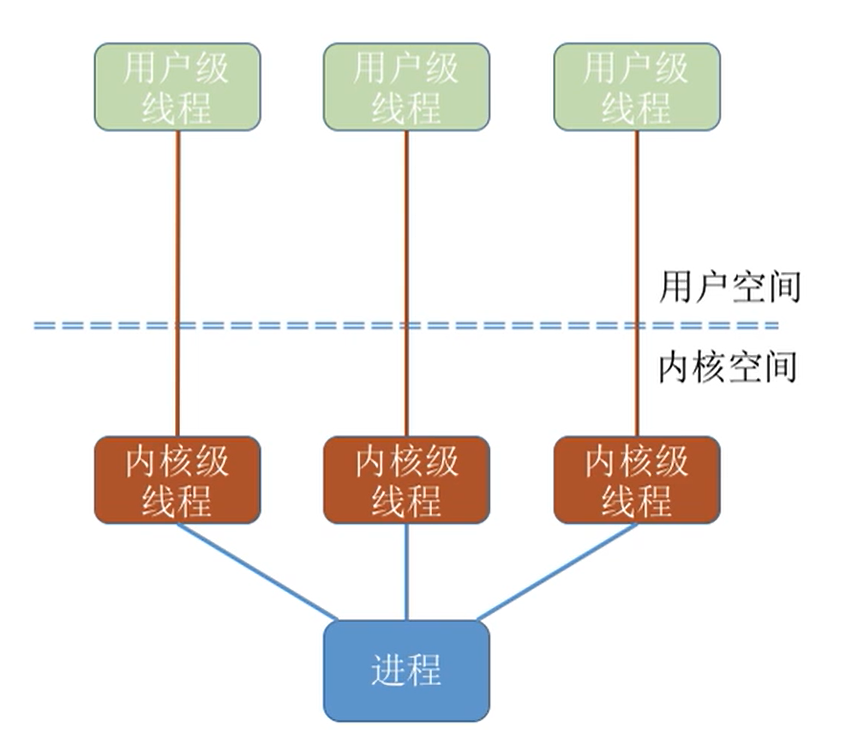

**内核级线程的管理工作**由**操作系统内核**完成。

线程调度、切换等工作都由内核负责，因此**内核级线程的切换**必然需要在**核心态下**才能完成

可以这样理解，**“内核级线程” 就是 “从操作系统内核视角看能看到的线程”**

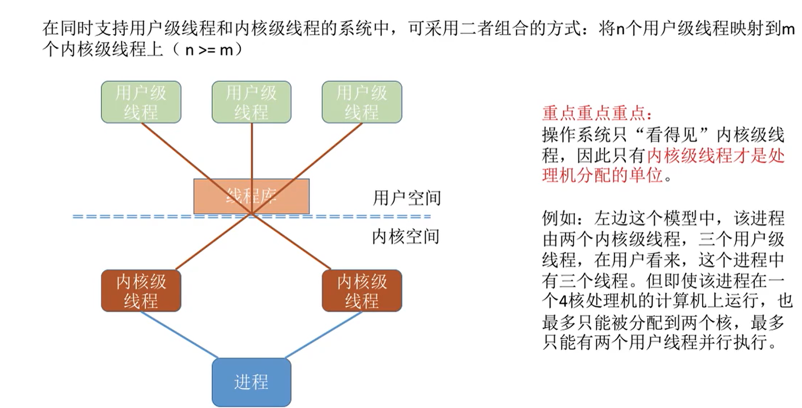

## 多线程模型

在同时支持用户级线程和内核级线程的系统中，**由几个用户级线程映射到几个内核级线程的问题**引出了“多线程模型”问题

### 多对一模型

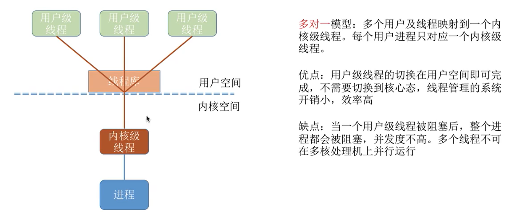

### 一对一模型

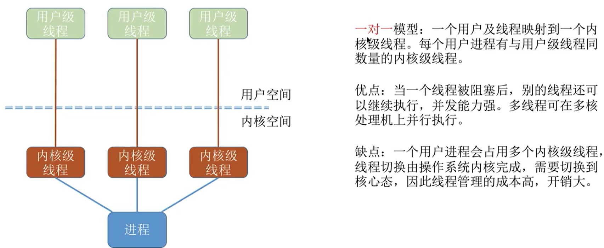

### 多对多模型

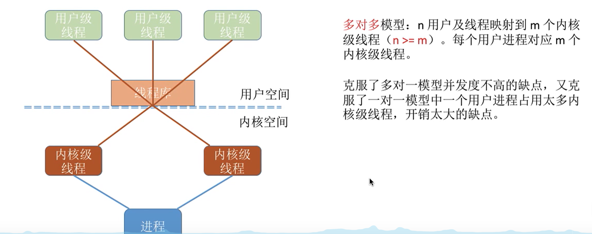

## 总结

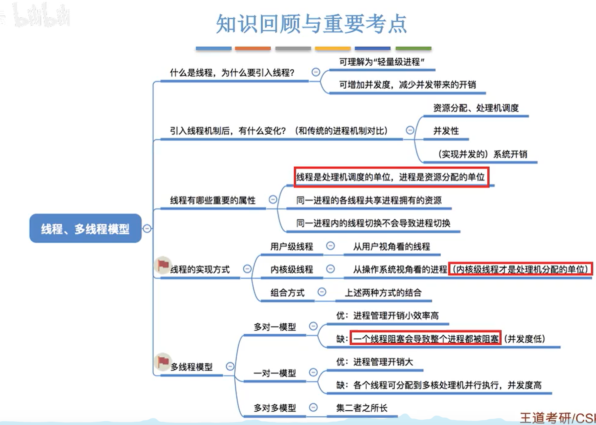