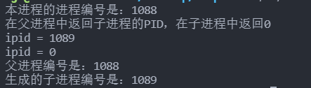

# 进程

## 一、定义

**进程**就是**正在内存中运行的程序**， 是系统进行资源分配和调度的一个独立单位。

**PCB(进程控制块)、程序段、数据段**三部分构成了进程实体。进程是进程实体的运行过程。

Linux下的一个进程在内存里有三部分的数据，就是**“代码段”， “堆栈段” 和 “数据段”** 

- 代码段：存放程序代码
- 堆栈段：存放程序的返回地址，程序的参数以及程序的局部变量
- 数据段：存放程序的全局变量，常数以及动态数据分配的数据空间（比如用new函数分配的空间)

系统如果同时运行多个相同的程序，它们的“代码段”是相同的，“堆栈段”和“数据段”是不同的

## 二、与进程有关的函数

### 1. getpid()   获得进程PID

```C++
pid_t getpid();
```

**作用**：获取本程序运行时进程的编号

函数没有参数，返回值是进程的编号, pid就是 typedef int pid_t

示例：

```cpp
#include<iostream>
#include<stdio.h>
#include<sys/types.h> //Unix/Linux系统的基本系统数据类型的头文件，含有size_t，time_t，pid_t等类型
#include<unistd.h> // 用于linux/unix系统的调用
using namespace std;

int main()
{
    cout << "本进程的进程编号是："<< getpid() << endl;  
    return 0;
}
```

每个进程拥有自己的编号PID，由系统动态分配，动态收回。

相同的程序在不同的时间执行，进程的编号是不同的。

进程的编号会循环使用，但是，在同一时间，进程的编号是唯一的，不管任何时间，系统不可能存在两个编号相同的进程

### 2. fork()  产生子进程

```C++
pid_t fork();
```

**作用**：用于产生一个新的进程

函数返回值pid_t 是一个整数，**在父进程中，返回值是子进程编号，在子进程中，返回值是0**

示例：

```cpp
#include<iostream>
#include<stdio.h>
#include<sys/types.h>
#include<unistd.h>
using namespace std;

int main()
{
    cout << "本进程的进程编号是："<< getpid() << endl;  

    cout << "在父进程中返回子进程的PID，在子进程中返回0"<< endl;
    int ipid = fork();   // 生成子进程
    sleep(1);            // sleep等待进程的生成
    cout << "pid = " << ipid << endl;

    if(ipid) cout << "父进程编号是：" << getpid() << endl;
    else cout << "生成的子进程编号是：" << getpid() << endl;

    //sleep(30);    // 为了方便查看进程在shell下用ps -ef | grep ./a.out 查看本进程的编号
    return 0;
}
```

结果如下：生成了一个子进程，在父进程中ipid是子进程的编号，在子进程中ipid是0，表示创建成功



fork函数创建了一个新的进程，**它和父进程使用相同的代码段，子进程拷贝了父进程的堆栈段和数据段。**子进程一旦开始运行，它复制了父进程的一切数据，然后各自运行，相互之间没有影响。**可以通过fork的返回值来区别父进程和子进程，**然后再执行不同的代码

## 三、多进程应用

### 1. 并发的服务端

如果把socket服务端改为多进程，在每次accept到一个客户端的连接后，生成一个子进程，让子进程负责和这个客户端通信，父进程继续accept客户端的连接，socket的服务端在监听新客户端的同时，还可以和多个客户端进行通信，这就是并发。

  

