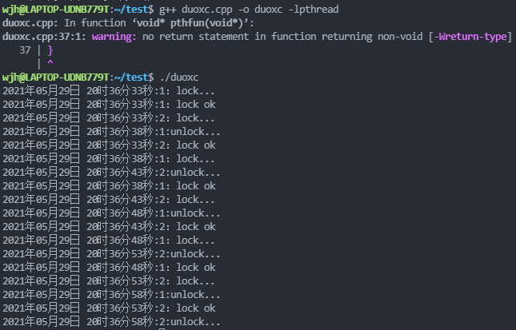

# Thread

## 一、定义

**线程**是操作系统能够进行运算调度的最小单位，它被包含在**进程**之中，是**进程**中的实际运作单位。

## 二、函数				

```cpp
#include<pthread.h>

// 线程的标识符
pthread_t threadId;  
// 创建线程
pthread_create(&threadId, NULL, threadRun, this);
// 让线程分离    ----自动退出，无系统残留资源
pthread_detach(threadId);
// 等待线程执行结束
pthread_join(threadId, NULL);
// 发送信号终止线程执行，命令其他线程停止
pthread_cancel(threadId);
// 线程在执行过程，遇到该函数结束执行
pthread_exit();
```

另外，在编译时注意加上-lpthread参数，以调用静态链接库。因为pthread并非Linux系统的默认库

```cpp
$ gcc main.c -lpthread
$ ./a.out
```

#### 创建线程

```cpp
int pthread_create(pthread_t *thread,
                   const pthread_attr_t *attr,
                   void *(*start_routine) (void *),
                   void *arg);
/* 参数的含义
1) pthread_t *thread：传递一个 pthread_t 类型的指针变量，也可以直接传递某个 pthread_t 类型变量的地址。pthread_t 是一种用于表示线程的数据类型，每一个 pthread_t 类型的变量都可以表示一个线程。

2) const pthread_attr_t *attr：用于手动设置新建线程的属性，例如线程的调用策略、线程所能使用的栈内存的大小等。大部分场景中，我们都不需要手动修改线程的属性，将 attr 参数赋值为 NULL，pthread_create() 函数会采用系统默认的属性值创建线程。

3) void *(*start_routine) (void *)：以函数指针的方式指明新建线程需要执行的函数，该函数的参数最多有 1 个（可以省略不写），形参和返回值的类型都必须为 void* 类型。void* 类型又称空指针类型，表明指针所指数据的类型是未知的。使用此类型指针时，我们通常需要先对其进行强制类型转换，然后才能正常访问指针指向的数据。

4) void *arg：指定传递给 start_routine 函数的实参，当不需要传递任何数据时，将 arg 赋值为 NULL 即可。*/

如果成功创建线程，pthread_create() 函数返回数字 0，反之返回非零值。各个非零值都对应着不同的宏，指明创建失败的原因，常见的宏有以下几种：
EAGAIN：系统资源不足，无法提供创建线程所需的资源。
EINVAL：传递给 pthread_create() 函数的 attr 参数无效。
EPERM：传递给 pthread_create() 函数的 attr 参数中，某些属性的设置为非法操作，程序没有相关的设置权限。
以上这些宏都声明在 <errno.h> 头文件中，如果程序中想使用这些宏，需提前引入此头文件。
```

#### 分离线程

```cpp
int pthread_detach(pthread_t thread);    成功：0；失败：错误号
/*
作用：从状态上实现线程分离，注意不是指该线程独自占用地址空间。
线程分离状态：指定该状态，线程主动与主控线程断开关系。线程结束后（不会产生僵尸线程），其退出状态不由其他线			 程获取，而直接自己自动释放（自己清理掉PCB的残留资源）。
不会产生僵尸进程。僵尸进程的产生主要是由于进程死后，大部分资源被释放，一点残留资源仍存于系统中，导致内核认为该进程仍存在。
一般情况下，线程终止后，其终止状态一直保留到其它线程调用pthread_join获取它的状态为止（或者进程终止被回收了）。进程如果被置为detach状态，一旦终止就立刻回收它占用的所有资源，而不保留终止状态。*/
注意：不能对一个已经处于detach状态的线程调用pthread_join，这样的调用将返回EINVAL错误（22号错误）。也就是说，如果已经对一个线程调用了pthread_detach就不能再调用pthread_join了。
    
还可以通过修改线程属性的方法来实现线程分离。pthread_create函数的第二个参数
pthread_attr_t attr;            /*通过线程属性来设置游离态（分离态）*/
pthread_attr_init(&attr);
pthread_attr_setdetachstate(&attr, PTHREAD_CREATE_DETACHED);
pthread_create(&tid, &attr, tfn, NULL);
```

##### 什么时候分离线程会产生陷阱？

1. 一个分离线程使用一个共享资源
2. 分离线程的生命周期比所使用的资源的生命周期长

例如：子线程使用一个全局对象(object)，子线程与程序一并退出。

由于程序退出的顺序是：

1. 对象析构
2. 子线程退出
3. 主线程退出

因此，程序退出过程中，全局对象会调用自己的析构函数，此时，对象生命周期结束，对象被销毁。但是，子线程还没马上死亡，子线程仍然有可能继续调用已经析构的对象。期望的结果是安全退出程序，结果却造成了未知的错误。

方法：

1. 不要使用分离线程
2. 分离线程不用使用共享资源
3. 主线程退出前主动销毁子进程
4. 使用条件变量，主线程等待子进程退出

#### 等待线程执行结束

```cpp
int pthread_join(pthread_t thread, void ** retval);
/* 参数的含义：
	thread 参数用于指定接收哪个线程的返回值；retval 参数表示接收到的返回值，如果 thread 线程没有返回值，又或者我们不需要接收 thread 线程的返回值，可以将 retval 参数置为 NULL。*/
	
作用： pthread_join() 函数会一直阻塞调用它的线程，直至目标线程执行结束（接收到目标线程的返回值），阻塞状态才会解除。

如果 pthread_join() 函数成功等到了目标线程执行结束（成功获取到目标线程的返回值），返回值为数字 0；反之如果执行失败，函数会根据失败原因返回相应的非零值，每个非零值都对应着不同的宏，例如：
EDEADLK：检测到线程发生了死锁。
EINVAL：分为两种情况，要么目标线程本身不允许其它线程获取它的返回值，要么事先就已经有线程调用 pthread_join() 函数获取到了目标线程的返回值。
ESRCH：找不到指定的 thread 线程。
以上这些宏都声明在 <errno.h> 头文件中，如果程序中想使用这些宏，需提前引入此头文件。
    
注意：一个线程执行结束的返回值只能由一个 pthread_join()函数获取,当有多个线程调用 pthread_join() 函数获取同一个线程的执行结果时，哪个线程最先执行 pthread_join() 函数，执行结果就由那个线程获得，其它线程的 pthread_join() 函数都将执行失败
对于一个默认属性的线程 A 来说，线程占用的资源并不会因为执行结束而得到释放。而通过在其它线程中执行 pthread_join(A,NULL);语句，可以轻松实现“及时释放线程 A 所占资源”的目的。    
```

#### 发送信号终止线程执行

```cpp
int pthread_cancel(pthread_t thread);
参数 thread 用于指定发送 Cancel 信号的目标线程；

多线程程序中，一个线程可以借助 pthread_cancel() 函数向另一个线程发送“终止执行”的信号（后续称“Cancel”信号），从而令目标线程结束执行。
    
如果 pthread_cancel() 函数成功地发送了 Cancel 信号，返回数字 0；反之如果发送失败，函数返回值为非零数。对于因“未找到目标线程”导致的信号发送失败，函数返回 ESRCH 宏（定义在<errno.h>头文件中，该宏的值为整数 3）
```

#### 终止线程

多线程编程中，线程结束执行的方式有 3 种，分别是：

1. 线程将指定函数体中的代码执行完后自行结束；
2. 线程执行过程中，被同一进程中的其它线程（包括主线程）强制终止；
3. 线程执行过程中，遇到 pthread_exit() 函数结束执行。

```cpp
void pthread_exit(void *retval);
retval 是 void* 类型的指针，可以指向任何类型的数据，它指向的数据将作为线程退出时的返回值。如果线程不需要返回任何数据，将 retval 参数置为 NULL 即可。
    
注意，retval 指针不能指向函数内部的局部数据（比如局部变量）。换句话说，pthread_exit() 函数不能返回一个指向局部数据的指针，否则很可能使程序运行结果出错甚至崩溃
    
pthread_exit() 函数只会终止当前线程，不会影响进程中其它线程的执行。
```

##### return和pthread_exit()的区别

 在主线程（main() 函数）中，return 和 pthread_exit() 函数的区别最明显。举个例子： 

```cpp
#include <stdio.h>
#include <pthread.h>

void *ThreadFun(void *arg)
{
    sleep(5);//等待一段时间
    printf("http://c.biancheng.net\n");
}

int main()
{
    int res;
    pthread_t myThread;
     
    res = pthread_create(&myThread, NULL, ThreadFun, NULL);
    if (res != 0) {
        printf("线程创建失败");
        return 0;
    }
    printf("C语言中文网\n");
    return 0;
}
```

编译、执行此程序，输出结果为：

```
C语言中文网
```

通过执行结果可以看到，主线程正常执行结束，myThread 线程并没有输出指定的数据。原因很简单，主线程执行速度很快，主线程最后执行的 return 语句不仅会终止主线程执行，还会终止其它子线程执行。也就是说，myThread 线程还没有执行输出语句就被终止了。

将上面程序中，main() 函数中的 return 0 用如下语句替换：

```
pthread_exit(NULL);
```

重新编译、执行程序，运行结果为：

```
C语言中文网
http://c.biancheng.net
```

对比上面两个执行结果，我们可以得出的结论是：pthread_exit() 函数只会终止当前线程，不会影响进程中其它线程的执行。

 终止主线程时，return 和 pthread_exit() 函数发挥的功能不同，可以根据需要自行选择。 

# 多线程编程

## 定义

**多线程**就是指从软件或者硬件上实现**多个线程并发执行**的技术。

多线程是为了**同步完成多项任务**，不是为了提高运行效率，而是为了**提高资源使用效率**来提高系统的效率。多线程是在同一时间需要完成多项任务的时间实现的。

和多进程相比，多线程是一种比较**节省资源**的多任务操作方式。启动一个新的进程必须分配给它独立的地址空间，每个进程都有自己的堆栈段和数据段，系统开销比较高，进行数据的传递只能通过进程间通信的方式进行。可以运行多个线程，运行于同一个进程中的多个线程，**它们彼此之间使用相同的地址空间，共享全局变量和对象，启动一个线程所消耗的资源比启动一个进程所消耗的资源要少。**

## 优点

1. **加快程序的运行速度，使程序的响应速度更快**，因为用户界面可以在进行其它工作的同时一直处于活动状态
2. 可以把占据长时间的程序中的任务**放到后台去处理**，**同时执行其它操作**，提高效率
3. 当前没有处理的任务时可以将处理器时间让给其它任务
4. 可以让同一个程序的不同部分并发执行，**释放一些珍贵的资源如内存占用**等等
5. 可以**随时停止任务**
6. 可以分别设置各个任务的**优先级以优化性能**

## 缺点

1. 因为多线程**需要开辟内存**，而且线程切换**需要时间**。因此会很消耗系统内存
2. 线程的终止会对程序产生影响
3. 由于多个线程之间存在**共享数据**，因此**容易出现线程死锁**的情况
4. 对线程进行管理要求**额外的CPU开销**。线程的使用会给系统带来上下文切换的额外负担

# 同步与互斥的概念

### 同步

指散布在不同任务之间的若干程序片段，它们的运行**必须严格**按照规定的某种先后次序来运行，这种先后次序依赖于要完成的特定的任务。最基本的场景就是：**两个或两个以上的进程或线程在运行过程中协同步调，按预定的先后次序运行。比如A任务的运行依赖于B任务产生的数据**

### 互斥

是指散布在不同任务之间的若干程序片段，当某个任务运行其中一个程序片段时，其它任务就不能运行它们之中的任一程序片段，只能等到该任务运行完整个程序片段后才可以运行。最基本的场景就是：**一个公共资源同一时刻只能被提高进程或线程使用，多个线程或进程不能同时使用公共资源**

# 线程同步

对多线程来说，**资源是共享的**，基本上不存在不允许访问的情况，但是，共享的资源**在某一时间点只能有一个线程占用**，所以需要给资源加锁

线程锁的种类有**互斥锁、条件变量、信号量、自旋锁、读写锁**

## 互斥锁(同步)

互斥锁是一种简单的加锁的方法来**控制对共享资源的访问**，互斥锁只有两种状态，即**上锁(lock)和解锁(unlock)**

### 1.初始化锁

```c++
int pthread_mutex_init(pthread_mutex_t *mutex,const pthread_mutex_attr_t *mutexattr);
```

其中参数 mutexattr 用于指定锁的属性（见下），如果为NULL则使用缺省属性。

互斥锁的属性在创建锁的时候指定，当资源被某线程锁住的时候，其它的线程在试图加锁时表现将不同。当前有四个值可供选择：

1）PTHREAD_MUTEX_TIMED_NP，这是缺省值，也就是普通锁。当一个线程加锁以后，其余请求锁的线程将形成一个等待队列，并在解锁后按优先级获得锁。这种锁策略保证了资源分配的公平性。

2）PTHREAD_MUTEX_RECURSIVE_NP，嵌套锁，允许同一个线程对同一个锁成功获得多次，并通过多次unlock解锁。

3）PTHREAD_MUTEX_ERRORCHECK_NP，检错锁，如果同一个线程请求同一个锁，则返回EDEADLK，否则与PTHREAD_MUTEX_TIMED_NP类型动作相同。

4）PTHREAD_MUTEX_ADAPTIVE_NP，适应锁，动作最简单的锁类型，等待解锁后重新竞争。

### 2.阻塞加锁

```c++
int pthread_mutex_lock(pthread_mutex *mutex);
```

如果是锁是空闲状态，本线程将获得这个锁；如果锁已经被占据，本线程将排队等待，直到成功的获取锁。

### 3.非阻塞加锁

```c++
int pthread_mutex_trylock( pthread_mutex_t *mutex);
```

该函数语义与 pthread_mutex_lock() 类似，不同的是在锁已经被占据时立即返回 EBUSY，不是挂起等待。

### 4.解锁

```c++
int pthread_mutex_unlock(pthread_mutex *mutex);
```

线程把自己持有的锁释放。

### 5.销毁锁（此时锁必需unlock状态，否则返回EBUSY）

```c++
int pthread_mutex_destroy(pthread_mutex *mutex);
```

销毁锁之前，锁必需是空闲状态（unlock）

### 示例程序

```c++
// 使用互斥量解决多线程抢占资源的问题

// g++ duoxc.cpp -o duoxc -lpthread
// ./duoxc
// 当一个线程上锁后，其他线程会阻塞住，等待该线程解锁，之后其他线程才能上锁
#include<stdio.h>
#include<stdlib.h>
#include<unistd.h>
#include<pthread.h>
#include<time.h>
#include<string.h>
using namespace std;

char buffer[101];   // 全局共享的buffer
//声明互斥锁，实际上只是把互斥锁的每个字段都初始化为0
// pthread_mutex_t mutex = PTHREAD_MUTEX_INITIALIZER; 
pthread_mutex_t mutex; //声明互斥锁

void *pthfun(void *arg)
{
    for(int i=0; i<3; i++)
    {
        time_t current = time(NULL);
        tm* p = localtime(&current);
         printf("%d年%02d月%02d日 %02d时%02d分%02d秒:%ld：lock...\n",p->tm_year+1900,p->tm_mon+1,p->tm_mday,p->tm_hour,p->tm_min,p->tm_sec,(long)arg);
        pthread_mutex_lock(&mutex);   // 加锁
        printf("%d年%02d月%02d日 %02d时%02d分%02d秒:%ld：lock ok\n",p->tm_year+1900,p->tm_mon+1,p->tm_mday,p->tm_hour,p->tm_min,p->tm_sec,(long)arg);

        // 操作共享的全局变量
        sprintf(buffer,"%d年%02d月%02d日 %02d时%02d分%02d秒:%ld,%d",p->tm_year+1900,p->tm_mon+1,p->tm_mday,p->tm_hour,p->tm_min,p->tm_sec,pthread_self(),i);
        sleep(5);

        pthread_mutex_unlock(&mutex);  // 解锁
        printf("%d年%02d月%02d日 %02d时%02d分%02d秒:%ld:unlock...\n",p->tm_year+1900,p->tm_mon+1,p->tm_mday,p->tm_hour,p->tm_min,p->tm_sec+5,(long)arg);
        usleep(100);
    }
}

int main()
{
    pthread_mutex_init(&mutex,NULL); // 初始化锁
    pthread_t pthid1,pthid2;    // 创建两个线程的标识符
    pthread_create(&pthid1, NULL, pthfun, (void *)1);   // 创建线程
    pthread_create(&pthid2, NULL, pthfun, (void *)2);

    pthread_join(pthid1,NULL);  // 回收线程
    pthread_join(pthid2, NULL);
    
    pthread_mutex_destroy(&mutex); // 销毁锁，释放器占用的内核资源
    return 0;
}
```

运行结果：



## 读写锁(同步)

读写锁与互斥量类似，不过读写锁允许更改的并行性，**也叫共享互斥锁**。互斥量要么是锁住状态，要么就是不加锁状态，而且一次只有一个线程可以对其加锁。

读写锁可以有3种状态：**读模式下加锁状态**、**写模式加锁状态**、**不加锁状态**

**一次只有一个线程可以占有写模式的读写锁，但是多个线程可以同时占有读模式的读写锁（允许多个线程读但只允许一个线程写）。**

在程序中，并没有规定持有读锁就一定要读数据，持有写锁就一定要写数据

### 特点

- 如果有其他线程读数据，则允许其它线程执行读操作，但不允许写操作

  （允许多位读者同时访问某数据)

- 如果有其他线程写数据，则其他线程都不允许读、写操作

### 规则

- 如果某线程申请了读锁，其它线程可以再申请读锁，但不能申请写锁
- 如果某线程申请了写锁，其它线程不能申请读锁，也不能申请写锁

读写锁适合于对数据结构的读次数比写次数多得多的情况

```c++
#include <pthread.h>
// 初始化读写锁
int pthread_rwlock_init(pthread_rwlock_t *rwlock, 
						const pthread_rwlockattr_t *attr); 

// 申请读锁
int pthread_rwlock_rdlock(pthread_rwlock_t *rwlock ); 

// 申请写锁
int pthread_rwlock_wrlock(pthread_rwlock_t *rwlock ); 

// 尝试以非阻塞的方式来在读写锁上获取写锁，
// 如果有任何的读者或写者持有该锁，则立即失败返回。
int pthread_rwlock_trywrlock(pthread_rwlock_t *rwlock); 

// 解锁
int pthread_rwlock_unlock (pthread_rwlock_t *rwlock); 

// 销毁读写锁
int pthread_rwlock_destroy(pthread_rwlock_t *rwlock);
```

### Demo

```c++
// 一个使用读写锁来实现 4 个线程读写一段数据是实例。
// 在此示例程序中，共创建了 4 个线程，
// 其中两个线程用来写入数据，两个线程用来读取数据
#include <stdio.h>  
#include <unistd.h>  
#include <pthread.h>  

pthread_rwlock_t rwlock; //声明读写锁  
int num = 1;  
  
//读操作，其他线程允许读操作，却不允许写操作  
void *fun1(void *arg)  
{  
    while(1)  
    {  
        pthread_rwlock_rdlock(&rwlock);
        printf("read num first == %d\n", num);
        pthread_rwlock_unlock(&rwlock);
        sleep(2);
    }
}
  
//读操作，其他线程允许读操作，却不允许写操作  
void *fun2(void *arg)
{
    while(1)
    {
        pthread_rwlock_rdlock(&rwlock);
        printf("read num second == %d\n", num);
        pthread_rwlock_unlock(&rwlock);
        sleep(2);
    }
}
 
//写操作，其它线程都不允许读或写操作  
void *fun3(void *arg)
{
    while(1)
    {
        pthread_rwlock_wrlock(&rwlock);
        num++;
        printf("write thread first\n");
        pthread_rwlock_unlock(&rwlock);
        sleep(2);
    }
}
 
//写操作，其它线程都不允许读或写操作  
void *fun4(void *arg)
{
    while(1)
    {  
        pthread_rwlock_wrlock(&rwlock);  
        num++;  
        printf("write thread second\n");  
        pthread_rwlock_unlock(&rwlock);  
        sleep(2);  
    }  
}  
  
int main()  
{  
    pthread_t ptd1, ptd2, ptd3, ptd4;  // 创建线程的
      
    pthread_rwlock_init(&rwlock, NULL);//初始化一个读写锁  
      
    //创建线程  
    pthread_create(&ptd1, NULL, fun1, NULL);  
    pthread_create(&ptd2, NULL, fun2, NULL);  
    pthread_create(&ptd3, NULL, fun3, NULL);  
    pthread_create(&ptd4, NULL, fun4, NULL);  
      
    //等待线程结束，回收其资源  
    pthread_join(ptd1, NULL);  
    pthread_join(ptd2, NULL);  
    pthread_join(ptd3, NULL);  
    pthread_join(ptd4, NULL);  
      
    pthread_rwlock_destroy(&rwlock);//销毁读写锁  
      
    return 0;  
}  
```

## 条件变量

**在进程之间同步共享数据的值。条件变量提供了一种线程间的通知机制：当某个共享数据达到了某个值的时候，唤醒等待这个共享数据的线程**，与互斥锁结合使用

### Demo

```c++
// 条件变量
// 一个终端执行g++ ConditionalVariable.cpp -o a -lpthread
// ./a
// 另一个终端执行killall -15 a （向线程发送指定信号）
#include<pthread.h>
#include<stdlib.h>
#include<unistd.h>
#include<signal.h>
#include<iostream>
using namespace std;

pthread_mutex_t mutex; // 声明一个互斥锁
pthread_cond_t cond;  //  声明一个条件变量

void *thread1(void *arg)
{
    while(1)
    {
        pthread_mutex_lock(&mutex);
        printf("线程一开始等待条件\n");
        pthread_cond_wait(&cond, &mutex); // 等待目标条件变量
        printf("线程一被唤醒\n");
        pthread_mutex_unlock(&mutex);
    }
}

void *thread2(void *arg)
{
    while(1)
    {
        pthread_mutex_lock(&mutex);
        printf("线程二开始等待条件\n");
        pthread_cond_wait(&cond, &mutex); // 等待目标条件变量
        printf("线程二被唤醒\n");
        pthread_mutex_unlock(&mutex);
    }
}

void func(int sig)
{
    pthread_cond_signal(&cond); // 唤醒一个等待目标条件变量的线程
    // pthread_cond_broadcast(&cond); // 以广播的方式唤醒所有等待目标条件变量的线程
}
int main()
{
    signal(15,func); // 设置一个信号来执行这个函数
    
    pthread_mutex_init(&mutex, NULL); // 锁初始化
    pthread_cond_init(&cond, NULL);     // 条件变量初始化

    pthread_t thid1, thid2;
    pthread_create(&thid1, NULL, thread1, NULL);
    pthread_create(&thid2, NULL, thread2, NULL);

    pthread_join(thid1,NULL);
    pthread_join(thid2,NULL);
    return 0;
}
```

### 运行结果

1.开始运行


2.发送1个信号


3.发送2个信号


### 为什么一开始会有两个线程运行，互斥锁没用了吗？

原因：

### pthread_cond_wait函数里发生了什么？

1）**释放了互斥锁**

2）等待条件

3）条件被触发

4）给互斥锁加锁

第3和第4步是原子操作

## 虚假唤醒的问题

 条件变量是我们常用的同步原语之一，它的正确使用方式一般如下图： 


在wait端，我们必须把判断布尔条件和wait()放到while循环中，而不能用if语句，原因是可能会引起**虚假唤醒**

### 什么是虚假唤醒？

举个例子，我们现在有一个生产者-消费者队列和三个线程。

1） 1号线程从队列中获取了一个元素，此时队列变为空。

2） 2号线程也想从队列中获取一个元素，但此时队列为空，2号线程便只能进入阻塞(cond.wait())，等待队列非空。

3） 这时，3号线程将一个元素入队，并调用cond.notify()唤醒条件变量。

4） 处于等待状态的2号线程接收到3号线程的唤醒信号，便准备解除阻塞状态，执行接下来的任务(获取队列中的元素)。

5） 然而可能出现这样的情况：当2号线程准备获得队列的锁，去获取队列中的元素时，此时1号线程刚好执行完之前的元素操作，返回再去请求队列中的元素，1号线程便获得队列的锁，检查到队列非空，就获取到了3号线程刚刚入队的元素，然后释放队列锁。

6） 等到2号线程获得队列锁，判断发现队列仍为空，1号线程“偷走了”这个元素，所以对于2号线程而言，这次唤醒就是“虚假”的，它需要再次等待队列非空。

### 使用while()判断的原因

在多核处理器下，pthread_cond_signal可能会激活多于一个线程（阻塞在条件变量上的线程）。结果就是，当一个线程调用pthread_cond_signal()后，多个调用pthread_cond_wait()或pthread_cond_timedwait()的线程返回。这种效应就称为“虚假唤醒”。

 如果用if判断，多个等待线程在满足if条件时都会被唤醒(虚假的)，但实际上条件并不满足，生产者生产出来的消费品已经被第一个线程消费了。 

这就是我们使用while去做判断而不是使用if的原因：因为等待在条件变量上的线程被唤醒有可能不是因为条件满足而是由于虚假唤醒。所以，我们需要对条件变量的状态进行不断检查直到其满足条件，不仅要在pthread_cond_wait前检查条件是否成立，在pthread_cond_wait之后也要检查。


## 生产消费者模型


**用epoll接收，接收到就放到高速缓存中，然后让多线程进行处理**


## 高速缓存的实现

> 高速缓存，用一个动态数组vector保存数据，生产者函数生产数据，消费者函数处理函数
> 当收到信号后，会运行生产者函数，在生产者函数中有条件激活(先解锁然后激活线程)，会激活线程(线程运行消费者函数)
> 用容器能解决大部分业务，但还是较慢，因为内存拷贝，(往容器中添加数据，需要拷贝数据，往容器中取出数据，需要拷贝数据)。可以用链表
> // g++ Cache.cpp -o a -lpthread
> // ./a
>
> // killall -15 a

```c++
#include<stdio.h>
#include<pthread.h>
#include<stdlib.h>
#include<unistd.h>
#include<signal.h>
#include<string.h>
#include<vector>
using namespace std;

int mesgid = 1; // 消息的记数器

// 缓存消息的结构体
struct st_message
{
    int mesgid;
    char message[1024];
} stmesg;

vector<struct st_message> vcache; // 用vector容器做缓存

pthread_cond_t cond = PTHREAD_COND_INITIALIZER; // 声明并初始化条件变量
pthread_mutex_t mutex = PTHREAD_MUTEX_INITIALIZER;   // 声明并初始化互斥锁

// 消费者、出队线程主函数
void *outcache(void *arg)
{
    // 增加线程清理函数，释放锁
    struct st_message stmesg;

    while(true)
    {
        pthread_mutex_lock(&mutex); // 加锁

        // 如果缓存为空，等待。 // 有个条件变量虚假唤醒的情况
        while(vcache.size() == 0)
        {
            pthread_cond_wait(&cond,&mutex);
        }
        // 从缓存中获取第一条记录，然后删除该记录
        memcpy(&stmesg,&vcache[0], sizeof(struct st_message));
        vcache.erase(vcache.begin());  // 删除

        pthread_mutex_unlock(&mutex); // 解锁

        // 以下是处理业务的代码
        printf("phid = %ld,mesgid=%d\n",pthread_self(),stmesg.mesgid);

        usleep(100); // 互斥锁有优先唤醒的问题，加时间会让其按顺序分配
    }
}

// 生产者、把生产的数据存入缓存
void incache(int sig)
{
    struct st_message stmsg;
    memset(&stmesg, 0, sizeof(struct st_message)); //将某一块内存中的内容全部设置为指定的值
    pthread_mutex_lock(&mutex);  // 加锁
    
    //生产数据，放入缓存
    stmesg.mesgid = mesgid++;
    vcache.push_back(stmesg); // 入队
     stmesg.mesgid = mesgid++;
    vcache.push_back(stmesg); // 入队
     stmesg.mesgid = mesgid++;
    vcache.push_back(stmesg); // 入队
    pthread_mutex_unlock(&mutex); // 解锁

    //pthread_cond_signal(&cond);  // 触发条件，激活排队中的第一个线程
    pthread_cond_broadcast(&cond);  // 触发条件，激活全部的线程
}
int main()
{
    signal(15,incache);  // 接收15的信号，调用生产者函数

    pthread_t thid1,thid2,thid3;
    pthread_create(&thid1, NULL, outcache, NULL);
    pthread_create(&thid2, NULL, outcache, NULL);
    pthread_create(&thid3, NULL, outcache, NULL);

    pthread_join(thid1, NULL);
    pthread_join(thid2, NULL);
    pthread_join(thid3, NULL);

    return 0;
}
```

## 信号量

**信号量是一个整数计数器，其数值可以用于表示空闲临界资源的数量。**

**当有进程释放资源时，信号量增加，表示可用资源数增加；当有进程申请到资源时，信号量减少，表示可用资源数减少**

```c++
// g++ Semaphore.cpp -g -o a -lpthread
// ./a

#include<stdio.h>
#include<stdlib.h>
#include<unistd.h>
#include<pthread.h>
#include<string.h>
#include<semaphore.h>
#include<pthread.h>

char buffer[101];   // 全局共享的buffer
sem_t sem;   // 声明信号量

void *pthfun(void *arg)
{
    for(int i = 0; i<3; i++)
    {
         time_t current = time(NULL);
         tm* p = localtime(&current);
        printf("%d年%02d月%02d日 %02d时%02d分%02d秒:%ld：lock...\n",p->tm_year+1900,p->tm_mon+1,p->tm_mday,p->tm_hour,p->tm_min,p->tm_sec,(long)arg);
        sem_wait(&sem);  // 加锁 -1
        printf("%d年%02d月%02d日 %02d时%02d分%02d秒:%ld：lock ok\n",p->tm_year+1900,p->tm_mon+1,p->tm_mday,p->tm_hour,p->tm_min,p->tm_sec,(long)arg);
        
        // 操作共享的全局变量
        sprintf(buffer,"%d年%02d月%02d日 %02d时%02d分%02d秒:%ld,%d",p->tm_year+1900,p->tm_mon+1,p->tm_mday,p->tm_hour,p->tm_min,p->tm_sec,pthread_self(),i);
        sleep(5);

        sem_post(&sem); // 解锁 +1
        printf("%d年%02d月%02d日 %02d时%02d分%02d秒:%ld:unlock...\n",p->tm_year+1900,p->tm_mon+1,p->tm_mday,p->tm_hour,p->tm_min,p->tm_sec+5,(long)arg);
        usleep(100);
    }
}

int main()
{
    sem_init(&sem, 0, 1);  // 初始化信号量 ，0表示是当前进程的局部信号量，1是这个信号量的初始值
    int value;
    sem_getvalue(&sem, &value);
    printf("value = %d\n",value);

    pthread_t pthid1, pthid2;
    pthread_create(&pthid1, NULL, pthfun, (void *)1);
    pthread_create(&pthid2, NULL, pthfun, (void *)2);

    pthread_join(pthid1, NULL);
    pthread_join(pthid2, NULL);
    sem_destroy(&sem);  // 销毁信号量
}
```

## 用信号量实现高速缓存

可以用信号量模拟互斥锁和条件变量。

信号量的初始值为0，模拟条件变量

信号量的初始值为1，模拟互斥锁

```c++
#include<stdio.h>
#include<pthread.h>
#include<stdlib.h>
#include<unistd.h>
#include<signal.h>
#include<string.h>
#include<vector>
#include<semaphore.h>
using namespace std;

int mesgid = 1; // 消息的记数器

// 缓存消息的结构体
struct st_message
{
    int mesgid;
    char message[1024];
} stmesg;

vector<struct st_message> vcache; // 用vector容器做缓存

// 声明信号量
sem_t sem; 
sem_t lock; 

// 消费者、出队线程主函数
void *outcache(void *arg)
{
    // 增加线程清理函数，释放锁
    struct st_message stmesg;

    while(true)
    {
        while(vcache.size() == 0) //判断缓存中是否有数据
        {
            sem_wait(&sem); // -1
            printf("%ld wait ok. \n",pthread_self());
        }

        sem_wait(&lock);    // 加锁

        if(vcache.size() == 0)
        {
            // 解锁， continue
            sem_post(&lock); continue;
        }
       
        // 从缓存中获取第一条记录，然后删除该记录
        memcpy(&stmesg,&vcache[0], sizeof(struct st_message));
        vcache.erase(vcache.begin());  // 删除

        sem_post(&lock);

        // 以下是处理业务的代码
        printf("phid = %ld,mesgid=%d\n",pthread_self(),stmesg.mesgid);

        usleep(100); // 互斥锁有优先唤醒的问题，加时间会让其按顺序分配
    }
}

// 生产者、把生产的数据存入缓存
void incache(int sig)
{
    struct st_message stmsg;
    memset(&stmesg, 0, sizeof(struct st_message)); //将某一块内存中的内容全部设置为指定的值
    //pthread_mutex_lock(&mutex);  // 加锁
    sem_wait(&lock); // 加锁-1
    
    //生产数据，放入缓存
    stmesg.mesgid = mesgid++;
    vcache.push_back(stmesg); // 入队
     stmesg.mesgid = mesgid++;
    vcache.push_back(stmesg); // 入队
     stmesg.mesgid = mesgid++;
    vcache.push_back(stmesg); // 入队
    // pthread_mutex_unlock(&mutex); // 解锁
    sem_post(&lock); // 解锁+1

    //pthread_cond_signal(&cond);  // 触发条件，激活排队中的第一个线程
    // pthread_cond_broadcast(&cond);  // 触发条件，激活全部的线程
    sem_post(&sem); // 信号+1
    sem_post(&sem);
    sem_post(&sem);
}
int main()
{
    signal(15,incache);  // 接收15的信号，调用生产者函数

    sem_init(&sem, 0, 0);   // 信号量模拟条件变量
    sem_init(&lock, 0, 1);  // 信号量模拟锁

    pthread_t thid1,thid2,thid3;
    pthread_create(&thid1, NULL, outcache, NULL);
    pthread_create(&thid2, NULL, outcache, NULL);
    pthread_create(&thid3, NULL, outcache, NULL);

    pthread_join(thid1, NULL);
    pthread_join(thid2, NULL);
    pthread_join(thid3, NULL);

    sem_destroy(&sem);  // 销毁信号量
    sem_destroy(&lock);  // 销毁信号量
    return 0;
}
```

## 自旋锁

自旋锁也是为实现保护共享资源而提出的一种锁机制。其实，与互斥锁类似。在任何时刻最多只能有一个执行单元获得锁。

但是两者在调度机制上略有不同。对于互斥锁，如果资源已经被占用，资源申请者进入睡眠状态。

**但是自旋锁不会引起申请者睡眠，如果自旋锁已经被占用，调用者就一直循环在那里判断占用者是否已经释放了锁，“自旋”一词就是因此而得名(空转锁)**

自旋锁主要用于Linux内核同步

```c++
// 初始化锁
int pthread_spin_init(pthread_spinlock_t *lock, int pshared);
// 阻塞加锁，若互斥锁已经被其它线程上锁，则调用者一直阻塞等待，直到被解锁后才上锁
int pthread_spin_lock(pthread_spinlock_t *lock);
// 非阻塞加锁，若互斥锁未加锁，则上锁，若互斥锁已加锁，则函数立即返回失败
int pthread_spin_trylock(pthread_spinlock_t *lock);
// 解锁
int pthread_spin_unlock(pthread_spinlock_t *lock);
// 销毁锁，释放资源
int pthread_spin_destroy(pthread_spinlock_t *lock);

//自旋锁也存在优先唤醒的问题
```


