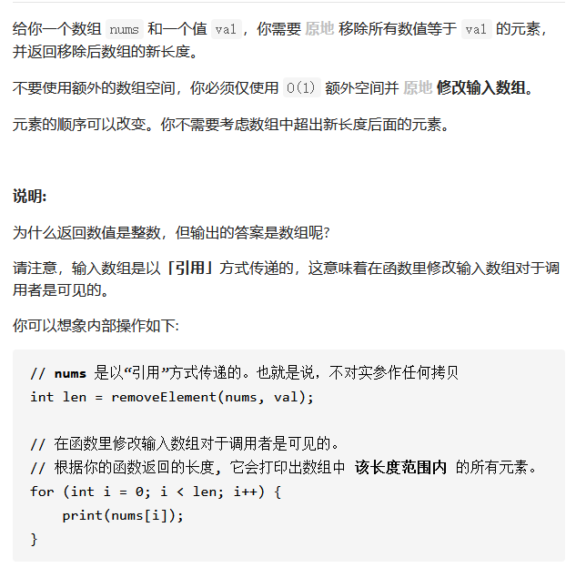
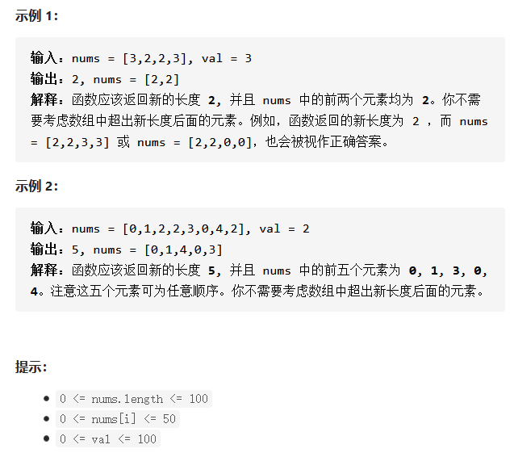

# 移除元素





## 暴力算法

```c++
class Solution {
public:
    int removeElement(vector<int>& nums, int val) {
            int size = nums.size();
            for(int i=0; i<size; i++){
                if(nums[i] == val){			// 发现需要移除的元素，就将数组集体向前移动一位
                for(int j=i+1; j<size; j++){
                    nums[j-1] = nums[j];
                }
                i--;		// 因为下表i以后的数值都向前移动了一位，所以i也向前移动一位
                size--; 	// 此时数组的大小-1
                }
            }
            return size;
    }
};
```

## 双指针

### 思路及算法

由于题目要求删除数组中等于 val 的元素，因此输出数组的长度一定小于等于输入数组的长度，

我们可以把输出的数组直接写在输入数组上。可以使用双指针：

右指针 right 指向当前将要处理的元素，左指针 left 指向下一个将要赋值的位置。

    如果右指针指向的元素不等于 val，它一定是输出数组的一个元素，我们就将右指针指向的元素复制到左指针位置，然后将左右指针同时右移；
    
    如果右指针指向的元素等于 val，它不能在输出数组里，此时左指针不动，右指针右移一位。

整个过程保持不变的性质是：区间 [0,left) 中的元素都不等于 val。当左右指针遍历完输入数组以后，left 的值就是输出数组的长度。

这样的算法在最坏情况下（输入数组中没有元素等于 val），左右指针各遍历了数组一次。

```c++
class Solution{
public:
	int removeElement(vector<int>& nums, int val){
	int n = nums.size();
	int left = 0;
	for(int right = 0; right<n; right++){
		if(nums[right] ! = val){
		nums[left] = nums[right];
		left++;
			}
		}
		return left;
	}
}
```

### 复杂度分析

- 时间复杂度：O(n)，其中 nnn 为序列的长度。我们只需要遍历该序列至多两次。

- 空间复杂度：O(1)，我们只需要常数的空间保存若干变量

## 双指针优化

### 思路

如果要移除的元素恰好在数组的开头，例如序列 [1,2,3,4,5]，当 val 为 1 时，我们需要把每一个元素都左移一位。注意到题目中说：「元素的顺序可以改变」。实际上我们可以直接将最后一个元素 5 移动到序列开头，取代元素 1，得到序列 [5,2,3,4]，同样满足题目要求。这个优化在序列中 val 元素的数量较少时非常有效。

实现方面，我们依然使用双指针，两个指针初始时分别位于数组的首尾，向中间移动遍历该序列。

### 算法

如果左指针 left 指向的元素等于 val，此时将右指针 right 指向的元素复制到左指针 left 的位置，然后右指针 right 左移一位。如果赋值过来的元素恰好也等于 val，可以继续把右指针 right 指向的元素的值赋值过来（左指针 left 指向的等于 val 的元素的位置继续被覆盖），直到左指针指向的元素的值不等于 val 为止。

当左指针 left 和右指针 right 重合的时候，左右指针遍历完数组中所有的元素。

这样的方法两个指针在最坏的情况下合起来只遍历了数组一次。与方法一不同的是，**方法二避免了需要保留的元素的重复赋值操作**。

```c++
class Solution {
public:
    int removeElement(vector<int>& nums, int val) {
        int left = 0;
        int right = nums.size();
        while(left<right){
            if(nums[left] == val){
                nums[left] = nums[right-1];
                right--;
            }else{
                left++;
            }
        }
        return left;
    }
};
```

### 复杂度分析

- 时间复杂度：O(n)，其中 n 为序列的长度。我们只需要遍历该序列至多一次。

- 空间复杂度：O(1)。我们只需要常数的空间保存若干变量。

