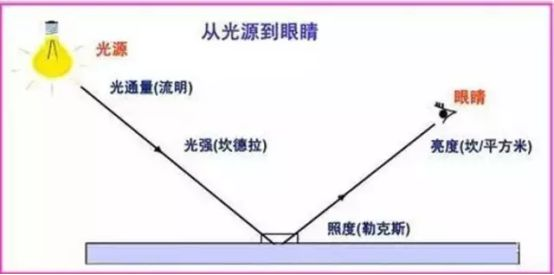
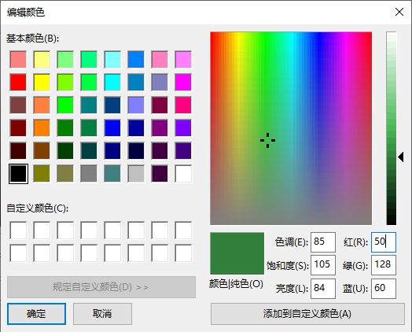
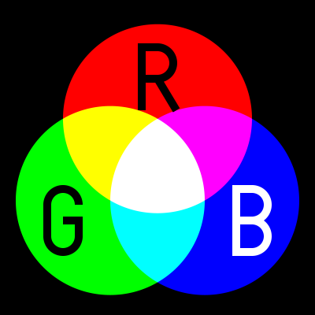
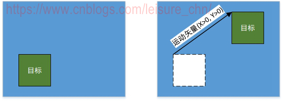
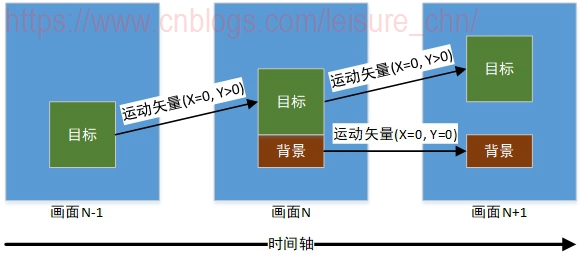
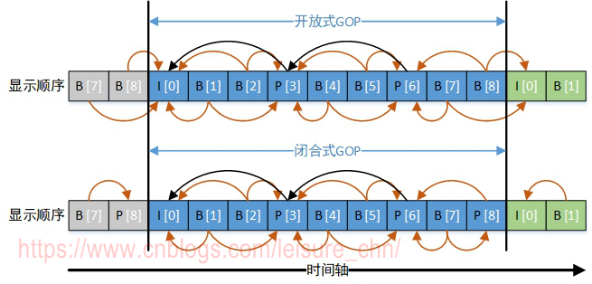
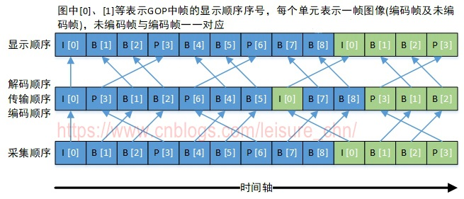

#  视频编码

视频编码的主要作用是**将视频像素数据(RGB,YUV等)压缩成为视频码流，从而降低视频的数据量**。 高效率的视频编码在同等的码率下，可以获得更高的视频质量。 

# 色彩空间与像素格式

## 1. 色彩空间基础

颜色是**不同波长的光对人眼刺激产生的色彩感觉**。最常用的色彩模型：RGB（用于计算机图形学),YUV(用于视频系统),CMYK(用于色彩印刷)

### 1.1 光的常用度量

 描述光的常用物理量有四个：**光通量、光强、照度、亮度**。 

  

#### 1.1.1 光通量

单位时间内由光源所发出或由被照物所吸收的总光能。单位流明。
在第一张图中，灯泡在单位时间内散发的的光的总和即为光通量。光通量衡量光源总的发光量。 

#### 1.1.2 光强

 光源在给定方向上，每单位立体角内所发出的的光通量。单位坎德拉。
在第一张图中，光源射向照射面的一根光线表示光强。光强衡量光源的发光强度。 

####  1.1.3 照度

物体表面每单位面积入射可见光的光通量。单位勒克斯。
照度在被观察者(被照物体)角度，衡量接受到的光的强弱。 

#### 1.1.4 亮度

 描述发光面或反光面上光的明亮程度的光度量。单位坎德拉每平方米。
亮度在观察者(人眼)角度，衡量感受到的光的明亮程度。

### 1.2 色度学基础

#### 1.2.1 彩色三要素

光的颜色取决于客观和主观两方面的因素。客观因素是**光的功率波谱分布**，它影响光源的颜色。主观因素是**人眼视频特性**，它影响人眼对色彩的感觉。 彩色三要素指**亮度**(Lightness)、**色调**(Hue)和**饱和度**(Saturation)，任一色彩都可以用这三个基本参量来表示： 

- **亮度**：表示**颜色明暗的程度**，是光作用于人眼时引起的明亮程度的感觉
- **色调**：表示**颜色的类别**，例如红色、蓝色、绿色指的就是色调
- **饱和度**：指**颜色的深浅程度**，也称彩度。例如深绿、浅绿指的就是饱和度，饱和度越高，颜色越深

#### 1.2.2 三原色原理

**三基色原理指自然界中大部分彩色都可以由三种基色按不同比例混合得到**。选择三种基色的前提的：每一种基色都不能由另外两种基色混合得到，**这三种基色互相独立**。三基色原理主要内容如下： 

1. 自然界中的绝大部分彩色，都可以由三种基色按一定比例混合得到；反之，任意一种彩色均可被分解为三种基色。
2. 作为基色的三种彩色，要相互独立，即其中任何一种基色都不能由另外两种基色混合来产生。
3. 由三基色混合而得到的彩色光的亮度等于参与混合的各基色的亮度之和。
4. 三基色的比例决定了混合色的色调和色饱和度。

不同颜色混合在一起能产生新的颜色，这种方法称为**混色法**。色彩空间 RGB 是采用了 R、G、B 三种基色，色彩空间 CMYK 是采用了 C、M、Y 三种基色。

我们看一张包含彩色三要素和 RGB 三原色的示意图：

  

## 2. RGB色彩空间

### 2.1 加色法和减色法

一些经验观点：

> -  RGB 三原色不是唯一的正交基，还可以有其他选择，只不过 RGB 能组合出来的颜色更为丰富。 
> -  不考虑人类视觉的特殊性时，我们平时所认为的“红+绿=黄”之类的“颜色叠加”是不成立的。因为红色和绿色的单色光的混合只有在人类的视觉中才会跟黄色的单色光一样，它们在其它动物的视觉中不一定是一样的。也就是说，不考虑人类视觉的特殊性时，不存在 RGB 颜色空间。 
> -  人类有三种视锥细胞用于感知颜色，这三种视锥细胞对红(R)、绿(G)、蓝(B)三种颜色敏感。 

**人眼看到的物体颜色**，是光源照射到物体，物体吸收(还有透射)部分颜色的光，然后从物体表面反射的光线进入人眼后人眼得到的色彩感觉。 
**人眼看到物体为黑色**，是因为没有光线从物体表面反射进入人眼。一种情况是物体将光线完全吸收，没有光从物体表面反射出来(例如白天我们看一件黑衣服)；另外一种情况是没有任何光线照射到物体(例如黑夜我们看一张白纸)。
**人眼看到物体为白色**，是因为在白光源照射下，物体不吸收光线而将光线全部反射(例如白天我们看一张白纸)。

颜色与光源和物体的吸色特性密切相关，基于此，引出混色方法中的加色法和减色法。 

加色法利用光源发射特性，将各分色的光谱成分相加得到混合颜色。RGB 色彩空间采用加色法。当无任何光线照射时，R、G、B 三种颜色分量都为 0 时，物体呈现**黑色**；当 R、G、B 三种颜色分量达到最大时，物体不吸收光线只反射的情况下，物体呈现**白色**。我们称黑色为最暗，白色为最亮，要达到最亮状态，需要三色分量最大程度混合，因此称为加色。 

 加色法用于自发光物体。RGB 颜色空间主要应用于计算机显示器、电视机、舞台灯光等，都具有发光特性。彩色像素在显示器屏幕上不会重叠，但足够的距离时，光线从像素扩散到视网膜上会重叠，人眼会感觉到重叠后的颜色效果。 

  

减色法是利用颜料吸色特性，每加一种颜色的颜料，会吸收掉对应的补色成分。CMYK 色彩空间采用减色法。例如，我们在白纸(白光照射、不吸收、全反射)上涂颜料，黄色颜料能吸收蓝色(黄色的补色)，因此在白光照射下显示黄色，当黄(Y)、青(C)、品红(M)三色混在一起且颜色分量都为最大时，它们的补色成分被吸收掉，变成了黑色；当三色分量为 0 即什么也不涂时，白纸显现白色。要达到最大亮度，需要三色分量完全消失，因此称为减色。 

 印刷时，无法达到理想程度，C、M、Y 最大程度混合后无法得到纯黑色，只能得到深灰色，因此在 C、M、Y 三色之外引入了 K(黑色)。 

 减色法用于无法发光的物体。CMYK 颜色空间主要应用于印刷、绘画、布料染色等。 

  

### 2.2 存储模式

 RGB 色彩空间中每个像素点包含了 R、G、B 三种分量。RGB 存储模式也有 **packed** 和 **planar** 两类，这两种模式的区分在第 3 节中讲述。RGB 色彩空间及存储模式比较简单，我们挑几个有代表性的存储模式来简述一下： 

#### 2.2.1 RGB565

使用 16b(bit)表示一个像素，5b 用于 R，6b 用于 G，5b 用于 B。如下：

```
[ R G B ]  [ R G B ]  [ R G B ]  [ R G B ]
[ R G B ]  [ R G B ]  [ R G B ]  [ R G B ]
```

以上只是示意图，实际 R、G、B 顺序可能与图中不同。

#### 2.2.2 RGB888

 使用 24 位来表示一个像素，每个分量都用 8 位表示。其示意图跟 RGB565 示意图类似。 

#### 2.2.3 ARGB8888

使用 32 位来表示一个像素，R、G、B 都用 8 位表示，另外 A(Alpha)表示透明度，也用 8 位表示。

```
[ A R G B ]  [ A R G B ]  [ A R G B ]  [ A R G B ]
[ A R G B ]  [ A R G B ]  [ A R G B ]  [ A R G B ]
```

以上只是示意图，实际 A、R、G、B 顺序可能与图中不同。

## 3. YUV色彩空间

YUV 颜色空间是 PAL、NTSC、SCEAM 三大视频标准使用的颜色空间，主要应用于视频系统。**YUV 色彩空间中，Y 表示亮度信息，U 和 V 表示色调和饱和度信息。** 

 YUV 颜色空间和 RGB 颜色空间可以根据公式相互转换。 

 经常提到的还有 YPbPr 和 YCbCr。YPbPr 指模拟分量信号(或接口)，P(Parallel)表示并行，b 下标表示蓝，r 下标表示红。YCbCr 指的是数字分量信号(或接口)，C(Chroma)表示色度。YCbCr 还可指色彩空间，YCbCr 色彩空间是 YUV 色彩空间的缩放和偏移版本。 

>  YUV, YCbCr, YPbPr 所指涉的范围，常有混淆或重叠的情况。从历史的演变来说，其中 YUV 和 Y'UV 通常用来编码电视的模拟信号，而 YCbCr 则是用来描述数字的视频信号，适合影片与图片压缩以及传输，例如 MPEG、JPEG。 但在现今，YUV 通常已经在计算机系统上广泛使用。

### 3.1 YUV采样模式与存储模式

人眼有一个特性：对亮度更敏感，对色度没有那么敏感。因此**压缩色度分量可以降低数据量**，但并不会人眼主观感觉造成太大影响。这是 YUV 采样的理论基础。主流的采样方式有三种，**YUV4:4:4，YUV4:2:2，YUV4:2:0**。这些采样方式，不压缩 Y 分量，对 UV 分量的压缩程度不同。 

同一种采样方式，数据在内存中可以有不同的排布方式。YUV 数据在内存中的排布方式称作 **YUV 存储模式**。YUV 存储模式分成三大类： 

-  **packed**：将 Y、U、V 分量交织存放在一起，和 RGB 的存放方式类似。内存中排列形式类似：YVYUYVYUYVYUYVYU...。在具体的存储模式命名中，packed 格式不带后缀 P。 
-  **planar**：将 Y、U、V 的三个分量分别存放在不同的矩阵(平面)中。内存中排列形式类似：YYYYYY...，UUUUUU...，VVVVVV...。在具体的存储模式命名中，planar 格式带后缀 P。 
-  **semi-planar**：将 Y、U、V 三个分量放在两个矩阵(平面)中。Y 占用一个平面，UV 共用一个平面。内存中排列形式类似：YYYYYY...，UVUVUV...。在具体的存储模式命名中，semi-planar 格式带后缀 SP。 

注意：packed 格式通常用于只含水平采样的采样方式。packed 格式不能处理垂直采样，否则会导致不同的行尺寸不一。 

存储模式是一种较粗粒度的划分方式，主要依据不同分量在不同 plane 中的排列顺序来划分存储模式，一种存储模式定义了各分量样本在内存中的布局方式，而更一步的细节并不明确。像素格式则是细粒度的划分方式，一种像素格式中图像数据的内存组织方式的所有细节都是确定的，像素格式在第 4 节讲解。 

### 3.2 采样方式的命名含义

为方便描述，我们将一个 Y 值称作一个**亮度样本**。一对 Cb+Cr 值称作一个**色度样本**。因为采样方式中只对色度进行下采样，不对亮度进行下采样，所以在一幅图像中，**亮度样本数等于图像像素总数**。 

#### 3.2.1  J：a：b命名法

 采样方式采用的是 J：a：b 命名形式。这个比例指的是在水平方向上的相对采样率，注意此形式的命名中并没有体现垂直方向的采样率。J：a：b 表示，**一幅图像中总像素数目(奇数行+偶数行的总像素数，也等于总亮度样本数)：奇数行中的色度样本数：偶数行中的色度样本数。**按照惯例，J 通常都是 4。 

  

以上图来理解，图中 a 部分，一个细线方框表示一个图像像素，一个粗线方框表示一个色度样本(即一对 Cb、Cr)。可以看到 YUV4:4:4 中，一个图像像素对应一个色度样本，而 YUV4:4:0 和 YUV4:2:2 则是两个图像像素对应一个色度样本，YUV4:2:0 和 YUV4:1:1 是四个图像像素对应一个色度样本，YUV4:1:0 是 8 个图像像素对应一个色度样本。这幅图看起来非常直观，**一眼能看出一幅图像中大概多少个像素采样出一个色度样本**。

图中 b 部分则详解了各种采样方式的命名含义。J：a：b 命名形式中，引入了图像参考块的概念，参考块是 J 个像素宽(J 实际是 4)2 个像素高的一个图像块，那么 J：a：b 的含义就是，J 个像素宽的参考块中，第一行中有 a 个色度样本，第二行中有 b 个色度样本。此处由参考块解释的 J：a：b 的含义，与前文提到的 J：a：b 表示图像总像素数目:奇数行中的色度样本数:偶数行中的色度样本数，实际含义是一致的。

#### 3.2.2 h/v 命名法

 其实，采样方式可以由两个简单含义的数字描述：**水平和垂直采样因子**。水平采样因子表示在水平方向每多少个像素采样出一个色度样本，垂直采样因子表示在垂直方向每多少个像素采样出一个色度样本。这种方式可以称作 h/v 命名形式。 

 采样方式的水平采样率和垂直采样率，这更便于理解。如下表： 

| J：a：b | h/v  | 说明                                                         |
| :------ | :--- | :----------------------------------------------------------- |
| 4:4:4   | 1/1  | 水平方向，每 1 个像素采样出 1 个色度样本；垂直方向，每 1 个像素采样出 1 个色度样本 |
| 4:4:0   | 1/2  | 水平方向，每 1 个像素采样出 1 个色度样本；垂直方向，每 2 个像素采样出 1 个色度样本 |
| 4:2:2   | 2/1  | 水平方向，每 2 个像素采样出 1 个色度样本；垂直方向，每 1 个像素采样出 1 个色度样本 |
| 4:2:0   | 2/2  | 水平方向，每 2 个像素采样出 1 个色度样本；垂直方向，每 2 个像素采样出 1 个色度样本 |
| 4:1:1   | 4/1  | 水平方向，每 4 个像素采样出 1 个色度样本；垂直方向，每 1 个像素采样出 1 个色度样本 |
| 4:1:0   | 4/2  | 水平方向，每 4 个像素采样出 1 个色度样本；垂直方向，每 2 个像素采样出 1 个色度样本 |

### 3.3 采样方式 YUV4:4:4

 YUV4:4:4 采样方式中，水平方向，每 1 个像素采样出 1 个色度样本；垂直方向，每 1 个像素采样出 1 个色度样本。以４x4 像素点阵为例，每一个像素都有独立的ＵＶ分量可供使用。如下(每个[]为一个像素点)： 

```
[ Y U V ]  [ Y U V ]  [ Y U V ]  [ Y U V ]
[ Y U V ]  [ Y U V ]  [ Y U V ]  [ Y U V ]
[ Y U V ]  [ Y U V ]  [ Y U V ]  [ Y U V ]
[ Y U V ]  [ Y U V ]  [ Y U V ]  [ Y U V ]
```

 在这种采样方式下，一个像素点包含的完整的亮度信息和色度信息。 

### 3.4 采样方式 YUV 4:2:2

 参考图４和表１可知，YUV4:2:2 采样方式中，水平方向，每 2 个像素采样出 1 个色度样本；垂直方向，每 1 个像素采样出 1 个色度样本。  以下图４x4 像素点阵为例进行说明。每 2 个像素共用 1 组 UV 分量。 

```
[ Y U ]  [ Y V ]  [ Y U ]  [ Y V ]
[ Y V ]  [ Y U ]  [ Y V ]  [ Y U ]
[ Y U ]  [ Y V ]  [ Y U ]  [ Y V ]
[ Y V ]  [ Y U ]  [ Y V ]  [ Y U ]
```

若位深是 8，平均算来，一个像素占用的数据宽度为 16b，其中 Y 占 8b，U 占 4b，V 占 4b。后面存储模式命名中的数字 16 指的就是 16b。 

在这种采样方式下，一个像素点里含的数据是不完整的，还原出一个像素点，需要相邻的两个像素点数据，如下：

```
[ Y U ]  [ Y V ]
```

在同一采样模式下，根据分量元素排列顺序的不同，又分为不同的存储模式：

#### 3.4.1 packed存储模式 YUYV 和 UYVY

 YUYV(YUY2) 模式： 

```
[ Y U ]  [ Y V ]  [ Y U ]  [ Y V ]
[ Y V ]  [ Y U ]  [ Y V ]  [ Y U ]
[ Y U ]  [ Y V ]  [ Y U ]  [ Y V ]
[ Y V ]  [ Y U ]  [ Y V ]  [ Y U ]
```

 UYVY 存储模式： 

```
[ U Y ]  [ V Y ]  [ U Y ]  [ V Y ]
[ U Y ]  [ V Y ]  [ U Y ]  [ V Y ]
[ U Y ]  [ V Y ]  [ U Y ]  [ V Y ]
[ U Y ]  [ V Y ]  [ U Y ]  [ V Y ]
```

#### 3.4.2 planar存储模式 YUV422P

YU16：

```
Y Y Y Y
Y Y Y Y
Y Y Y Y
Y Y Y Y
-------
U U U U
U U U U
-------
V V V V
V V V V
```

YV16：

```
Y Y Y Y
Y Y Y Y
Y Y Y Y
Y Y Y Y
-------
V V V V
V V V V
-------
U U U U
U U U U
```

#### 3.4.3 semi-planar 存储模式 YUV422SP

NV16：

```
Y Y Y Y
Y Y Y Y
Y Y Y Y
Y Y Y Y
-------
U V U V
U V U V
U V U V
U V U V
```

NV61：

```
Y Y Y Y
Y Y Y Y
Y Y Y Y
Y Y Y Y
-------
V U V U
V U V U
V U V U
V U V U
```

### 3.5 采样方式 YUV4：2：0

参考图４和表１可知，YUV4:2:0 采样方式中，水平方向，每 2 个像素采样出 1 个色度样本；垂直方向，每 2 个像素采样出 1 个色度样本。

每 4 个像素共用 1 组 UV 分量。若位深是 8，平均算来，一个像素占用的数据宽度为 12b，其中 Y 占 8b，U 占 2b，V 占 2b。后面存储模式命名中的数字 12 指的就是 12b。

```
[ Y U ]  [ Y ]  [ Y U ]  [ Y ]
[ Y V ]  [ Y ]  [ Y V ]  [ Y ]
[ Y U ]  [ Y ]  [ Y U ]  [ Y ]
[ Y V ]  [ Y ]  [ Y V ]  [ Y ]
```

在这种采样方式下，还原出一个像素点，需要相邻的四个像素点数据，如下：

```
[ Y U ]  [ Y ]
[ Y V ]  [ Y ]
```

### 3.6 yuv444、yuv422、yuv420的区别

**YUV 4:4:4采样，每一个Y对应一组UV分量，一个YUV占8+8+8=24bits，3个字节
YUV 4:2:2采样，每两个Y共用一组UV分量，一个YUV占8+4+4=16bits，2个字节
YUV 4:2:0采样，每四个Y共用一组UV分量，一个YUV占8+2+2=12bits，1.5个字节** 

假如图像视720※576的
(1) yuv444，图片的大小是720x576x3个字节，是总像素大小的3倍
y的字节是720x576
u的字节是720x576
v的字节是720x576 

 YUV444，这种格式占用空间最大，每个像素点有一个Y分量+一个U分量+一个V分量，所以和rgb一样每个像素点占用3个字节！ 

（2） yuv422，图片的大小是720x576x2个字节，是总像素大小的2倍
 y的字节是720x576
u的字节是720x576 /2
v的字节是720x576 /2 

 YUV422 每两个Y分量公用一个UV分量，所以一个像素占用两个字节，根据存储顺序不同又分为四种不同的格式

（3） yuv420，图片的大小是720x576x3/2个字节,是总像素大小的1.5倍
y的字节是720x576
u的字节是720x576 /4 
v的字节是720x576 /4 

 YUV420 每四个y分量共用一个UV分量，所以每个像素点占用1.5个字节空间，根据存储顺序不一样又分为四个不同的类型  

# 视频压缩原理

## 熵与冗余

在所有的实际节目素材中，存在着两种类型的信号分量：即异常的、不可预见的信号分量和可以预见的信号分量。**异常分量称为熵，它是信号中的真正信息。**其余部分称为**冗余**，因为它不是必需的信息。冗余可以是**空间性**的，如在图像的大片区域中，**邻近像素几乎具有相同的数值**。冗余也可以是**时间性**的，例如连**续图像之间的相似部分**。在所有的压缩系统编码器中都是将熵与冗余相分离，**只有熵被编码和传输，而在解码器中再从编码器的发送的信号中计算出冗余。** 

## 帧内编码

帧内编码是**空间域编码**，利用**图像空间性冗余度**进行图像压缩，处理的是一幅独立的图像，不会跨越多幅图像。空间域编码依赖于一幅图像中**相邻像素间的相似性**和**图案区的主要空间域频率**。

JPEG标准用于静止图像(即图片)，只使用了空间域压缩，**只使用帧内编码**。

## 帧间编码

帧间编码是**时间域编码**，是利用**一组连续图像间的时间性冗余度**进行图像压缩。如果某帧图像可被解码器使用，那么解码器只须利用两帧图像的差异即可得到下一帧图像。比如运动平缓的几帧图像的相似性大，差异性小，而运动剧烈的几幅图像则相似性小，差异性大。当得到一帧完整的图像信息后，**可以利用与后一帧图像的差异值推算得到后一帧图像**，这样就实现了数据量的压缩。时间域编码依赖于**连续图像帧间的相似性**，尽可能利用已接收处理的图像信息来“预测”生成当前图像。

MPEG标准用于运动图像(即视频)，会使用**空间域编码**和**时间域编码**，因此是**帧内编码和帧间编码结合使用。**

## 运动矢量

一组连续图像记录了目标的运动。运动矢量**用于衡量两帧图像间目标的运动程度**，运动矢量由**水平位移量**和**垂直位移量**二者构成。 

## 运动补偿

目标的运动降低了图像间的相似性，增加了差异数据量。而运动补偿则**通过运动矢量来降低图像间的差异数据量**。 

下图为运动补偿的示意图。当某一目标运动时，其位置会变化但形状颜色等基本不变。编码器则可利用运动矢量减低图像差值，解码器根据图像差值中的运动矢量移动目标到合适的位置即可。假设图中是理想情况，目标除移动位置外其他任何属性无任何变化，则两幅图像间的差值仅包含运动矢量这一数据量。显然运动补偿可以显著减少图像差值数据量。 

  

## 双向预测

  

 连续的三幅图像中，目标块有垂直位置上的移动，背景块无位置移动。我们考虑如何取得当前帧图像(画面N)：
画面N中，目标向上移动后，露出背景块。
画面N-1中，因为背景块被目标块遮挡住了，因此没有背景块相关信息。
画面N+1中，完整包含背景块的数据，因此画面N可以从画面N-1中取得背景块。
如何可以得到画面N呢？解码器可以先解码得到画面N-1和画面N+1，通过画面N-1中的目标块数据结合运动矢量即可得到画面N中的目标块数据，通过画面N+1中的背景块数据则可得到画面N中的背景块数据。三幅画面的解码顺序为：N-1, N+1, N。三幅画面的显示顺序为：N-1, N, N+1。画面N通过其前一幅画面N-1和后一幅画面N+1推算(预测，predicted)得到，因此这种方式称为**双向预测**(或前向预测、双向参考)。 

## I帧、IDR帧、P帧、B帧

**I帧**： I帧(Intra-coded picture, **帧内编码帧**，常称为**关键帧**)**包含一幅完整的图像信息**，属于帧内编码图像，**不含运动矢量，在解码时不需要参考其他帧图像**。因此在I帧图像处可以切换频道，而不会导致图像丢失或无法解码。I帧图像**用于阻止误差的累积和扩散**。在闭合式GOP中，每个GOP的第一个帧一定是I帧，且当前GOP的数据不会参考前后GOP的数据。 

**IDR帧**： IDR帧(Instantaneous Decoding Refresh picture, **即时解码刷新帧**)是一种特殊的I帧。当解码器解码到IDR帧时，会将DPB(Decoded Picture Buffer，指**前后向参考帧列表**)**清空**，**将已解码的数据全部输出或抛弃**，然后开始一次全新的解码序列。**IDR帧之后的图像不会参考IDR帧之前的图像，因此IDR帧可以阻止视频流中的错误传播**，同时IDR帧也是解码器、播放器的一个安全访问点。 

**P帧**： P帧(Predictive-coded picture, **预测编码图像帧**)是**帧间编码帧**，**利用之前的I帧或P帧进行预测编码**。 

**B帧**： B帧(Bi-directionally predicted picture, **双向预测编码图像帧**)是**帧间编码帧**，利用之前和(或)之后的I帧或P帧进行双向预测编码。B帧不可以作为参考帧。
B帧具有更高的压缩率，但需要更多的缓冲时间以及更高的CPU占用率，因此B帧适合本地存储以及视频点播，而不适用对实时性要求较高的直播系统。 

## GOP

GOP (Group Of Pictures, 图像组)是**一组连续的图像**，由**一个I帧和多个B/P帧组成**，是编解码器存取的基本单位。 GOP结构常用的两个参数M和N，M指定GOP中两个anchor frame(anchor frame指可被其他帧参考的帧，即I帧或P帧)之间的距离，N指定一个GOP的大小。例如M=3，N=15，GOP结构为：IBBPBBPBBPBBPBB 

 <font color=FF0000>TODO</font>: GOP中是否每两个anchor frame的间隔是相同的？推测：未必相同。实际上分析不少视频文件，规律并不一致。此处没有彻底弄清楚，待进一步积累素材、分析与确认。

GOP有两种：闭合式GOP和开放式GOP：

**闭合式GOP**：闭合式GOP只需要参考本GOP内的图像即可，不需参考前后GOP的数据。这种模式决定了，闭合式GOP的显示顺序总是以I帧开始以P帧结束

<font color=FF0000>TODO</font>: 闭合式GOP是否一定是以P帧结束？推测：可能未必有此定义。有看到某些视频文件GOP以B帧结束。

**开放式GOP**：开放式GOP中的B帧解码时可能要用到其前一个GOP或后一个GOP的某些帧。码流里面包含B帧的时候才会出现开放式GOP。

<font color=FF0000>TODO</font>: 开放式GOP是否规定是以B帧开始，P帧结束？推测：可能未必有此定义。是否以B帧开始？网上资料说法不一。是否以P帧结束？有看到某些视频文件GOP以B帧结束。

在开放式GOP中，普通I帧和IDR帧功能是有差别的，需要明确区分两种帧类型。在闭合式GOP中，普通I帧和IDR帧功能没有差别，可以不作区分。

开放式GOP和闭合式GOP中I帧、P帧、B帧的依赖关系如下图所示：

  

## DTS和PTS

DTS(Decoding Time Stamp, **解码时间戳**)，表示压缩帧的解码时间。  
PTS(Presentation Time Stamp, **显示时间戳**)，表示将压缩帧解码后得到的原始帧的显示时间。
音频中DTS和PTS是相同的。视频中由于B帧需要双向预测，B帧依赖于其前和其后的帧，因此含B帧的视频解码顺序与显示顺序不同，即DTS与PTS不同。当然，不含B帧的视频，其DTS和PTS是相同的。下图以一个开放式GOP示意图为例，说明视频流的解码顺序和显示顺序 

  

**采集顺序**指图像传感器采集原始信号得到图像帧的顺序。
**编码顺序**指编码器编码后图像帧的顺序。存储到磁盘的本地视频文件中图像帧的顺序与编码顺序相同。
**传输顺序**指编码后的流在网络中传输过程中图像帧的顺序。
**解码顺序**指解码器解码图像帧的顺序。
**显示顺序**指图像帧在显示器上显示的顺序。
**采集顺序与显示顺序相同。编码顺序、传输顺序和解码顺序相同。**
以图中“B[1]”帧为例进行说明，“B[1]”帧解码时需要参考“I[0]”帧和“P[3]”帧，因此**“P[3]”帧必须比“B[1]”帧先解码**。这就导致了解码顺序和显示顺序的不一致，后显示的帧需要先解码。

# 常见的视频编码格式

 所谓视频编码方式就是指通过特定的压缩技术，将某个视频格式的文件转换成另一种视频格式文件的方式

## 视频传输中的编码标准

1. 国际电联的H.264
2.  国际标准化组织运动图像专家组的MPEG系列标准 
3.  微软公司的WMV 
4.  Apple公司的 QuickTime 
5.  google力推的WebM格式 

**视频编码格式**

高清视频的编码格式有五种，即H.264、 MPEG-4、MPEG-2、WMA-HD以及VC-1。 

## H.264

>  H.264是由国际电信联盟（iTU-T）所制定的新一代的视频压缩格式。H.264的数据压缩比能比当前DVD系统中使用的 MPEG-2高2～3倍，比MPEG-4高1.5～2倍。正因为如此，经过H.264压缩的视频数据，在网络传输过程中所需要的带宽更少，也更加经济. 

**缺点：**

1.  与MPEG-4一样，经过H.264压缩的视频文件一般也是**采用avi 作为其后缀名**，同样不容易辨认，只能通过解码器来自己识别。 
2.  H.264编码的影片在播放的时候**对硬件系统也提出了非常高的要求**。 

据相关资料显示，H.264的影片在编码的过程中复杂度是MPEG2的10倍，解码的复杂度是MPEG2的3倍，这对于CPU来说是很沉重的负担，而显卡芯片如果要整合硬件解码模块，其难度也随之加大。 

**优点**:

1.  H.264 使图像压缩技术上升到了一个更高的阶段，**能够在较低带宽上提供高质量的图像传输**，该优点非常适合国内运营商用户量大、接入网/骨干网带宽相对有限的状况。 

**特点**：

1.  更高的编码效率 
2.  高质量的视频画面 
3.  提高网络适应能力：H.264可以工作在实时通信应用（如视频会议）低延时模式下，也可以工作在没有延时的视频存储或视频流服务器中。 
4.  采用混合编码结构 
5.  错误恢复功能：H.264**提供了解决网络传输包丢失的问题的工具**，适用于在高误码率传输的无线网络中传输视频数据。 
6.  较高的复杂度：264性能的改进是以增加复杂性为代价而获得的。据估计，H.264编码的计算复杂度大约相当于H.263的3倍，解码复杂度大约相当于H.263的2倍。 

## MPEG-4

由于MPEG4只处理图像帧与帧之间有差异的元素，而舍弃相同的元素，因此大大减少了合成多媒体文件的体积。应用MPEG4技术的影音文件最显著特点就是 **压缩率高且成像清晰**，一般来说，一小时的影像可以被压缩为350M左右的数据，而一部高清晰度的DVD电影, 可以压缩成两张甚至一张650M CD光碟来存储。

> MPEG-4不仅可提供高压缩率，同时也可实现更好的多媒体内容互动性及全方位的存取性，它采用开放的编码系统，可随时加入新的编码算法模块，同时也可根据不同应用需求现场配置解码器，以支持多种多媒体应用。
> 优点:
> 1.具有很好的兼容性；
> 2.MPEG-4比其他算法提供更好的压缩比，最高达200：1；
> 3.MPEG-4在提供高压缩比的同时，对数据的损失很小。所以，mpeg-4的应用能大 幅度的降低录像存储容量，获得较高的录像清晰度，特别适用于长时间实时录像的需求，同时具备在低带宽上优良的网络传输能力。
> 4.采用开放的编码系统,可以加入新的编码算法模块.

## VC-1

> VC-1是软件巨头微软力推的一种视频编码的格式
> 总的来说，从压缩比上来看，H.264的压缩比率更高一些，也就是同样的视频，通过H.264编码算法压出来的视频容量要比VC-1的更小，但是VC-1 格式的视频在解码计算方面则更小一些，一般通过高性能的CPU就可以很流畅的观看高清视频。（H.264对硬件的要求比较高）

VC-1目前的气势依然弱于H.264，也弱于MPEG-4，一方面是VC-1在技术层面上的实际表现与H.264无太大差异，VC-1同样以MPEG-4为基础，但并没有特别的突出点或优越性，运营商从技术角度考虑没有必要非选择VC-1。
另外，从授权角度来看VC-1是否有优势呢？答案是三者中最不利的，碍于Microsoft一贯的推行策略，VC-1的授权来源仅只一家，授权价格与方式调整，以及后续版本的改进方向，都由微软一手掌握，无人能左右，眼前为与MPGE-4、H.264等竞争，VC-1授权自然不敢过高，但运营商依然对未来是否会涨价表示担心。

## MPEG-2

> 目前的MPEG-2的视频在蓝光时代一样是得到了重用，MPEG-2不是MPEG -1的简单升级，MPEG-2在系统和传送方面作了更加详细的规定和进一步的完善。MPEG-2特别适用于广播级的数字电视的编码和传送，被认定为SDTV和HDTV的编码标准。DVD影碟就是采用MPEG-2压缩标准。

## 各种视频编码格式性能比较

| **性能**         | **MPEG2**                                                    | **MPEG4**                                                    | **H264**                                                     | **VC-1**                                          |
| ---------------- | ------------------------------------------------------------ | ------------------------------------------------------------ | ------------------------------------------------------------ | ------------------------------------------------- |
| 压缩比(MPEG2为1) | 100%                                                         | 50%~60%                                                      | 25%~40%                                                      | 30%~40%                                           |
| 对硬件的要求     | 最低                                                         | 较低                                                         | 最高                                                         | 较高                                              |
| 授权成本         | 最低                                                         | 较高                                                         | 最低                                                         | 较低                                              |
| 画面质量         | 一般                                                         | 较好                                                         | 最好                                                         | 最好                                              |
| 适用场景         | 适用于广播级的数字电视的编码和传送，被认定为SDTV和HDTV的编码标准。DVD影碟就是采用MPEG-2压缩标准。 | MPEG-4在提供高压缩比的同时，对数据的损失很小。所以，mpeg-4的应用能大幅度的降低录像存储容量，获得较高的录像清晰度，特别适用于长时间实时录像的需求 | H.264可以工作在实时通信应用（如视频会议）低延时模式下，也可以工作在没有延时的视频存储或视频流服务器中。 | 高压缩比,画面质量好但是对硬件要求没有H264高的场景 |


# 参考文章

-  [视频编解码基础概念 - 叶余 - 博客园 (cnblogs.com)](https://www.cnblogs.com/leisure_chn/p/10285829.html) 
-  [色彩空间与像素格式 - 叶余 - 博客园 (cnblogs.com)](https://www.cnblogs.com/leisure_chn/p/10290575.html) 
-  [视音频编解码技术零基础学习方法_雷霄骅(leixiaohua1020)的专栏-CSDN博客_雷霄骅](https://blog.csdn.net/leixiaohua1020/article/details/18893769) 