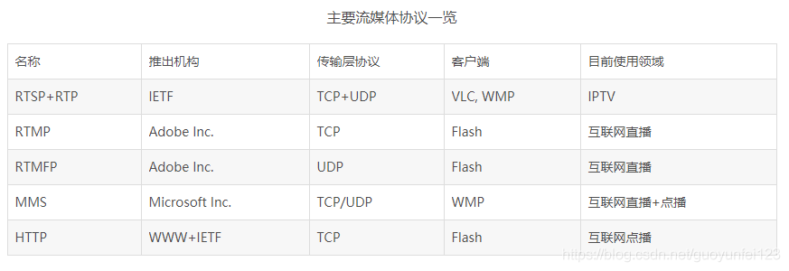
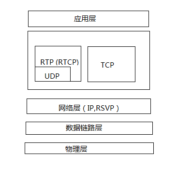

## 流媒体协议

 流媒体协议是**服务器与客户端之间通信遵循的规定**。当前网络上主要的流媒体协议如表所示。 

# 流媒体传输协议

常用的流媒体协议主要有**HTTP渐近下载**和**基于RTSP/RTP的实时流媒体协议**两类。在流式传输的实现方案中，一般采用**HTTP/TCP**来**传输控制信息**，而用**RTP/UDP**来传输实时多媒体数据。

## 1. 实时传输协议RTP与RTCP

RTP(Real-time Transport Protocol)是用于Internet上针对**多媒体数据流**的一种传输协议。

由两个紧密链接部分组成

- **RTP-----------传送具有实时属性的数据**
- **RTP控制协议(RTCP)--------------监控服务质量并传送正在进行的会话参与者的相关信息**

RTP协议是建立在**UDP协议**上的。RTP协议详细说明了**在互联网上传递音频和视频的标准数据包格式**。RTP协议常用于流媒体系统(配合RTCP协议)、视频会议和视频电话系统(配合H.263或SIP)

RTP本身并没有提供按时发送机制或其他服务质量(QoS)保证，它依赖于底层服务去实现这一过程。RTP并不保证传送或防止无序传送，也不确定底层网络的可靠性。**RTP实行有序传送**，RTP中的**序列号允许接收方重组发送方的包序列**。同时序列号也能决定适当的包位置。例如：在视频解码中，就不需要顺序解码。

实时传输控制协议(Real-time Transport Control Protocol, RTCP)是实时传输协议(RTP)的一个姐妹协议。

- RTCP**为RTP媒体流提供信道外控制**。
- RTCP定期在流多媒体会话参加者之间传输控制数据。
- RTCP的主要功能是**为RTP所提供的服务质量提供反馈**。
- RTCP收集相关媒体连接的统计信息。例如：传输字节数，传输分组数，丢失分组数，时延抖动，单向和双向网络延迟等等。网络应用程序可以利用RTCP所提供的信息试图提高服务质量，比如限制信息流量或改用压缩比较小的编解码器。
- RTCP本身不提供数据加密或身份认证，其伴生协议SRTCP(安全实时传输控制协议)则可用于此类用途。

## 2. 实时流协议RTSP

RTSP协议定义了**一对多应用程序如何有效通过IP网络传输多媒体协议**。RTSP在体系结构上位于RTP和RTCP之上。**它使用TCP或RTP完成数据传输。**

HTTP与RTSP相比，HTTP传送HTML，而RTP传送的是多媒体数据。HTTP请求由客户机发出，服务器做出响应；RTSP可以是**双向**的，即客户机和服务器都可以发出请求。

RTSP与RTP最大的区别在于：**RTSP是一种双向实时数据传输协议，它允许客户端向服务器发送请求，如回放、快进、倒退等操作**。当然RTSP可基于RTP来传送数据，还可以连接TCP、UDP、组播UDP等通道来发送数据，具有很好的扩展性。它是一种类似于HTTP协议的网络应用协议。

## 3. 资源预定协议RSVP

RSVP即资源预订协议，使用RSVP预留一部分网络资源(即带宽)，能在一定程度上为流媒体的传输提供Qos。

Qos(服务质量)指一个网络能够利用各种基础技术，为指定的网络通信提供更好的服务能力，是网络的一种安全机制，是用来**解决网络延迟和阻塞**等问题的一种技术。

RSVP、RTSP与RTP协议工作在不同的层次，如下图所示

## 4. 实时消息传输协议RTMP

RTMP(Real Time Messaging Protocol) 是Adobe System公司为**Flash播放器和服务器之间音频、视频和数据传输**开发的开放协议。它有三种变种：

- 工作在TCP之上的明文协议，使用端口1935；
- RTMP封装在HTTP请求之中，可穿越防火墙；
- RTMPS类似RTMPT，但使用的是HTTPS连接。

RTMP视频播放的特点：

- RTMP协议是采用实时的流式传输，所以不会缓存文件到客户端，这种特性说明用户想下载RTMP协议下的视频是比较难的
- 视频流可以随便拖动，既可以从任意时间点向服务器发送请求进行播放，并不需要视频有关键帧。相比而言，HTTP协议下的视频需要有关键帧才可以随意拖动。
- RTMP协议支持点播、回放(通俗点讲就是支持把flv,f4v,mp4文件放在RTMP服务器，客户端可以直接播放)，直播(边录制视频边播放)

## 5. 微软媒体服务器协议MMS

MMS(Microsoft Media Server Protocol)是用来访问并流式接收Windows Media服务器中.asf文件的一种协议。

MMS协议用于访问Windows Media发布点上的单播内容。MMS是连接Windows Media单播服务的默认方法，若观众在Windows Media Player中键入一个URL以连接内容，而不是通过超级连接访问内容，则他们必须是MMS协议引用该流。MMS的预设端口是1755.

## 6. 基于HTTP的自适应码率流媒体传输协议 HLS

HLS(HTTP Live Streaming)是苹果公司实现的**基于HTTP的流媒体传输协议**，可实现流媒体的直播和点播，主要应用于IOS系统。HLS点播是**分段HTTP点播**，不同在于它的分段非常小。要实现HLS点播，重点在于对媒体文件分段。

相对于常见的流媒体直播协议，HLS直播最大的不同在于，**直播客户端获取到的并不是一个完整的数据流**，HLS协议在服务器端将直播数据流存储为**连续的、很短时长的媒体文件(MPEG-TS格式)**，而客户端则不断的下载并播放这些小文件，因为服务器总是会将最新的直播数据生成新的小文件，这样客户端只有不停的按顺序播放从服务器获取到的文件，就实现了直播。

HLS是**以点播的技术方式实现直播**。由于数据**通过HTTP协议传输**，所以完全不用考虑防火墙或者代理的问题，而且分段文件的时长很短，客户端**可以很快的选择和切换码率，以适应不同带宽条件下的播放**。不过HLS的这种技术特点，决定了它的延迟一般总是会高于普通的流媒体直播协议。

