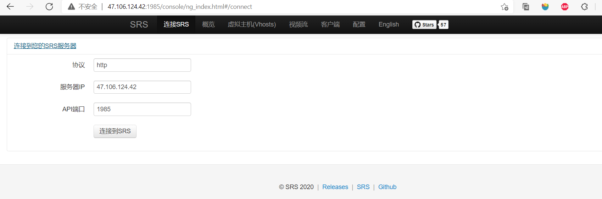

# 一、SRS4.0 开发环境搭建

## 1. 开发环境

- 服务器：SRS，（支持RTMP、HTTP-FLV、HLS)
- 推流端：ffmpeg+OBS
- 拉流端：ffplay+VLC+srs播放器

## 2. 安装SRS流媒体服务器

###  下载仓库并编译

github源：https://github.com/ossrs/srs.git

码云源: https://gitee.com/ossrs/srs.git

```shell
# 代码下载在srs.4.0目录下
git clone https://gitee.com/ossrs/srs.git srs.4.0  
cd srs.4.0

# 查看所有分支
git branch -a

# git标签，查看所有标签
git tag

# 查看每一次的提交
git log

# 直接使用当前最新的4.0release版本
cd trunk

# 查看更多的配置信息
./configure --help

# 编译
./configure 
make
```

### 设置配置文件

```shell
cd trunk
cd conf
vi srs.conf
```

端口号：

- 1935端口对应的是rtmp服务
- 1985对应的是http api服务，进一步学习： [v4_CN_HTTPApi - Wiki - Gitee.com](https://gitee.com/ossrs/srs/wikis/v4_CN_HTTPApi) 
- 8080对应的是http-flv、hls的服务器端口

### 启动SRS

```shell
 ./objs/srs -c conf/srs.conf
```

### 查看日志

```shell
you can check log by: tail -n 30 -f ./objs/srs.log
```

### 查看是否启动成功

```shell
ps -ef|grep srs
```

### 查看端口

```shell
lsof -i:1935
```

## 3. 查看控制台

在浏览器输入

http://47.106.124.42:1985/console/ng_index.html



# 二、wiki学习

SRS，是一个简单高效的实时视频服务器，支持RTMP/WebRTC/HLS/HTTP-FLV/SRT

