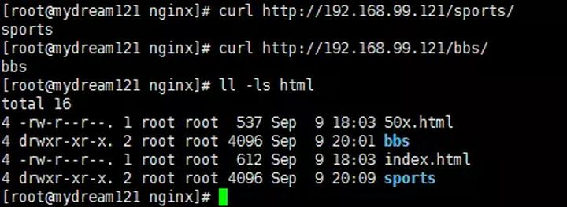

[TOC]

# nginx介绍

Nginx是一款轻量级的**Web服务器、反向代理服务器**，由于它的内存占用少，启动极快，高并发能力强，在互联网项目中广泛应用。


 上图基本上说明了当下流行的技术架构，其中Nginx有点入口网关的味道。 

## 反向代理服务器

### 正向代理


### 反向代理


由于**防火墙**的原因，我们并不能直接访问谷歌，那么我们可以借助**VPN**（虚拟专业网络， 提供了一种通过公用网络安全地对企业内部专用网络进行远程访问的连接方式 ) 来实现，这就是一个简单的**正向代理**的例子。在这里，正向代理 “代理” 的是客户端，而且客户端是知道目标的，而目标是不知道客户端是通过VPN访问的。(由外到内)

当我们在外网访问百度的时候，其实会进行一个转发，代理到内网去，这就是所谓的**反向代理**，即反向代理 “代理” 的是服务器端，而且这一个过程对于客户端而已是透明的。(由内到外)

## Nginx的Master-Worker模式


 启动Nginx后，其实就是在80端口启动了Socket服务进行监听，如图所示，Nginx涉及**Master进程和Worker进程**。 


Master进程的作用是

**读取并验证配置文件nginx.conf；管理worker进程**

Worker进程的作用是

**每一个worker进程都维护一个线程(避免线程切换)，处理连接和请求； 注意Worker进程的个数由配置文件决定，一般和CPU个数相关(有利于进程切换)，配置几个就有几个worker进程**

## 思考：nginx如何做到热部署？

 所谓**热部署**，就是配置文件nginx.conf修改后，不需要stop Nginx，不需要中断请求，就能让配置文件生效！（**nginx -s reload 重新加载        /nginx -t检查配置         /nginx -s stop**） 

 通过上文我们已经知道**worker进程负责处理具体的请求**，那么如果想达到热部署的效果，可以想象： 

方案一：

修改配置文件nginx.conf后，主进程master负责推送给woker进程更新配置信息，woker进程收到信息后，更新进程内部的线程信息。（有点valatile的味道）

方案二：

修改配置文件nginx.conf后，**重新生成新的worker进程**，当然会以新的配置进行处理请求，而且新的请求必须都交给新的worker进程，至于老的worker进程，等把那些以前的请求处理完毕后，kill掉即可。

**Nginx采用的就是方案二来达到热部署的！**

## 思考：Nginx如何做到高并发下的高效处理？

上文已经提及Nginx的worker进程个数与CPU绑定、worker进程内部包含一个线程高效回环处理请求，这的确有助于效率，但这不够。

**Nginx采用了Linux的epoll模型，epoll模型基于事件驱动机制，它可以监控多个事件是否准备完毕，如果完成，那么放入epoll队列，这个过程是异步的。worker只需要从epoll队列循环处理即可。**

## 思考：Nginx挂了怎么办？

Nginx作为入口网关，很重要，如果出现单点问题，显然是不可接受的。

可以用 **Keepaliver + Nginx实现高可用**

Keepaliver是一个高可用解决方案，主要是用来**防止服务器单点发生故障**，可以通过和Nginx配合来实现Web服务的高可用。

Keepaliver + Nginx实现高可用的思路：

第一：请求不要直接打到Nginx上，应该先通过Keepaliver(这就是所谓虚拟IP, VIP)

第二： Keepaliver应该能监控Nginx的生命状态(提供一个用户自定义的脚本，定期检查Nginx进程状态，进行权重变化，从而实现Nginx故障切换)


## nginx.conf

> ​                                                  http的server段 


> ​                                    访问结果  



 其实这是把Nginx作为web server来处理静态资源。 

 第一：location可以进行正则匹配，应该注意正则的几种形式以及优先级。（这里不展开） 

 第二：Nginx能够提高速度的其中一个特性就是：**动静分离，就是把静态资源放到Nginx上，由Nginx管理，动态请求转发给后端。 **

 **第三：我们可以在Nginx下把静态资源、日志文件归属到不同域名下（也即是目录），这样方便管理维护。** 

 **第四：Nginx可以进行IP访问控制，有些电商平台，就可以在Nginx这一层，做一下处理，内置一个黑名单模块，那么就不必等请求通过Nginx达到后端在进行拦截，而是直接在Nginx这一层就处理掉。** 


## 反向代理【proxy_pass】

所谓反向代理，很简单，其实就是在location这一段配置中的root替换成**proxy_pass**即可。root说明是静态资源，可以由Nginx进行返回；而proxy_pass说明是动态请求，需要进行转发，比如代理到Tomcat上。

反向代理，上面已经说了，过程是透明的，比如说request -> Nginx -> Tomcat，那么对于Tomcat而言，请求的IP地址就是Nginx的地址，而非真实的request地址，这一点需要注意。不过好在Nginx不仅仅可以反向代理请求，还可以由用户**自定义设置HTTP HEADER**。

## 负载均衡【upstream】

 上面的反向代理中，我们通过proxy_pass来指定Tomcat的地址，很显然我们只能指定一台Tomcat地址，那么我们如果想指定多台来达到负载均衡呢？ 

 第一，通过**upstream**来定义一组Tomcat，并指定负载策略（IPHASH、加权论调、最少连接），健康检查策略（Nginx可以监控这一组Tomcat的状态）等 

 第二，将proxy_pass替换成upstream指定的值即可。 

### 负载均衡可能带来的问题？

 负载均衡所带来的明显的问题是，一个请求，可以到A server，也可以到B server，这完全不受我们的控制，当然这也不是什么问题，只是我们得注意的是：**用户状态的保存问题，如Session会话信息，不能在保存到服务器上。** 

### 缓存

 缓存，是Nginx提供的，可以加快访问速度的机制，说白了，在配置上就是一个开启，同时指定目录，让缓存可以存储到磁盘上。具体配置，大家可以参考Nginx官方文档，这里就不在展开了。 

# 创建rtmp流媒体服务器

## 创建放压缩包的目录

```shell
cd /usr/local
sudo mkdir package
cd package
```

## 下载软件

```shell
sudo wget http://nginx.org/download/nginx-1.19.9.tar.gz

sudo wget http://zlib.net/zlib-1.2.11.tar.gz

sudo wget https://ftp.pcre.org/pub/pcre/pcre-8.40.tar.gz

sudo wget https://www.openssl.org/source/openssl-1.0.2k.tar.gz

cd ..
sudo git clone  https://github.com/arut/nginx-rtmp-module.git
```

## 解压下载的文件

```shell
//tar后缀的使用 tar -zxvf 文件名
//zip后缀的使用 unzip 文件名 -C指定解压后的路径

cd package
sudo tar -zxvf nginx-1.19.9.tar.gz -C /usr/local
sudo tar -zxvf zlib-1.2.11.tar.gz -C /usr/local
sudo tar -zxvf pcre-8.40.tar.gz -C /usr/local
sudo tar -zxvf openssl-1.0.2k.tar.gz -C /usr/local
cd ..
```

 ##  进入nginx文件，编译安装nginx 

```C++
cd nginx-1.19.9
// 输入./configure --help 可以看使用帮助
// --prefix=PATH            set installation prefix（设置安装前缀）
// --add-module=PATH        enable external module （启用外部模块）
sudo ./configure --prefix=/usr/local/nginx --with-debug --with-pcre=../pcre-8.40 --with-zlib=../zlib-1.2.11 --with-openssl=../openssl-1.0.2k --add-module=../nginx-rtmp-module
    
sudo make
sudo make install
cd ..
cd nginx
```

## 启动nginx服务

```C++
sudo /usr/local/nginx/sbin/nginx
```

结果如下：


 ##  配置nginx.conf文件

```
cd /usr/local/nginx/conf
sudo vi nginx.conf
```

在文件尾添加：

```
rtmp {
    server {
        listen 1935;

        application myapp{
        live on;
        hls on;
        hls_path /usr/local/nginx/myapp;  #推流拉流存放路径
        }

        # video on demand
        application vod {
            play /opt/video/vod; #指定存放视频文件的路径
        }

        application vod_http {
            #myserver.com及服务器地址，如果只是本地播放，填写127.0.0.1:端口号 就行，端口好看配置文件中http监听的端口下同
            play http://172.20.125.125/vod;
                 }

        application vod_mirror {
            play /var/local_mirror http://172.20.125.125:1935/vod;
        }
    }
}
```

```
#如果想在网页显示，在http中添加
 autoindex on; #开启nginx目录浏览功能
 autoindex_exact_size off; #文件大小从KB开始显示
 autoindex_localtime on; #显示文件修改时间为服务器本地时间
# 将视频文件放在html的文件夹里
```


##  重新加载配置，使用命令 

```shell
sudo mkdir /usr/local/nginx/myapp     // 拉流和推流视频地址
sudo mkdir /usr/local/html/video   // 网页上的视频地址
sudo /usr/local/nginx/sbin/nginx -s reload
```

# 出现的问题

## 端口被占用

```C++
//启动nginx
sudo /usr/local/nginx/sbin/nginx
```


```
//该问题是该端口被占用了

// 查看是否开启了nginx
ps -e | grep nginx

方法一：
//切换到nginx sbin目录
-- 停止
sudo ./nginx -s stop
-- 启动
./nginx

方法二：
ps -e | grep nginx
kill -9 PID
```

## 查看开放的端口，并关闭在运行的进程

```
// 查看所有开放端口
netstat -ntlp
```

## 

```
kill 6751
```


```c++
// 查看端口命令
   lsof -i:port
 // 关闭进程
       kill -9 PID
// 下面是防火墙      
// 查看开启的端口
    sudo ufw status
// 打开端口
    sudo ufw allow 1935
// 开启防火墙
    sudo ufw enable
 // 重启防火墙
      sudo ufw reload
  
//如果你使用了防火墙，请允许端口 tcp 1935,81
iptables -A INPUT -p tcp --dport 1935 -j ACCEPT 
iptables -A OUTPUT -p tcp --sport 1935 -j ACCEPT 
iptables -A INPUT -p tcp --dport 81 -j ACCEPT 
iptables -A OUTPUT -p tcp --sport 81 -j ACCEPT
//关闭防火墙
iptables -F
       
 // wsl2网络地址异常ping不通
 //重启 WSL 指令 
$ wsl --shutdown 
// 之后就重新启动进入即可 
$ wsl 
```

# 运行结果

## 网页上访问服务区媒体资源


## 拉流和推流

在虚拟机上


用云服务器


## 播放媒体服务器中的文件

```
将文件放在指定路径下
将input.mp4文件放在了/opt/video/vod
拉流地址：rtmp://172.20.113.219:1935/vod/input.mp4
然后就可以播放了
```


## 总结

 搭建好的nginx-rtmp服务器上做推流延时会很高，开始在5s左右，用云服务器延时会更高