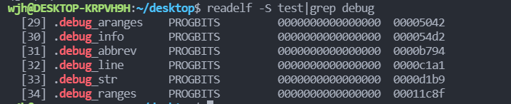
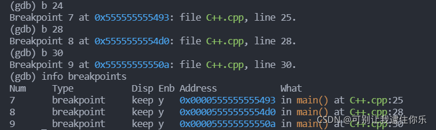
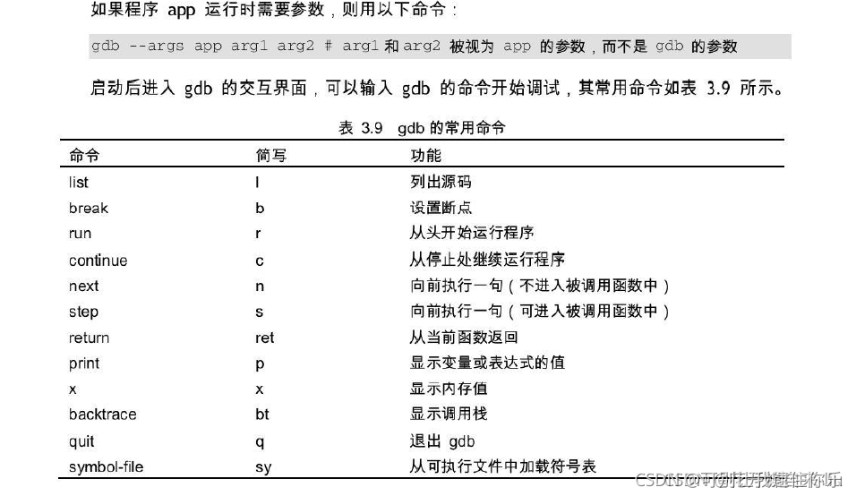

# GDB调试
## 一、简介
UNIX/LINUX操作系统下，基于命令行，功能强大的程序调试工具
<font color=#999AAA >
## 二、判断文件是否带有调试信息
要调试C/C++的程序，首先在编译时，要使用gdb调试程序，在使用gcc编译源代码时必须加上`-g`参数，保留调试信息，否则不能使用GDB进行调试
使用命令`readlef`查看可执行文件是否带有调试功能

```bash
readelf -S main|grep debug   // main为文件名，根据需要更换
```
如果有debug说明有调试功能，如果没有debug，说明没有带有调试功能，则不能被调试。

<font color=#999AAA >测试如下：


## 三、启动gdb
`-g`表示可以调试
```bash
gcc -g test.c -o test
```
启动gdb，命令如下：

```bash
gdb test
gdb -q test  // 表示不打印gdb版本信息，界面干净
```
## 四、GDB基本使用命令
### 1. 查看源程序代码
list（简写l)
功能：**查看源程序代码，默认显示10行，按回车键继续看余下的**

list 行号：将显示当前文件以“行号”为中心的前后10行代码，如：list 12
list 函数名：将显示“函数名”所在函数的源代码，如：list main
list ：不带参数，将接着上一次 list 命令的，输出下边的内容。
<font color=#999AAA >测试如下：
```cpp
(gdb) list
1       #include<iostream>
2       #include<vector>
3       using namespace std;
4
5       int main()
6       {
7           vector<int> nums;
8           nums.push_back(1);
9           nums.push_back(2);
10          nums.push_back(3);
(gdb) 
11          nums.push_back(4);
12          nums.push_back(5);
13          nums.push_back(6);
14          nums.push_back(7);
15          for(vector<int>::iterator it = nums.begin(); it != nums.end(); it++)
16          {
17              cout << *it << " ";
18          }
19          cout << endl;
20          int k = 3;
(gdb) 
```
###  2. 运行程序
run（简写 r）
功能：运行程序直到 ==结束或者遇到断点==等待下一个命令

### 3. 设置断点
break（简写 b）
功能：**设置断点**
格式：`b 行号`，表示在某行设置断点
（可以带上代码路径和代码名称：b test.cpp:222)

```bash
info breakpoints: 显示断点信息

Num：断点编号
Disp：断点执行一次之后是否有效     keep:有效     dis:无效
Enb：当前断点是否有效  		y:有效  	n:无效
Address：内存地址
What：位置
```

<font color=#999AAA >测试如下：


> `bn fn1 if a>b`					：条件断点设置
>
> `break func`					：在函数func()的入口处设置断点
> `delete 断点号n`：删除第n个断点
> `disable 断点号n`：暂停第n个断点
> `enable 断点号n`：开启第n个断点
> `clear 行号n`：清除第n行的断点
> `info b（info breakpoints）`：显示当前程序的断点设置情况
> `delete breakpoints`：清除所有断点


### 4. 单步执行
使用 continue、step、next命令
continue（简写c）：继续执行程序，直到下一个断点或者结束
step（简写s）：单步执行程序，但是遇到函数会进入函数
next（简写n）：单步执行程序，但是遇到函数会直接跳过函数，不进入函数
同 step 的主要区别是，step 遇到用户自定义的函数，将步进到函数中去运行，而 next 则直接调用函数，不会进入到函数体内。

until：当你厌倦了在一个循环体内单步跟踪时，这个命令可以运行程序直到退出循环体
until + 行号：运行至某行，不仅仅用来跳出循环
finish：运行程序，直到当前函数完成返回，并打印函数返回时的堆栈地址和返回值及参数值等信息
call 函数(参数)：调用程序中可见的函数，并传递“参数”，如call gdb_test(55)
### 5. 查看变量
使用print、whatis命令

<font color=#999AAA >测试如下：

```bash
(gdb) print num
$2 = 10
(gdb) whatis num
type = int
```
### 6. 打印表达式
print 表达式：简记为 p ，其中“表达式”可以是任何当前正在被测试程序的有效表达式，比如当前正在调试C语言的程序，那么“表达式”可以是任何C语言的有效表达式，包括数字，变量甚至是函数调用。
print a：将显示整数 a 的值
print ++a：将把 a 中的值加1,并显示出来
print name：将显示字符串 name 的值
print gdb_test(22)：将以整数22作为参数调用 gdb_test() 函数
print gdb_test(a)：将以变量 a 作为参数调用 gdb_test() 函数
display 表达式：在单步运行时将非常有用，使用display命令设置一个表达式后，它将在每次单步进行指令后，紧接着输出被设置的表达式及值。如： display a
watch 表达式：设置一个监视点，一旦被监视的“表达式”的值改变，gdb将强行终止正在被调试的程序。如： watch a
whatis ：查询变量或函数
info function： 查询函数
扩展info locals： 显示当前堆栈页的所有变量
### 7. 查看运行信息
where/bt ：当前运行的堆栈列表；
bt backtrace 显示当前调用堆栈
up/down 改变堆栈显示的深度
set args 参数:指定运行时的参数
show args：查看设置好的参数
info program： 来查看程序的是否在运行，进程号，被暂停的原因。
### 8. 分割窗口
layout：用于分割窗口，可以一边查看代码，一边测试：
layout src：显示源代码窗口
layout asm：显示反汇编窗口
layout regs：显示源代码/反汇编和CPU寄存器窗口
layout split：显示源代码和反汇编窗口
Ctrl + L：刷新窗口
### 9. 退出
quit（简写q）
功能：退出gdb

## 五、常用gdb调试命令汇总

## 参考文章
- [Linux下gdb调试方法与技巧整理](https://blog.csdn.net/niyaozuozuihao/article/details/91802994)