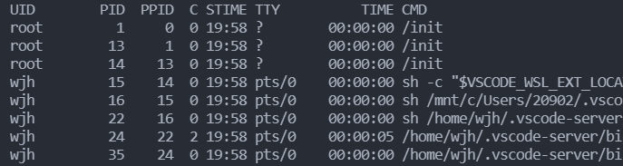

# 怎么用linux查找文件

> # find -name test.file
>
> 这样他就会查找test.file文件
>
> 也可以指定某个目录
>
> find /var -name test.file

# 查看连接树莓派的摄像头设备名

> ls /dev/video*

# 怎么查看Linux进程id

>  ps -aux | grep "执行的文件名"

# 查看Linux下的ip

> ifconfig 

# 给文件赋权

输入命令【chmod 777 文件名称】，赋权文件rwx，可读可写可执行权限

# Linux中删除文件

rm  [选项] 文件名

-f, --force 强制删除。忽略不存在的文件，不提示确认
-i 在删除前需要确认
-r, -R, --recursive 递归删除目录及其内容
-v, --verbose 详细显示进行的步骤

# 给文件改名

输入命令:mv 修改前文件名 修改后文件名,按回车。

# 查看连接网线上的ip

> arp -a

# ubuntu换源

查看当前系统的代号

> lsb_release -a 

备份原来的源

> cp -ra /etc/apt/sources.list /etc/apt/sources.list.bak

更新缓存和升级

> sudo apt-get update
> sudo apt-get upgrade

> sudo vi /etc/resolv.conf
>
> nameserver 8.8.8.8

# 查看树莓派的内存

> df -h

# ssh连接

> ssh  用户名@ip名

# 树莓派开机启动

> 使用systemctl控制开机自动启动

# 重启

> sudo reboot

# 查看摄像头是否有效

> 使用cheese命令
>
> 安装
>
> sudo apt-get install cheese

# 报错Failed to fetch的问题

>  #设置妥当DNS服务器 
>
> sudo vi /etc/resolv.conf 
>
> #保存后，联网更新一下 
>
> sudo apt-get update

# 安装SDL2

```
sudo apt-get install libsdl2-dev
```

# Vim的操作

```
按 i 进入编辑模式

按Esc进入命令行模式

:w 保存文件

:q 退出

！强制操作

:%d  删除所有内容

:%s/vivian/sky/g   替换每一行中所有 vivian 为 sky 
```

# 添加环境变量

用export来设置或显示环境变量

```shell
export [-fnp][变量名称]=[变量设置值]
```

参数说明：

- -f 代表【变量名称】中为函数名称
- -n  删除指定的变量。变量实际上并未删除，只是不会输出到后续指令的执行环境中。
- -p 列出所有的shell赋予程序的环境变量

```shell
export -p  # 会列出当前所有的环境变量值
export PATH="$PATH:要添加的路径"  # 添加路径
export 变量名=变量设置值  # 定义变量并赋值
```

# 查看进程的Linux命令

### 1. 查看进程

- ` ps `查看当前终端的进程
- ` ps -ef ` 查看系统全部的进程
- ` ps -ef | more ` 查看系统全部的进程，结果分页显示（enter下一行，空格翻页)



UID：启动进程的操作系统用户

PID：进程编号（进程标识符)

PPID：进程的父进程的编号

C：CPU使用的资源百分比

STIME：进程启动时间

TTY：进程所属的终端

TIME：使用掉的CPU时间

CMD：执行的指令


### 2. 查看系统中某个运行的进程

```bash
ps -ef | grep xxxx(xxxx是执行的程序名)
```

例如：

```bash
ps -ef | grep nginx
```

### 3. 查看指定进程ID已打开的内容

```shell
lsof -p PID(进程标识符)
```

# 显示与指定端口相关的网络信息

```shell
lsof -i:port
```

# 防火墙

```
//正常启动防火墙,下面两个选择一个即可
systemctl unmask firewalld.service
systemctl start firewalld.service
如果这个防火墙没有安装		apt-get install firewall
关闭防火墙		systemctl stop firewalld.service
开机自动启动		systemctl enable firewalld.service
禁止开机启动		systemctl disable firewalld.service
在不改变状态的条件下重新加载防火墙		firewall-cmd --reload
修改配置后需要重启服务使其生效		systemctl restart firewalld.service
```

# 在Windows解压文件夹后，拉到linux环境，运行出错

-bash: ./picom.sh: /bin/bash^M: bad interpreter: No such file or directory

出现了^M的脏东西

解决方法：sed -i "s/\r//" a.sh

# 查找同一局域网中可以ping通的ip

```
for /L %i IN (1,1,254) DO ping -w 1 -n 1 192.168.3.%i
```

# 查看网卡

```
ip addr
```

