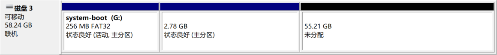

# 参考文章

-  [树莓派折腾记（一）-- 安装系统（Ubuntu Server 20.04.1） | 修行的技术阁 (mrxiuxing.com)](https://mrxiuxing.com/posts/2f81a42d.html) 

# 给树莓派安装系统

## 选择系统

在ubuntu官网，找到适合树莓派的系统版本，我下载了64位的Ubuntu Server 20.04.3 LTS

 默认用户名，密码都是ubuntu 

## 烧录系统

需要用到一个软件  balenaEtcher 这是github地址： https://github.com/balena-io/etcher/releases 

 安装好balenaEtcher之后，按照下图所示操作即可 

  

 稍等片刻，出现如下图所示，系统就烧录进TF卡中了。关闭balenaEtcher即可 

  

 烧录完之后，你的电脑可能找不到TF了，这时你可以重新插拔一下TF卡，如果还是不显示你就重启一下电脑。 

 从windows自带的磁盘工具查看到还有很大一部分空间未分配，你的可用空间（主分区）大概只有2G左右的样子。 

   这时就需要另一个工具了 DiskGenius 一个强大的磁盘管理工具，官网地址：https://www.diskgenius.cn/ 。打开DiskGenius，找到你的TF卡，不出意外你的TF下有两个分区 

  

 选中主分区（Ext4分区），然后右键扩容分区 

  

点击开始，会有一个警告弹窗，点击确定，稍等片刻即可扩容完毕


  如下图，这是扩容之后的样子，所有的空闲空间已经扩容到了主分区（Ext4分区）了


在 system-boot 盘符中，找到 network-config 这个文件（wifi网络配置文件） 

 打开network-config，修改内容，你可以添加多个wifi配置，如下内容中TP-LINK_1以及TP-LINK_2都是wifi名称，不需要引号引起来，除非wifi名称中含有空格，密码填入对应wifi名称下password后的引号中即可。此外缩进一定要使用空格。 

```
version: 2
ethernets:
  eth0:
    dhcp4: true
    optional: true
wifis:
  wlan0:
    dhcp4: true
    optional: true
    access-points:
      TP-LINK_1:
        password: "TP-LINK_1的密码"
      TP-LINK_2:
        password: "TP-LINK_2的密码"
#      myhomewifi:
#        password: "S3kr1t"
#      myworkwifi:
#        password: "correct battery horse staple"
#      workssid:
#        auth:
#          key-management: eap
#          method: peap
#          identity: "me@example.com"
#          password: "passw0rd"
#          ca-certificate: /etc/my_ca.pem
```

## ssh连接

我用路由器+网线+电脑，先找到树莓派的ip地址

可查找同一局域网中的ip

```powershell
for /L %i IN (1,1,254) DO ping -w 1 -n 1 192.168.3.%i
```

再用 

```shell
arp -a
```

其中的动态地址就是可ping通的地址，树莓派ip地址就是其中一个

```shell
ssh ubuntu@ip地址
```

## 配置无线网卡

第一步，在首次开机前就配置好wifi，也就是上文中扩容TF卡之后的操作

第二步，依次执行下面的命令更新软件（切记：不要更换软件源）

```shell
sudo apt update
sudo apt upgrade
```

如果你在执行sudo apt upgrade时，出现了类似下图问题


  使用Ctrl + c 停止，然后执行 sudo reboot 重启树莓派。重新依次执行sudo apt update 和 sudo apt upgrade即可。这时，你使用 ip addr 命令发现还是没有wlan0网卡，不要慌不要急，我们执行一下 sudo reboot 重启树莓派。然后执行 ip addr 命令，发现wlan0出现了，如下图：


## 更换软件源

```shell
# 将官方源做一下备份
sudo cp /etc/apt/sources.list /etc/apt/sources.list.bak
# 将ubuntu的镜像站点替换为阿里云的镜像站点
sudo sed -i 's/http:\/\/.*.ubuntu.com/https:\/\/mirrors.aliyun.com/g' /etc/apt/sources.list
sudo apt update
sudo apt upgrade
```

## 修改时区

 可以使用 date -R 命令查看当前时区， 发现为 +0000。 

修改时区可以使用 sudo tzselect 命令。例如我要修改为北京时间，可以在输入 sudo tzselect 命令后依次输入 4 --> 9 --> 1 --> 1 ，如下图：


  我们还需执行下面的命令让其生效

```
sudo cp /usr/share/zoneinfo/Asia/Shanghai /etc/localtime
```

  这时使用 date -R 命令查看当前时区，就会发现时区变成了 +0800 ,此刻的时间对于我们来说也就是正确的时间了。


## 配置静态IP

 之前我们在系统第一次启动前就配置了wifi，但是DHCP是开启的，也就是ip可能会因为我们重启机器而改变，所以我们需要将IP固定下来 。

 首次启动会初始化一次配置，之前配置的wifi会初始化写入到 /etc/netplan 目录下的yaml配置文件。我们要想配置静态IP也是在这个yaml文件中。我们可以使用下面的命令查看配置文件全名。 

```shell
ll /etc/netplan/
```

 配置文件全名应该是50-cloud-init.yaml 

```shell
 进入配置目录
cd /etc/netplan/
 先做一下备份
sudo cp 50-cloud-init.yaml 50-cloud-init.yaml.back
 打开配置文件
sudo vim 50-cloud-init.yaml
```

 配置静态ip，我们需要将DHCP关闭，指定静态ip地址/子网掩码，指定网关地址，指定DNS地址。具体如下： 

```
network:
    ethernets:
        eth0:  # 有线网卡
            addresses:
                - 192.168.0.109/24  # ip地址/子网掩码
            gateway4: 192.168.0.1  # 网关地址
            nameservers:
                    addresses: # DNS地址，多个的话按照下面添加即可
                        - 114.114.114.114
                        - 8.8.8.8
            dhcp4: no  # DHCP
            optional: no
    version: 2
    wifis:
        wlan0:  # 无线网卡
            addresses:
                - 192.168.0.110/24  # ip地址/子网掩码
            gateway4: 192.168.0.1  # 网关地址
            nameservers:
                    addresses: # DNS地址，多个的话按照下面添加即可
                        - 114.114.114.114
                        - 8.8.8.8
            access-points:
                TP-LINK_1:  # wifi名称
                    password: TP-LINK_1的密码  # wifi密码
                TP-LINK_2:  # wifi名称
                    password: TP-LINK_2的密码  # wifi密码
            dhcp4: no  # DHCP
            optional: no
```

 然后使用下面的命令让配置生效，当然你也可以重启树莓派。 

```shell
sudo netplan --debug apply
```

 如果你当前连接树莓派的ip地址与你在配置文件中指定的地址不一样，ssh工具会断开与树莓派的连接。当然这也说明你的配置大概率是成功了的，然后你就可以使用你刚刚在配置文件中指定的ip地址连接到树莓派了。 

 使用 ip addr 命令查看效果。如下图：可以看到有限网卡 eth0 静态ip为 192.168.0.109 ，无线网卡 wlan0 静态ip为 192.168.0.110, ， 和我们配置的一样，说明配置生效了。 

  

# vscode免密登录服务器

## ssh连接上服务器

> $ ps -e | grep ssh     # 查看是否有ssh
>
> $ sudo apt install openssh-server    # 安装SSH
>
> $ sudo service ssh start   # 启动SSH

## Windows端执行

> ssh-keygen  -t  rsa  -C    "github账号邮箱"

一直按`enter`即可，最终会在`C:\Users\20902\.ssh`目录下，生成两个文件：

> id_rsa
>
> id_rsa.pub

## 服务器端

输入同样的命令，在`/home/codespace/.ssh`文件下也会生成`id_rsa`和`id_rsa.pub`文件

> ssh-keygen -t rsa -C "github账号邮箱"

然后在`/home/codespace/.ssh`文件下，新建一个文件，名字是`authorized_keys`,直接将Windows端目录`C:\Users\20902\.ssh`下的`id_rsa.pub`文件内容复制到`authorized_keys`中。

# 创建新用户

 adduser：会自动为创建的用户指定主目录、系统shell版本，会在创建时输入用户密码。 

输入命令：`$  sudo adduser tt`

# 给新用户添加权限

1.切换到root用户下 
方法为直接在命令行输入：*su*，然后输入密码（即你的登录密码，且密码默认不可见）。

2./etc/sudoers文件默认是只读的，对root来说也是，因此需先添加sudoers文件的写权限，命令是: 
即执行操作：*chmod u+w /etc/sudoers*

3.编辑sudoers文件 
即执行：*vi /etc/sudoers* 
找到这行 root ALL = (ALL) ALL,在他下面添加xxx ALL=(ALL) ALL (这里的xxx是你的用户名)


4.撤销sudoers文件写权限，命令：
*chmod u-w /etc/sudoers*
5.切换用户
*su yakong*

# 换源

查看当前系统的代号

> lsb_release -a 

备份原来的源

> cp -ra /etc/apt/sources.list /etc/apt/sources.list.bak

更新缓存和升级

> sudo apt-get update
> sudo apt-get upgrade

> sudo vi /etc/resolv.conf
>
> nameserver 8.8.8.8

