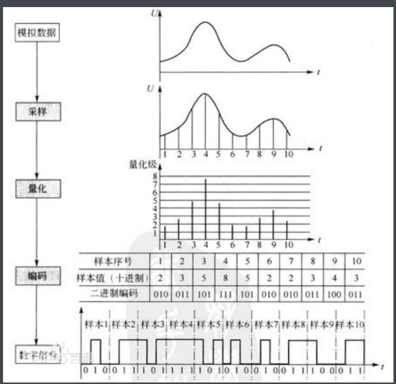
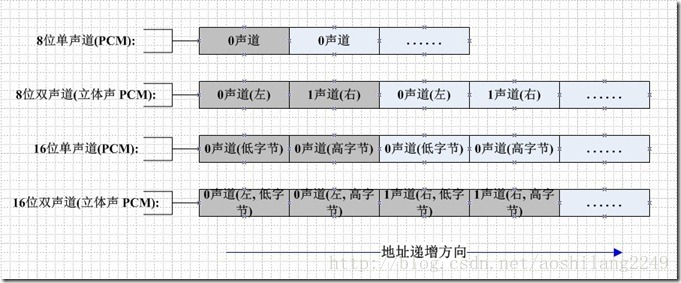

# 音频编码

## 声音数字化三要素

| 采样频率                                     | 量化位数                                 | 声道数                                   |
| -------------------------------------------- | ---------------------------------------- | ---------------------------------------- |
| 每秒种抽取声波幅度样本的次数                 | 每个采样点用多少二进制位表示数据范围     | 使用声音通道的个数                       |
| 采样频率越高 声音质量越好 数据量也越大 | 量化位数越多 音质越好 数据量也越大 | 立体声比单声道的表现力丰富，但数据量翻倍 |
| 11.025 kHz 22.05 kHz 44.1 kHz          | 8位 = 256 16位  = 65536               | 单声道 立体声                         |

## 声音数字化的数据量

**音频数据量 = 采样频率 x 量化位数 x 声道数 /8(字节数)**

<table>
	<tr>
		<td rowspan="2">采样频率 (kHz)</td>
		<td rowspan="2">量化位数 (bit)</td>
        <td colspan="2">数据量 （KB/s)</td>
	</tr>
    <tr>
    	<td>单声道</td>
    	<td>立体声</td>
    </tr>
	<tr>
		<td rowspan="2">11.025</td>
		<td>8</td>
        <td>10.77</td>
        <td>21.35</td>
	</tr>
 	<tr>
		<td>16</td>
        <td>21.53</td>
        <td>43.07</td>
	</tr>
    	<tr>
		<td rowspan="2">22.05</td>
		<td>8</td>
        <td>21.53</td>
        <td>43.07</td>
	</tr>
 	<tr>
		<td>16</td>
        <td>43.07</td>
        <td>86.13</td>
	</tr>
    	<tr>
		<td rowspan="2">44.1</td>
		<td>8</td>
        <td>43.07</td>
        <td>86.13</td>
	</tr>
 	<tr>
		<td>16</td>
        <td>86.13</td>
        <td>172.27</td>
	</tr>

## PCM音频编码

主要过程是将语音等模拟信号每隔一定时间进行**取样**，使其**离散化**，同时将抽样值按分层单位四舍五入取整**量化**，同时将抽样值按一组二进制码来表示抽样脉冲的幅值。也就是说语音信号最终以脉冲形式编码。

### PCM编码原理

模拟信号数字化必须经过三个过程：**抽样、量化和编码**

  

#### 1.1 抽样

**抽样**是把模拟信号以其**信号带宽2倍以上**( **奈奎斯特采样定理** ) 的频率提取样值(采样率)，变为在时间轴上离散的抽样信号的过程。**采样率：每秒从连续信号中提取并组成离散信号的采样个数，用赫兹(Hz)表示**

#### 1.2 量化

抽样信号虽然是时间轴上离散的信号，但仍然是模拟信号，其样值在一定的取值范围内，可有无限多个值。**必须采用“四舍五入”的方法把样值分级“取整”**，使一定取值范围内的样值由无限多个值变为有限个值，这一过程称为**量化**

**采样位数：描述数字信号所使用的位数**
8位(8bit)代表2的8次方=256，16 位(16bit)则代表2的16次方=65536

sample：
如音频传感器采集到的电压范围为0-3.3V，采样位数为8bit(位)
即我们把3.3V/ 2^8 = 0.0128 即为**量化精度**。
我们把3.3v分成0.0128为步进的**Y轴**，如图3中的1 2 …8就变成了0 0.0128 0.0256 ……3.3 V
比如某个采样点的电压值为1.652V(1280.128 与 1290.128之间) 我们对它四舍五入就为1.65V 对应 量化等级为128 。

#### 1.3 编码

量化后的抽样信号就转化为**按抽样时序排列的一串十进制数字码流**，即十进制数字信号。简单高效的数据系统是二进制码系统，因此，应**将十进制数字转化为二进制编码**。

 sample：
接着上面的1.65V 对应 量化等级为128 。对应的2进制为10000000 。即该采样点编码后结果为10000000 。当然这是没有考虑正负值情况下的编码方式，而且编码方式种类非常多，需要具体问题具体分析。（PCM音频格式编码为A律13折线编码） 

### PCM音频编码

PCM信号未经过任何编码和压缩处理。与模拟信号相比，它不易受传送系统的杂波及失真的影响。动态范围宽，可得到音质相当好的效果。

#### 2.1 PCM编码

编码上采用的是A律13折线编码

#### 2.2 声道

- 单声道文件，采样数据为八位的短整数
- 双声道立体声文件，每次采样数据为一个16位(采样位数仍是8bit)的整数（int），高八位(左声道)和低八位(右声道)分别代表两个声道

 

PCM的每个样本值包含在一个整数i中，i的长度为容纳指定样本长度所需的最小字节数。
首先存储低有效字节，表示样本幅度的位放在i的高有效位上，剩下的位置为0，这样8位和16位的PCM波形样本的数据格式如下所示。 

| 样本大小 | 数据格式     | 最小值 | 最大值 |
| -------- | ------------ | ------ | ------ |
| 8位PCM   | unsigned int | 0      | 225    |
| 16位PCM  | int          | -32767 | 32767  |

#### 2.3 采样频率

人对频率的识别范围是20Hz - 20KHz,      20KHz以上人耳是听不到的。

- 8000hz 为电话采样。
- 22050 的采样频率是常用的。
  44100已是CD音质, 超过48000的采样对人耳已经没有意义。

 一般情况下，一帧PCM是由2048次采样组成的。 

#### 2.4 采样位数

每个采样数据记录的是振幅，采样精度取决于储存空间（采样位数）的大小：

- 1 字节(也就是8bit) 只能记录 256 个数, 也就是只能将振幅划分成 256 个等级
- 2 字节(也就是16bit) 可以细到 65536 个数, 这已是 CD 标准了;
- 4 字节(也就是32bit) 能把振幅细分到 4294967296 个等级, 实在是没必要了

 如果是双声道(stereo), 采样就是双份的, 文件也差不多要大一倍. 

#### 2.5 比特率

 码率是指经过编码后的音频数据每秒钟需要用多少个比特来表示 

 ## 常见的音频编码格式

 人耳所能听到的声音，最低的频率是从 20Hz 起一直到最高频率 20KHZ，20KHz 以上人耳是听不到 的，因此音频文件格式的最大带宽是 20KHZ，故而采样速率需要介于 40~50KHZ 之间，而且对每个样本需要更多的量化比特数。音频数字化的标准是每个样本 16 位-96dB 的信噪比，采用线性脉冲编码调制 PCM，每一量化步长都 具有相等的长度。在音频文件的制作中，正是采用这一标准。

### 各种编码比较

> 1.压缩比比较：
> aac>ogg>mp3(wma)>ape>flac>wav（同一音源条件下）
> mp3和wma以192kbps为分界线，192kbps以上mp3好，192kbps以下wma好。
> WMA（10~12），APE(无损压缩，但庞大的WAV可以瘦身为APE)，，
> ATRAC(1:5)，，MP3(10~12)，，AAC(18~20)，，OGG()，，
> FLAC(1:2)
> 2.2.音质比较：
> wav=flac=ape>aac>ogg>mp3>wma
> 3.3.硬件支持比较：
> MP3播放器：mp3>wma>wav>flac>ape aac ogg
> 手机：mp3>wma>aac wav>flac ogg>ape

### CD

>  CD 格式的音质是比较高的音频格式。因此要讲音频格式，CD 自然是打头阵的先锋。在大多数播放软件的“打 开文件类型”中，都可以看到.cda 格式，这就是 CD 音轨了。标准 CD 格式也就是 44.1K 的采样频率，速率 88K/ 秒，16 位量化位数，因为 CD 音轨可以说是近似无损的，因此它的声音基本上是忠于原声的，因此如果你是一个音 响发烧友的话，CD 是你的首选。它会让你感受到天籁之音。CD 光盘可以在 CD 唱机中播放，也能用电脑里的各种 播放软件来重放。一个 CD 音频文件是一个.cda 文件，这只是一个索引信息，并不是真正的包含声音信息，所以不 论 CD 音乐的长短，在电脑上看到的“.cda 文件”都是 44 字节长。注意：不能直接的复制 CD 格式的.cda 文件到 硬盘上播放，需要使用像 EAC 这样的抓音轨软件把 CD 格式的文件转换成 WAV，这个转换过程如果光盘驱动器质量过关而且 EAC 的参数设置得当的话，可以说是基本上无损抓音频。推荐大家使用这种方法 

### MP3

> 能够在音质丢失很小的情况下把文件压缩到更小的程度。而且还非常好的保持了原来的音质。 
> **压缩率**：10~12倍
> **优点**：压缩比高，适合用于互联网上的传播
> **缺点**： MP3 在 128KBitrate 及以下时，会出现明显的高频丢失 

### AAC高级音频编码

>  一种专为声音数据设计的文件压缩格式，与MP3不同，它采用了全新的算法进行编码，更加高效，具有更高的“性价比”。利用AAC格式，可使人感觉声音质量没有明显降低aac标志的前提下，更加小巧。 
>
>  AAC属于**有损压缩**的格式 ,**优点：支持多种音频声道组合，提供优质的音质**

### WMA

>  微软力推的一种音频格式。WMA格式是以减少数据流量但保持音质的方法来达到更高的压缩率目的，其压缩率一般可以达到1:18，生成的文件大小只有相应MP3文件的一半。 
>
> **压缩率**：10~12倍
> **缺点**：在高比率的渲染能力低下，同音源的一个320KBPS的MP3与比较192KBPS的WMA相比，音质和渲染力很容易分别出是前者较优。因为：
> 当 Bitrate 小于 128K 时， WMA 最为出色且编码后得到的音频文件很小。
> 当 Bitrate 大于 128K 时， WMA 音质损失过大。
> **优点**：WMA还可以通过DRM（Digital Rights Management）方案加入防止拷贝，或者加入限制播放时间和播放次数，甚至是播放机器的限制，可有力地防止盗版。

### WAV

> WAV是录音时用的标准的windows文件格式，文件的扩展名为“.wav”，WAVE文件作为最经典的Windows多媒体音频格式，应用非常广泛。声道有**单声道和立体声**之分，采样频率一般有11kHz、22kHz和44kHz三种。 标准格式的 WAV 文件和 CD 格式一样，也是 44.1K 的采样频率，速率 88K/秒，16 位量化位数
>
> WAVE文件所占容量=（采样频率×采样位数×声道)×时间/8（1字节=8bit）

### ATRAC

> ATRAC压缩技术主要是利用了人耳的蔽遮效应，在心理声学原理上，在进行音频录入的同时，有许多外部的频段同时也会被录入，当人耳同时听到两个不同频率、不同音量的声音时，音量较小的低频及音量较小的高频连同不为人耳所察觉的频段信号都会被自动减弱或忽略不予记录，因此又可以**称为适应性变换声码技术**，由于近年來编码压缩技术（ATRAC的版本）越來越成熟，所以经过编码解码过程后的声音仍直逼CD，
> ATRAC将16比特44.1KHz的数字信号以频率响应轴分成52个区段（在低频时分割较细而在高频时分割较粗），根据声音心理学的原理，将声音信号中人耳听不到和对人的听力影响不大的信息给剔除出去而达到缩小声音文件的目的。利用这种原理，ATRAC可以将录音的资料量压缩为原来的五分之一（即压缩比为1：5）。
> **压缩率**：**5倍**
> **特点**：**自动减弱或者忽略外部频段的杂音**

### PLAC

>  FLAC与MP3不同，MP3是音频压缩编码，但**FLAC是无损压缩，也就是说音频以FLAC编码压缩后不会丢失任何信息，将FLAC文件还原为WAV文件后，与压缩前的WAV文件内容相同**

### OGG

> 它是一种新的音频压缩格式，类似于MP3等现有的音乐格式。但有一点不同的是，它是完全免费、开放和没有专利限制的。OGG Vobis有一个很出众的特点，就是支持多声道，
> OGG Vobis在压缩技术上比MP3好，而且它的多声道，免费，开源这些特点，使它很有可能成为一个流行的趋势，这也正是一些MP3播放器对其支持的原因
>
> 可以对所有的声道进行编码，而不是MP3只能编码2个声道。**多声道音乐的兴起，给音乐欣赏带来了革命性的变化，尤其在欣赏交响时，会带来更多临场感。这场革命性的变化是MP3无法适应的。**在以后的播放技术不断提高以后，而且人们对音质要求不断提高，Ogg的优势将更加明显。
> **优点：完全免费。开放没有专利限制。支持多声道**
> 
>

### APE

> APE的本质，其实它是一种**无损压缩**音频格式。庞大的WAV音频文件可以通过Monkey”s Audio这个软件进行“瘦身”压缩为APE。**有时候它被用做网络音频文件传输，因为被压缩后的APE文件容量要比WAV源文件小一半多，可以节约传输所用的时间。更重要的是，通过Monkey”s Audio解压缩还原以后得到的WAV文件可以做到与压缩前的源文件完全一致**。所以APE被誉为“无损音频压缩格式”
> **无损压缩**

# 参考文章

-  [ PCM音频编码_Andy Tools-CSDN博客_pcm编码原理](https://blog.csdn.net/m0_37263637/article/details/78914566) 
-  [常见音视频编码格式_xixihaha331的博客-CSDN博客_音频编码格式](https://blog.csdn.net/xixihaha331/article/details/62884176) 