# 视音频数据处理入门：RGB、YUV像素数据处理

 本文记录RGB/YUV视频像素数据的处理方法。视频像素数据在视频播放器的解码流程中的位置如下图所示。
  

本文分别介绍如下几个RGB/YUV视频像素数据处理函数：
 分离YUV420P像素数据中的Y、U、V分量
 分离YUV444P像素数据中的Y、U、V分量
 将YUV420P像素数据去掉颜色（变成灰度图）
 将YUV420P像素数据的亮度减半
 将YUV420P像素数据的周围加上边框
 生成YUV420P格式的灰阶测试图
 计算两个YUV420P像素数据的PSNR
 分离RGB24像素数据中的R、G、B分量
 将RGB24格式像素数据封装为BMP图像
 将RGB24格式像素数据转换为YUV420P格式像素数据
 生成RGB24格式的彩条测试图

## 一、分离YUV420P像素数据中的Y、U、V分量

后缀带P表示planar存储模式(**planar**：将 Y、U、V 的三个分量分别存放在不同的矩阵(平面)中)

 本程序中的函数**可以将YUV420P数据中的Y、U、V三个分量分离开来并保存成三个文件**。函数的代码如下所示。 

```cpp
#include<stdio.h>
#include<stdlib.h>
#include<string.h>
#include<math.h>

/**
 * Split Y, U, V planes in YUV420P file.
 * @param url  Location of Input YUV file.
 * @param w    Width of Input YUV file.
 * @param h    Height of Input YUV file.
 * @param num  Number of frames to process.
 *
 */
int simplest_yuv420P_split(char *url, int w, int h,int num){
	FILE *fp=fopen(url,"rb+");
	FILE *fp1=fopen("output_420_y.y","wb+");
	FILE *fp2=fopen("output_420_u.y","wb+");
	FILE *fp3=fopen("output_420_v.y","wb+");

	unsigned char *pic=(unsigned char *)malloc(w*h*3/2);

	for(int i=0;i<num;i++){

		fread(pic,1,w*h*3/2,fp);
		//Y
		fwrite(pic,1,w*h,fp1);
		//U
		fwrite(pic+w*h,1,w*h/4,fp2);
		//V
		fwrite(pic+w*h*5/4,1,w*h/4,fp3);
	}

	free(pic);
	fclose(fp);
	fclose(fp1);
	fclose(fp2);
	fclose(fp3);

	return 0;
}
```

调用上面函数的方法如下所示

```cpp
simplest_yuv420P_split("lena_256x256_yuv420p.yuv",256,256,1);
```

从代码可以看出，如果视频帧的宽和高分别为w和h，那么一帧YUV420P像素数据一共占用w * h * 1.5 Byte的数据。其中前w * h Byte存储Y，接着的w * h * 1/4 Byte存储U，最后w * h * 1/4 Byte存储V。 上述调用函数的代码运行后，将会把一张分辨率为256x256的名称为lena_256x256_yuv420p.yuv的YUV420P格式的像素数据文件分离成为三个文件： 

> -  output_420_y.y：纯Y数据，分辨率为256x256。 
> -  output_420_u.y：纯U数据，分辨率为128x128。 
> -  output_420_v.y：纯V数据，分辨率为128x128。 

 注：本文中像素的采样位数一律为8bit。由于1Byte=8bit，所以一个像素的一个分量的采样值占用1Byte。 

 程序输入的原图如下所示

   

 程序输出的三个文件的截图如下图所示。在这里需要注意输出的U、V分量在YUV播放器中也是当做Y分量进行播放的。 **注意：必须调整分辨率，图像才能显示出来**

 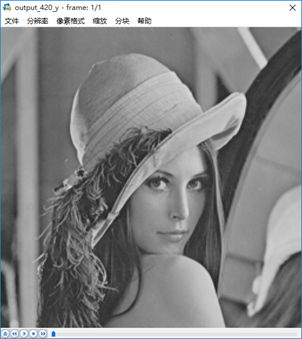

output_420_y.y

 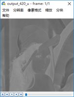      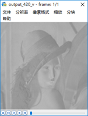

output_420_u.y和output_420_v.y

## 二、 分离YUV444P像素数据中的Y、U、V分量 

 本程序中的函数可以将YUV444P数据中的Y、U、V三个分量分离开来并保存成三个文件 

```c
/**
 * Split Y, U, V planes in YUV444P file.
 * @param url  Location of YUV file.
 * @param w    Width of Input YUV file.
 * @param h    Height of Input YUV file.
 * @param num  Number of frames to process.
 *
 */
int simplest_yuv444P_split(char *url, int w, int h,int num){
	FILE *fp=fopen(url,"rb+");
	FILE *fp1=fopen("output_444_y.y","wb+");
	FILE *fp2=fopen("output_444_u.y","wb+");
	FILE *fp3=fopen("output_444_v.y","wb+");
	unsigned char *pic=(unsigned char *)malloc(w*h*3);
 
	for(int i=0;i<num;i++){
		fread(pic,1,w*h*3,fp);
		//Y
		fwrite(pic,1,w*h,fp1);
		//U
		fwrite(pic+w*h,1,w*h,fp2);
		//V
		fwrite(pic+w*h*2,1,w*h,fp3);
	}
 
	free(pic);
	fclose(fp);
	fclose(fp1);
	fclose(fp2);
	fclose(fp3);
 
	return 0;
}
```

 调用上面函数的方法如下所示

```c
simplest_yuv444P_split("lena_256x256_yuv444p.yuv",256,256,1);
```

 一帧YUV444P像素数据一共占用w * h * 3 Byte的数据 。 上述调用函数的代码运行后，将会把一张分辨率为256x256的名称为lena_256x256_yuv444p.yuv的YUV444P格式的像素数据文件分离成为三个文件： 

> -  output_444_y.y：纯Y数据，分辨率为256x256。 
> -  output_444_u.y：纯U数据，分辨率为256x256。 
> -  output_444_v.y：纯V数据，分辨率为256x256。 

输入的原图如下所示。

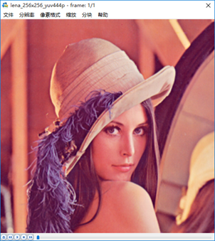

输出的三个文件的截图如下图所示。

 

output_444_y.y

 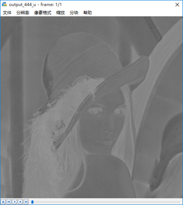

output_444_u.y

 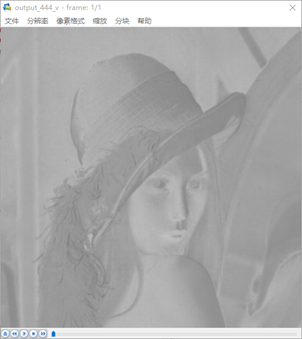

output_444_v.y

## 三、将YUV420P像素数据去掉颜色（变成灰度图）

 本程序中的函数可以将YUV420P格式像素数据的彩色去掉，变成纯粹的灰度图。函数的代码如下。 

```c
/**
 * Convert YUV420P file to gray picture
 * @param url     Location of Input YUV file.
 * @param w       Width of Input YUV file.
 * @param h       Height of Input YUV file.
 * @param num     Number of frames to process.
 */
int simplest_yuv420_gray(char *url, int w, int h,int num){
	FILE *fp=fopen(url,"rb+");
	FILE *fp1=fopen("output_gray.yuv","wb+");
	unsigned char *pic=(unsigned char *)malloc(w*h*3/2);
 
	for(int i=0;i<num;i++){
		fread(pic,1,w*h*3/2,fp);
		//Gray
		memset(pic+w*h,128,w*h/2);  // memset初始化函数，将pic+w*h后面的w*h/2个字节用128替代
		fwrite(pic,1,w*h*3/2,fp1);
	}
 
	free(pic);
	fclose(fp);
	fclose(fp1);
	return 0;
}
```

调用上面函数的方法如下所示。

```cpp
simplest_yuv420_gray("lena_256x256_yuv420p.yuv",256,256,1);
```

从代码可以看出，如果想把YUV格式像素数据变成灰度图像，**只需要将U、V分量设置成128即可**。这是因为U、V是图像中的经过偏置处理的色度分量。色度分量在偏置处理前的取值范围是-128至127，这时候的无色对应的是“0”值。经过偏置后色度分量取值变成了0至255，因而此时的无色对应的就是128了。上述调用函数的代码运行后，将会把一张分辨率为256x256的名称为lena_256x256_yuv420p.yuv的YUV420P格式的像素数据文件处理成名称为output_gray.yuv的YUV420P格式的像素数据文件。

输入的原图如右所示                          

处理后的图像如右所示                      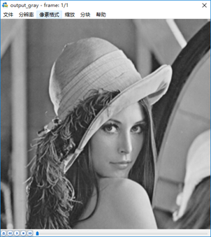 

## 四、将YUV420P像素数据的亮度减半

 本程序中的函数可以通过将YUV数据中的亮度分量Y的数值减半的方法，降低图像的亮度。函数代码如下所示。 

```cpp
/**
 * Halve Y value of YUV420P file
 * @param url     Location of Input YUV file.
 * @param w       Width of Input YUV file.
 * @param h       Height of Input YUV file.
 * @param num     Number of frames to process.
 */
int simplest_yuv420_halfy(char *url, int w, int h,int num){
	FILE *fp=fopen(url,"rb+");
	FILE *fp1=fopen("output_half.yuv","wb+");
 
	unsigned char *pic=(unsigned char *)malloc(w*h*3/2);
 
	for(int i=0;i<num;i++){
		fread(pic,1,w*h*3/2,fp);
		//Half
		for(int j=0;j<w*h;j++){
			unsigned char temp=pic[j]/2;
			//printf("%d,\n",temp);
			pic[j]=temp;
		}
		fwrite(pic,1,w*h*3/2,fp1);
	}
 
	free(pic);
	fclose(fp);
	fclose(fp1);
 
	return 0;
}
```

调用上面函数的方法如下所示。

```cpp
simplest_yuv420_halfy("lena_256x256_yuv420p.yuv",256,256,1);
```

如果打算将图像的亮度减半，**只要将图像的每个像素的Y值取出来分别进行除以2的工作就可以了**。 **一帧YUV420P的图像占w * h * 3/2 个字节，其中Y分量占w * h个字节**。**图像的每个Y值占用1 Byte**，取值范围是0至255，对应C语言中的unsigned char数据类型。上述调用函数的代码运行后，将会把一张分辨率为256x256的名称为lena_256x256_yuv420p.yuv的YUV420P格式的像素数据文件处理成名称为output_half.yuv的YUV420P格式的像素数据文件。
 输入的原图如右所示           	  

 处理后的图像如右所示              

## 五、将YUV420P像素数据的周围加上边框

 本程序中的函数可以通过修改YUV数据中特定位置的亮度分量Y的数值，给图像添加一个“边框”的效果。函数代码如下所示。 

```cpp
/**
 * Add border for YUV420P file
 * @param url     Location of Input YUV file.
 * @param w       Width of Input YUV file.
 * @param h       Height of Input YUV file.
 * @param border  Width of Border.
 * @param num     Number of frames to process.
 */
int simplest_yuv420_border(char *url, int w, int h,int border,int num){
	FILE *fp=fopen(url,"rb+");
	FILE *fp1=fopen("output_border.yuv","wb+");
 
	unsigned char *pic=(unsigned char *)malloc(w*h*3/2);
 
	for(int i=0;i<num;i++){
		fread(pic,1,w*h*3/2,fp);
		//Y
		for(int j=0;j<h;j++){
			for(int k=0;k<w;k++){
				if(k<border||k>(w-border)||j<border||j>(h-border)){ //border是边框的宽度
					pic[j*w+k]=255;
					//pic[j*w+k]=0;
				}
			}
		}
		fwrite(pic,1,w*h*3/2,fp1);
	}
 
	free(pic);
	fclose(fp);
	fclose(fp1);
 
	return 0;
}
```

调用上面函数的方法如下所示

```cpp
simplest_yuv420_border("lena_256x256_yuv420p.yuv",256,256,20,1);
```

从代码可以看出，图像的边框的宽度为border，本程序**将距离图像边缘border范围内的像素的亮度分量Y的取值设置成了亮度最大值255**。上述调用函数的代码运行后，将会把一张分辨率为256x256的名称为lena_256x256_yuv420p.yuv的YUV420P格式的像素数据文件处理成名称为output_border.yuv的YUV420P格式的像素数据文件。

输入的原图如右所示               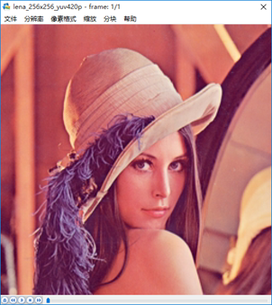 

 处理后的图像如右所示          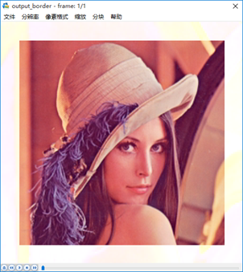 

## 六、生成YUV420P格式的灰阶测试图

 本程序中的函数可以生成一张YUV420P格式的灰阶测试图。函数代码如下所示。 

```cpp
/**
 * Generate YUV420P gray scale bar.
 * @param width    Width of Output YUV file.
 * @param height   Height of Output YUV file.
 * @param ymin     Max value of Y
 * @param ymax     Min value of Y
 * @param barnum   Number of bars
 * @param url_out  Location of Output YUV file.
 */
int simplest_yuv420_graybar(int width, int height,int ymin,int ymax,int barnum,char *url_out){
	int barwidth;
	float lum_inc;
	unsigned char lum_temp;
	int uv_width,uv_height;
	FILE *fp=NULL;
	unsigned char *data_y=NULL;
	unsigned char *data_u=NULL;
	unsigned char *data_v=NULL;
	int t=0,i=0,j=0;
 
	barwidth=width/barnum;
	lum_inc=((float)(ymax-ymin))/((float)(barnum-1));
	uv_width=width/2;
	uv_height=height/2;
 
	data_y=(unsigned char *)malloc(width*height);
	data_u=(unsigned char *)malloc(uv_width*uv_height);
	data_v=(unsigned char *)malloc(uv_width*uv_height);
 
	if((fp=fopen(url_out,"wb+"))==NULL){
		printf("Error: Cannot create file!");
		return -1;
	}
 
	//Output Info
	printf("Y, U, V value from picture's left to right:\n");
	for(t=0;t<(width/barwidth);t++){
		lum_temp=ymin+(char)(t*lum_inc);
		printf("%3d, 128, 128\n",lum_temp);
	}
	//Gen Data
	for(j=0;j<height;j++){
		for(i=0;i<width;i++){
			t=i/barwidth;  // 在每一小块的宽度中再细分
			lum_temp=ymin+(char)(t*lum_inc);
			data_y[j*width+i]=lum_temp;
		}
	}
	for(j=0;j<uv_height;j++){
		for(i=0;i<uv_width;i++){
			data_u[j*uv_width+i]=128;
		}
	}
	for(j=0;j<uv_height;j++){
		for(i=0;i<uv_width;i++){
			data_v[j*uv_width+i]=128;
		}
	}
	fwrite(data_y,width*height,1,fp);
	fwrite(data_u,uv_width*uv_height,1,fp);
	fwrite(data_v,uv_width*uv_height,1,fp);
	fclose(fp);
	free(data_y);
	free(data_u);
	free(data_v);
	return 0;
}
```

 调用上面函数的方法如下所示。 

```cpp
simplest_yuv420_graybar(640, 360,0,255,10,"graybar_640x360.yuv");
```

从源代码可以看出，本程序一方面通过灰阶测试图的**亮度最小值ymin**，**亮度最大值ymax**，**灰阶数量barnum**确定每一个灰度条中像素的亮度分量Y的取值。另一方面还要根据图像的宽度width和图像的高度height以及灰阶数量barnum确定每一个灰度条的宽度。有了这两方面信息之后，就可以生成相应的图片了。上述调用函数的代码运行后，会生成一个取值范围从0-255，一共包含10个灰度条的YUV420P格式的测试图。

 测试图的内容如下所示。 

 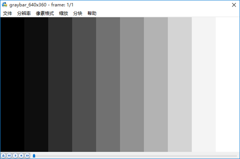 

 从程序也可以得到从左到右10个灰度条的Y、U、V取值，如下所示。 

| **Y** | **U** | **V** |
| ----- | ----- | ----- |
| 0     | 128   | 128   |
| 28    | 128   | 128   |
| 56    | 128   | 128   |
| 85    | 128   | 128   |
| 113   | 128   | 128   |
| 141   | 128   | 128   |
| 170   | 128   | 128   |
| 198   | 128   | 128   |
| 226   | 128   | 128   |
| 255   | 128   | 128   |

## 七、计算两个YUV420P像素数据的PSNR

 PSNR是最基本的视频质量评价方法。本程序中的函数可以对比两张YUV图片中亮度分量Y的PSNR。函数的代码如下所示。 

```cpp
/**
 * Calculate PSNR between 2 YUV420P file
 * @param url1     Location of first Input YUV file.
 * @param url2     Location of another Input YUV file.
 * @param w        Width of Input YUV file.
 * @param h        Height of Input YUV file.
 * @param num      Number of frames to process.
 */
int simplest_yuv420_psnr(char *url1,char *url2,int w,int h,int num){
	FILE *fp1=fopen(url1,"rb+");
	FILE *fp2=fopen(url2,"rb+");
	unsigned char *pic1=(unsigned char *)malloc(w*h);
	unsigned char *pic2=(unsigned char *)malloc(w*h);
 
	for(int i=0;i<num;i++){
		fread(pic1,1,w*h,fp1);
		fread(pic2,1,w*h,fp2);
 
		double mse_sum=0,mse=0,psnr=0;
		for(int j=0;j<w*h;j++){
            // pow(x,y) 是x的y次幂
			mse_sum+=pow((double)(pic1[j]-pic2[j]),2);  
		}
		mse=mse_sum/(w*h);
		psnr=10*log10(255.0*255.0/mse);
		printf("%5.3f\n",psnr);
 
        // fseek()设置流 stream 的文件位置为给定的偏移 offset 
        // SEEK_SET	文件的开头
        // 从文件的开头位置偏移w*h/2位置
		fseek(fp1,w*h/2,SEEK_CUR);
		fseek(fp2,w*h/2,SEEK_CUR);
 
	}
 
	free(pic1);
	free(pic2);
	fclose(fp1);
	fclose(fp2);
	return 0;
}
```

 调用上面函数的方法如下所示。 

```cpp
simplest_yuv420_psnr("lena_256x256_yuv420p.yuv","lena_distort_256x256_yuv420p.yuv",256,256,1);
```

对于8bit量化的像素数据来说，PSNR的计算公式如下所示。

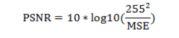

上述公式中mse的计算公式如下所示。

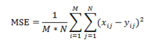

其中M，N分别为图像的宽高，xij和yij分别为两张图像的每一个像素值。PSNR通常用于质量评价，就是计算受损图像与原始图像之间的差别，以此来评价受损图像的质量。本程序输入的两张图像的对比图如下图所示。其中左边的图像为原始图像，右边的图像为受损图像。

 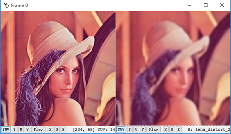 

经过程序计算后得到的PSNR取值为26.693。PSNR取值通常情况下都在20-50的范围内，取值越高，代表两张图像越接近，反映出受损图像质量越好。


## 参考文章

-  [视音频数据处理入门：RGB、YUV像素数据处理_雷霄骅(leixiaohua1020)的专栏-CSDN博客_rgb yuv](https://blog.csdn.net/leixiaohua1020/article/details/50534150) 