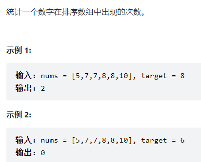

# 栈与队列

# 09.用两个栈实现队列

## 题目


## 第一次题解

```cpp
class CQueue {
public:
    CQueue() {
        
    }
    void appendTail(int value) {
        while(!a2.empty())
        {
            a1.push(a2.top());
            a2.pop();
        }
        a1.push(value);
    }
    
    int deleteHead() {
        while(!a1.empty())
        {
            a2.push(a1.top());
            a1.pop();
        }
        if(a2.empty())
            return -1;
        else
        {
            num = a2.top();
            a2.pop();
            return num;
        }      
    }

public:
    stack<int> a1;
    stack<int> a2;
    int num = -1;
};

/**
 * Your CQueue object will be instantiated and called as such:
 * CQueue* obj = new CQueue();
 * obj->appendTail(value);
 * int param_2 = obj->deleteHead();
 */
```

## 思路

- 用两个栈a1和a2来模拟队列，a1模拟队尾的插入，a2模拟队头的删除
- 考虑栈a2中可能还有数据，将全部数据移动到a1中，再插入
- 考虑栈a1中可能还有数据，将全部数据移动到a2中，再删除
- 考虑队列中没有元素，则返回-1，且用变量保存要删除的数据

# 30.包含min函数的栈

## 题目


## 第一次题解

```cpp
class MinStack {
public:
    /** initialize your data structure here. */
    MinStack() {

    }
    
    void push(int x) {
        a.push(x);
        if(b.empty())
        {
            b.push(x);
        }
        else
        {
            value = (x<b.top())?x:b.top();
            b.push(value);
        }
    }
    
    void pop() {
        a.pop();
        b.pop();
    }   
    
    int top() {
        return a.top();
    }
    
    int min() {
        return b.top();
    }
public:
    stack<int> a,b;
    int value;
};

/**
 * Your MinStack object will be instantiated and called as such:
 * MinStack* obj = new MinStack();
 * obj->push(x);
 * obj->pop();
 * int param_3 = obj->top();
 * int param_4 = obj->min();
 */
```

## 思路

难点在于如何使min的时间复杂度为O(1)

- 可以采用一个辅助栈，存储每个区间中的最小值

# 链表

# 06.从尾到头打印链表

## 题目


## 第一次题解

```cpp
/**
 * Definition for singly-linked list.
 * struct ListNode {
 *     int val;
 *     ListNode *next;
 *     ListNode(int x) : val(x), next(NULL) {}
 * };
 */
class Solution {
public:
    vector<int> reversePrint(ListNode* head) {
        vector<int> a;
        while(head)
        {
            a.push_back(head->val);
            head = head->next;
        }
        // 数组转置
       std::reverse(a.begin(), a.end());
       return a;
    }
};
```

## 思路

将每个节点的数据压入数组，再将数组转置

vector数组插入：push_back();

数组转置：std::reverse(a.begin(), a.end());

# 24. 反转链表

## 题目


## 第一次题解

```cpp
/**
 * Definition for singly-linked list.
 * struct ListNode {
 *     int val;
 *     ListNode *next;
 *     ListNode(int x) : val(x), next(NULL) {}
 * };
 */
class Solution {
public:
    ListNode* reverseList(ListNode* head) {
        ListNode* a = new ListNode(sizeof(ListNode));
        ListNode* b;
        a->next = head;

        if(head == NULL) 
            return NULL;
        while(head->next)
        {
            b = head->next;
            head->next = head->next->next;   // 取出b节点
            // 头插法
            b->next = a->next;
            a->next = b;
        }
        return a->next;
    }
};
```

## 思路

创建一个新的哨兵节点，用头插法来反转链表

需要考虑链表为空的情况

# 35. 复杂链表的复制

## 题目


## 官方题解：回溯+哈希

### 思路

-  如果是普通链表，我们可以直接按照遍历的顺序创建链表节点。 因为随机指针的存在，其指向的节点可能还没创建，因此需要转换思路
- 用哈希表记录当前每一个节点对应新节点的情况，拷贝当前节点
-  检查「当前节点的后继节点」和「当前节点的随机指针指向的节点」的创建情况。如果这两个节点中的任何一个节点的新节点没有被创建，我们都立刻递归地进行创建 
-  为了防止重复拷贝，我们需要首先检查当前节点是否被拷贝过，如果已经拷贝过，我们可以直接从哈希表中取出拷贝后的节点的指针并返回即可 

```cpp
/*
// Definition for a Node.
class Node {
public:
    int val;
    Node* next;
    Node* random;
    
    Node(int _val) {
        val = _val;
        next = NULL;
        random = NULL;
    }
};
*/

class Solution {
public:
    unordered_map<Node*, Node*> cachedNode;

    Node* copyRandomList(Node* head) {
        if(head == nullptr)
            return nullptr;

        // 防止重复拷贝新节点
        //count函数：返回哈希桶中关键码为key的键值对的个数，查看是否存在
        if(!cachedNode.count(head))
        {
            Node* NewNode = new Node(head->val);
            cachedNode[head] = NewNode;
            NewNode->next = copyRandomList(head->next);
            NewNode->random = copyRandomList(head->random);
        }
        return cachedNode[head];
    }
};
```

## 官方题解：迭代+拆分

### 思路

- 可以将链表每一个节点拆分为两个相连的节点， 比如A ->B ->C 拆分为 A ->A' ->B ->B' ->C ->C‘
- 对于任意一个原节点S，其拷贝节点S’ 就是其后继节点
- 我们可以直接找到每一个拷贝节点 S' 的随机指针应当指向的节点 

```cpp
class Solution {
public:
    Node* copyRandomList(Node* head) {
        if(head == nullptr)
            return nullptr;
        for(Node* node = head; node != nullptr; node = node->next->next)
        {
            // 创建新节点
            Node* nodeNew = new Node(node->val);
            // 接在原节点后面
            nodeNew->next = node->next;
            node->next = nodeNew;
        }
        for(Node* node = head; node != nullptr; node = node->next->next)
        {
            Node* nodeNew = node->next;
            nodeNew->random = (node->random != nullptr)? node->random->next: nullptr;
        }
        Node* headnew = head->next;
        for(Node* node = head; node != nullptr; node = node->next)
        {
            // 记录新节点
            Node* nodeNew = node->next;
            // 将新节点取出
            node->next = node->next->next;
            nodeNew->next = (node->next != nullptr)? node->next->next: nullptr;
        }
        return headnew;
    }
};
```

# 字符串

# 05. 替换空格

## 题目


## 题解

```cpp
class Solution {
public:
    string replaceSpace(string s) {
        string array;

        for(int i=0; i<s.size(); i++)
        {
            if(s[i] == ' ')
            {
               // 或者  array += "%20";
               array.push_back('%');
               array.push_back('2');
               array.push_back('0');
            }
            else
            {
                //或者  array += s[i];
                array.push_back(s[i]);
            }
        }
        return array;
    }
};
```

# 58. ΙΙ. 左旋转字符串

## 题目

 

## 第一次题解

```cpp
class Solution {
public:
    string reverseLeftWords(string s, int n) {
        string a;
        for(int i=n; i<s.size(); i++)
        {
            a += s[i];
        }
        for(int i=0; i<n; i++)
        {
            a += s[i];
        }
        return a;
    }
};
```

# 查找算法

# 03. 数组中重复的数字

## 题目


## 第一次题解

```cpp
class Solution {
public:
    int findRepeatNumber(vector<int>& nums) {
        unordered_map<int, int> array;
        int val = 0;

        for(int i=0; i<nums.size(); i++)
        {
            // 如果有重复的
            if(array.count(nums[i]))
            {
                array[nums[i]] += 1;
                return nums[i];
            }
            array[nums[i]] = val;
        }
        return -1;
    }
};
```

## 官方题解

```cpp
class Solution {
public:
    int findRepeatNumber(vector<int>& nums) {
        unordered_map<int, bool> array;

        for(int i=0; i<nums.size(); i++)
        {
            // 出现重复
            if(array[nums[i]])
            {
                return nums[i];
            }
            array[nums[i]] = true;
        }
        return -1;
    }
};
```

# 53. Ι. 在排序数组中查找数字

## 题目



## 第一次题解

### 思路

- 遍历一次，找到第一个目标值的位置
- 从这个位置往后开始计数，得到目标值出现的次数

```cpp
class Solution {
public:
    int search(vector<int>& nums, int target) {
       int count = 0, left = 0, right = nums.size()-1;
       for(int i=0; i<nums.size(); i++)
       {
           if(nums[i] == target)
           {
               left = i;
               break;
           }
       }
       while(left <= right)
       {
           if(nums[left] == target)
           {
               count++;
               left++;
           }
           else
           {
               break;
           }
       }
        return count;
    }
};
```

## 二分查找

### 思路

- 用二分查找算法得到目标值第一次出现的位置和大于目标值的位置
- 然后就能得到重复的次数

```cpp
class Solution {
public:
    int binarySearch(vector<int>& nums, int target, bool lower)
    {
        int left = 0, right = nums.size()-1, ans = nums.size();
        while(left <= right)
        {
            // 取中
            int mid = (left + right) / 2;
            // 大于目标，则在左边，移动right
            if(nums[mid] > target || (lower && nums[mid] >= target) )
            {
                // lower为true时，right在第一个target的左边。lower为false时，right是最后一个target
                right = mid-1; 
                ans = mid;
            } 
            else
            {
                left = mid+1;
            }
        }
        return ans;
    }
    int search(vector<int>& nums, int target) {
        int leftIdx = binarySearch(nums, target, true);
        int rightIdx = binarySearch(nums, target, false) - 1;
        if(leftIdx <= rightIdx && rightIdx < nums.size() && nums[leftIdx] == target && nums[rightIdx] == target)
        {
            return rightIdx - leftIdx + 1;
        }
        return 0;
    }
};
```

