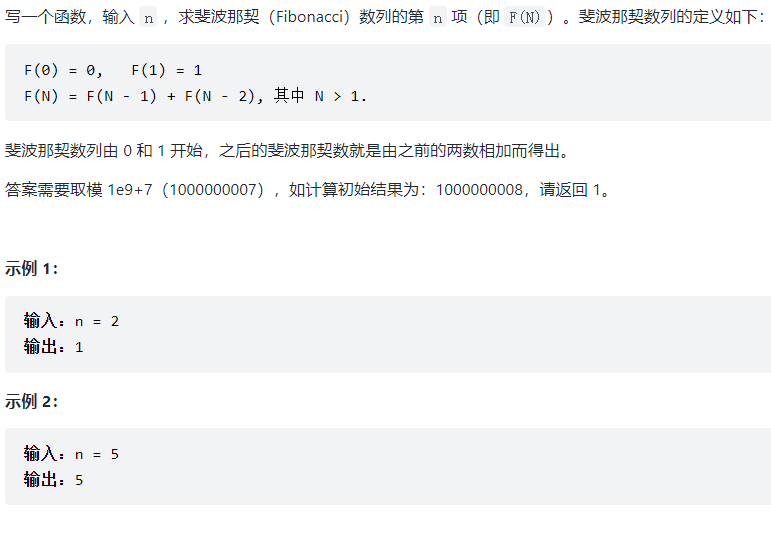

# 栈与队列

# 09.用两个栈实现队列

## 题目


## 第一次题解

### 思路

- 用两个栈a1和a2来模拟队列，a1模拟队尾的插入，a2模拟队头的删除
- 考虑栈a2中可能还有数据，将全部数据移动到a1中，再插入
- 考虑栈a1中可能还有数据，将全部数据移动到a2中，再删除
- 考虑队列中没有元素，则返回-1，且用变量保存要删除的数据

```cpp
class CQueue {
public:
    CQueue() {
        
    }
    void appendTail(int value) {
        while(!a2.empty())
        {
            a1.push(a2.top());
            a2.pop();
        }
        a1.push(value);
    }
    
    int deleteHead() {
        while(!a1.empty())
        {
            a2.push(a1.top());
            a1.pop();
        }
        if(a2.empty())
            return -1;
        else
        {
            num = a2.top();
            a2.pop();
            return num;
        }      
    }

public:
    stack<int> a1;
    stack<int> a2;
    int num = -1;
};

/**
 * Your CQueue object will be instantiated and called as such:
 * CQueue* obj = new CQueue();
 * obj->appendTail(value);
 * int param_2 = obj->deleteHead();
 */
```

# 30.包含min函数的栈

## 题目


## 第一次题解

### 思路

难点在于如何使min的时间复杂度为O(1)

- 可以采用一个辅助栈，存储每个区间中的最小值

```cpp
class MinStack {
public:
    /** initialize your data structure here. */
    MinStack() {

    }
    
    void push(int x) {
        a.push(x);
        if(b.empty())
        {
            b.push(x);
        }
        else
        {
            value = (x<b.top())?x:b.top();
            b.push(value);
        }
    }
    
    void pop() {
        a.pop();
        b.pop();
    }   
    
    int top() {
        return a.top();
    }
    
    int min() {
        return b.top();
    }
public:
    stack<int> a,b;
    int value;
};

/**
 * Your MinStack object will be instantiated and called as such:
 * MinStack* obj = new MinStack();
 * obj->push(x);
 * obj->pop();
 * int param_3 = obj->top();
 * int param_4 = obj->min();
 */
```


# 链表

# 06.从尾到头打印链表

## 题目


## 第一次题解

### 思路

将每个节点的数据压入数组，再将数组转置

vector数组插入：push_back();

数组转置：std::reverse(a.begin(), a.end());

```cpp
/**
 * Definition for singly-linked list.
 * struct ListNode {
 *     int val;
 *     ListNode *next;
 *     ListNode(int x) : val(x), next(NULL) {}
 * };
 */
class Solution {
public:
    vector<int> reversePrint(ListNode* head) {
        vector<int> a;
        while(head)
        {
            a.push_back(head->val);
            head = head->next;
        }
        // 数组转置
       std::reverse(a.begin(), a.end());
       return a;
    }
};
```

# 24. 反转链表

## 题目


## 第一次题解

### 思路

创建一个新的哨兵节点，用头插法来反转链表

需要考虑链表为空的情况

```cpp
/**
 * Definition for singly-linked list.
 * struct ListNode {
 *     int val;
 *     ListNode *next;
 *     ListNode(int x) : val(x), next(NULL) {}
 * };
 */
class Solution {
public:
    ListNode* reverseList(ListNode* head) {
        ListNode* a = new ListNode(sizeof(ListNode));
        ListNode* b;
        a->next = head;

        if(head == NULL) 
            return NULL;
        while(head->next)
        {
            b = head->next;
            head->next = head->next->next;   // 取出b节点
            // 头插法
            b->next = a->next;
            a->next = b;
        }
        return a->next;
    }
};
```

# 35. 复杂链表的复制

## 题目


## 官方题解：回溯+哈希

### 思路

-  如果是普通链表，我们可以直接按照遍历的顺序创建链表节点。 因为随机指针的存在，其指向的节点可能还没创建，因此需要转换思路
- 用哈希表记录当前每一个节点对应新节点的情况，拷贝当前节点
-  检查「当前节点的后继节点」和「当前节点的随机指针指向的节点」的创建情况。如果这两个节点中的任何一个节点的新节点没有被创建，我们都立刻递归地进行创建 
-  为了防止重复拷贝，我们需要首先检查当前节点是否被拷贝过，如果已经拷贝过，我们可以直接从哈希表中取出拷贝后的节点的指针并返回即可 

```cpp
/*
// Definition for a Node.
class Node {
public:
    int val;
    Node* next;
    Node* random;
    
    Node(int _val) {
        val = _val;
        next = NULL;
        random = NULL;
    }
};
*/

class Solution {
public:
    unordered_map<Node*, Node*> cachedNode;

    Node* copyRandomList(Node* head) {
        if(head == nullptr)
            return nullptr;

        // 防止重复拷贝新节点
        //count函数：返回哈希桶中关键码为key的键值对的个数，查看是否存在
        if(!cachedNode.count(head))
        {
            Node* NewNode = new Node(head->val);
            cachedNode[head] = NewNode;
            NewNode->next = copyRandomList(head->next);
            NewNode->random = copyRandomList(head->random);
        }
        return cachedNode[head];
    }
};
```

## 官方题解：迭代+拆分

### 思路

- 可以将链表每一个节点拆分为两个相连的节点， 比如A ->B ->C 拆分为 A ->A' ->B ->B' ->C ->C‘
- 对于任意一个原节点S，其拷贝节点S’ 就是其后继节点
- 我们可以直接找到每一个拷贝节点 S' 的随机指针应当指向的节点 

```cpp
class Solution {
public:
    Node* copyRandomList(Node* head) {
        if(head == nullptr)
            return nullptr;
        for(Node* node = head; node != nullptr; node = node->next->next)
        {
            // 创建新节点
            Node* nodeNew = new Node(node->val);
            // 接在原节点后面
            nodeNew->next = node->next;
            node->next = nodeNew;
        }
        for(Node* node = head; node != nullptr; node = node->next->next)
        {
            Node* nodeNew = node->next;
            nodeNew->random = (node->random != nullptr)? node->random->next: nullptr;
        }
        Node* headnew = head->next;
        for(Node* node = head; node != nullptr; node = node->next)
        {
            // 记录新节点
            Node* nodeNew = node->next;
            // 将新节点取出
            node->next = node->next->next;
            nodeNew->next = (node->next != nullptr)? node->next->next: nullptr;
        }
        return headnew;
    }
};
```

# 字符串

# 05. 替换空格

## 题目


## 题解

```cpp
class Solution {
public:
    string replaceSpace(string s) {
        string array;

        for(int i=0; i<s.size(); i++)
        {
            if(s[i] == ' ')
            {
               // 或者  array += "%20";
               array.push_back('%');
               array.push_back('2');
               array.push_back('0');
            }
            else
            {
                //或者  array += s[i];
                array.push_back(s[i]);
            }
        }
        return array;
    }
};
```

# 58. ΙΙ. 左旋转字符串

## 题目

 

## 第一次题解

```cpp
class Solution {
public:
    string reverseLeftWords(string s, int n) {
        string a;
        for(int i=n; i<s.size(); i++)
        {
            a += s[i];
        }
        for(int i=0; i<n; i++)
        {
            a += s[i];
        }
        return a;
    }
};
```

# 查找算法

# 03. 数组中重复的数字

## 题目


## 第一次题解

```cpp
class Solution {
public:
    int findRepeatNumber(vector<int>& nums) {
        unordered_map<int, int> array;
        int val = 0;

        for(int i=0; i<nums.size(); i++)
        {
            // 如果有重复的
            if(array.count(nums[i]))
            {
                array[nums[i]] += 1;
                return nums[i];
            }
            array[nums[i]] = val;
        }
        return -1;
    }
};
```

## 官方题解

```cpp
class Solution {
public:
    int findRepeatNumber(vector<int>& nums) {
        unordered_map<int, bool> array;

        for(int i=0; i<nums.size(); i++)
        {
            // 出现重复
            if(array[nums[i]])
            {
                return nums[i];
            }
            array[nums[i]] = true;
        }
        return -1;
    }
};
```

# 53. Ι. 在排序数组中查找数字

## 题目


## 第一次题解

### 思路

- 遍历一次，找到第一个目标值的位置
- 从这个位置往后开始计数，得到目标值出现的次数

```cpp
class Solution {
public:
    int search(vector<int>& nums, int target) {
       int count = 0, left = 0, right = nums.size()-1;
       for(int i=0; i<nums.size(); i++)
       {
           if(nums[i] == target)
           {
               left = i;
               break;
           }
       }
       while(left <= right)
       {
           if(nums[left] == target)
           {
               count++;
               left++;
           }
           else
           {
               break;
           }
       }
        return count;
    }
};
```

## 二分查找

### 思路

- 用二分查找算法得到目标值第一次出现的位置和大于目标值的位置
- 然后就能得到重复的次数

```cpp
class Solution {
public:
    int binarySearch(vector<int>& nums, int target, bool lower)
    {
        int left = 0, right = nums.size()-1, ans = nums.size();
        while(left <= right)
        {
            // 取中
            int mid = (left + right) / 2;
            // 大于目标，则在左边，移动right
            if(nums[mid] > target || (lower && nums[mid] >= target) )
            {
                // lower为true时，right在第一个target的左边。lower为false时，right是最后一个target
                right = mid-1; 
                ans = mid;
            } 
            else
            {
                left = mid+1;
            }
        }
        return ans;
    }
    int search(vector<int>& nums, int target) {
        int leftIdx = binarySearch(nums, target, true);
        int rightIdx = binarySearch(nums, target, false) - 1;
        if(leftIdx <= rightIdx && rightIdx < nums.size() && nums[leftIdx] == target && nums[rightIdx] == target)
        {
            return rightIdx - leftIdx + 1;
        }
        return 0;
    }
};
```

# 53. ΙΙ. 0~n-1中缺失的数字

## 题目


## 题解

### 思路

- 排序数组中的搜索问题，首先想到二分法
- 根据题意，可以分为以下两部分
- 左子数组：nums[i] = i;
- 右子数组：nums[i] != i;
- 跳出时，变量left和right分别指向“右子数组的首位元素”和“左子数组的末位元素”， 因此返回left即可

```cpp
class Solution { 
public:
    int missingNumber(vector<int>& nums) {
        // 二分法
        int left = 0, right = nums.size()-1, target = -1;
        while(left <= right)
        {
            int mid = (left + right)/2;
            // nums[i] == i, 则缺失数字在右边
            if(nums[mid] == mid) 
            {
                left = mid+1;
            }
            else 
            {
                right = mid-1;
            }
        }
        // 缺失的数字是最后一次循环的mid +1, 故返回left
        return left;
    }
};
```

# 04. 二维数组中的查找

## 题目


## 暴力

### 思路

- 将二维数组中的每个值都遍历一遍

```cpp
class Solution {
public:
    bool findNumberIn2DArray(vector<vector<int>>& matrix, int target) {
        for(int i=0; i<matrix.size(); i++)
        {
            for(int j=0; j < matrix[0].size(); j++)
            {
                if(matrix[i][j] == target)
                {
                    return true;
                }
            }
        }
        return false;
    }
};
```

## 线性查找

 从二维数组的右上角开始查找。如果当前元素等于目标值，则返回 `true`。如果当前元素大于目标值，则移到左边一列。如果当前元素小于目标值，则移到下边一行。 

```cpp
class Solution {
public:
    bool findNumberIn2DArray(vector<vector<int>>& matrix, int target) {
        if(matrix.size() == 0 || matrix[0].size() == 0)
            return false;
        
        int rows = matrix.size(), columns = matrix[0].size();
        // 从右上角开始， 第一行最后一列
        // row表示行，column表示列
        int row = 0, column = columns-1;
        while(row <rows && column >= 0)
        {
            if(matrix[row][column] == target)
                return true;
            // 若大于目标值， 则往左移, 否则往下移
            else if(matrix[row][column] > target)
            {
                column--;
            }else{
                row++;
            }
        }
        return false;
    }
};
```

# 11. 旋转数组的最小数字

## 题目


## 二分法题解

### 思路

- 将数组中的数字与最后一个值比较，可以划分为两个部分
- 前面一个部分中的数字大于最后一个值
- 后面一个部分中的数字小于最后一个值

```cpp
class Solution {
public:
    int minArray(vector<int>& numbers) {
       int left = 0, right = numbers.size()-1;
       while(left < right)
       {
           int mid = left + (right - left) /2;
           if(numbers[mid] < numbers[right])
           {
               right = mid; // 可以忽略右半部分
           }
           else if(numbers[mid] > numbers[right])
           {
               left = mid+1; // 可以忽略左半部分
           }
           else
           {
               right -= 1;
           }
       }
       return numbers[left];
    }
};
```

# 50. 第一次只出现一次的字符

## 题目


## 哈希解法

- 用哈希存储字符出现的频数

```cpp
class Solution {
public:
    char firstUniqChar(string s) {
        char a = ' '; 
        unordered_map<char, int> map;

        if(s.size() == 0)
        {
            return a;
        }
        for(int i=0; i<s.size(); i++)
        {
            map[s[i]] += 1;
        }
        for(int i=0; i<s.size(); i++)
        {
            if(map[s[i]] == 1)
            {
                a = s[i];
                break;
            }
        }
        return a;    
    }
};
```

# 搜索与回溯算法

# 32.  Ι. 从上到下打印二叉树

## 题目


## 题解

### 思路

- 按层打印，又称为二叉树的**广度优先搜索**(BFS)
- BFS通常借助**队列**的先入先出特性来实现

流程：

- 特例处理：当树的根节点为空，则直接返回空列表【】
- 初始化：创建队列，并将根节点放进队列
- BFS循环：当队列为空时跳出
- 1. 出队：队首元素出队，记为node
  2. 打印：将node.val添加到数组中
  3. 添加子节点：若 `node` 的左（右）子节点不为空，则将左（右）子节点加入队列 `queue` 

```cpp
/**
 * Definition for a binary tree node.
 * struct TreeNode {
 *     int val;
 *     TreeNode *left;
 *     TreeNode *right;
 *     TreeNode(int x) : val(x), left(NULL), right(NULL) {}
 * };
 */
class Solution {
public:
    vector<int> levelOrder(TreeNode* root) {
        vector<int> res;
        if(root == NULL)
        {
            return res;
        }
        queue<TreeNode*> que;
        que.push(root);
        while(que.size())
        {
            TreeNode* target = que.front();
            que.pop();
            res.push_back(target->val);
            if(target->left)
            {
                que.push(target->left);
            }
            if(target->right)
            {
                que.push(target->right);
            }
        }
        return res;
    }
};
```

# 32.  ΙΙ.从上到下打印二叉树 

## 题目


## 题解

### 思路

- 与上一题比较，需要将每一层打印到一行中
- 分层用一个for循环，循环次数为当前层节点数

```cpp
/**
 * Definition for a binary tree node.
 * struct TreeNode {
 *     int val;
 *     TreeNode *left;
 *     TreeNode *right;
 *     TreeNode(int x) : val(x), left(NULL), right(NULL) {}
 * };
 */
class Solution {
public:
    vector<vector<int>> levelOrder(TreeNode* root) {
        queue<TreeNode*> que;
        vector<vector<int>> ans;
        if(root == NULL)
        {
            return ans;
        }
        que.push(root);
        while(que.size())
        {
            vector<int> temp;
            for(int i=que.size(); i>0; i--)
            {
                TreeNode* node = que.front();
                que.pop();
                temp.push_back(node->val);
                if(node->left != NULL) que.push(node->left);
                if(node->right != NULL) que.push(node->right);
            }
            ans.push_back(temp);
        }
        return ans;
    }
};
```

# 32. ΙΙΙ. 从上到下打印二叉树

## 题目


## 题解

### 思路

- 比上一题多了一个要求，第偶数层要按照从右到左的顺序打印
- 将第偶数层的数组反转即可

```cpp
class Solution {
public:
    vector<vector<int>> levelOrder(TreeNode* root) {
        vector<vector<int>> ans;
        int count = 0;
        if(root == NULL)
            return ans;
        queue<TreeNode*> que;
        que.push(root);
        while(que.size())
        {
            vector<int> temp;
            for(int i=que.size(); i>0; i--)
            {
                TreeNode* node = que.front();
                que.pop();
                temp.push_back(node->val);
                if(node->left != NULL)  que.push(node->left);
                if(node->right != NULL) que.push(node->right);
            }
            count++;
            if(count%2 == 0)
            {
                reverse(temp.begin(), temp.end());
            }
            ans.push_back(temp);
        }
        return ans;
    }
};
```

# 26. 树的子结构

## 题目


## 题解

### 思路

```cpp
/**
 * Definition for a binary tree node.
 * struct TreeNode {
 *     int val;
 *     TreeNode *left;
 *     TreeNode *right;
 *     TreeNode(int x) : val(x), left(NULL), right(NULL) {}
 * };
 */
class Solution {
public:
    bool compare(TreeNode* A, TreeNode* B)
    {
        // 如果B为null，说明B都走完了，B都能匹配，返回true
        if(B == NULL) return true;
        // 如果A为null，走到这里说明B不为null，则B不能完全匹配，返回false
        if(A == NULL) return false;
        // A的值与B的值不同，返回false
        if(A->val != B->val)
            return false;
        // //走到这里说明A的值与B的值相等，递归各自的左右节点
        return compare(A->left, B->left) && compare(A->right, B->right);
    }
    bool isSubStructure(TreeNode* A, TreeNode* B) {
        if(A == NULL || B == NULL)
            return false;
        // 判断根节点， 再判断左右节点
        return compare(A, B) || isSubStructure(A->left, B) || isSubStructure(A->right, B); 
    }
};
```

# 27. 二叉树的镜像

## 题目


## 递归法

### 思路

- 递归遍历二叉树（dfs)，交换每个节点的左右子节点，即可生成二叉树的镜像
- 从下往上交换

```cpp
class Solution {
public:
    TreeNode* mirrorTree(TreeNode* root) {
        if(root == nullptr)     
            return nullptr;
        TreeNode* temp = root->left;
        root->left = mirrorTree(root->right); // 这一步会往下递归，递归到最低
        root->right = mirrorTree(temp);

        return root;
    }
};
```

## 利用辅助栈

### 思路

- 将每个节点放入栈中，再拿出一个节点，交换其左右节点
- 从上往下交换

```cpp
class Solution {
public:
    TreeNode* mirrorTree(TreeNode* root) {
        if(root == nullptr) 
            return nullptr;
        stack<TreeNode*> sta;
        sta.push(root);
        while(!sta.empty())
        {
            TreeNode* node = sta.top();
            sta.pop();
            if(node->left != nullptr)  sta.push(node->left);
            if(node->right != nullptr) sta.push(node->right);
            
            // 交换两个节点
            TreeNode* tmp = node->left;
            node->left = node->right;
            node->right = tmp;
        }
        return root;
    }
};
```

# 28. 对称的二叉树

## 题目


## 题解

### 思路

- 对称二叉树：对于树中任意两个对称节点L和R，一定有：
  - L.val == R.val  ， 两对称节点值相等
  - L.left.val == R.right.val   ，即L的左子节点和R的右子节点对称
  - L.right.val == R.left.val ， 即L的右子节点和R的左子节点对称

```cpp
class Solution {
public:
    bool isSymmetric(TreeNode* root) {
        if(root == NULL)
            return true;
        else
            return isSymmetric(root->left, root->right);
    }
    bool isSymmetric(TreeNode* left, TreeNode* right)
    {
        // 结束条件1：如果对称两个节点都为空，则返回true
        if(!left && !right)
            return true;
        // 结束条件2：如果单独一个节点为空，另一个节点不为空，又或者是对称节点间的val值不等，则返回false
        if(!left || !right || left->val != right->val)
            return false;
         // 该层符合对称二叉树的要求，开始比较下一层
        return isSymmetric(left->left, right->right) && isSymmetric(left->right, right->left);
    }
};
```

# 动态规划

# 10. Ι. 斐波那契数列

## 题目



## 递归

### 思路

- 可以用递归，但是超时了

```cpp
class Solution {
public:
    int fib(int n) {
        if(n == 0)
            return 0;
        if(n == 1)
            return 1;
        return fib(n-1)+fib(n-2);
    }
};
```

## 动态规划

### 思路

```cpp
class Solution {
public:
    int fib(int n) {
        if(n <= 1)
            return n;
        int a=0, b=1, sum = 0;
        for(int i=1; i<n; i++)
        {
            sum = (a+b) % 1000000007;
            a = b;
            b = sum;
        }
        return sum;
    }
};
```

# 10. ΙΙ.青蛙跳台阶问题

## 题目


## 动态规划

### 思路

 在所有跳法中，青蛙的最后一步只有两种情况： **跳上 1 级或 2 级台阶**。 

```cpp
class Solution {
public:
    int numWays(int n) {
        if(n <= 1)
            return 1;
        if(n == 2)
            return 2;
        int a = 1, b = 2, sum = 0;
        for(int i=2; i<n; i++)
        {
            sum = (a+b) % 1000000007;
            a = b;
            b = sum;
        }
        return sum;
    }
};
```

# 63. 股票的最大利润

## 题目


## 题解

### 思路

- 用maximun记录最大利润
-  前一天股票的利润，跟**今天的股票价格**和**历史股票最低价**的**差值** 进行相比，取大的那个，赋值给maximum

```cpp
class Solution {
public:
    int maxProfit(vector<int>& prices) {
        // 特殊情况
        if(prices.size() == 0)
            return 0;
        // 记录最小值,maximun记录最大利润
        int minimin=prices[0];
        int maximun = 0;
        for(int i=1; i<prices.size(); i++)
        {
            if(minimin>prices[i])
            {
                minimin = prices[i];
            }
            maximun = max(maximun, prices[i]-minimin);
        }
        return maximun;
    }
};
```

# 42. 连续子数组的最大和

## 题目


## 题解

### 思路

- 用整型变量pre表示以nums[i]为结尾的连续子数组最大和。
- 若pre <= 0,即pre+nums[i]还不如nums[i]本身大
  - 当pre>0时， 执行pre = pre+nums[i]
  - 当pre<0时，执行pre = nums[i]
- 返回全局最大值

```cpp
class Solution {
public:
    int maxSubArray(vector<int>& nums) {
        int pre = 0, maxAns = nums[0];
        for(int i=0; i<nums.size(); i++)
        {
            pre = max(pre+nums[i], nums[i]);
            maxAns = max(pre, maxAns);
        }
        return maxAns;
    }
};
```

# 47. 礼物的最大价值

## 题目


## 题解

### 思路

- 新建立一个二维数组，里面存储走到那里的最大价值数
- 先将第一个数据赋值
- 第一行往右叠加
- 第一列往下叠加
- 第m行第n列的数 + max(其上面的数， 其左边的数)

```cpp
class Solution {
public:
    int maxValue(vector<vector<int>>& grid) {
        int row = grid.size(), line = grid[0].size();
        vector< vector<int> > dp(row, vector<int>(line));
        for(int i = 0; i < row; i++)
        {
            for(int j = 0; j < line; j++)
            {
                if(i == 0 && j == 0)    dp[i][j] = grid[i][j];
                else if(i == 0) dp[i][j] = dp[i][j-1] + grid[i][j];
                else if(j == 0) dp[i][j] = dp[i-1][j] + grid[i][j];
                else dp[i][j] = max(dp[i-1][j], dp[i][j-1]) + grid[i][j];
            }
        }
        return dp[row-1][line-1];
    }
};
```

# 46. 把数字翻译成字符串

## 题目


## 题解

### 思路

- 这道题与青蛙跳台阶的题目相似，不过有个限制条件：两位数要在0~25之间

- 利用to_string()函数将整数转化为string类型

- 用dp数组记录每个区间的翻译方法

  ```cpp
  class Solution {
  public:
      // 符合返回true，不符合返回false
      bool helper(const char& a, const char& b)
      {
          return !(a == '0' || a > '2' || a == '2' && b > '5');
      }
      int translateNum(int num) {
          string s = to_string(num);
          int n = s.size(), dp[n];
          if(n <= 1)
              return n;
          dp[0] = 1;
          dp[1] = helper(s[0], s[1])? 2: 1;
          for(int i=2; i<n; i++)
          {
              // 如果后面两个数字不符合要求，则有dp[i-1]种翻译方法
              dp[i] = helper(s[i-1], s[i])? dp[i-1]+dp[i-2]: dp[i-1];
          }
          return dp[n-1];
      }
  };
  ```

  # 48. 最长不含重复字符的字符串

  ## 题目

  

## 题解

### 思路

- 可以看出，最长的子串不含重复字符
- 可以使用双指针+哈希表解决
- 用变量i和j来滑动

```cpp
class Solution {
public:
    int lengthOfLongestSubstring(string s) {
        // 用哈希表记录出现的次数
        unordered_map<char, int> hash;
        int n = s.size(), res = 0;
        // 双指针
        for(int i=0, j=0; j<n; j++)
        {
            hash[s[j]]++;
            // s[j]字符出现两次
            while(hash[s[j]] > 1)
            {
                hash[s[i]]--;
                i++;
            }
            res = max(res, j-i+1);
        }
        return res;
    }
};
```

