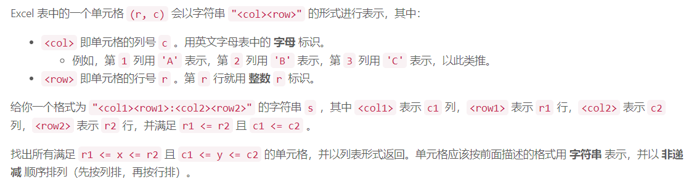
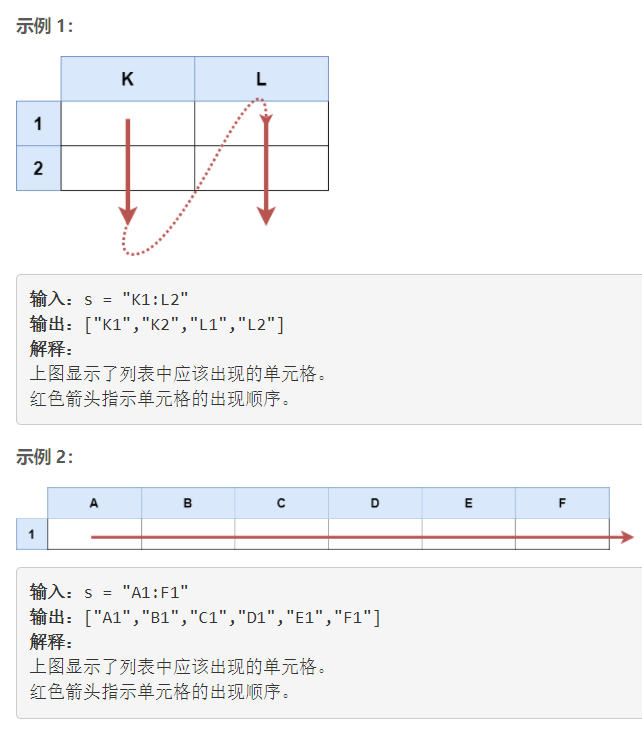
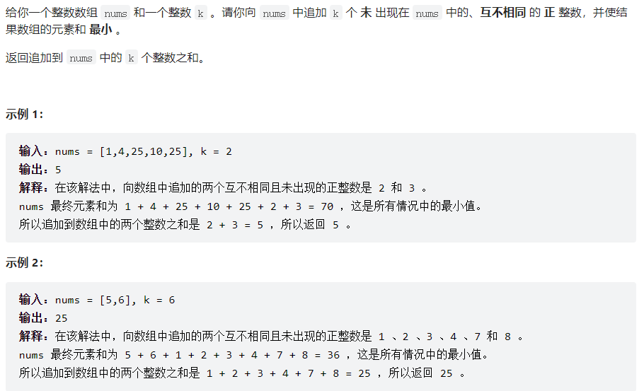
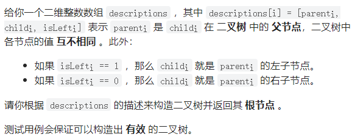
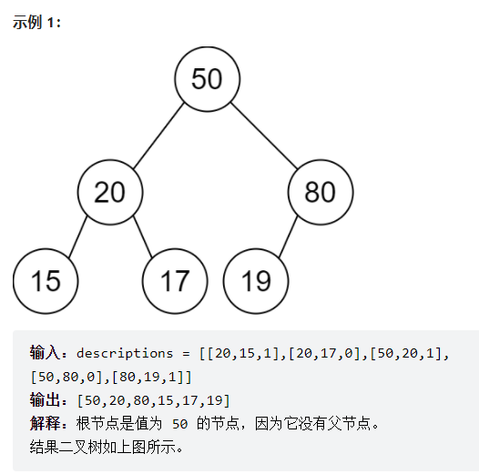
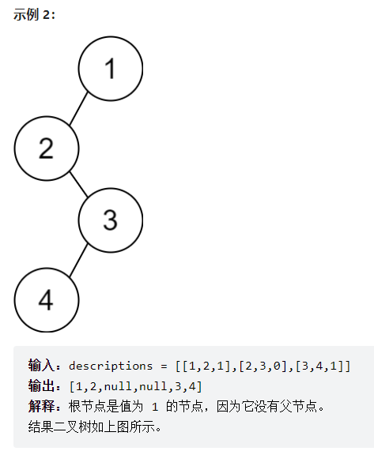
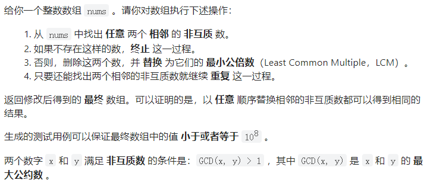
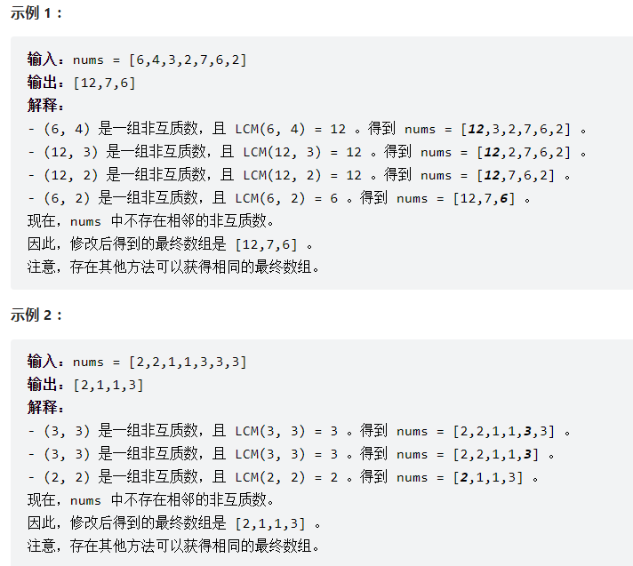

# 6016. Excel表中某个范围内的单元格

## 题目





## 题解

### 思路

- 将数字字符串转化为整型，可以-'0'
- 如果是字母，可以-‘A'， -'a'

```cpp
class Solution {
public:
    vector<string> cellsInRange(string s) {
        vector<string> vec;
        char i = s[0];
        while(i <= s[3])
        {
            for(int j = s[1]-'0'; j <= s[4] - '0'; j++)
            {
                string str1 = to_string(j);
                string str2 = i+str1;
                vec.push_back(str2);
            }
            i++;
        }
        return vec;
    }
};
```

## 优化

```cpp
class Solution
{
public:
    vector<string> cellsInRange(string s)
    {
        vector<string> ans;
        for(char i = s[0]; i <= s[3]; i++)
        {
            for(char j = s[i]; j <= s[4]; j++)
            {
                string str = {i,j,'\0'};
                ans.push_back(str);
            }
        }
        return ans;
    }
};
```

# 6017. 向数组中追加K个整数

## 题目



## 题解

### 思路

- 排序+去重+等差数列

- 插入最小值和最大值，这样就只有考虑两数之间的间隔

  ```cpp
  class Solution {
  public:
      long long minimalKSum(vector<int>& nums, int k) {
          // 插入最小值和最大值，使得不用考虑前后的情况
          nums.push_back(0),nums.push_back(2000000001);  
          // 排序
          sort(nums.begin(),nums.end());
          // unique()去除数组中相邻的重复项, 返回的是一个迭代器，指向的是去重后容器中不重复序列的最后一个元素的下一个元素
          // erase()删除
          nums.erase(unique(nums.begin(),nums.end()),nums.end());
          long long ans=0;
          int len=nums.size();
          for(int i=1;i<len;i++){
              // tem表示两个数之间的间隔数目
              int tmp=nums[i]-nums[i-1]-1;
              tmp=min(tmp,k);
              k-=tmp;
              // 等差数列
              ans+=(long long)(2*nums[i-1]+1+tmp)*tmp/2;  
              if(k==0)break;
          }
          return ans;
      }
  };
  ```

# 6018. 根据描述创建二叉树

## 题目







## 题解

```cpp
/**
 * Definition for a binary tree node.
 * struct TreeNode {
 *     int val;
 *     TreeNode *left;
 *     TreeNode *right;
 *     TreeNode() : val(0), left(nullptr), right(nullptr) {}
 *     TreeNode(int x) : val(x), left(nullptr), right(nullptr) {}
 *     TreeNode(int x, TreeNode *left, TreeNode *right) : val(x), left(left), right(right) {}
 * };
 */
class Solution {
public:
    TreeNode* createBinaryTree(vector<vector<int>>& descriptions) {
        unordered_map<int, TreeNode*> map;
        int n = descriptions.size();
        for(int i=0; i<n; i++)
        {
            if(!map[descriptions[i][0]]) //如果父节点不存在
            {
                map[descriptions[i][0]] = new TreeNode(descriptions[i][0]);
            }
            if(map[descriptions[i][1]])  // 当前节点的子节点存在
            {
                if(descriptions[i][2]){
                    map[descriptions[i][0]]->left = map[descriptions[i][1]];
                }else{
                    map[descriptions[i][0]]->right = map[descriptions[i][1]];
                }
            }
            else
            {
                TreeNode* t = new TreeNode(descriptions[i][1]);
                if(descriptions[i][2]){
                    map[descriptions[i][0]]->left = t;
                }else{
                    map[descriptions[i][0]]->right = t;
                }
                map[descriptions[i][1]] = t;
            }
        }
        unordered_map<int, int> hx;
        for(int i=0; i<n; i++)  // 记录父节点
        {
            hx[descriptions[i][0]]++;
        }
        for(int i=0; i<n; i++)  // 剔除子节点
        {
            hx[descriptions[i][1]] = 0;
        }
        for(int i=0; i<n; i++)  // 记录父节点
        {
            if(hx[descriptions[i][0]])
                return map[descriptions[i][0]];
        }
        return NULL;
    }
};
```

# 6019. 替换数组中的非互质数

## 题目





## 题解

### 思路

-  如果有三个相邻且可以合并的数 x,y,z*x*,*y*,*z*，那么先合并 x*x* 和 y*y* 再合并 z*z* 的结果，与先合并 y*y* 和 z*z* 再合并 x*x* 的结果是一样的 
-  用栈来模拟上述过程 
- 从 \textit{nums}[1]nums[1] 开始遍历，将其入栈。循环，每次从栈顶取出两个元素，若其互质则退出循环，否则将这两个元素的最小公倍数入栈，循环直至栈内只有一个元素为止


```cpp
class Solution {
public:
   vector<int> replaceNonCoprimes(vector<int>& nums)
    {
        vector<int> s = {nums[0]};
        for(int i = 1; i < nums.size(); i++)
        {
            s.push_back(nums[i]);
            while(s.size()>1)
            {
                int x = s.back(), y = s[s.size()-2];
                int g = gcd(x, y);
                if(g == 1) break;
                s.pop_back();
                s.back() *= x/g;
            }
        }
        return s;
    }
};
```

