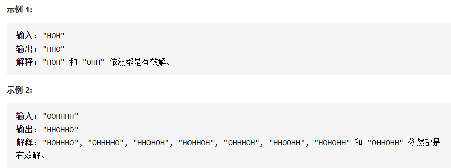

# 多线程题目

## 1114.按序打印


### 解决代码

```c++
#include<pthread.h>
#include<semaphore.h>
using namespace std;

class Foo {
public:
    Foo() {
        sem_init(&sem1, 0, 0);
        sem_init(&sem2, 0, 0);
    }

    void first(function<void()> printFirst) {
     
        // printFirst() outputs "first". Do not change or remove this line.
        printFirst();
        sem_post(&sem1);
    }

    void second(function<void()> printSecond) {
        sem_wait(&sem1);
        // printSecond() outputs "second". Do not change or remove this line.
        printSecond();
        sem_post(&sem2);
    }

    void third(function<void()> printThird) {
        sem_wait(&sem2);
        // printThird() outputs "third". Do not change or remove this line.
        printThird();
    }
private:
    sem_t sem1;
    sem_t sem2;
};
```

### 总结

> 使用了两个信号量来模拟条件变量，使能够按序打印

## 1115. 交替打印FooBar


### 解决代码

```c++
#include<pthread.h>
#include<time.h>
#include<pthread.h>
#include<semaphore.h>
using namespace std;

class FooBar {
private:
    int n;
    sem_t sem1;
    sem_t sem2;

public:
    FooBar(int n) {
        this->n = n;
        sem_init(&sem1, 0, 0);
        sem_init(&sem2, 0, 0);
        sem_post(&sem1);
    }

    void foo(function<void()> printFoo) {
        
        for (int i = 0; i < n; i++) {
            sem_wait(&sem1);
        	// printFoo() outputs "foo". Do not change or remove this line.
        	printFoo();
            sem_post(&sem2);
        }
    }

    void bar(function<void()> printBar) {
        
        for (int i = 0; i < n; i++) {
           sem_wait(&sem2);
        	// printBar() outputs "bar". Do not change or remove this line.
        	printBar();
           sem_post(&sem1);
        }
    }
};
```

### 总结

> 用两个信号量，要交替打印，让两个线程分别生产对方的信号量，这样就能交替执行

## 1116.打印零与奇偶数


### 解决代码

```c++
#include<semaphore.h>
class ZeroEvenOdd {
private:
    int n;
    sem_t zero_sem;
    sem_t odd_sem;
    sem_t even_sem;

public:
    ZeroEvenOdd(int n) {
        this->n = n;
        sem_init(&zero_sem, 0, 1);
        sem_init(&odd_sem, 0, 0);
        sem_init(&even_sem, 0, 0);
    }

    // printNumber(x) outputs "x", where x is an integer.
    void zero(function<void(int)> printNumber) {
        for(int i=1; i<=n; i++)
        {
            sem_wait(&zero_sem);
             printNumber(0);
             if(i%2 == 0)
             {
                 sem_post(&even_sem);  
             } 
             else 
             {
                 sem_post(&odd_sem);
             }
             
        }
    }

    void even(function<void(int)> printNumber) {
        for(int j=2; j<=n; j=j+2)
        {
            sem_wait(&even_sem);
            printNumber(j);
            sem_post(&zero_sem);
        }
    }

    void odd(function<void(int)> printNumber) {
        for(int z=1; z<=n; z=z+2)
        {
             sem_wait(&odd_sem);
             printNumber(z);
             sem_post(&zero_sem);
        }
    }
};
```

### 总结

> LeetCode底层实现时,
>
> zero中printNumber.accept只能输入0,
>
> even中printNumber.accept只能输入偶数,
>
> odd中printNumber.accept只能输入奇数,

## 1117. H2O生成




### 解决代码

```c++
#include<semaphore.h>

class H2O {
private:
    sem_t sem1;
    sem_t sem2;
    int i=0;
public:
    H2O() {
        sem_init(&sem1, 0, 0);
        sem_init(&sem2, 0, 1);
    }

    void hydrogen(function<void()> releaseHydrogen) {
        sem_wait(&sem1);
        // releaseHydrogen() outputs "H". Do not change or remove this line.
        releaseHydrogen();
        i++;
        if(i==2)
        {
            i=0;
            sem_post(&sem2);
        }
    }

    void oxygen(function<void()> releaseOxygen) {
        sem_wait(&sem2);
        sem_post(&sem1);
        sem_post(&sem1);
        // releaseOxygen() outputs "O". Do not change or remove this line.
        releaseOxygen();
    }
};
```

### 总结

> 用两个信号量，当一个线程中的函数运行了两次，满足条件后就激活另一个线程。

## 1195. 交替打印字符串


### 解决代码

```c++
#include<semaphore.h>

class FizzBuzz {
private:
    int n;
    sem_t fizz_sem;
    sem_t buzz_sem;
    sem_t fizzbuzz_sem;
    sem_t number_sem;
public:
    FizzBuzz(int n) {
        this->n = n;
        sem_init(&fizz_sem, 0, 1);
        sem_init(&buzz_sem, 0, 0);
        sem_init(&fizzbuzz_sem, 0, 0);
        sem_init(&number_sem, 0, 0);
    }

    // printFizz() outputs "fizz".
    void fizz(function<void()> printFizz) {
        for(int i=1; i<=n; i++)
        {
            sem_wait(&fizz_sem);
            if(i%3 == 0 && i%5 != 0)    printFizz();
            sem_post(&buzz_sem);
        }
    }

    // printBuzz() outputs "buzz".
    void buzz(function<void()> printBuzz) {
          for(int i=1; i<=n; i++)
        {
            sem_wait(&buzz_sem);
            if(i%3 != 0 && i%5 == 0)    printBuzz();
            sem_post(&fizzbuzz_sem);
        }
    }

    // printFizzBuzz() outputs "fizzbuzz".
	void fizzbuzz(function<void()> printFizzBuzz) {
          for(int i=1; i<=n; i++)
        {
            sem_wait(&fizzbuzz_sem);
            if(i%3 == 0 && i%5 == 0)    printFizzBuzz();
            sem_post(&number_sem);
        }
    }

    // printNumber(x) outputs "x", where x is an integer.
    void number(function<void(int)> printNumber) {
         for(int i=1; i<=n; i++)
        {
            sem_wait(&number_sem);
            if(i%3 != 0 && i%5 != 0)    printNumber(i);
            sem_post(&fizz_sem);
        }
    }
};
```

### 总结

> 用4个信号量来控制线程的顺序

## 1226. 哲学家进餐（死锁经典问题)


### 求解方法

问题的本质就是解决N个哲学家同时就餐时的死锁问题，解题思路如下：

1.使用and语义，即要么多锁同时被锁定，要么全部不被锁定。
2.限定就餐人数为N-1，这样死锁的闭环总不成立。
3.奇偶编号的哲学家加锁顺序不一致即可。
4.只有一个人拿筷子的顺序和其他人不一样也可以避免一个闭环。

**策略1：**

**只有当哲学家的左右两只筷子均处于可用状态时**，才允许他拿起筷子。这样就可以避免他们同时拿起筷子就餐，导致死锁

1.当得不到所有所需资源时，放弃已经获得的资源，等待。

2.保证资源的获取顺序，要求每个线程获取资源的顺序一致。


**策略2:**

**至多允许有四位哲学家**同时去竞争就餐，最终可以保证至少有一位哲学家成功就餐，并在就餐完毕，释放他的筷子资源，其他的philosopher就有机会可以就餐了

```c++
// 伪代码
semaphore chopstick[5] = [1,1,1,1,1];
semaphore count = 4; // 设置一个count,最多有4个哲学家可以进来
void philosopher(int i)
{
	while(true)
	{
		think();  // 思考
		P(count); // 请求进入房间进餐，当count为0时，不能允许哲学家再进来了
		
		P(chopstick[i]); // 请求左手边的筷子
		P(chopstick[(i+1)%5]); // 请求右手边的筷子
		eat();
		V(chopstick[i]); // 释放左手边的筷子
		V(chopstick[(i+1)%5]); // 释放右手边的筷子
		
		V(count); // 离开饭桌释放信号量
	}
}
```

**策略3：**

利用封装好的信号量，使用奇偶法。防止哲学家饿死的情况，制定如下规则：

规则： 奇数号的哲学家先拿起右边的筷子再拿起左边的筷子。

​			偶数号哲学家先拿起左边的筷子，再拿起右边的筷子。

如果哲学家抢到一只筷子，在抢占另一只筷子时失败，则要放弃已经抢占到的资源。

左右两边都抢到筷子的哲学家，吃完放后释放资源。

实现时只需在求解策略二的基础上加个奇偶判断就可以了

### 解决代码

### 以下的代码超出时间限制了

```c++
class DiningPhilosophers {
private:
    pthread_mutex_t forks[5];
public:
    DiningPhilosophers() {
        for(int i = 0; i < 5; i++) pthread_mutex_init(forks + i, NULL);
    }

    void wantsToEat(int philosopher,
                    function<void()> pickLeftFork,
                    function<void()> pickRightFork,
                    function<void()> eat,
                    function<void()> putLeftFork,
                    function<void()> putRightFork) {
        int left_hand = philosopher, right_hand = (philosopher + 1) % 5;    //左右手序号
        int ret1 = 1, ret2 = 1;
        while(ret1 != 0 || ret2 != 0) {                                               //尝试同时锁两个直到成功
            if(ret1 == 0) pthread_mutex_unlock(forks + left_hand);          //锁失败锁住的打开
            if(ret2 == 0) pthread_mutex_unlock(forks + right_hand);
            ret1 = pthread_mutex_trylock(forks + left_hand);                //继续尝试 
            ret2 = pthread_mutex_trylock(forks + right_hand);               //pthread_mutex_trylock 成功会返回0
        }
        pickLeftFork();
        pickRightFork();
        eat();
        putLeftFork();
        putRightFork();
        pthread_mutex_unlock(forks + left_hand);                            //全部解锁
        pthread_mutex_unlock(forks + right_hand);
    }
};
```

### 方法一、当两边的叉子都可用时才拿

为了保证能够同时拿起，我们需要对拿叉子这一步骤进行加锁，保证哲学家能够同时拿起一双叉子，而不会拿了一边后另一边被人抢走

```c++
class DiningPhilosophers {
public:
    DiningPhilosophers() 
    {}

    void wantsToEat(int philosopher,
                    function<void()> pickLeftFork,
                    function<void()> pickRightFork,
                    function<void()> eat,
                    function<void()> putLeftFork,
                    function<void()> putRightFork) 
    {
        //对拿叉子进行这一流程进行加锁，保证其能同时拿起一双，而不会被其他人抢走
        _lock.lock();
        _fork[philosopher].lock();
        _fork[(philosopher + 1) % 5].lock();
		_lock.unlock();
		
		//拿起左右叉子
        pickLeftFork();	
        pickRightFork();

        eat();	//吃饭
        
		//放下左右叉子
        putLeftFork();
        putRightFork();
        
        //解锁，让其他人获取叉子
        _fork[philosopher].unlock();
        _fork[(philosopher + 1) % 5].unlock();
    }

private:
    mutex _lock;	
    mutex _fork[5];
};
```

### 转化后的代码

```c++
class DiningPhilosophers {
public:
    DiningPhilosophers() 
    {
        pthread_mutex_init(&_lock,NULL);
        for(int i=0; i<5; i++)
       pthread_mutex_init(_fork+i, NULL);
    }

    void wantsToEat(int philosopher,
                    function<void()> pickLeftFork,
                    function<void()> pickRightFork,
                    function<void()> eat,
                    function<void()> putLeftFork,
                    function<void()> putRightFork) 
    {
        //对拿叉子进行这一流程进行加锁，保证其能同时拿起一双，而不会被其他人抢走
        pthread_mutex_lock(&_lock);
        pthread_mutex_lock(_fork + philosopher);
        pthread_mutex_lock(_fork + (philosopher + 1) % 5);
		pthread_mutex_unlock(&_lock);
		
		//拿起左右叉子
        pickLeftFork();	
        pickRightFork();

        eat();	//吃饭
        
		//放下左右叉子
        putLeftFork();
        putRightFork();
        
        //解锁，让其他人获取叉子
        pthread_mutex_unlock(_fork + philosopher);                            //全部解锁
        pthread_mutex_unlock(_fork + (philosopher + 1) % 5);
    }

private:
    pthread_mutex_t _lock;	
    pthread_mutex_t _fork[5];
};
```

### 方法二、限制就餐的哲学家数量

 我们需要用到一个计数器来表示当前就餐的人数，为了保证线程安全我们需要用到一个互斥锁和一个条件变量对其进行保护 

```c++
class DiningPhilosophers {
public:
    DiningPhilosophers()
        :_count(0)
    {}

    void wantsToEat(int philosopher,
                    function<void()> pickLeftFork,
                    function<void()> pickRightFork,
                    function<void()> eat,
                    function<void()> putLeftFork,
                    function<void()> putRightFork) 
    {
        
        unique_lock<mutex> lock(_mtx); //在unique_lock对象的声明周期内，它所管理的锁对象会一直保持上锁状态；而unique_lock的生命周期结束之后，它所管理的锁对象会被解锁
        _cond.wait(lock, [this]()->bool{
            return _count < 4;
        });    //当就餐人数不超过四人的时候允许拿叉子
        ++_count;

        _fork[philosopher].lock();
        _fork[(philosopher + 1) % 5].lock();
        pickLeftFork();
        pickRightFork();

        eat();

        putLeftFork();
        putRightFork();
        _fork[philosopher].unlock();
        _fork[(philosopher + 1) % 5].unlock();

        --_count;
        _cond.notify_one();	//就餐完成，让下一个人进来就餐.只唤醒等待队列中的第一个线程
    }

private:
    mutex _fork[5];
    mutex _mtx;
    condition_variable _cond;
    int _count;
};
```

### 转化后的代码

```c++
#include<semaphore.h>

class DiningPhilosophers {
public:
    DiningPhilosophers() :count(0) {

        sem_init(&sem, 0, 0);
        pthread_mutex_init(&lock,NULL);
        for(int i=0; i<5; i++)
        pthread_mutex_init(fork+i, NULL);
    }

    void wantsToEat(int philosopher,
                    function<void()> pickLeftFork,
                    function<void()> pickRightFork,
                    function<void()> eat,
                    function<void()> putLeftFork,
                    function<void()> putRightFork) {
        ++count;	// 有线程运行了这个函数就会加一
		//对拿叉子进行这一流程进行加锁，保证其能同时拿起一双，而不会被其他人抢走
        pthread_mutex_lock(&lock);
        if( count > 4)	// 限制进入的人数，如果进入的线程大于4个，就进入等待状态
        sem_wait(&sem);
        pthread_mutex_lock(fork + philosopher);
        pthread_mutex_lock(fork + (philosopher + 1) % 5);
		pthread_mutex_unlock(&lock);
		//拿起左右叉子
        pickLeftFork();	
        pickRightFork();

        eat();	//吃饭
        
		//放下左右叉子
        putLeftFork();
        putRightFork();
        
        //解锁，让其他人获取叉子
        pthread_mutex_unlock(fork + philosopher);                            //全部解锁
        pthread_mutex_unlock(fork + (philosopher + 1) % 5);
        --count;	
        sem_post(&sem);	// 唤醒一个等待的线程
    }
private:
    pthread_mutex_t fork[5];
    pthread_mutex_t lock;
    sem_t sem;	// 模拟条件变量
    int count;    
};
```

### 方法三：奇数先左后右，偶数先右后左


 此时2号和3号哲学家争抢3号叉子，4号和5号哲学家争抢5号叉子，1号没有竞争对手，直接获取叉子1。
可以看到，在第一轮中所有哲学家先去争抢奇数叉子，抢到偶数叉子后再去争抢偶数叉子，这样就能够保证至少有一个科学家能够获得两只叉子 

```c++
class DiningPhilosophers {
public:
    DiningPhilosophers()
    {}

    void wantsToEat(int philosopher,
                    function<void()> pickLeftFork,
                    function<void()> pickRightFork,
                    function<void()> eat,
                    function<void()> putLeftFork,
                    function<void()> putRightFork) 
    {
        //如果是奇数则先抢左后抢右
        if(philosopher & 1) // 相当于philosopher%2,取余
        {
            _fork[philosopher].lock();
            _fork[(philosopher + 1) % 5].lock();
            pickLeftFork();
            pickRightFork();
        }
        //如果是偶数则先抢右后抢左
        else
        {
            _fork[(philosopher + 1) % 5].lock();
            _fork[philosopher].lock();
            pickRightFork();
            pickLeftFork();
            
        }
        eat();  //吃饭

        putLeftFork();  //放下叉子
        putRightFork();
        _fork[philosopher].unlock();
        _fork[(philosopher + 1) % 5].unlock();
    }
private:
    mutex _fork[5];
};
```

