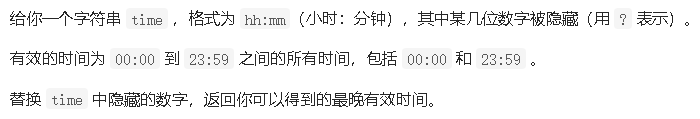
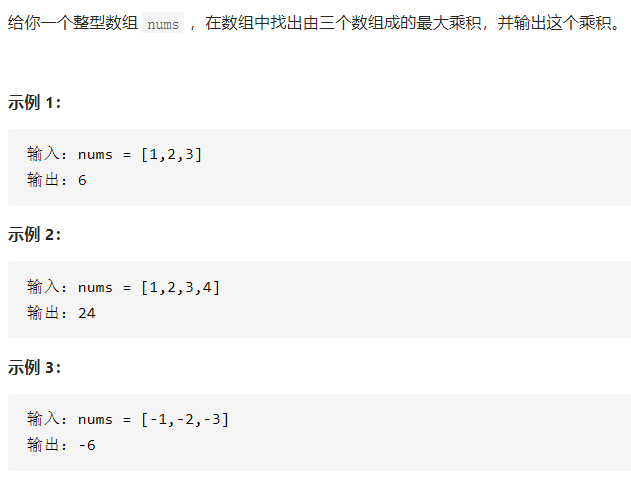
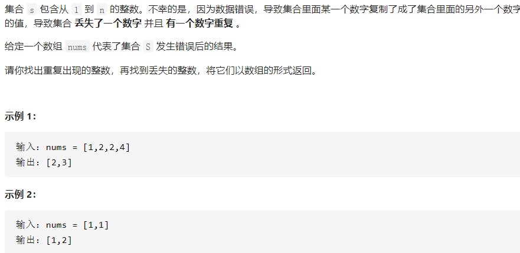

# 数组

## 数组的遍历

### 485. 最大连续1的个数


#### 解决代码

```c++
class Solution {
public:
    int findMaxConsecutiveOnes(vector<int>& nums) {
        int nums_max = 0;
        int count = 0;
        for(int i=0; i<nums.size(); i++)
        {
            if(nums[i] == 1)
            {
                 count++;
                 nums_max = max(count, nums_max);
            }
            else count = 0;
        }
        return nums_max;
    }
};
```

#### 总结

> 看数组的大小：nums.size();

### 495.提莫攻击


#### 解决代码

```c++
class Solution {
public:
    int findPoisonedDuration(vector<int>& timeSeries, int duration) {
       auto ans = timeSeries.size();
       int nums = 0;
       if(ans == 0) return 0;
       if(ans == 1) return duration;
       else
       {
           for(int i=0; i<ans-1; i++)
           {
               int a = timeSeries[i+1] - timeSeries[i];
               if(a >= duration)
                nums += duration;
                else nums += a;
           }
           return nums+duration;
       }
    }
};
```

#### 总结

> 要考虑数组中的个数，每一个相邻数值之间的差值

### 414. 第三大的数


#### 解决代码

```c++
class Solution {
public:
    int thirdMax(vector<int>& nums) {
        int n=nums.size();
        if(n == 1) return nums[0];
        if(n == 2 ) return max(nums[0], nums[1]);
        sort(nums.begin(),nums.end(),greater<int>()); // 降序排列
        int count=0;
        for(int i=1;i<n;i++){
            if(nums[i]!=nums[i-1]){
                count++;
            }
            if(count==2){
                return nums[i];
            }
        }
       return max(nums[0],nums[n-1]); // 要考虑没出现count == 2的情况 
    }
};
```

#### 总结

> 可以用sort函数对数组进行排序。

### 1736.替换隐藏数字得到的最晚时间




#### 解决代码

```C++
class Solution {
public:
    string maximumTime(string time) {
     for(int i=0; i<=time.size(); i++)
     {
        if(time[i] == '?')
        {
            switch(i)
            {
                case 0: time[0] = (time[1] >= '4' && time[1] <= '9' ? '1':'2');  break;
                case 1: time[1] = (time[0] == '2'? '3': '9'); break;
                case 3: time[3] = '5';break;
                case 4: time[4] = '9';break;
            }
        }
     }
     return time;
    }
};
```

#### 总结

> 第一位：若第二位的值已经确定，且值落在区间 [4,9]中时，第一位的值最大只能为 1，否则最大可以为 2；
> 第二位：若第一位的值已经确定，且值为 2 时，第二位的值最大为 3，否则为 9；
> 第三位：第三位的值的选取与其它位无关，最大为 5；
> 第四位：第四位的值的选取与其它位无关，最大为 9。
>

### 628. 三个数的最大乘积



#### 解决代码

```C++
class Solution {
public:
    int maximumProduct(vector<int>& nums) {
        // 降序排序
        sort(nums.begin(), nums.end(), greater<int>());
        return max(nums[0]*nums[1]*nums[2], nums[nums.size()-1]*nums[nums.size()-2]*nums[0]);
    }
};
```

#### 总结

> 有两种情况：
>
> 1. 如果全部是非负数，就是前三个数相乘
> 2. 如果全部是非正数，也是前三个数相乘
> 3. 如果负数中有绝对值大于最大的那个正数，那么就是两个最小的负数相乘再乘以最大的正数
>
> 例如：[-99, -88, 0, 1, 2]

## 统计数组中的元素

### 645.错误的集合



#### 解决代码

```C++
class Solution {
public:
    vector<int> findErrorNums(vector<int>& nums) {
        int nums1 = 0;  // 重复的数
        int nums2 = 0;  // 被替换的数
        int n = nums.size();
        sort(nums.begin(),nums.end());  // 升序
        if(nums[0] != 1) nums2 = 1;
        if(nums[n-1] != n) nums2 = n;
        for(int i=1; i<n; i++)
        {
            if(nums[i] == nums[i-1])  nums1 = nums[i];
            if(nums[i]-nums[i-1] == 2) nums2 = nums[i-1]+1;
        }
     
        vector<int> num = {nums1, nums2};
        return num;
    }
};
```

#### 总结

>  如果相邻的两个元素相等，则该元素为重复的数字 
>
> 如果丢失的数字大于 1 且小于 n，则一定存在相邻的两个元素的差等于 2，这两个元素之间的值即为丢失的数字；
>
> 如果丢失的数字是 1 或 n，则需要另外判断。
>