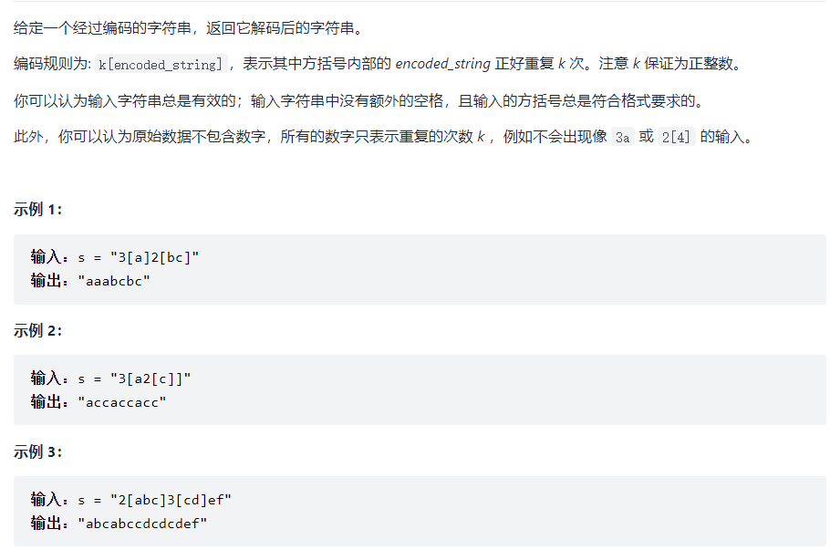
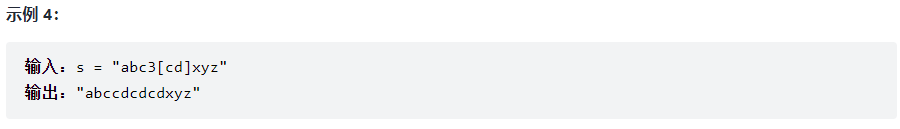
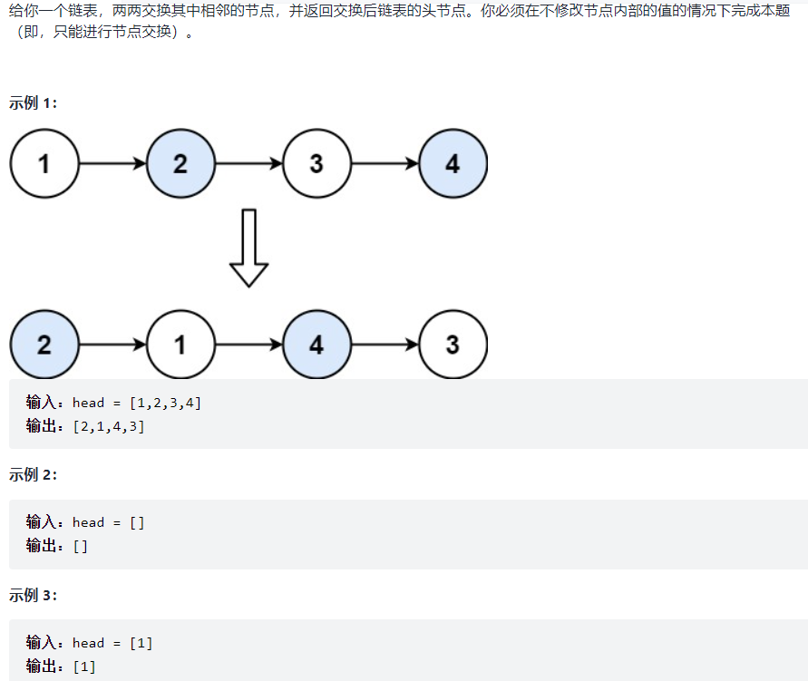
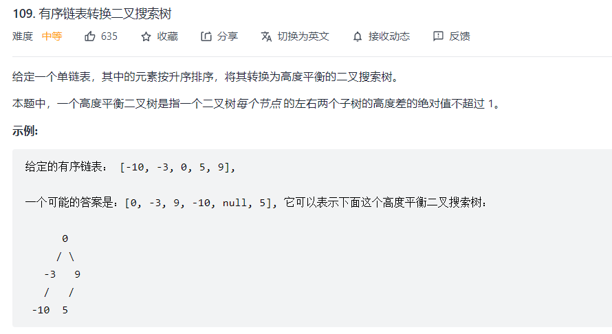

# 数组

## 数组的遍历

### 485. 最大连续1的个数


#### 解决代码

```c++
class Solution {
public:
    int findMaxConsecutiveOnes(vector<int>& nums) {
        int nums_max = 0;
        int count = 0;
        for(int i=0; i<nums.size(); i++)
        {
            if(nums[i] == 1)
            {
                 count++;
                 nums_max = max(count, nums_max);
            }
            else count = 0;
        }
        return nums_max;
    }
};
```

#### 总结

> 看数组的大小：nums.size();

### 495.提莫攻击


#### 解决代码

```c++
class Solution {
public:
    int findPoisonedDuration(vector<int>& timeSeries, int duration) {
       auto ans = timeSeries.size();
       int nums = 0;
       if(ans == 0) return 0;
       if(ans == 1) return duration;
       else
       {
           for(int i=0; i<ans-1; i++)
           {
               int a = timeSeries[i+1] - timeSeries[i];
               if(a >= duration)
                nums += duration;
                else nums += a;
           }
           return nums+duration;
       }
    }
};
```

#### 总结

> 要考虑数组中的个数，每一个相邻数值之间的差值

### 414. 第三大的数


#### 解决代码

```c++
class Solution {
public:
    int thirdMax(vector<int>& nums) {
        int n=nums.size();
        if(n == 1) return nums[0];
        if(n == 2 ) return max(nums[0], nums[1]);
        sort(nums.begin(),nums.end(),greater<int>()); // 降序排列
        int count=0;
        for(int i=1;i<n;i++){
            if(nums[i]!=nums[i-1]){
                count++;
            }
            if(count==2){
                return nums[i];
            }
        }
       return max(nums[0],nums[n-1]); // 要考虑没出现count == 2的情况 
    }
};
```

#### 总结

> 可以用sort函数对数组进行排序。

### 1736.替换隐藏数字得到的最晚时间


#### 解决代码

```C++
class Solution {
public:
    string maximumTime(string time) {
     for(int i=0; i<=time.size(); i++)
     {
        if(time[i] == '?')
        {
            switch(i)
            {
                case 0: time[0] = (time[1] >= '4' && time[1] <= '9' ? '1':'2');  break;
                case 1: time[1] = (time[0] == '2'? '3': '9'); break;
                case 3: time[3] = '5';break;
                case 4: time[4] = '9';break;
            }
        }
     }
     return time;
    }
};
```

#### 总结

> 第一位：若第二位的值已经确定，且值落在区间 [4,9]中时，第一位的值最大只能为 1，否则最大可以为 2；
> 第二位：若第一位的值已经确定，且值为 2 时，第二位的值最大为 3，否则为 9；
> 第三位：第三位的值的选取与其它位无关，最大为 5；
> 第四位：第四位的值的选取与其它位无关，最大为 9。
>

### 628. 三个数的最大乘积


#### 解决代码

```C++
class Solution {
public:
    int maximumProduct(vector<int>& nums) {
        // 降序排序
        sort(nums.begin(), nums.end(), greater<int>());
        return max(nums[0]*nums[1]*nums[2], nums[nums.size()-1]*nums[nums.size()-2]*nums[0]);
    }
};
```

#### 总结

> 有两种情况：
>
> 1. 如果全部是非负数，就是前三个数相乘
> 2. 如果全部是非正数，也是前三个数相乘
> 3. 如果负数中有绝对值大于最大的那个正数，那么就是两个最小的负数相乘再乘以最大的正数
>
> 例如：[-99, -88, 0, 1, 2]

## 统计数组中的元素

### 645.错误的集合


#### 解决代码

```C++
class Solution {
public:
    vector<int> findErrorNums(vector<int>& nums) {
        int nums1 = 0;  // 重复的数
        int nums2 = 0;  // 被替换的数
        int n = nums.size();
        sort(nums.begin(),nums.end());  // 升序
        if(nums[0] != 1) nums2 = 1;
        if(nums[n-1] != n) nums2 = n;
        for(int i=1; i<n; i++)
        {
            if(nums[i] == nums[i-1])  nums1 = nums[i];
            if(nums[i]-nums[i-1] == 2) nums2 = nums[i-1]+1;
        }
     
        vector<int> num = {nums1, nums2};
        return num;
    }
};
```

#### 总结

>  如果相邻的两个元素相等，则该元素为重复的数字 
>
> 如果丢失的数字大于 1 且小于 n，则一定存在相邻的两个元素的差等于 2，这两个元素之间的值即为丢失的数字；
>
> 如果丢失的数字是 1 或 n，则需要另外判断。
>

# 989. 数组形式的整数加法


## 思路

一开始想着将数组转化为整数再相加，但是数值太大，示例4过不了，超出了int型的范围

正确解法：

1. 逐位相加，将数组的每一位和整数的每一位相加，若得到的数大于等于10，则进位
2. 将得到的数放进新数组中，转置数组

## 代码

```cpp
class Solution {
public:
    vector<int> addToArrayForm(vector<int>& num, int k) {

    vector<int> num1;
    int n= num.size();
    for(int i = n-1; i>=0; i--)  // vector数组是从左往右的，num[0]是最左边的数
    {
        int sum = num[i]+k%10;  // 逐位相加
        k /= 10;
        if(sum>=10)
        {
            k++;			// 进位加1
        }
        num1.push_back(sum%10);
        sum = 0;
    }
    while(k>0)		// 考虑整数k比数组 位数多 的情况
    {
        num1.push_back(k%10);
        k /= 10;
    }
    reverse(num1.begin(), num1.end());  // 数组反转
    return num1;
    }
};
```

## 复杂度

时间复杂度：O(n)

空间复杂度：O(1)

# 821. 字符的最短距离


## 暴力解法

### 思路

1. 将出现字符的下标数字存在数组a中
2. 遍历字符串，将每个字符下标与整个数组a比较，将最短距离存进answer数组中

### 代码

暴力解法：

```cpp
class Solution {
public:
    vector<int> shortestToChar(string s, char c) {
        vector<int> a;

        for(int i=0; i<s.size(); i++)
        {
            if(s[i] == c)
                a.push_back(i);  // 将出现字符的下标数字存在数组a中
        }

        vector<int> answer;
        for(int i=0; i<s.size(); i++)  // 遍历字符串
        {
            int num = s.size();
            for(int j=0; j< a.size(); j++)   // 将每个字符下标与整个数组a比较，将最短距离存进answer数组中
            {
                num = min(num, abs(a[j]-i));
            }
            answer.push_back(num);
        }
        return answer;
    }
};
```

### 复杂度

时间复杂度：O(n^2)

空间复杂度：O(1)

## 贪心

### 思路

1. 先 `从左往右` 遍历字符串 `S`，用一个数组 left 记录每个字符 `左侧` 出现的最后一个 `C` 字符的下标；
2. 再 `从右往左` 遍历字符串 `S`，用一个数组 right 记录每个字符 `右侧` 出现的最后一个 `C` 字符的下标；
3. 然后同时遍历这两个数组，计算距离最小值。

### 代码

```cpp
class Solution {
public:
    vector<int> shortestToChar(string s, char c) {
         int n  = s.size();
         vector<int> left(s.size(), n); // 前面是个数，后面是数值
         vector<int> right(s.size(), n);
         vector<int> answer(n, n);
         for(int i=0; i<s.size(); i++)  // 从左到右
         {
             if(s[i] == c) left[i] = 0;
             else if(i>0) left[i] = left[i-1]+1;
         }
         for(int i = s.size()-1; i>=0; i--)  // 从右到左
         {
             if(s[i] == c) right[i] = 0;
             else if(i<s.size()-1) right[i] = right[i+1]+1;
         }
         for(int i=0; i<s.size(); i++)  // 综合两个数组
         {
             int num = 0;
             num = min(left[i], right[i]);
             answer[i] = num;
             
         }
         return answer;
    }
};
```

### 复杂度

时间复杂度 ： O(n)

空间复杂度：O(1)

# 1381. 设计一个支持增量操作的栈


## 数组模拟，用reserve()预留空间

### 思路

用vector数组模拟栈

- 创建一个预留一定空间的vector数组
- 判断数组中的个数是否超出容器，进而执行push操作，判断数组是否为空，进而执行pop操作
- 判断数组中的个数，决定对哪些元素进行加法

### 代码

```cpp
class CustomStack {
public:
    CustomStack(int maxSize) {
        a.reserve(maxSize);  // 预留长度, 里面的空间不能访问
    }
    
    void push(int x) {
        if(a.size()<a.capacity())   // 判断数组中的个数是否超出容器
        {
            a.push_back(x);
        }
    }
    
    int pop() {
        if(a.size())    // 判断数组是否为空
        {
            int num = a.back();
            a.pop_back();
            return num;
        }
        else
        {
            return -1;
        }
    }
    
    void increment(int k, int val) {
        if(a.size() != 0)
        {
            int m=0;
            int n = a.size();
            m = (n <= k)? n:k;   
            for(int i=0; i<m; i++)
            {
                a[i] += val;
            }  
        }
public:
    vector<int> a;
};

```

### 复杂度

时间复杂度：初始化（构造函数）、`push` 操作和 `pop` 操作的渐进时间复杂度为 O(1)，`inc` 操作的渐进时间复杂度为 O(k)。 

空间复杂度：O(N)

## 数组模拟，用resize()初始化

### 思路

- 用resize()初始化数组(默认值为0)， 可以访问所有空间，用top记录当前栈顶的位置 

### 代码

```cpp
class CustomStack{
public:
    vector<int> stk;
    int top;

    CustomStack(int maxSize)
    {
        stk.resize(maxSize); // 初始化数组，此时数组的size()为maxSize.
        top = -1;
    }
    void push(int x)
    {
        if(top != stk.size()-1)  // 栈未满
        {   
            top++;
            stk[top] = x;
        }
    }
    int pop()
    {
        if(top == -1)  //考虑栈空的情况
        {
            return -1;
        }
        top--;
        return stk[top + 1];
    }
    void increment(int k, int val)
    {
        int lim = min(k, top+1);
        for(int i=0; i<lim; i++)
        {
            stk[i] += val;
        }
    }
public:
	vector<int> stk;
	int top;
};
```

### 优化

- 因为只有在pop操作时，我们才需要知道栈顶元素的值
- 可以用辅助数组`add`记录每次`inc`操作，具体地，如果`inc`操作是将栈底的k个元素(将k与栈中元素取最小值)增加val，那么我们将`add[k-1]`增加val。（增量加在数组的一个数中)
- 因此在遇到 pop 操作时，我们返回栈顶元素的初始值加上增量 add[top]。在这之后，我们将增量向栈底进行传递，累加至 add[top - 1] 处，这样 inc 操作的时间复杂度也减少至 O(1)了。

代码如下：

```cpp
class CustomStack{
public:
    vector<int> stk;
    int top;

    CustomStack(int maxSize)
    {
        stk.resize(maxSize);
        add.resize(maxSize);
        top = -1;
    }
    void push(int x)
    {
        if(top != stk.size()-1)
        {   
            top++;
            stk[top] = x;
        }
    }
    int pop()
    {
        if(top == -1)
        {
            return -1;
        }
        int ret = stk[top] + add[top];  // 输出栈顶的数和增量之和
        if(top != 0)
        {
            add[top-1] += add[top];   // 往下传递
        }
        add[top] = 0;   // 将该位置清零
        top--;
        return stk[ret];
    }
    void increment(int k, int val)
    {
        int lim = min(k-1, top);
        if(lim>=0)
        {
            add[lim] += val;  // 将增量加在数组的一个数中
        }
    }

public:
    vector<int> stk, add;
    int top;    
};
```

## 优化第一次提交的代码


```cpp
class CustomStack {
public:
    CustomStack(int maxSize) {
        a.reserve(maxSize);  // 预留长度, 里面的空间不能访问
        add.resize(maxSize);
    }
    
    void push(int x) {
        if(a.size()<a.capacity())   // 判断数组中的个数是否超出容器
        {
            a.push_back(x);
        }
    }
    
    int pop() {
        if(a.size() == 0)    // 判断数组是否为空
        {
            return -1;
        }
           int num = a.back()+add[a.size()-1];
           if(a.size()>1)
           {
               add[a.size()-2] += add[a.size()-1];
           }
           add[a.size()-1] = 0;
            a.pop_back();
            return num;
    }
    
    void increment(int k, int val) {
            int n = a.size();
            int m = min(n, k);
            if(m > 0)
            {
                add[m-1] += val;
            }
        }
    
public:
    vector<int> a, add;
};
```

# 394. 字符串解码





## 思路

- 括号匹配，可以用栈解决
- 用两个栈分别存储字符串的重复次数以及当前解码的字符串
- 最开始str栈内存入“” 
- 每次遇到字母，表示该字母属于str栈顶的待解码字符串，可以直接在str栈顶字符串末尾加入该字母。
- 每次碰到数字要读取完整的数字，此时遍历过了一次'[' ，就在字符串栈中新开一层
- 每次遇到']'， 此时栈顶字符串就是一个“【】”里面需要重复的字符串，重复次数为num栈顶元素次数，记录两个栈顶元素，分别减少一层， 将解码结果加入str栈顶字符串末尾
- 遍历完s字符串，str栈顶就是最终解码结果

## 代码

```cpp
class Solution {
public:
    string decodeString(string s)
    {
        str.push_back(""); // 创建空的一层
        for(int i=0; i<s.size(); i++)   // 遍历字符串s
        {
            if(isalpha(s[i]))   // 判断字符是否为字母
                str.back() += s[i];  // 字母直接加在一层中
            else if(isdigit(s[i]))  // 判断字符是否为数字
            {
                int x=0;
                while(isdigit(s[i]))
                {
                    // 若s[i] == '0', 转化为整型数字是48, 不符合，所以要 -'0'转化
                    x = x*10 + s[i] - '0'; 
                    i++;            //考虑后面的字符也是数字
                } // 读取重复次数，此时已经遍历过一个'['
                num.push_back(x);
                str.push_back(""); //因为遍历过一个'[', 所以新开一层
            }
            else // 如果是']'则出栈一次
            {
                int a = num.back();
                string sstr = str.back();
                str.pop_back();
                num.pop_back();
                while (a -- ) str.back() += sstr;//更新最内一层的字符串
            }
        }
        return str.back();  //最后的结果是栈底
    }
private:
    vector<int> num; // 数字栈，存储重复的次数的栈
    vector<string> str; // 记录最内一层字符串的栈， 有'【'就开一层
};
```

## 复杂度

时间复杂度：O(n^2)

空间复杂度：O(1)

# 232. 用栈实现队列

## 思路

用两个栈模拟队列，队尾push，队头pop

## 代码

```cpp
class MyQueue {
public:
    MyQueue() {

    }
    
    void push(int x) {
        while(!b.empty())  // 如果b非空
        {
            a.push(b.top());
            b.pop();
        }
        a.push(x);
        while(! a.empty())
        {
            b.push(a.top());
            a.pop();
        }
    }
    
    int pop() {
        int ret = b.top();
        b.pop();
        return ret;
    }
    
    int peek() {
        return b.top();
    }
    
    bool empty() {
        return b.empty();
    }
private:
    stack<int> a,b;
};

/**
 * Your MyQueue object will be instantiated and called as such:
 * MyQueue* obj = new MyQueue();
 * obj->push(x);
 * int param_2 = obj->pop();
 * int param_3 = obj->peek();
 * bool param_4 = obj->empty();
 */
```

## 复杂度

时间复杂度：O(N)
空间复杂度：O(N)

# 24. 两两交换链表中的节点



## 思路

- 先考虑没有节点和一个节点的情况
-  在链表操作中，使用一个dummy结点，可以少掉很多边界条件的判断，这样可以将head节点当做普通节点 ，不用单独考虑了 
- 用prev指针指向虚拟节点，cur指针指向要交换的第一个节点，cur->next是要交换的第二个节点

## 代码

```cpp
/**
 * Definition for singly-linked list.
 * struct ListNode {
 *     int val;
 *     ListNode *next;
 *     ListNode() : val(0), next(nullptr) {}
 *     ListNode(int x) : val(x), next(nullptr) {}
 *     ListNode(int x, ListNode *next) : val(x), next(next) {}
 * };
 */
class Solution {
public:
    ListNode* swapPairs(ListNode* head) {
        if(head == nullptr || head->next == nullptr)  
            return head;
        ListNode* dummy = new ListNode(-1, head);  // 创建虚拟节点，虚拟节点的next指向头节点
        ListNode* prev = dummy;
        ListNode* cur = prev->next;

        while(cur != nullptr && cur->next != nullptr)   // 要交换的两者不为空
        {
            ListNode* p1 = cur->next;
            cur->next = p1->next;
            p1->next = cur;
            prev->next = p1;

            prev = cur;
            cur = prev->next;
        }
       
        return dummy->next;
    }
};
```

## 复杂度

- 时间复杂度：O(N)
- 空间复杂度：O(1)

# 109. 有序链表转换二叉搜索树



## 快慢指针

### 思路

- 二叉搜索树的任意一个节点，当前节点的值必然大于所有左子树节点的值。同理，当前节点的值必然小于所有右子树节点的值
- 使用快慢指针可定位中点。 快指针走两步，慢指针走一步，当快指针到达尾部的时候，正好慢指针所到的点为中点
- 获得当前链表的中点，然后以链表中点为根，中点左边的值都小于它，可以构造左子树, 同理构造右子树， 循环第一步

### 代码

```cpp
/**
 * Definition for singly-linked list.
 * struct ListNode {
 *     int val;
 *     ListNode *next;
 *     ListNode() : val(0), next(nullptr) {}
 *     ListNode(int x) : val(x), next(nullptr) {}
 *     ListNode(int x, ListNode *next) : val(x), next(next) {}
 * };
 */
/**
 * Definition for a binary tree node.
 * struct TreeNode {
 *     int val;
 *     TreeNode *left;
 *     TreeNode *right;
 *     TreeNode() : val(0), left(nullptr), right(nullptr) {}
 *     TreeNode(int x) : val(x), left(nullptr), right(nullptr) {}
 *     TreeNode(int x, TreeNode *left, TreeNode *right) : val(x), left(left), right(right) {}
 * };
 */
class Solution {
public:
    TreeNode* sortedListToBST(ListNode* head) {
        if(head == nullptr) return nullptr;
        return sortedListToBST(head, nullptr);
    }
    TreeNode* sortedListToBST(ListNode* head, ListNode* tail)
    {
        if(head == tail) return nullptr;
        ListNode* slow = head; // 慢指针
        ListNode* fast = head; // 快指针

        while(fast != tail && fast->next != tail)
        {
            slow = slow->next;
            fast = fast->next->next;
        }
        // 当快指针走到尽头，慢指针指向的是中点
        TreeNode* root = new TreeNode(slow->val);
        root->left = sortedListToBST(head, slow);
        root->right = sortedListToBST(slow->next, tail);

        return root;
    }
};
```

### 复杂度

时间复杂度：递归树的深度为O(logn)，每一层的操作数为n， 因此总的时间复杂度为O(nlogn)

空间复杂度：O(logn)

# 100

## 思路

- 比较两个树是否相同，可以将树的节点放进队列，逐一对比
- 先考虑是否有空树的情况，然后将两个树的根节点压进队列中
- 如果队列不空，取出两个数比较，再将左右节点压进队列

## 代码

```cpp
/**
 * Definition for a binary tree node.
 * struct TreeNode {
 *     int val;
 *     TreeNode *left;
 *     TreeNode *right;
 *     TreeNode() : val(0), left(nullptr), right(nullptr) {}
 *     TreeNode(int x) : val(x), left(nullptr), right(nullptr) {}
 *     TreeNode(int x, TreeNode *left, TreeNode *right) : val(x), left(left), right(right) {}
 * };
 */
class Solution {
public:
    bool isSameTree(TreeNode* p, TreeNode* q) {
        if(p == NULL && q == NULL)    return true;
        if(p == NULL || q == NULL)    return false;
        queue<TreeNode*> que;
        que.push(p);
        que.push(q);
        while(!que.empty())
        {
            TreeNode* leftNode = que.front(); que.pop();
            TreeNode* rightNode = que.front(); que.pop();
            if(!leftNode && !rightNode)
            {
                continue;
            }
            if(!leftNode || !rightNode || (leftNode->val != rightNode->val))
            {
                return false;
            }
            que.push(leftNode->left);
            que.push(rightNode->left);
            que.push(leftNode->right);
            que.push(rightNode->right);
        }
        return true;

    }
};
```

## 复杂度

- 时间复杂度：O(n)
- 空间复杂度：O(n)