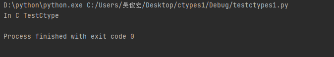

# python用ctypes调用C++的动态库

在vs中，点击Windows桌面向导，创建一个空项目的动态链接库(.dll)。

创建源代码

```c++
//extern "C" c++中编译c格式的函数，如果用c语言编译就不需要(文件后缀名.c)
// _declspec(dllexport)函数导出到库中
#include<stdio.h>
extern "C" _declspec(dllexport) void TestCtypes()
{
	printf("In C TestCtype\n");
}
```

x86是32位的，所以要换成x64

然后点击生成，生成解决方案，再将.dll文件复制到C:\Windows\System32里面

在pycharm中，运行下面的代码

```python
from ctypes import *

# 导入库 windows中dll后缀名不用加
lib = CDLL("testctypes")
lib.TestCtypes()
```

结果如下：




