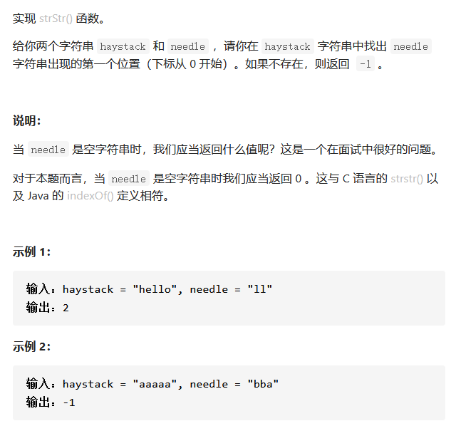
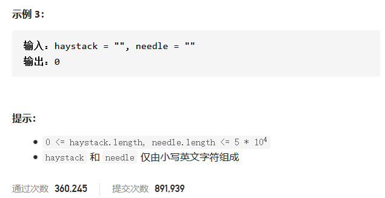

# 实现strStr()





## 题意

找出needle作为haystack的子串的第一个位置。

## 第一次出错

以为是找needle的第一个字符与haystack的第一个字符一致

```c++
class Solution {
public:
    int strStr(string haystack, string needle) {
    int left = 0;
    int nums = -1;
       if(needle.size() == 0)   return 0;
       else if(1){
        for(int right = 0; right < haystack.size() - needle.size()+1;right++){
            if(haystack[right] == needle[left]){
                nums = right;
                break;
            }
        }
        return nums;
       }
        
    }
};
```

## 暴力匹配

#### 思路和算法

让字符串 needle 与字符串 haystack 的所有长度为 m 的子串均匹配一次。

为了减少不必要的匹配，我们每次匹配失败即立刻停止当前子串的匹配，对下一个子串继续匹配。如果当前子串匹配成功，我们返回当前子串的开始位置即可。如果所有子串都匹配失败，则返回 −1。

```C++
class Solution {
public:
    int strStr(string haystack, string needle)
    {
        int n = haystack.size();
        int m = needle.size();
        for(int i=0; i<n-m+1; i++)
        {
            bool flag = true;
            for(int j=0; j<m;j++)
            {
                if(haystack[i+j] != needle[j])
                {
                    flag = false;
                    break;	//如果有匹配不成功，就跳出第一个for，i右移，继续匹配
                }
            }
            if(flag)    return i;
        }
        return -1;
    }
};
```

## KMP算法

