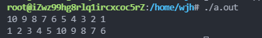

# 数组笔记

数组，最简单的数据结构之一。数组，即元素的序列，可以按特定顺序存储元素。一个长度为n的数组a，它的下标从0开始到n-1结束

## 数组大小

```c++
int a = nums.size();
```

## 对vector数组内的数据进行排序

sort()函数，头文件是“algorithm”，函数默认按升序排列

1.升序排列

```c++
sort(iterator.begin(),iterator.end());
sort(iterator.begin(),iterator.end(),less<int>());
```

2.降序排列

```c++
sort(iterator.begin(),iterator.end(),greater<int>());
```

3.也可以自定义排序函数

> sort(iterator.begin(), iterator.end(), compare comp);

```c++
bool comp(int a, int b)
{
	return a>b;
}
```

## 对vector数组内的数据进行部分排序

partial_sort()函数，进行部分排序

> 1.partial_sort(Iterator first, Iterator middle, Iterator last);
>
> 2.partial_sort(Iterator first, Iterator middle, Iterator last, Compare comp);

```c++
#include<iostream>
#include<algorithm>
#include<vector>
using namespace std;
int main()
{
    int n=10;
    vector<int> nums(n);
    for(int i=0; i<n; i++)
    {
        nums[i] = 10-i;
        cout<<nums[i]<<" ";
    }
    cout<<""<<endl;
    partial_sort(nums.begin(), nums.begin()+5,nums.end());
    for(int i=0;i<n;++i)
    cout<<nums[i]<<" ";
    cout<<""<<endl;
    return 0;
}
```



## 求不同类型数字的绝对值

第一种： int abs(int i) 返回整型参数i的绝对值

第二种：double cabs(struct complex znum) 返回复数znum的绝对值

第三种： double fabs(double x) 返回双精度参数x的绝对值

第四种：long labs(long n) 返回长整型参数n的绝对值