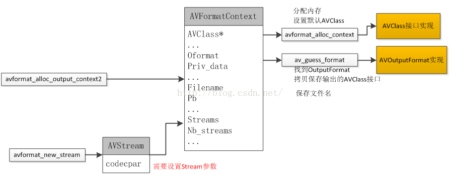

# FFmpeg编码用到的API

## 头文件介绍

```tcl
libavcodec  - 编码解码器

libavdevice  - 输入输出设备的支持

libavfilter  - 视音频滤镜支持

libavformat  - 视音频等格式的解析

libavutil   - 工具库

libpostproc  - 后期效果处理

libswscale  - 图像颜色、尺寸转换  
```

## av_register_all()

```c
//初始化所有组件，只有调用了该函数，才能使用复用器和编解码器
av_register_all();
```

##  avformat_alloc_context()

```c
 /*封装上下文AVFormatContext, avformat_alloc_context(void)
   头文件：libavformat/avfromat.h
   该函数用于分配空间创建一个AVFormatContext对象，并且强调使用avformat_free_context方法来清理并释放该对象的空间。*/
AVFormatContext *ofmt_ctx = avformat_alloc_context();
```

## av_guess_format(NULL,output,NULL)

```c
/* 封装上下文内部结构体AVOutputFormat，av_guess_format(const char* short_name,const char* filename,const char* mime_type);
    这是一个决定视频输出时封装方式的函数,其中有三个参数，写任何一个参数，都会自动匹配相应的封装方式
     example:获得输出格式，这里是RTP网络流,fmtctx->oformat = av_guess_format("rtp", NULL, NULL); */
  AVOutputFormat *oformat = av_guess_format(NULL,output,NULL);
```

## av_log()

```c
/* 日志输出的核心函数 av_log()
       一般情况下FFmpeg类库的源代码不允许使用printf()这种函数，所有的输出一律使用的av_log()。
       av_log()的声明位于libavutil\log.h
       其中第一个参数指定该log所属的结构体，例如AVFormatContext、AVCodecContext等等。第二个参数指定log的级别，第三个参数为要输出的内容
       av_log()的日志级别分别是：
        AV_LOG_PANIC(0)，AV_LOG_FATAL(8)，AV_LOG_ERROR(16)，AV_LOG_WARNING(24)，AV_LOG_INFO(32)，AV_LOG_VERBOSE(40)，AV_LOG_DEBUG(48)
        每个级别定义的数值代表了严重程度，数值越小代表越严重。
        默认av_log()输出的级别是AV_LOG_INFO。*/
    av_log(NULL,AV_LOG_ERROR,"fail to find the output format\n");
```

## avformat_alloc_output_context2(&ofmt_ctx,oformat,oformat->name,output)

```c
/* avformat_alloc_output_context2(AVFormatContext **ctx, AVOutputFormat *oformat,
                                   const char *format_name, const char *filename)
    它的声明位于libavformat\avformat.h
    函数可以初始化一个用于输出的AVFormatContext结构体
    ctx：函数调用成功之后创建的AVFormatContext结构体。
    oformat：指定AVFormatContext中的AVOutputFormat，用于确定输出格式。如果指定为NULL，可以设定后两个参数（format_name或者filename）由FFmpeg猜测输出格式。
    PS：使用该参数需要自己手动获取AVOutputFormat，相对于使用后两个参数来说要麻烦一些。
    format_name：指定输出格式的名称。根据格式名称，FFmpeg会推测输出格式。输出格式可以是“flv”，“mkv”等等。
    filename：指定输出文件的名称。根据文件名称，FFmpeg会推测输出格式。文件名称可以是“xx.flv”，“yy.mkv”等等。
    函数执行成功的话，其返回值大于等于0。*/
if (avformat_alloc_output_context2(&ofmt_ctx,oformat,oformat->name,output) <0){
    av_log(NULL,AV_LOG_ERROR,"fail to alloc output context\n");
    return -1;
  }
```

## avformat_new_stream()创建流通道

```c
 /* 流通道AVStream，avformat_new_stream 在 AVFormatContext 中创建 Stream 通道
 	AVStream *avformat_new_stream(AVFormatContext *s, const AVCodec *c)
 	例如我们将 H264 和 AAC 码流存储为MP4文件的时候，就需要在 MP4文件中增加两个流通道，一个存储Video：H264，一个存储Audio：AAC。（假设H264和AAC只包含单个流通道）。
 	AVFormatContext ：
    unsigned int nb_streams;    记录stream通道数目。
    AVStream **streams;    存储stream通道。
AVStream ：
    int index;   在AVFormatContext 中所处的通道索引
    
    avformat_new_stream之后便在 AVFormatContext 里增加了 AVStream 通道（相关的index已经被设置了） 。之后，我们就可以自行设置 AVStream 的一些参数信息。例如 : codec_id , format ,bit_rate ,width , height ... ...*/
     AVStream *out_stream = avformat_new_stream(ofmt_ctx,NULL);
```

```c
AVStream包含很多参数，用于记录通道信息，其中最重要的是  :

AVCodecParameters * codecpar  ：用于记录编码后的流信息，即通道中存储的流的编码信息。

AVRational time_base ：AVStream通道的时间基，时间基是个相当重要的概念。（可参考之后的关于ffmpeg时间的文章）

需要注意的是：现在的 ffmpeg 3.1.4版本已经使用AVCodecParameters * codecpar替换了原先的CodecContext* codec !
```



## ffmpeg 编码器AVCodecContext 的配置参数

 开始配置编码器上下文的参数 

```c
/*AVCodecContext 相当于虚基类，需要用具体的编码器实现来给他赋值*/
pCodecCtxEnc = video_st->codec; 
 
//编码器的ID号，这里我们自行指定为264编码器，实际上也可以根据video_st里的codecID 参数赋值
pCodecCtxEnc->codec_id = AV_CODEC_ID_H264;
 
//编码器编码的数据类型
pCodecCtxEnc->codec_type = AVMEDIA_TYPE_VIDEO;
 
//目标的码率，即采样的码率；显然，采样码率越大，视频大小越大
pCodecCtxEnc->bit_rate = 200000;
 
//固定允许的码率误差，数值越大，视频越小
pCodecCtxEnc->bit_rate_tolerance = 4000000;
 
//编码目标的视频帧大小，以像素为单位
pCodecCtxEnc->width = 640;
pCodecCtxEnc->height = 480;
 
//帧率的基本单位，我们用分数来表示，
//用分数来表示的原因是，有很多视频的帧率是带小数的eg：NTSC 使用的帧率是29.97
pCodecCtxEnc->time_base.den = 30;
pCodecCtxEnc->time_base = (AVRational){1,25};
pCodecCtxEnc->time_base.num = 1;
 
//像素的格式，也就是说采用什么样的色彩空间来表明一个像素点
pCodecCtxEnc->pix_fmt = PIX_FMT_YUV420P;
 
//每250帧插入1个I帧，I帧越少，视频越小
pCodecCtxEnc->gop_size = 250;
 
//两个非B帧之间允许出现多少个B帧数
//设置0表示不使用B帧
//b 帧越多，图片越小
pCodecCtxEnc->max_b_frames = 0;
 
//运动估计
pCodecCtxEnc->pre_me = 2;
 
//设置最小和最大拉格朗日乘数
//拉格朗日乘数 是统计学用来检测瞬间平均值的一种方法
pCodecCtxEnc->lmin = 1;
pCodecCtxEnc->lmax = 5;
 
//最大和最小量化系数
pCodecCtxEnc->qmin = 10;
pCodecCtxEnc->qmax = 50;
 
//因为我们的量化系数q是在qmin和qmax之间浮动的，
//qblur表示这种浮动变化的变化程度，取值范围0.0～1.0，取0表示不削减
pCodecCtxEnc->qblur = 0.0;
 
//空间复杂度的masking力度，取值范围 0.0-1.0
pCodecCtxEnc->spatial_cplx_masking = 0.3;
 
//运动场景预判功能的力度，数值越大编码时间越长
pCodecCtxEnc->me_pre_cmp = 2;
 
//采用（qmin/qmax的比值来控制码率，1表示局部采用此方法，）
pCodecCtxEnc->rc_qsquish = 1;
 
//设置 i帧、p帧与B帧之间的量化系数q比例因子，这个值越大，B帧越不清楚
//B帧量化系数 = 前一个P帧的量化系数q * b_quant_factor + b_quant_offset
pCodecCtxEnc->b_quant_factor = 1.25;
 
//i帧、p帧与B帧的量化系数便宜量，便宜越大，B帧越不清楚
pCodecCtxEnc->b_quant_offset = 1.25;
 
//p和i的量化系数比例因子，越接近1，P帧越清楚
//p的量化系数 = I帧的量化系数 * i_quant_factor + i_quant_offset
pCodecCtxEnc->i_quant_factor = 0.8;
pCodecCtxEnc->i_quant_offset = 0.0;
 
//码率控制测率，宏定义，查API
pCodecCtxEnc->rc_strategy = 2;
 
//b帧的生成策略
pCodecCtxEnc->b_frame_strategy = 0;
 
//消除亮度和色度门限
pCodecCtxEnc->luma_elim_threshold = 0;
pCodecCtxEnc->chroma_elim_threshold = 0;
 
//DCT变换算法的设置，有7种设置，这个算法的设置是根据不同的CPU指令集来优化的取值范围在0-7之间
pCodecCtxEnc->dct_algo = 0;
 
//这两个参数表示对过亮或过暗的场景作masking的力度，0表示不作
pCodecCtxEnc->lumi_masking = 0.0;
pCodecCtxEnc->dark_masking = 0.0;
```

## FFMPEG编码器的参数分析

### 1.codec_type(编码的数据类型)

```c
enum AVMediaType {
    AVMEDIA_TYPE_UNKNOWN = -1,  ///< Usually treated as AVMEDIA_TYPE_DATA
    AVMEDIA_TYPE_VIDEO,
    AVMEDIA_TYPE_AUDIO,
    AVMEDIA_TYPE_DATA,          ///< Opaque data information usually continuous
    AVMEDIA_TYPE_SUBTITLE,
    AVMEDIA_TYPE_ATTACHMENT,    ///< Opaque data information usually sparse
    AVMEDIA_TYPE_NB
};
```

### 2. **sample_fmt** ( 音频采样格式 )

```c
enum AVSampleFormat {
    AV_SAMPLE_FMT_NONE = -1,
    AV_SAMPLE_FMT_U8,          ///< unsigned 8 bits
    AV_SAMPLE_FMT_S16,         ///< signed 16 bits
    AV_SAMPLE_FMT_S32,         ///< signed 32 bits
    AV_SAMPLE_FMT_FLT,         ///< float
    AV_SAMPLE_FMT_DBL,         ///< double
 
    AV_SAMPLE_FMT_U8P,         ///< unsigned 8 bits, planar
    AV_SAMPLE_FMT_S16P,        ///< signed 16 bits, planar
    AV_SAMPLE_FMT_S32P,        ///< signed 32 bits, planar
    AV_SAMPLE_FMT_FLTP,        ///< float, planar
    AV_SAMPLE_FMT_DBLP,        ///< double, planar
 
    AV_SAMPLE_FMT_NB           ///< Number of sample formats. DO NOT USE if linking dynamically
};
```

## avcodec_find_encoder()

```c
/* 查找FFmpeg的编码器
   AVCodec *avcodec_find_decoder(enum AVCodecID id);
   avcodec_find_encoder()的声明位于libavcodec\avcodec.h
   函数的参数是一个编码器的ID，返回查找到的编码器（没有找到就返回NULL）*/
  AVCodec *pCodec = avcodec_find_encoder(pCodecCtx->codec_id);
```

##  avcodec_open2() 

```c
 /* 该函数用于初始化一个视音频编解码器的AVCodecContext
   avcodec_open2(context, codec, opts)
   avcodec_open2()的声明位于libavcodec\avcodec.h
   用中文简单转述一下avcodec_open2()各个参数的含义：
   avctx：需要初始化的AVCodecContext。
   codec：输入的AVCodec
   options：一些选项。例如使用libx264编码的时候，“preset”，“tune”等都可以通过该参数设置。*/
    if (avcodec_open2(pCodecCtx,pCodec,NULL) < 0){
    av_log(NULL,AV_LOG_ERROR,"fail to open codec\n");
    return -1;
  }
```

## av_dump_format()

```c
/*打印输入和输出格式的详细信息,会打印流媒体的信息
声明位于libavformat/avformat.h下
void av_dump_format(AVFormatContext *ic,
                    int index,	
                    const char *url,
                    int is_output);
这里的参数只需要注意两个一个是ic，一个是is_output。
ic：输入的AVFormatContext
is_output：如果是解封装的话是写输入0，需要输出的话是写输出1

函数没有返回值。*/
av_dump_format(ofmt_ctx,0,output,1);
```

## avio_open()

```c
/* avio_open()，是FFmepeg早期版本。avio_open()比avio_open2()少了最后2个参数。而它前面几个参数的含义和avio_open2()是一样的。从源代码中可以看出，avio_open()内部调用了avio_open2()，并且把avio_open2()的后2个参数设置成了NULL，因此它的功能实际上和avio_open2()都是用于打开FFmpeg的输入输出文件的。
int avio_open(AVIOContext **s, const char *filename, int flags)  
{  
    return avio_open2(s, filename, flags, NULL, NULL);  
} */
avio_open(&ofmt_ctx->pb,output,AVIO_FLAG_WRITE)
```

##  avformat_write_header() 

```c
/* 用于写视频文件头
声明位于libavformat\avformat.h
int avformat_write_header(AVFormatContext *s, AVDictionary **options);
参数的含义：
s：用于输出的AVFormatContext。
options：额外的选项，目前没有深入研究过，一般为NULL。
函数正常执行后返回值等于0。*/
avformat_write_header(ofmt_ctx,NULL)
```

## fopen(filename, “rb”)

```c
/* 读写打开一个二进制文件，只允许读写数据
函数原型：FILE * fopen(const char * path,const char * mode);
返回值：文件顺利打开后，指向该流的文件指针就会被返回。如果文件打开失败则返回NULL，并把错误代码存在errno 中
参数path字符串包含欲打开的文件路径及文件名，参数mode字符串则代表着流形态。*/
FILE *fp = fopen(input,"rb");
```

```tex
r 以只读方式打开文件，该文件必须存在。

r+ 以可读写方式打开文件，该文件必须存在。

rb+ 读写打开一个二进制文件，允许读写数据，文件必须存在。

w 打开只写文件，若文件存在则文件长度清为0，即该文件内容会消失。若文件不存在则建立该文件。

w+ 打开可读写文件，若文件存在则文件长度清为零，即该文件内容会消失。若文件不存在则建立该文件。

a 以附加的方式打开只写文件。若文件不存在，则会建立该文件，如果文件存在，写入的数据会被加到文件尾，即文件原先的内容会被保留。（EOF符保留）

a+ 以附加方式打开可读写的文件。若文件不存在，则会建立该文件，如果文件存在，写入的数据会被加到文件尾后，即文件原先的内容会被保留。 （原来的EOF符不保留）

wb 只写打开或新建一个二进制文件；只允许写数据。

wb+ 读写打开或建立一个二进制文件，允许读和写。

ab+ 读写打开一个二进制文件，允许读或在文件末追加数据。

wx 创建文本文件,只允许写入数据.[C11]

wbx 创建一个二进制文件,只允许写入数据.[C11]

w+x 创建一个文本文件,允许读写.[C11]

wb+x 创建一个二进制文件,允许读写.[C11]

w+bx 和"wb+x"相同[C11]

以x结尾的模式为独占模式,文件已存在或者无法创建(一般是路径不正确)都会导致fopen失败.文件以操作系统支持的独占模式打开.[C11]

上述的形态字符串都可以再加一个b字符，如rb、w+b或ab+等组合，加入b 字符用来告诉函数库以二进制模式打开文件。如果不加b，表示默认加了t，即rt,wt,其中t表示以文本模式打开文件。
```

## av_frame_alloc()

```c
/* 用于AVFrame结构体的初始化
av_frame_alloc()的声明位于libavutil\frame.h
AVFrame *av_frame_alloc(void);*/
AVFrame *pframe = av_frame_alloc();
```

## av_samples_get_buffer_size()

```c
 /* 用来计算音频占用的字节数
 音频一般是采用成PCM格式，而计算PCM格式音频尺寸，就需要如下几个参数。
 通道数，采样频率，采用格式
 
 通道数：个人理解，就是同时有个几个设备在进行音频的采样，最少为1，一般通道数越多，音质越好。

 采样频率：（也称为采样速度或者采样频率）定义了每秒从连续信号中提取并组成离散信号的采样个数，它用赫兹（Hz）来表  示。

 采用位数：既然采样频率表示每秒采样的个数，那么如何描述每个采样点呢？用什么方法独立每个采样点值的区别呢？也就是如何度量每个采样点，而这正是采样格式出现的意义。通常使用16bit，也就是2的16次方，共有65536个不同的度量值，这样采样位数越高，音频度量化的就越精细，音质同样也就越高。
 音频所占用字节数 = 通道数 * 采用频率(Hz) * 采用位数(byte)
 int av_samples_get_buffer_size(int *linesize, int nb_channels, int nb_samples,  
                               enum AVSampleFormat sample_fmt, int align)*/
 int size = av_samples_get_buffer_size(NULL,pCodecCtx->channels,pCodecCtx->frame_size,pCodecCtx->sample_fmt,1);
```

