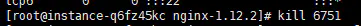

[TOC]

# 创建rtmp流媒体服务器

## 创建放压缩包的目录

```shell
cd /usr/local
sudo mkdir package
cd package
```

## 下载软件

```shell
sudo wget http://nginx.org/download/nginx-1.19.9.tar.gz

sudo wget http://zlib.net/zlib-1.2.11.tar.gz

sudo wget https://ftp.pcre.org/pub/pcre/pcre-8.40.tar.gz

sudo wget https://www.openssl.org/source/openssl-1.0.2k.tar.gz

cd ..
sudo git clone  https://github.com/arut/nginx-rtmp-module.git
```

## 解压下载的文件

```shell
//tar后缀的使用 tar -zxvf 文件名
//zip后缀的使用 unzip 文件名 -C指定解压后的路径

cd package
sudo tar -zxvf nginx-1.19.9.tar.gz -C /usr/local
sudo tar -zxvf zlib-1.2.11.tar.gz -C /usr/local
sudo tar -zxvf pcre-8.40.tar.gz -C /usr/local
sudo tar -zxvf openssl-1.0.2k.tar.gz -C /usr/local
cd ..
```

 ##  进入nginx文件，编译安装nginx 

```C++
cd nginx-1.19.9
// 输入./configure --help 可以看使用帮助
// --prefix=PATH            set installation prefix（设置安装前缀）
// --add-module=PATH        enable external module （启用外部模块）
sudo ./configure --prefix=/usr/local/nginx --with-debug --with-pcre=../pcre-8.40 --with-zlib=../zlib-1.2.11 --with-openssl=../openssl-1.0.2k --add-module=../nginx-rtmp-module

sudo make
sudo make install
cd ..
cd nginx
```

## 启动nginx服务

```C++
sudo /usr/local/nginx/sbin/nginx
```

结果如下：


 ##  配置nginx.conf文件

```
cd /usr/local/nginx/conf
sudo vi nginx.conf
```

在文件尾添加：

```
rtmp {
    server {
        listen 1935;

        application myapp{
        live on;
        hls on;
        hls_path /usr/local/nginx/myapp;  #视频存放路径
        }

        # video on demand
        application vod {
            play /var/flvs; #指定存放视频文件的路径
        }

        application vod_http {
            #myserver.com及服务器地址，如果只是本地播放，填写127.0.0.1:端口号 就行，端口好看配置文件中http监听的端口下同
            play http://172.20.125.125/vod;
                 }

        application vod_mirror {
            play /var/local_mirror http://172.20.125.125:1935/vod;
        }
    }
}
```

```
#如果想在网页显示，在http中添加
 autoindex on; #开启nginx目录浏览功能
 autoindex_exact_size off; #文件大小从KB开始显示
 autoindex_localtime on; #显示文件修改时间为服务器本地时间
# 将视频文件放在html的文件夹里
```


##  重新加载配置，使用命令 

```shell
sudo mkdir /usr/local/nginx/myapp     // 拉流和推流视频地址
sudo mkdir /usr/local/html/video   // 网页上的视频地址
sudo /usr/local/nginx/sbin/nginx -s reload
```

# 出现的问题

## 端口被占用

```C++
//启动nginx
sudo /usr/local/nginx/sbin/nginx
```


```
//该问题是该端口被占用了

// 查看是否开启了nginx
ps -e | grep nginx

方法一：
//切换到nginx sbin目录
-- 停止
sudo ./nginx -s stop
-- 启动
./nginx

方法二：
ps -e | grep nginx
kill -9 PID
```

## 查看开放的端口，并关闭在运行的进程

```
// 查看所有开放端口
netstat -ntlp
```

## 

```
kill 6751
```



```c++
// 查看端口命令
   lsof -i:port
 // 关闭进程
       kill -9 PID
// 下面是防火墙      
// 查看开启的端口
    sudo ufw status
// 打开端口
    sudo ufw allow 1935
// 开启防火墙
    sudo ufw enable
 // 重启防火墙
      sudo ufw reload
  
//如果你使用了防火墙，请允许端口 tcp 1935,81
iptables -A INPUT -p tcp --dport 1935 -j ACCEPT 
iptables -A OUTPUT -p tcp --sport 1935 -j ACCEPT 
iptables -A INPUT -p tcp --dport 81 -j ACCEPT 
iptables -A OUTPUT -p tcp --sport 81 -j ACCEPT
//关闭防火墙
iptables -F
       
 // wsl2网络地址异常ping不通
 //重启 WSL 指令 
$ wsl --shutdown 
// 之后就重新启动进入即可 
$ wsl 
```

# 运行结果

## 网页上访问服务区媒体资源


## 拉流和推流

在虚拟机上


用云服务器


## 总结

 搭建好的nginx-rtmp服务器上做推流延时会很高，开始在5s左右，用云服务器延时会更高