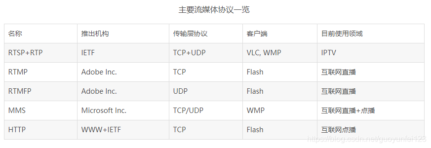

# 流媒体传输协议

 

常用的流媒体协议主要有**HTTP渐近下载**和**基于RTSP/RTP的实时流媒体协议**两类。在流式传输的实现方案中，一般采用**HTTP/TCP**来**传输控制信息**，而用**RTP/UDP**来传输实时多媒体数据。

## 1. 实时传输协议RTP与RTCP

RTP(Real-time Transport Protocol)是用于Internet上针对**多媒体数据流**的一种传输协议。

