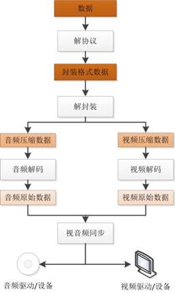
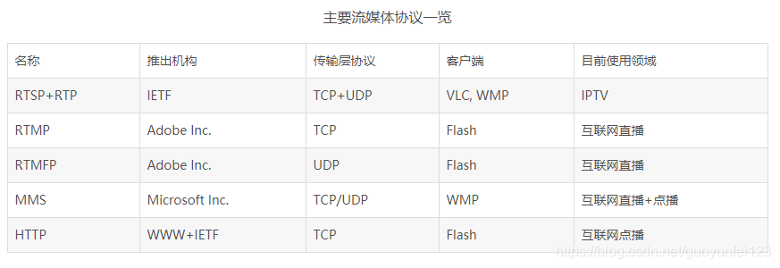

# 音视频编解码常用知识点

## 视频播放器原理

视频播放器播放一个互联网上的视频文件，需要经过以下几个步骤：解协议、解封装、解码视音频、视音频同步。

  

### 解协议

**就是将流媒体协议的数据，解析为标准的相应的封装格式数据。** 视音频在网络上传输的时候，常常采用各种流媒体协议，例如HTTP，RTMP，或者MMS等等。这些协议在传输视音频数据的同时，也会传输一些**信令数据**。这些信令数据包括对播放的控制(播放，暂停，停止)，或者对网络状态的描述等。解协议的过程中会去掉信令数据而只保留视音频数据。例如，采用RTMP协议传输的数据，经过解协议操作后，输出FLV格式的数据

### 解封装

**就是将输入的封装格式的数据，分离成为音频流压缩编码数据和视频流压缩编码数据。** 封装格式种类很多，例如MP4，MKV，RMVB，TS，FLV，AVI等等，它的作用就是将已经压缩编码的视频数据和音频数据按照一定格式放在一起，例如，FLV格式的数据，经过解封装操作后，输出H.264编码的视频码流和AAC编码的音频码流

### 解码

**就是将视频/音频压缩编码数据，解码成为非压缩的视频/音频原始数据。** 音频的压缩编码标准包含AAC，MP3，AC-3等等，视频的压缩编码标准则包含H.264，MPEG2，VC-1等等。解码是整个系统中最重要也是最复杂的一个环节。通过解码，压缩编码的视频数据输出为非压缩的颜色数据，例如YUV420P，RGB等等；压缩编码的音频数据输出成为非压缩的音频抽样数据，例如PCM数据

### 视音频同步

就是根据解封装模块处理过程中获取的参数信息，同步解码出来的视频和音频数据，并将视音频数据送至系统的显卡和声卡播放出来

## 流媒体协议

 流媒体协议是服务器与客户端之间通信遵循的规定。当前网络上主要的流媒体协议如表所示。 

  

## 封装格式(容器)

 

 由表可见，除了AVI之外，其他封装格式都支持流媒体，即可以“边下边播”。有些格式更“万能”一些，支持的视音频编码标准多一些，比如MKV。而有些格式则支持的相对比较少，比如说RMVB。 

## 编解码

编解码器(codec)指的是一个能够对一个信号或者一个数据流进行变换的设备或者程序。这里的变换既包括将信号或者数据流进行编码(通常是为了**传输、存储、加密**)或者提取到一个编码流的操作， 也包括为了观察或者处理从这个编码流中恢复适合观察或操作的形式的操作。编解码器经常用在视频会议和流媒体应用中。

## 转码

指将一段多媒体包括音频、视频或其他的内容从一段编码格式转化成为另外一种编码格式

## 帧(Frame)

是影象中常用的最小单位，相当于电影中胶片的每一格镜头，一帧就是一副静止的画面，连续的帧就形成了视频

## 帧率(Frame rate)

是称为帧的位图图像连续出现在显示器上的频率（速率）。该术语同样适用于胶片和摄像机，计算机图形和动作捕捉系统。帧速率也可以称为帧频率，并以赫兹（Hz）表示。每秒的帧数(fps)或者说帧率表示图形处理器处理场时每秒钟能够更新的次数。高的帧率可以得到更流畅、更逼真的动画。一般来说30fps就是可以接受的，但是将性能提升至60fps则可以明显提升交互感和逼真感，但是一般来说超过75fps一般就不容易察觉到有明显的流畅度提升了。如果帧率超过屏幕刷新率只会浪费图形处理的能力，因为监视器不能以这么快的速度更新，这样超过刷新率的帧率就浪费掉了。

## 分辨率

又称解析度、解像度，可以从显示分辨率与图像分辨率两个方向来分类。显示分辨率（屏幕分辨率）是屏幕图像的精密度，是指显示器所能显示的像素有多少。由于屏幕上的点、线和面都是由像素组成的，显示器可显示的像素越多，画面就越精细，同样的屏幕区域内能显示的信息也越多，所以分辨率是个非常重要的性能指标之一。

## 比特率(码率)

比特率指每秒传送的比特数，单位为bps(Bit Per Second),比特率越高，传送数据速度越快。声音中的比特率是指将模拟声音信号转换成数字声音信号后，单位时间内的二进制数据量，是间接衡量音频质量的一个指标。多媒体行业在指音频或视频在单位时间内的数据传输率时通常使用码流或码率，单位是kbps(千位每秒)。视频中的码率的概念与声音中的相同，都是指由模拟信号转换成数字信号后，单位时间内的二进制数据量。比如 1.44Mbps ,就是1秒内到达的数据量为1.44Mb。(注意：是bit，不是byte字节)

音频中比特率的计算公式如下：

比特率 = 采样率 * 采样精度 * 声道数目

视频中比特率的计算公式如下：

比特率 = 帧率 * 每帧数据大小

## 采样率

 采样率（也称为采样速度或者采样频率）定义了每秒从连续信号中提取并组成离散信号的采样个数，它用赫兹（Hz）来表示。采样频率的倒数叫作采样周期或采样时间，它是采样之间的时间间隔。注意不要将采样率与比特率（bit rate，亦称“位速率”）相混淆。 

采样定理表明采样频率必须大于被采样信号带宽的两倍，另外一种等同的说法是奈奎斯特频率必须大于被采样信号的带宽。如果信号的带宽是 100Hz，那么为了避免混叠现象采样频率必须大于200Hz。换句话说就是采样频率必须至少是信号中最大频率分量频率的两倍，否则就不能从信号采样中恢复原始信号。

对于语音采样：

8,000 Hz - 电话所用采样率, 对于人的说话已经足够
11,025 Hz
22,050 Hz - 无线电广播所用采样率
32,000 Hz - miniDV 数码视频 camcorder、DAT (LP mode)所用采样率
44,100 Hz - 音频 CD, 也常用于 MPEG-1 音频（VCD, SVCD, MP3）所用采样率
47,250 Hz - Nippon Columbia (Denon)开发的世界上第一个商用 PCM 录音机所用采样率
48,000 Hz - miniDV、数字电视、DVD、DAT、电影和专业音频所用的数字声音所用采样率
50,000 Hz - 二十世纪七十年代后期出现的 3M 和 Soundstream 开发的第一款商用数字录音机所用采样率
50,400 Hz - 三菱 X-80 数字录音机所用所用采样率
96,000 或者 192,000 Hz - DVD-Audio、一些 LPCM DVD 音轨、Blu-ray Disc（蓝光盘）音轨、和 HD-DVD （高清晰度 DVD）音轨所用所用采样率
2.8224 MHz - SACD、 索尼 和 飞利浦 联合开发的称为 Direct Stream Digital 的 1 位 sigma-delta modulation 过程所用采样率。

 **总之当前声卡常用的采样频率一般为44.1KHz**（每秒采集声音样本44.1千次）11KHz、22KHz、和48KHz。采样频率越高，获得的声音文件质量越好，占用存储空间也就越大。

 在模拟视频中，采样率定义为帧频和场频，而不是概念上的像素时钟。图像采样频率是传感器积分周期的循环速度。由于积分周期远远小于重复所需时间，采样频率可能与采样时间的倒数不同。 

- 50 Hz - PAL 视频
- 60 / 1.001 Hz - NTSC 视频

　　当模拟视频转换为数字视频的时候，出现另外一种不同的采样过程，这次是使用像素频率。一些常见的像素采样率有：

- 13.5 MHz - CCIR 601、D1 video

## 采样位数

 即采样值或取样值。它是用来衡量声音波动变化的一个参数。在计算机中采样位数一般分为8bit和16bit,但有一点请大家注意，8位不是说把纵坐标分成8份，而是分成2的8次方即256份； 同理16位是把纵坐标分成2的16次方65536份。 

## 声道数

 CHANNEL_IN_MONO（单声道） and CHANNEL_IN_STEREO（立体声）. 其中CHANNEL_IN_MONO是可以保证在所有设备能够使用的。 

## 有损压缩和无损压缩

在视频压缩中有损（Lossy ）和无损（Lossless）的概念与静态图像中基本类似。无损压缩也即压缩前和解压缩后的数据完全一致。多数的无损压缩都采用RLE行程编码算法。有损 压缩意味着解压缩后的数据与压缩前的数据不一致。在压缩的过程中要丢失一些人眼和人耳所不敏感的图像或音频信息，而且丢失的信息不可恢复。几乎所有高压缩的算法都采用有损压缩，这样才能达到低数据率的目标。丢失的数据率与压缩比有关，压缩比越小，丢失的数据越多，解压缩后的效果一般越差。此外，某些有损压 缩算法采用多次重复压缩的方式，这样还会引起额外的数据丢失。

- 无损格式，例如WAV，PCM，TTA，FLAC，AU，APE，TAK，WavPack(WV)
- 有损格式，例如MP3，Windows Media Audio（WMA），Ogg Vorbis（OGG），AAC

## 帧内压缩和帧间压缩

帧内（Intraframe）压缩也称为空间压缩 （Spatial compression）。当压缩一帧图像时，仅考虑本帧的数据而不考虑相邻帧之间的冗余信息，这实际上与静态图像压缩类似。帧内一般采用有损压缩算法，由于帧内压缩时各个帧之间没有相互关系，所以压缩后的视频数据仍可以以帧为单位进行编辑。帧内压缩一般达不到很高的压缩。

采用帧间（Interframe）压缩是基于许多视频或 动画的连续前后两帧具有很大的相关性，或者说前后两帧信息变化很小的特点。也即连续的视频其相邻帧之间具有冗余信息，根据这一特性，压缩相邻帧之间的冗余量就可以进一步提高压缩量，减小压缩比。帧间压缩也称为时间压缩（Temporalcompression），它通过比较时间轴上不同帧之间的数据进行压缩。帧间压缩一般是无损的。帧差值（Frame differencing）算法是一种典型的时间压缩法，它通过比较本帧与相邻帧之间的差异，仅记录本帧与其相邻帧的差值，这样可以大大减少数据量。

## 对称编码和不对称编码

对称性（symmetric）是压缩编码的一个关键特 征。对称意味着压缩和解压缩占用相同的计算处理能力和时间，对称算法适合于实时压缩和传送视频，如视频会议应用就以采用对称的压缩编码算法为好。而在电子出版和其它多媒体应用中，一般是把视频预先压缩处理好，尔后再播放，因此可以采用不对称（asymmetric）编码。不对称或非对称意味着压缩时需要花费大量的处理能力和时间，而解压缩时则能较好地实时回放，也即以不同的速度进行压缩和解压缩。一般地说，压缩一段视频的时间比回放（解压缩）该视频的时间 要多得多。例如，压缩一段三分钟的视频片断可能需要10多分钟的时间，而该片断实时回放时间只有三分钟。
