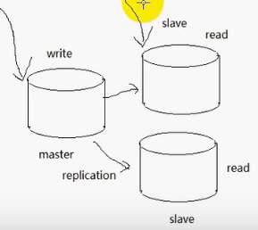

# 服务器的架构

## 大并发服务器设计目标

- 高性能 (大量并发请求能快速响应)
- 高可用 (7x24h不间断服务，故障转移)
- 伸缩性 (良好的框架，分层设计，业务分离，能灵活部署)

## 服务器性能四大杀手

- 数据拷贝			（缓存)
- 环境切换               (理性创建线程)
- 内存分配                (内存池)
- 锁竞争                    (减少锁的使用)

大量的数据可以使用队列+连接池

缓存更新(同步)：一旦数据库数据更新，通知前端的缓存更新

缓存换页：内存不够，将不活跃的数据换出内存

读写分离，写需求要小于读需求，分为主从数据库，slave数据库处理读需求

## 负载均衡

### 前端负载均衡

- DNS负载均衡

在DNS服务器中，可以为多个不同的地址配置同一个名字，对于不同的客户机访问同一个名字，得到不同的地址

- 反向代理

使用代理服务器将请求发给内部服务器，让代理服务器将请求均匀转发给多台内部Web服务器之一，从而达到负载均衡的目的

- 基于NAT的负载均衡技术(映射)
- LVS(开源软件)
- F5硬件负载均衡

### 应用服务器负载均衡

应用服务器的负载均衡：增加一个任务服务器来实现，任务服务器可以监视应用服务器的负载，查询是否CPU高、IO高、并发高、内存换页高，查询到这些信息之后，选取负载最低的服务器分配任务

### 数据库负载均衡

主从数据库，分别处理读写需求

# poll

